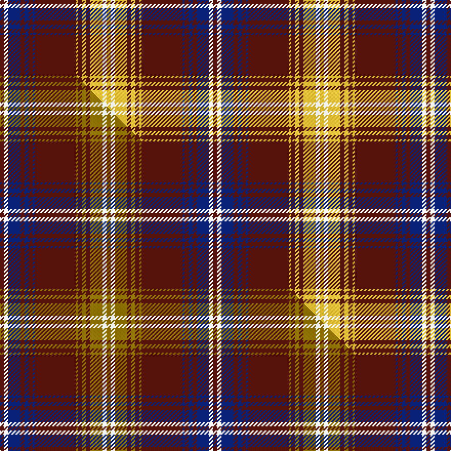

This is one **variant** — a specific cloth: this exact thread count and colourway, with its own
provenance below. It is one weaving of the [sett](/setts/dr2w2db6dr2db2dr2db1dr20ly1dr2ly2dr2ly6w2ly2/) (the scale-free proportion — the
same cloth at any scale or shade), whose colour order is pattern [BWBBBBBBYBYBYWY](/stripes/bwbbbbbbybybywy/).

Part of the [Winthrop University](/tartans/winthrop-university/) tartan — the named design grouping this sett with its other cloths.

Sourced from tartans-authority.  It is a [15 stripe tartan](/stripes/stripes15/).

Original link [https://www.tartanregister.gov.uk/tartanDetails.aspx?ref=10820](https://www.tartanregister.gov.uk/tartanDetails.aspx?ref=10820)

Dataset <small>— provenance for this record, inherited from the source manifest</small>

<dl class="dataset-prov">
<dt>source</dt><dd><a href="/sources/tartans-authority/">Scottish Tartans Authority</a></dd>
<dt>data captured from</dt><dd><a href="https://github.com/thetartan/tartan-database/blob/master/data/tartans-authority/data.csv">https://github.com/thetartan/tartan-database/blob/master/data/tartans-authority/data.csv</a></dd>
<dt>data date</dt><dd>01/10/2012 <small>(this record)</small></dd>
<dt>licence</dt><dd><a href="https://creativecommons.org/licenses/by-nc-nd/4.0/">CC BY-NC-ND 4.0</a></dd>
</dl>

Capture chain <small>— the hands this data passed through, oldest first; each capture carries its own licence</small>

<ol class="capture-chain">
<li><a href="https://www.tartansauthority.com/">Scottish Tartans Authority</a> <small>the heritage body's archive — its tartan-ferret record browser is retired (links repaired to the SRT, above)</small></li>
<li><a href="https://github.com/thetartan/tartan-database">thetartan/tartan-database</a> <small>2016-2017</small> · <a href="https://creativecommons.org/licenses/by-nc-nd/4.0/">CC BY-NC-ND 4.0</a> <small>Levko Kravets's frozen compilation — the capture we vendored, and where its CC licence text came from</small></li>
<li>this dictionary <small>captured 2026-06-10 · commit 5bf86c7566</small> <small>each re-capture is a git commit to data/sources</small></li>
</ol>

## Register references

External register numbers recorded for this tartan.

- Scottish Register of Tartans: [10820](https://www.tartanregister.gov.uk/tartanDetails?ref=10820)
- Scottish Tartans Authority (ITI): 10820

## Thread count
DR/4 W4 DB12 DR4 DB4 DR4 DB2 DR40 LY2 DR4 LY4 DR4 LY12 W4 LY/4

One full sett is **208 threads**.

## Palette
<table><thead><tr><th>Colour</th><th>Shade</th><th>OKLCh</th></tr></thead><tbody><tr><td>DB</td><td><code style="background-color:#082077;">#082077</code> <small style="color:#888">#082077</small></td><td><small style="color:#888">oklch(30.0% 0.149 265.1)</small></td></tr><tr><td>DR</td><td><code style="background-color:#55120C;">#55120C</code> <small style="color:#888">#55120C</small></td><td><small style="color:#888">oklch(30.0% 0.099 29.3)</small></td></tr><tr><td>LY</td><td><code style="background-color:#DCBC32;">#DCBC32</code> <small style="color:#888">#DCBC32</small></td><td><small style="color:#888">oklch(80.0% 0.150 95.2)</small></td></tr><tr><td>W</td><td><code style="background-color:#F7F7F7;">#F7F7F7</code> <small style="color:#888">#F7F7F7</small></td><td><small style="color:#888">oklch(97.6% 0.000 89.9)</small></td></tr></tbody></table>

# Sample pattern

## Compared to the master

This cloth is one sett of its design; the master sett (the exemplar the design is anchored on) is below for comparison.

Its **ΔTartan distance** from the master is **0.10** — the same measure the nearest-tartans table ranks by (0 is identical; a re-scale of the same cloth is near 0, a recolour or a different proportion further).

<figure class="master-compare" style="margin:0">

this sett
master sett ★

<figcaption style="color:#888;font-size:smaller">One weave of this sett against the <a href="/setts/dr2w2db6dr2db2dr2db1dr20y1dr2y2dr2y6w2y2/">master sett ★</a>, split on the diagonal: a shared proportion runs seamlessly across it with only the shades shifting; a different proportion breaks on it.</figcaption>
</figure>

## Nearest tartan variants

The nearest existing variants by ΔTartan distance, with this cloth at the top so the swatches line up against it.

ΔTartan

Threads

Variant

Sett

—

208

<a href="/variants/s15/dr2w2db6dr2db2dr2db1dr20ly1dr2ly2dr2ly6w2ly2~x2/">Winthrop University (Corporate)</a>

<a href="/ttd/edit/#slug=dr2w2db6dr2db2dr2db1dr20y1dr2y2dr2y6w2y2~x2&amp;base=dr2w2db6dr2db2dr2db1dr20ly1dr2ly2dr2ly6w2ly2~x2" title="compare in the TTD">0.10</a>

208

<a href="/variants/s15/dr2w2db6dr2db2dr2db1dr20y1dr2y2dr2y6w2y2~x2/">Winthrop University</a>

<a href="/ttd/edit/#slug=dr6lo2dr32lo15dr2lo3dr2lo6w3db4~x2&amp;base=dr2w2db6dr2db2dr2db1dr20ly1dr2ly2dr2ly6w2ly2~x2" title="compare in the TTD">3.11</a>

280

<a href="/variants/s10/dr6lo2dr32lo15dr2lo3dr2lo6w3db4~x2/">Virginia Tech</a>

<a href="/ttd/edit/#slug=dr6lo2dr36lo18dr2lo4dr2lo6w3db4~x2&amp;base=dr2w2db6dr2db2dr2db1dr20ly1dr2ly2dr2ly6w2ly2~x2" title="compare in the TTD">3.14</a>

312

<a href="/variants/s10/dr6lo2dr36lo18dr2lo4dr2lo6w3db4~x2/">Virginia Tech (Corporate)</a>

<a href="/ttd/edit/#slug=lr12dr3lr3db4lr16ly3lr3ly3lr3ly16db52lr4&amp;base=dr2w2db6dr2db2dr2db1dr20ly1dr2ly2dr2ly6w2ly2~x2" title="compare in the TTD">3.65</a>

228

<a href="/variants/s12/lr12dr3lr3db4lr16ly3lr3ly3lr3ly16db52lr4/">Carsaig</a>

<a href="/ttd/edit/#slug=w4db2lo8db2n2db2n2db23lo10db2lo7db2~x2&amp;base=dr2w2db6dr2db2dr2db1dr20ly1dr2ly2dr2ly6w2ly2~x2" title="compare in the TTD">3.75</a>

252

<a href="/variants/s12/w4db2lo8db2n2db2n2db23lo10db2lo7db2~x2/">Auld Lang Syne Brown Tartan</a>

<a href="/ttd/edit/#slug=dr25lb2dr3ly2dr3lb11w13ly1~x2&amp;base=dr2w2db6dr2db2dr2db1dr20ly1dr2ly2dr2ly6w2ly2~x2" title="compare in the TTD">3.84</a>

188

<a href="/variants/s8/dr25lb2dr3ly2dr3lb11w13ly1~x2/">Citylink Gold (Corporate)</a>

<a href="/ttd/edit/#slug=o6ly3o3ly15k7o7k5o17k46w4~o2503076-k0705267&amp;base=dr2w2db6dr2db2dr2db1dr20ly1dr2ly2dr2ly6w2ly2~x2" title="compare in the TTD">3.94</a>

216

<a href="/variants/s10/lyi6ly3lyi3ly15db7lyi7db5lyi17db46w4~lyi2503076-db0705267/">Rhys (Welsh Name)</a>

## Neighbour map

Every grey dot is one of 13621 variants placed by the first two principal components of the ΔTartan feature space (42% of its variance). Red is this tartan; blue dots are its nearest — click one to open its page.

<svg viewBox="0 0 640 380" role="img" style="max-width:100%;height:auto;border:1px solid #e0e0e0;border-radius:4px;display:block" xmlns="http://www.w3.org/2000/svg"><image href="/nn/cloud.v1.png" width="640" height="380"/><a href="/variants/s15/dr2w2db6dr2db2dr2db1dr20y1dr2y2dr2y6w2y2~x2/"><circle cx="349.7" cy="133.1" r="4" fill="#3465a4"><title>Winthrop University</title></circle></a><a href="/variants/s10/dr6lo2dr32lo15dr2lo3dr2lo6w3db4~x2/"><circle cx="364.7" cy="164.7" r="4" fill="#3465a4"><title>Virginia Tech</title></circle></a><a href="/variants/s10/dr6lo2dr36lo18dr2lo4dr2lo6w3db4~x2/"><circle cx="369.9" cy="158.0" r="4" fill="#3465a4"><title>Virginia Tech (Corporate)</title></circle></a><a href="/variants/s12/lr12dr3lr3db4lr16ly3lr3ly3lr3ly16db52lr4/"><circle cx="303.2" cy="154.3" r="4" fill="#3465a4"><title>Carsaig</title></circle></a><a href="/variants/s12/w4db2lo8db2n2db2n2db23lo10db2lo7db2~x2/"><circle cx="299.5" cy="181.1" r="4" fill="#3465a4"><title>Auld Lang Syne Brown Tartan</title></circle></a><a href="/variants/s8/dr25lb2dr3ly2dr3lb11w13ly1~x2/"><circle cx="324.3" cy="169.4" r="4" fill="#3465a4"><title>Citylink Gold (Corporate)</title></circle></a><a href="/variants/s10/lyi6ly3lyi3ly15db7lyi7db5lyi17db46w4~lyi2503076-db0705267/"><circle cx="306.8" cy="178.9" r="4" fill="#3465a4"><title>Rhys (Welsh Name)</title></circle></a><circle cx="339.2" cy="137.2" r="5" fill="#c00000"/><text x="320" y="376" text-anchor="middle" font-size="11" fill="#999">ground</text><text x="11" y="190" text-anchor="middle" font-size="11" fill="#999" transform="rotate(-90 11 190)">complexity</text></svg>

ID: /variants/s15/dr2w2db6dr2db2dr2db1dr20ly1dr2ly2dr2ly6w2ly2~x2/
