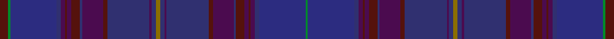

This page is one **sett** — a single exact thread-count. It belongs to the [tartan](/setts/dr4g1dbi22db2dp2dr1dp2dr4db1dp10dr2db20dp1db2y2/)
(the same proportion at any scale), whose colour order is pattern [BGBBBBBBBBBBBBGBBBBBBBBBBBBG](/stripes/bgbbbbbbbbbbbbgbbbbbbbbbbbbg/).

Sourced from register-of-tartans.  It is a [28 stripe tartan](/stripes/stripes28/).

Original link https://www.tartanregister.gov.uk/tartanDetails.aspx?ref=1707

## Provenance

Earliest known date: pre 2004 Nothing

3 attestations — the source records this cloth was collapsed from (oldest owns this page)

<ul>
<li>01/01/2004 — Highland Cathedral (register-of-tartans, <a href="https://www.tartanregister.gov.uk/tartanDetails.aspx?ref=1707">record</a>)  <em>No details known.</em></li>
<li>pre 2004 — Highland Cathedral (Fashion) (tartans-authority, <a href="http://www.tartansauthority.com/tartan-ferret/display/6136/">record</a>) </li>
<li>undated — Highland Cathedral Fashion Tartan (house-of-tartan, <a href="http://www.house-of-tartan.scotland.net/house/TartanViewjs.asp?colr=Def&tnam=6136">record</a>) </li>
</ul>

## Register references

External register numbers recorded for this tartan.

- Scottish Register of Tartans: [1707](https://www.tartanregister.gov.uk/tartanDetails.aspx?ref=1707)
- Scottish Tartans Authority (ITI): 6136

## Thread count
DR/8 G2 DBi44 DB4 DP4 DR2 DP4 DR8 DB2 DP20 DR4 DB40 DP2 DB4 Y4 DB4 DP2 DB40 DR4 DP20 DB2 DR8 DP4 DR2 DP4 DB4 DBi44 G/2

One full sett is **574 threads**.

## Palette
<table><thead><tr><th>Colour</th><th>Shade</th><th>OKLCh</th></tr></thead><tbody><tr><td>DB</td><td><code style="background-color:#2C2C80;">#2C2C80</code> <small style="color:#888">#2C2C80</small></td><td><small style="color:#888">oklch(35.0% 0.138 276.6)</small></td></tr><tr><td>DBa</td><td><code style="background-color:#303070;">#303070</code> <small style="color:#888">#303070</small></td><td><small style="color:#888">oklch(34.7% 0.108 279.2)</small></td></tr><tr><td>DR</td><td><code style="background-color:#55120C;">#55120C</code> <small style="color:#888">#55120C</small></td><td><small style="color:#888">oklch(30.0% 0.099 29.3)</small></td></tr><tr><td>G</td><td><code style="background-color:#008B2A;">#008B2A</code> <small style="color:#888">#008B2A</small></td><td><small style="color:#888">oklch(55.4% 0.170 145.9)</small></td></tr><tr><td>O</td><td><code style="background-color:#D60020;">#D60020</code> <small style="color:#888">#D60020</small></td><td><small style="color:#888">oklch(55.2% 0.224 25.5)</small></td></tr><tr><td>P</td><td><code style="background-color:#4B0B4F;">#4B0B4F</code> <small style="color:#888">#4B0B4F</small></td><td><small style="color:#888">oklch(30.1% 0.125 325.4)</small></td></tr><tr><td>Y</td><td><code style="background-color:#8B6E00;">#8B6E00</code> <small style="color:#888">#8B6E00</small></td><td><small style="color:#888">oklch(55.1% 0.113 90.4)</small></td></tr></tbody></table>

# Sample pattern

ID: /variants/s15/dr4g1dbi22db2dp2dr1dp2dr4db1dp10dr2db20dp1db2y2~x2~dbi1406275-db1404274/
