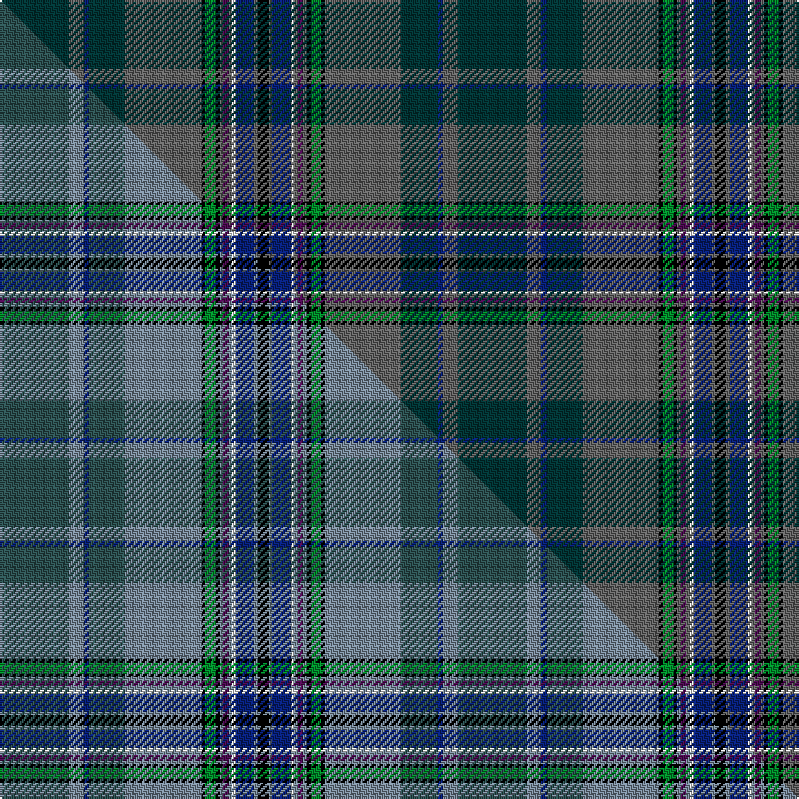

This is one **variant** — a specific cloth: this exact thread count and colourway, with its own
provenance below. It is one weaving of the [sett](/tartans/c/ca/causeway-the/) (the scale-free proportion — the
same cloth at any scale or shade), whose colour order is pattern [BBBBBKGKBBBWBBK](/stripes/bbbbbkgkbbbwbbk/).

Part of the [Causeway, The](/tartans/c/ca/causeway-the/) tartan — the named design grouping this sett with its other cloths.

Sourced from tartans-authority.  It is a [15 stripe tartan](/stripes/stripes15/).

Original link <code>http://www.tartansauthority.com/tartan-ferret/display/10508/</code> — retired · [Internet Archive copy](https://web.archive.org/web/*/http://www.tartansauthority.com/tartan-ferret/display/10508/*)

Dataset <small>— provenance for this record, inherited from the source manifest</small>

<dl class="dataset-prov">
<dt>source</dt><dd><a href="/sources/tartans-authority/">Scottish Tartans Authority</a></dd>
<dt>data captured from</dt><dd><a href="https://github.com/thetartan/tartan-database/blob/master/data/tartans-authority/data.csv">https://github.com/thetartan/tartan-database/blob/master/data/tartans-authority/data.csv</a></dd>
<dt>data date</dt><dd>pre 2011 <small>(this record)</small></dd>
<dt>licence</dt><dd><a href="https://creativecommons.org/licenses/by-nc-nd/4.0/">CC BY-NC-ND 4.0</a></dd>
</dl>

Capture chain <small>— the hands this data passed through, oldest first; each capture carries its own licence</small>

<ol class="capture-chain">
<li><a href="https://www.tartansauthority.com/">Scottish Tartans Authority</a> <small>the heritage body’s archive — its tartan-ferret record browser is retired; dead record links are shown unlinked, with an Internet Archive copy (ITI numbers are not SRT references)</small></li>
<li><a href="https://github.com/thetartan/tartan-database">thetartan/tartan-database</a> <small>2016-2017</small> · <a href="https://creativecommons.org/licenses/by-nc-nd/4.0/">CC BY-NC-ND 4.0</a> <small>Levko Kravets's frozen compilation — the capture we vendored, and where its CC licence text came from</small></li>
<li>this dictionary <small>captured 2026-06-10 · commit 5bf86c7566</small> <small>each re-capture is a git commit to data/sources</small></li>
</ol>

## Register references

External register numbers recorded for this tartan.

- Scottish Register of Tartans: [10508](https://www.tartanregister.gov.uk/tartanDetails?ref=10508)
- Scottish Tartans Authority (ITI): 10508

## Thread count
DT/38 N8 DB3 DT20 N42 K2 G6 K2 N2 DP3 N2 W2 DB10 N2 K/6

One full sett is **252 threads**.

## Palette
<table><thead><tr><th>Colour</th><th>Shade</th><th>OKLCh</th></tr></thead><tbody><tr><td>DB</td><td><code style="background-color:#082077;">#082077</code> <small style="color:#888">#082077</small></td><td><small style="color:#888">oklch(30.0% 0.149 265.1)</small></td></tr><tr><td>G</td><td><code style="background-color:#008B2A;">#008B2A</code> <small style="color:#888">#008B2A</small></td><td><small style="color:#888">oklch(55.4% 0.170 145.9)</small></td></tr><tr><td>K</td><td><code style="background-color:#000000;">#000000</code> <small style="color:#888">#000000</small></td><td><small style="color:#888">oklch(0.0% 0.000 0.0)</small></td></tr><tr><td>DT</td><td><code style="background-color:#023535;">#023535</code> <small style="color:#888">#023535</small></td><td><small style="color:#888">oklch(29.8% 0.050 194.8)</small></td></tr><tr><td>N</td><td><code style="background-color:#636363;">#636363</code> <small style="color:#888">#636363</small></td><td><small style="color:#888">oklch(50.0% 0.000 89.9)</small></td></tr><tr><td>DP</td><td><code style="background-color:#4B0B4F;">#4B0B4F</code> <small style="color:#888">#4B0B4F</small></td><td><small style="color:#888">oklch(30.1% 0.125 325.4)</small></td></tr><tr><td>W</td><td><code style="background-color:#F7F7F7;">#F7F7F7</code> <small style="color:#888">#F7F7F7</small></td><td><small style="color:#888">oklch(97.6% 0.000 89.9)</small></td></tr></tbody></table>

# Sample pattern

## Compared to the master

This cloth is one sett of its design; the master sett (the exemplar the design is anchored on) is below for comparison.

Its **ΔTartan distance** from the master is **1.99** — the same measure the nearest-tartans table ranks by (0 is identical; a re-scale of the same cloth is near 0, a recolour or a different proportion further).

<figure class="master-compare" style="margin:0">

this sett
master sett ★

<figcaption style="color:#888;font-size:smaller">One weave of this sett against the <a href="/setts/dt38b8db3dt20b42k2g6k2b2dp3b2w2db10b2k6/">master sett ★</a>, split on the diagonal: a shared proportion runs seamlessly across it with only the shades shifting; a different proportion breaks on it.</figcaption>
</figure>

## Nearest tartan variants

The nearest existing variants by ΔTartan distance, with this cloth at the top so the swatches line up against it.

ΔTartan

Threads

Variant

Sett

—

252

<a href="/variants/s15/dt38n8db3dt20n42k2g6k2n2dp3n2w2db10n2k6/">Causeway, The (District)</a>

<a href="/ttd/edit/#slug=dt38n8db3dt20n42k2g6k2n2dp3n2w2db10n2k6~dt4004195-n6103249&amp;base=dt38n8db3dt20n42k2g6k2n2dp3n2w2db10n2k6" title="compare in the TTD">2.07</a>

252

<a href="/variants/s15/dt38b8db3dt20b42k2g6k2b2dp3b2w2db10b2k6~dt4004195-b6103249/">Causeway, The</a>

<a href="/ttd/edit/#slug=db5t2db9dp10k2dp4k2dg10g33w2g33dg10k2dp4k2dp10db9t2db5w3~x2~db2911276-dg4514144-g5408159&amp;base=dt38n8db3dt20n42k2g6k2n2dp3n2w2db10n2k6" title="compare in the TTD">3.15</a>

620

<a href="/variants/s20/db5t2db9dp10k2dp4k2dg10g33w2g33dg10k2dp4k2dp10db9t2db5w3~x2~db2911276-dg4514144-g5408159/">Inverclyde Green</a>

<a href="/ttd/edit/#slug=db29dy3k3dy3k3dy3dg28k3dy2k3dr3ly3~x2&amp;base=dt38n8db3dt20n42k2g6k2n2dp3n2w2db10n2k6" title="compare in the TTD">3.20</a>

280

<a href="/variants/s12/db29dy3k3dy3k3dy3dg28k3dy2k3dr3ly3~x2/">Bro-Vigouden (Corporate)</a>

<a href="/ttd/edit/#slug=k3n3k1dg26k10y1k3dp5n4ly2~x2~k1608276-n4405237&amp;base=dt38n8db3dt20n42k2g6k2n2dp3n2w2db10n2k6" title="compare in the TTD">3.20</a>

222

<a href="/variants/s10/k3n3k1dg26k10y1k3dp5n4ly2~x2~k1608276-n4405237/">Rikaco Heirloom</a>

<a href="/ttd/edit/#slug=o4dg30db12g3k2lb3k26dp4k2~dg3710150-db2315264-g5818138-k1709270&amp;base=dt38n8db3dt20n42k2g6k2n2dp3n2w2db10n2k6" title="compare in the TTD">3.27</a>

166

<a href="/variants/s9/o4dg30db12g3k2lb3k26dp4k2~dg3710150-db2315264-g5818138-k1709270/">Begg (Scarfskerry)</a>

<a href="/ttd/edit/#slug=db2k2db21b1db1b2db1b8dg23ly2r2~x2&amp;base=dt38n8db3dt20n42k2g6k2n2dp3n2w2db10n2k6" title="compare in the TTD">3.29</a>

252

<a href="/variants/s11/db2k2db21b1db1b2db1b8dg23ly2r2~x2/">Century 21 (Fashion)</a>

<a href="/ttd/edit/#slug=n19o4t2n10o22k1g3k1o3w1t5o1k3~x2~n47-o62&amp;base=dt38n8db3dt20n42k2g6k2n2dp3n2w2db10n2k6" title="compare in the TTD">3.38</a>

256

<a href="/variants/s13/n19o4t2n10o22k1g3k1o3w1t5o1k3~x2~n47-o62/">Giants Causeway (District)</a>

<a href="/ttd/edit/#slug=k8t1o1ki10o16lb2k3n33t1n3w2~x2~k17-t5912243-o62-ki2007036-lb80-n47&amp;base=dt38n8db3dt20n42k2g6k2n2dp3n2w2db10n2k6" title="compare in the TTD">3.40</a>

300

<a href="/variants/s11/k8t1o1ki10o16lb2k3n33t1n3w2~x2~k17-t5912243-o62-ki2007036-lb80-n47/">Oban Mist</a>

<a href="/ttd/edit/#slug=n38y8db3n20y44k2g6k2y5w2db10y2k6~n45-y5203135&amp;base=dt38n8db3dt20n42k2g6k2n2dp3n2w2db10n2k6" title="compare in the TTD">3.41</a>

252

<a href="/variants/s13/n38y8db3n20y44k2g6k2y5w2db10y2k6~n45-y5203135/">Giants Causeway, The</a>

<a href="/ttd/edit/#slug=dg4dr1dg1dr3dg16k12dr1db27lb2db3lb1y2~x2&amp;base=dt38n8db3dt20n42k2g6k2n2dp3n2w2db10n2k6" title="compare in the TTD">3.44</a>

280

<a href="/variants/s12/dg4dr1dg1dr3dg16k12dr1db27lb2db3lb1y2~x2/">McGuirk (2013)</a>

## Neighbour map

Every grey dot is one of 13662 variants placed by the first two principal components of the ΔTartan feature space (42% of its variance). Red is this tartan; blue dots are its nearest — click one to open its page. The map is a flat projection of a many-dimensional space — [how to read it](/posts/neighbourhood-maps/).

<svg viewBox="0 0 640 380" role="img" style="max-width:100%;height:auto;border:1px solid #e0e0e0;border-radius:4px;display:block" xmlns="http://www.w3.org/2000/svg"><image href="/nn/cloud.v1.png" width="640" height="380"/><a href="/variants/s15/dt38b8db3dt20b42k2g6k2b2dp3b2w2db10b2k6~dt4004195-b6103249/"><circle cx="204.3" cy="82.1" r="4" fill="#3465a4"><title>Causeway, The</title></circle></a><a href="/variants/s20/db5t2db9dp10k2dp4k2dg10g33w2g33dg10k2dp4k2dp10db9t2db5w3~x2~db2911276-dg4514144-g5408159/"><circle cx="157.9" cy="86.0" r="4" fill="#3465a4"><title>Inverclyde Green</title></circle></a><a href="/variants/s12/db29dy3k3dy3k3dy3dg28k3dy2k3dr3ly3~x2/"><circle cx="202.6" cy="122.5" r="4" fill="#3465a4"><title>Bro-Vigouden (Corporate)</title></circle></a><a href="/variants/s10/k3n3k1dg26k10y1k3dp5n4ly2~x2~k1608276-n4405237/"><circle cx="290.1" cy="117.1" r="4" fill="#3465a4"><title>Rikaco Heirloom</title></circle></a><a href="/variants/s9/o4dg30db12g3k2lb3k26dp4k2~dg3710150-db2315264-g5818138-k1709270/"><circle cx="174.1" cy="128.7" r="4" fill="#3465a4"><title>Begg (Scarfskerry)</title></circle></a><a href="/variants/s11/db2k2db21b1db1b2db1b8dg23ly2r2~x2/"><circle cx="239.1" cy="106.7" r="4" fill="#3465a4"><title>Century 21 (Fashion)</title></circle></a><a href="/variants/s13/n19o4t2n10o22k1g3k1o3w1t5o1k3~x2~n47-o62/"><circle cx="258.7" cy="117.6" r="4" fill="#3465a4"><title>Giants Causeway (District)</title></circle></a><a href="/variants/s11/k8t1o1ki10o16lb2k3n33t1n3w2~x2~k17-t5912243-o62-ki2007036-lb80-n47/"><circle cx="231.0" cy="71.3" r="4" fill="#3465a4"><title>Oban Mist</title></circle></a><a href="/variants/s13/n38y8db3n20y44k2g6k2y5w2db10y2k6~n45-y5203135/"><circle cx="278.8" cy="123.4" r="4" fill="#3465a4"><title>Giants Causeway, The</title></circle></a><a href="/variants/s12/dg4dr1dg1dr3dg16k12dr1db27lb2db3lb1y2~x2/"><circle cx="230.7" cy="92.9" r="4" fill="#3465a4"><title>McGuirk (2013)</title></circle></a><circle cx="227.9" cy="89.6" r="5" fill="#c00000"/><text x="320" y="376" text-anchor="middle" font-size="11" fill="#999">ground</text><text x="11" y="190" text-anchor="middle" font-size="11" fill="#999" transform="rotate(-90 11 190)">complexity</text></svg>

ID: /variants/s15/dt38n8db3dt20n42k2g6k2n2dp3n2w2db10n2k6/
