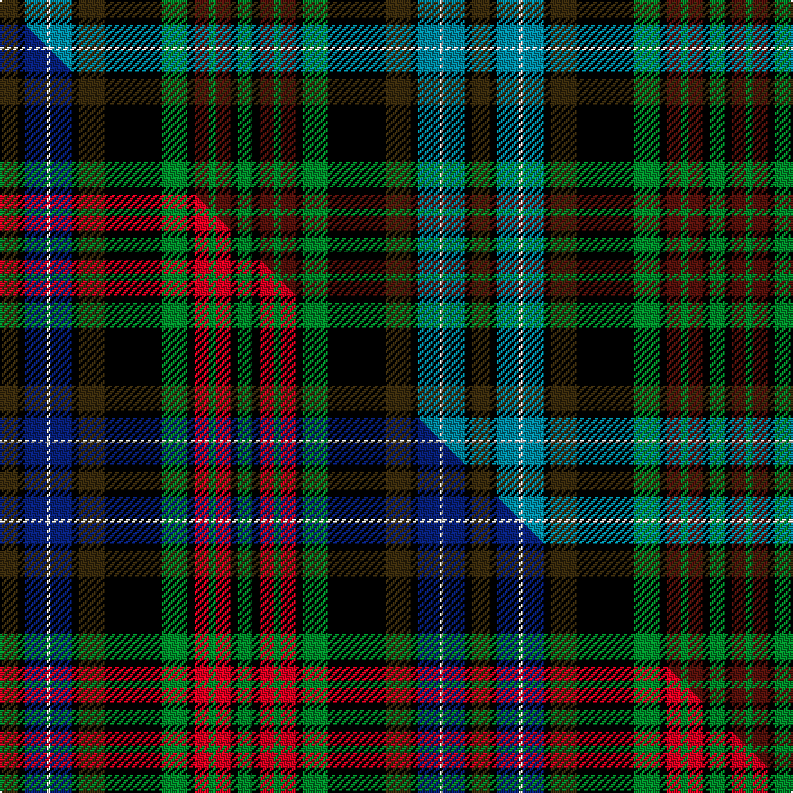

This is one **variant** — a specific cloth: this exact thread count and colourway, with its own
provenance below. It is one weaving of the [sett](/setts/dy5k2t6w1t6k2dy7k16g7k2dr4g2dr4k2g4/) (the scale-free proportion — the
same cloth at any scale or shade), whose colour order is pattern [GKBGBKGKGKBWBKG](/stripes/gkbgbkgkgkbwbkg/).

Part of the [Redgate Hunting](/tartans/r/re/redgate-hunting-2/) tartan — the named design grouping this sett with its other cloths.

Sourced from tartans-authority.  It is a [15 stripe tartan](/stripes/stripes15/).

Original link [https://www.tartanregister.gov.uk/tartanDetails.aspx?ref=10794](https://www.tartanregister.gov.uk/tartanDetails.aspx?ref=10794)

Dataset <small>— provenance for this record, inherited from the source manifest</small>

<dl class="dataset-prov">
<dt>source</dt><dd><a href="/sources/tartans-authority/">Scottish Tartans Authority</a></dd>
<dt>data captured from</dt><dd><a href="https://github.com/thetartan/tartan-database/blob/master/data/tartans-authority/data.csv">https://github.com/thetartan/tartan-database/blob/master/data/tartans-authority/data.csv</a></dd>
<dt>data date</dt><dd>17/03/2013 <small>(this record)</small></dd>
<dt>licence</dt><dd><a href="https://creativecommons.org/licenses/by-nc-nd/4.0/">CC BY-NC-ND 4.0</a></dd>
</dl>

Capture chain <small>— the hands this data passed through, oldest first; each capture carries its own licence</small>

<ol class="capture-chain">
<li><a href="https://www.tartansauthority.com/">Scottish Tartans Authority</a> <small>the heritage body's archive — its tartan-ferret record browser is retired (links repaired to the SRT, above)</small></li>
<li><a href="https://github.com/thetartan/tartan-database">thetartan/tartan-database</a> <small>2016-2017</small> · <a href="https://creativecommons.org/licenses/by-nc-nd/4.0/">CC BY-NC-ND 4.0</a> <small>Levko Kravets's frozen compilation — the capture we vendored, and where its CC licence text came from</small></li>
<li>this dictionary <small>captured 2026-06-10 · commit 5bf86c7566</small> <small>each re-capture is a git commit to data/sources</small></li>
</ol>

## Register references

External register numbers recorded for this tartan.

- Scottish Register of Tartans: [10794](https://www.tartanregister.gov.uk/tartanDetails?ref=10794)
- Scottish Tartans Authority (ITI): 10794

## Thread count
DY/10 K4 T12 W2 T12 K4 DY14 K32 G14 K4 DR8 G4 DR8 K4 G/8

One full sett is **262 threads**.

## Palette
<table><thead><tr><th>Colour</th><th>Shade</th><th>OKLCh</th></tr></thead><tbody><tr><td>T</td><td><code style="background-color:#00879F;">#00879F</code> <small style="color:#888">#00879F</small></td><td><small style="color:#888">oklch(57.4% 0.102 216.1)</small></td></tr><tr><td>DR</td><td><code style="background-color:#55120C;">#55120C</code> <small style="color:#888">#55120C</small></td><td><small style="color:#888">oklch(30.0% 0.099 29.3)</small></td></tr><tr><td>G</td><td><code style="background-color:#008B2A;">#008B2A</code> <small style="color:#888">#008B2A</small></td><td><small style="color:#888">oklch(55.4% 0.170 145.9)</small></td></tr><tr><td>K</td><td><code style="background-color:#000000;">#000000</code> <small style="color:#888">#000000</small></td><td><small style="color:#888">oklch(0.0% 0.000 0.0)</small></td></tr><tr><td>W</td><td><code style="background-color:#F7F7F7;">#F7F7F7</code> <small style="color:#888">#F7F7F7</small></td><td><small style="color:#888">oklch(97.6% 0.000 89.9)</small></td></tr><tr><td>DY</td><td><code style="background-color:#3A2B0D;">#3A2B0D</code> <small style="color:#888">#3A2B0D</small></td><td><small style="color:#888">oklch(30.0% 0.049 82.0)</small></td></tr></tbody></table>

# Sample pattern

## Compared to the master

This cloth is one sett of its design; the master sett (the exemplar the design is anchored on) is below for comparison.

Its **ΔTartan distance** from the master is **0.14** — the same measure the nearest-tartans table ranks by (0 is identical; a re-scale of the same cloth is near 0, a recolour or a different proportion further).

<figure class="master-compare" style="margin:0">

this sett
master sett ★

<figcaption style="color:#888;font-size:smaller">One weave of this sett against the <a href="/setts/dy5k2db6w1db6k2dy7k16g7k2r4g2r4k2g4/">master sett ★</a>, split on the diagonal: a shared proportion runs seamlessly across it with only the shades shifting; a different proportion breaks on it.</figcaption>
</figure>

## Nearest tartan variants

The nearest existing variants by ΔTartan distance, with this cloth at the top so the swatches line up against it.

ΔTartan

Threads

Variant

Sett

—

262

<a href="/variants/s15/dy5k2t6w1t6k2dy7k16g7k2dr4g2dr4k2g4~x2/">Redgate Hunting #2 (Name)</a>

<a href="/ttd/edit/#slug=dy5k2db6w1db6k2dy7k16g7k2r4g2r4k2g4~x2&amp;base=dy5k2t6w1t6k2dy7k16g7k2dr4g2dr4k2g4~x2" title="compare in the TTD">0.14</a>

262

<a href="/variants/s15/dy5k2db6w1db6k2dy7k16g7k2r4g2r4k2g4~x2/">Redgate (Connecticut) Hunting #2</a>

<a href="/ttd/edit/#slug=lr3k15db10o10k1g5k1y10k10g8k1db2~x2&amp;base=dy5k2t6w1t6k2dy7k16g7k2dr4g2dr4k2g4~x2" title="compare in the TTD">1.51</a>

294

<a href="/variants/s12/lr3k15db10o10k1g5k1y10k10g8k1db2~x2/">Blue Castlefield</a>

<a href="/ttd/edit/#slug=g19k20r1db8b8g8db3r1n12k8r1n1~x2~db1003265-b2105244&amp;base=dy5k2t6w1t6k2dy7k16g7k2dr4g2dr4k2g4~x2" title="compare in the TTD">1.69</a>

320

<a href="/variants/s12/g19k20r1db8t8g8db3r1n12k8r1n1~x2~db1003265-t2105244/">Vine (2015)</a>

<a href="/ttd/edit/#slug=db4dy2db14dy4db4o1k8g13y3g13k8dy10k3dy3~x2&amp;base=dy5k2t6w1t6k2dy7k16g7k2dr4g2dr4k2g4~x2" title="compare in the TTD">1.88</a>

346

<a href="/variants/s14/db4dy2db14dy4db4o1k8g13y3g13k8dy10k3dy3~x2/">Humble, Gordon (Personal)</a>

<a href="/ttd/edit/#slug=o3k15n10dy10k1g5k1lo10k10g8k1n2~x2~o2500000-n1900000&amp;base=dy5k2t6w1t6k2dy7k16g7k2dr4g2dr4k2g4~x2" title="compare in the TTD">1.88</a>

294

<a href="/variants/s12/o3k15n10dy10k1g5k1lo10k10g8k1n2~x2~o2500000-n1900000/">Castlefield (Personal)</a>

<a href="/ttd/edit/#slug=g10dr2g2dr3g11lr2k10dr2db12k1lo2dr2lo2dr2~x2&amp;base=dy5k2t6w1t6k2dy7k16g7k2dr4g2dr4k2g4~x2" title="compare in the TTD">2.02</a>

228

<a href="/variants/s14/g10dr2g2dr3g11lr2k10dr2db12k1lo2dr2lo2dr2~x2/">Esteba-Quer (Personal)</a>

<a href="/ttd/edit/#slug=t8k4t8k20lo1g20r8w1r8w1r8g20lo1k20t8k4t4~x2&amp;base=dy5k2t6w1t6k2dy7k16g7k2dr4g2dr4k2g4~x2" title="compare in the TTD">2.11</a>

552

<a href="/variants/s17/t8k4t8k20lo1g20r8w1r8w1r8g20lo1k20t8k4t4~x2/">Cumming</a>

<a href="/ttd/edit/#slug=g10dr2g2dr3g11lr2k10dr2db12k1lo2dr2lo2dr2lo2~x2&amp;base=dy5k2t6w1t6k2dy7k16g7k2dr4g2dr4k2g4~x2" title="compare in the TTD">2.17</a>

236

<a href="/variants/s15/g10dr2g2dr3g11lr2k10dr2db12k1lo2dr2lo2dr2lo2~x2/">Esteba-Quer (Personal)</a>

<a href="/ttd/edit/#slug=g15db3g3db3g3db16o16k5y2k5o16db16g15r1k4~x2&amp;base=dy5k2t6w1t6k2dy7k16g7k2dr4g2dr4k2g4~x2" title="compare in the TTD">2.21</a>

454

<a href="/variants/s15/g15db3g3db3g3db16o16k5y2k5o16db16g15r1k4~x2/">Loseby, Luke (Personal)</a>

<a href="/ttd/edit/#slug=r3dg4g2dg10k18dg2db18dg3db18dg2k18dg16w1r3~x2~dg1806142-g2408144&amp;base=dy5k2t6w1t6k2dy7k16g7k2dr4g2dr4k2g4~x2" title="compare in the TTD">2.25</a>

460

<a href="/variants/s14/r3dg4g2dg10k18dg2db18dg3db18dg2k18dg16w1r3~x2~dg1806142-g2408144/">Paget Family Tartan</a>

## Neighbour map

Every grey dot is one of 13621 variants placed by the first two principal components of the ΔTartan feature space (42% of its variance). Red is this tartan; blue dots are its nearest — click one to open its page.

<svg viewBox="0 0 640 380" role="img" style="max-width:100%;height:auto;border:1px solid #e0e0e0;border-radius:4px;display:block" xmlns="http://www.w3.org/2000/svg"><image href="/nn/cloud.v1.png" width="640" height="380"/><a href="/variants/s15/dy5k2db6w1db6k2dy7k16g7k2r4g2r4k2g4~x2/"><circle cx="83.1" cy="119.1" r="4" fill="#3465a4"><title>Redgate (Connecticut) Hunting #2</title></circle></a><a href="/variants/s12/lr3k15db10o10k1g5k1y10k10g8k1db2~x2/"><circle cx="83.7" cy="133.6" r="4" fill="#3465a4"><title>Blue Castlefield</title></circle></a><a href="/variants/s12/g19k20r1db8t8g8db3r1n12k8r1n1~x2~db1003265-t2105244/"><circle cx="94.6" cy="117.5" r="4" fill="#3465a4"><title>Vine (2015)</title></circle></a><a href="/variants/s14/db4dy2db14dy4db4o1k8g13y3g13k8dy10k3dy3~x2/"><circle cx="76.9" cy="148.1" r="4" fill="#3465a4"><title>Humble, Gordon (Personal)</title></circle></a><a href="/variants/s12/o3k15n10dy10k1g5k1lo10k10g8k1n2~x2~o2500000-n1900000/"><circle cx="80.1" cy="132.5" r="4" fill="#3465a4"><title>Castlefield (Personal)</title></circle></a><a href="/variants/s14/g10dr2g2dr3g11lr2k10dr2db12k1lo2dr2lo2dr2~x2/"><circle cx="99.0" cy="129.5" r="4" fill="#3465a4"><title>Esteba-Quer (Personal)</title></circle></a><a href="/variants/s17/t8k4t8k20lo1g20r8w1r8w1r8g20lo1k20t8k4t4~x2/"><circle cx="89.3" cy="103.9" r="4" fill="#3465a4"><title>Cumming</title></circle></a><a href="/variants/s15/g10dr2g2dr3g11lr2k10dr2db12k1lo2dr2lo2dr2lo2~x2/"><circle cx="89.8" cy="125.0" r="4" fill="#3465a4"><title>Esteba-Quer (Personal)</title></circle></a><a href="/variants/s15/g15db3g3db3g3db16o16k5y2k5o16db16g15r1k4~x2/"><circle cx="100.3" cy="130.8" r="4" fill="#3465a4"><title>Loseby, Luke (Personal)</title></circle></a><a href="/variants/s14/r3dg4g2dg10k18dg2db18dg3db18dg2k18dg16w1r3~x2~dg1806142-g2408144/"><circle cx="119.4" cy="120.0" r="4" fill="#3465a4"><title>Paget Family Tartan</title></circle></a><circle cx="85.6" cy="124.0" r="5" fill="#c00000"/><text x="320" y="376" text-anchor="middle" font-size="11" fill="#999">ground</text><text x="11" y="190" text-anchor="middle" font-size="11" fill="#999" transform="rotate(-90 11 190)">complexity</text></svg>

ID: /variants/s15/dy5k2t6w1t6k2dy7k16g7k2dr4g2dr4k2g4~x2/
