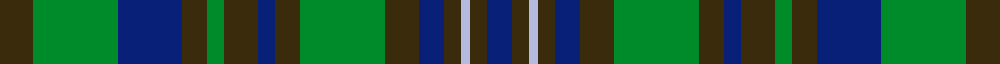

This is one **variant** — a specific cloth: this exact thread count and colourway, with its own
provenance below. It is one weaving of the [sett](/tartans/u/un/unidentified-fragment/) (the scale-free proportion — the
same cloth at any scale or shade), whose colour order is pattern [BGWGBGGGBGGGBGG](/stripes/bgwgbgggbgggbgg/).

Part of the [Unidentified Fragment](/tartans/u/un/unidentified-fragment/) tartan — the named design grouping this sett with its other cloths.

Sourced from house-of-tartan.  It is a [15 stripe tartan](/stripes/stripes15/).

Original link [http://www.house-of-tartan.scotland.net/house/TartanViewjs.asp?colr=Def&tnam=2018](http://www.house-of-tartan.scotland.net/house/TartanViewjs.asp?colr=Def&tnam=2018)

## Provenance

Earliest known date: 1978 Sent from Canada. See file.

2 attestations — the source records this cloth was collapsed from (oldest owns this page)

<ul>
<li>1978 — Unidentified Fragment Artifact Tartan (house-of-tartan, <a href="http://www.house-of-tartan.scotland.net/house/TartanViewjs.asp?colr=Def&tnam=2018">record</a>) </li>
<li>Historic — Unidentified Fragment #2 (register-of-tartans, <a href="https://www.tartanregister.gov.uk/tartanDetails.aspx?ref=4296">record</a>)  <em>Sent from Canada. Scottish Tartans Society archive.</em></li>
</ul>

Dataset <small>— provenance for this record, inherited from the source manifest</small>

<dl class="dataset-prov">
<dt>source</dt><dd><a href="/sources/house-of-tartan/">House of Tartan</a></dd>
<dt>data captured from</dt><dd><a href="https://github.com/thetartan/tartan-database/blob/master/data/house-of-tartan/data.csv">https://github.com/thetartan/tartan-database/blob/master/data/house-of-tartan/data.csv</a></dd>
<dt>data date</dt><dd>1978 <small>(this record)</small></dd>
<dt>licence</dt><dd><a href="https://creativecommons.org/licenses/by-nc-nd/4.0/">CC BY-NC-ND 4.0</a></dd>
</dl>

Capture chain <small>— the hands this data passed through, oldest first; each capture carries its own licence</small>

<ol class="capture-chain">
<li><a href="http://www.house-of-tartan.scotland.net/">House of Tartan</a> <small>the weaver/retailer's database — the site is now offline; the URL is kept as the ultimate source's identity</small></li>
<li><a href="https://github.com/thetartan/tartan-database">thetartan/tartan-database</a> <small>2016-2017</small> · <a href="https://creativecommons.org/licenses/by-nc-nd/4.0/">CC BY-NC-ND 4.0</a> <small>Levko Kravets's frozen compilation — the capture we vendored, and where its CC licence text came from</small></li>
<li>this dictionary <small>captured 2026-06-10 · commit 5bf86c7566</small> <small>each re-capture is a git commit to data/sources</small></li>
</ol>

## Register references

External register numbers recorded for this tartan.

- Scottish Register of Tartans: [4296](https://www.tartanregister.gov.uk/tartanDetails.aspx?ref=4296)
- Scottish Tartans World Register: 2018

## Thread count
DY/8 G20 DB15 DY6 G4 DY8 DB4 DY6 G20 DY8 DB6 DY4 LB2 DY4 DB/6

One full sett is **228 threads**.

## Palette
<table><thead><tr><th>Colour</th><th>Shade</th><th>OKLCh</th></tr></thead><tbody><tr><td>LB</td><td><code style="background-color:#B5BBDE;">#B5BBDE</code> <small style="color:#888">#B5BBDE</small></td><td><small style="color:#888">oklch(79.9% 0.050 277.6)</small></td></tr><tr><td>DB</td><td><code style="background-color:#082077;">#082077</code> <small style="color:#888">#082077</small></td><td><small style="color:#888">oklch(30.0% 0.149 265.1)</small></td></tr><tr><td>G</td><td><code style="background-color:#008B2A;">#008B2A</code> <small style="color:#888">#008B2A</small></td><td><small style="color:#888">oklch(55.4% 0.170 145.9)</small></td></tr><tr><td>DY</td><td><code style="background-color:#3A2B0D;">#3A2B0D</code> <small style="color:#888">#3A2B0D</small></td><td><small style="color:#888">oklch(30.0% 0.049 82.0)</small></td></tr></tbody></table>

# Sample pattern

## Nearest tartan variants

The nearest existing variants by ΔTartan distance, with this cloth at the top so the swatches line up against it.

ΔTartan

Threads

Variant

Sett

—

228

<a href="/variants/s15/dy8g20db15dy6g4dy8db4dy6g20dy8db6dy4lb2dy4db6/">Unidentified Fragment Artifact Tartan</a>

<a href="/ttd/edit/#slug=db21g2db3g2db2g14dy15g4dy15g14db14g2db3~x2&amp;base=dy8g20db15dy6g4dy8db4dy6g20dy8db6dy4lb2dy4db6" title="compare in the TTD">2.40</a>

396

<a href="/variants/s13/db21g2db3g2db2g14dy15g4dy15g14db14g2db3~x2/">Montmorency Family Tartan</a>

<a href="/ttd/edit/#slug=db4dy7y3dy12g15dy5db20dy5g4dy2~x2&amp;base=dy8g20db15dy6g4dy8db4dy6g20dy8db6dy4lb2dy4db6" title="compare in the TTD">2.40</a>

296

<a href="/variants/s10/db4dy7y3dy12g15dy5db20dy5g4dy2~x2/">Tupper. Sir Charles.. Family Tartan</a>

<a href="/ttd/edit/#slug=lo2db3dy3db4g16db3dy3db4g3db3dy16db4g3db3lo2~x2&amp;base=dy8g20db15dy6g4dy8db4dy6g20dy8db6dy4lb2dy4db6" title="compare in the TTD">2.43</a>

280

<a href="/variants/s15/lo2db3dy3db4g16db3dy3db4g3db3dy16db4g3db3lo2~x2/">Kerry, County</a>

<a href="/ttd/edit/#slug=db8dy1db1dy1db1dy8g8dy1g8dy8db8dy1db1~x6&amp;base=dy8g20db15dy6g4dy8db4dy6g20dy8db6dy4lb2dy4db6" title="compare in the TTD">2.63</a>

606

<a href="/variants/s13/db8dy1db1dy1db1dy8g8dy1g8dy8db8dy1db1~x6/">Tyneside Scottish (Blue) (District)</a>

<a href="/ttd/edit/#slug=dr3db14g14db2dr14db2dr14db2g14db2lo3~x2&amp;base=dy8g20db15dy6g4dy8db4dy6g20dy8db6dy4lb2dy4db6" title="compare in the TTD">2.76</a>

324

<a href="/variants/s11/dr3db14g14db2dr14db2dr14db2g14db2lo3~x2/">Clare Irish County Tartan</a>

<a href="/ttd/edit/#slug=dt4g2db10y1db2g13dt11g13db13y2~x2~dt1204274-db1406275&amp;base=dy8g20db15dy6g4dy8db4dy6g20dy8db6dy4lb2dy4db6" title="compare in the TTD">2.88</a>

272

<a href="/variants/s10/db4g2dbi10y1dbi2g13db11g13dbi13y2~x2~db1204274-dbi1406275/">Pinney's of Scotland</a>

<a href="/ttd/edit/#slug=db11do1db1do1db1do8g8do1g8do8db8do1db1~x2&amp;base=dy8g20db15dy6g4dy8db4dy6g20dy8db6dy4lb2dy4db6" title="compare in the TTD">2.94</a>

208

<a href="/variants/s13/db11do1db1do1db1do8g8do1g8do8db8do1db1~x2/">Tyneside Scottish District Tartan</a>

<a href="/ttd/edit/#slug=g9db2dg3db2dg5db2dg3lo3dg6lo3dg3db2dg5db2dg3db2g16dr3db2dr3g7~x2&amp;base=dy8g20db15dy6g4dy8db4dy6g20dy8db6dy4lb2dy4db6" title="compare in the TTD">3.08</a>

312

<a href="/variants/s21/g9db2dg3db2dg5db2dg3lo3dg6lo3dg3db2dg5db2dg3db2g16dr3db2dr3g7~x2/">Limerick Irish County Tartan</a>

<a href="/ttd/edit/#slug=db11n4db4w2db4n4db11dg26n4w3n4w2n14dg10db16dg6~x2&amp;base=dy8g20db15dy6g4dy8db4dy6g20dy8db6dy4lb2dy4db6" title="compare in the TTD">3.15</a>

466

<a href="/variants/s16/db11n4db4w2db4n4db11dg26n4w3n4w2n14dg10db16dg6~x2/">Stuart-Houghton Hunting (Personal)</a>

<a href="/ttd/edit/#slug=o8g20db15o6g4o8db4o6g20o8db6o4b2o4db6&amp;base=dy8g20db15dy6g4dy8db4dy6g20dy8db6dy4lb2dy4db6" title="compare in the TTD">3.16</a>

228

<a href="/variants/s15/o8g20db15o6g4o8db4o6g20o8db6o4b2o4db6/">Unidentified, Fragment</a>

## Neighbour map

Every grey dot is one of 13656 variants placed by the first two principal components of the ΔTartan feature space (42% of its variance). Red is this tartan; blue dots are its nearest — click one to open its page. The map is a flat projection of a many-dimensional space — [how to read it](/posts/neighbourhood-maps/).

<svg viewBox="0 0 640 380" role="img" style="max-width:100%;height:auto;border:1px solid #e0e0e0;border-radius:4px;display:block" xmlns="http://www.w3.org/2000/svg"><image href="/nn/cloud.v1.png" width="640" height="380"/><a href="/variants/s13/db21g2db3g2db2g14dy15g4dy15g14db14g2db3~x2/"><circle cx="277.0" cy="232.9" r="4" fill="#3465a4"><title>Montmorency Family Tartan</title></circle></a><a href="/variants/s10/db4dy7y3dy12g15dy5db20dy5g4dy2~x2/"><circle cx="275.2" cy="239.0" r="4" fill="#3465a4"><title>Tupper. Sir Charles.. Family Tartan</title></circle></a><a href="/variants/s15/lo2db3dy3db4g16db3dy3db4g3db3dy16db4g3db3lo2~x2/"><circle cx="215.6" cy="209.1" r="4" fill="#3465a4"><title>Kerry, County</title></circle></a><a href="/variants/s13/db8dy1db1dy1db1dy8g8dy1g8dy8db8dy1db1~x6/"><circle cx="273.1" cy="242.0" r="4" fill="#3465a4"><title>Tyneside Scottish (Blue) (District)</title></circle></a><a href="/variants/s11/dr3db14g14db2dr14db2dr14db2g14db2lo3~x2/"><circle cx="223.9" cy="235.3" r="4" fill="#3465a4"><title>Clare Irish County Tartan</title></circle></a><a href="/variants/s10/db4g2dbi10y1dbi2g13db11g13dbi13y2~x2~db1204274-dbi1406275/"><circle cx="273.2" cy="233.5" r="4" fill="#3465a4"><title>Pinney's of Scotland</title></circle></a><a href="/variants/s13/db11do1db1do1db1do8g8do1g8do8db8do1db1~x2/"><circle cx="294.1" cy="228.7" r="4" fill="#3465a4"><title>Tyneside Scottish District Tartan</title></circle></a><a href="/variants/s21/g9db2dg3db2dg5db2dg3lo3dg6lo3dg3db2dg5db2dg3db2g16dr3db2dr3g7~x2/"><circle cx="186.2" cy="194.9" r="4" fill="#3465a4"><title>Limerick Irish County Tartan</title></circle></a><a href="/variants/s16/db11n4db4w2db4n4db11dg26n4w3n4w2n14dg10db16dg6~x2/"><circle cx="250.4" cy="202.0" r="4" fill="#3465a4"><title>Stuart-Houghton Hunting (Personal)</title></circle></a><a href="/variants/s15/o8g20db15o6g4o8db4o6g20o8db6o4b2o4db6/"><circle cx="214.6" cy="210.0" r="4" fill="#3465a4"><title>Unidentified, Fragment</title></circle></a><circle cx="235.4" cy="225.7" r="5" fill="#c00000"/><text x="320" y="376" text-anchor="middle" font-size="11" fill="#999">ground</text><text x="11" y="190" text-anchor="middle" font-size="11" fill="#999" transform="rotate(-90 11 190)">complexity</text></svg>

ID: /variants/s15/dy8g20db15dy6g4dy8db4dy6g20dy8db6dy4lb2dy4db6/
