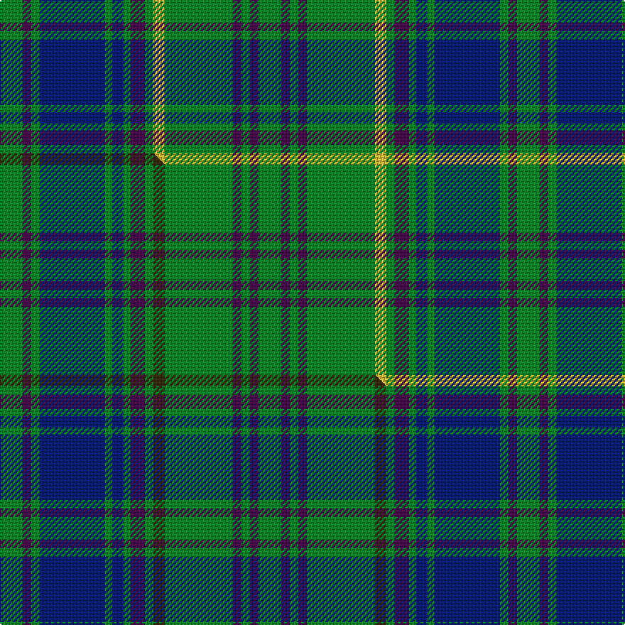

This is one **variant** — a specific cloth: this exact thread count and colourway, with its own
provenance below. It is one weaving of the [sett](/tartans/a/ab/aberlour-bicentenary/) (the scale-free proportion — the
same cloth at any scale or shade), whose colour order is pattern [GBGBGBGBGYGBGBG](/stripes/gbgbgbgbgygbgbg/).

Part of the [Aberlour Bicentenary](/tartans/a/ab/aberlour-bicentenary/) tartan — the named design grouping this sett with its other cloths.

Sourced from tartans-authority.  It is a [15 stripe tartan](/stripes/stripes15/).

Original link <code>http://www.tartansauthority.com/tartan-ferret/display/10563/</code> — retired · [Internet Archive copy](https://web.archive.org/web/*/http://www.tartansauthority.com/tartan-ferret/display/10563/*)

Dataset <small>— provenance for this record, inherited from the source manifest</small>

<dl class="dataset-prov">
<dt>source</dt><dd><a href="/sources/tartans-authority/">Scottish Tartans Authority</a></dd>
<dt>data captured from</dt><dd><a href="https://github.com/thetartan/tartan-database/blob/master/data/tartans-authority/data.csv">https://github.com/thetartan/tartan-database/blob/master/data/tartans-authority/data.csv</a></dd>
<dt>data date</dt><dd>1st Dec. 2011 <small>(this record)</small></dd>
<dt>licence</dt><dd><a href="https://creativecommons.org/licenses/by-nc-nd/4.0/">CC BY-NC-ND 4.0</a></dd>
</dl>

Capture chain <small>— the hands this data passed through, oldest first; each capture carries its own licence</small>

<ol class="capture-chain">
<li><a href="https://www.tartansauthority.com/">Scottish Tartans Authority</a> <small>the heritage body’s archive — its tartan-ferret record browser is retired; dead record links are shown unlinked, with an Internet Archive copy (ITI numbers are not SRT references)</small></li>
<li><a href="https://github.com/thetartan/tartan-database">thetartan/tartan-database</a> <small>2016-2017</small> · <a href="https://creativecommons.org/licenses/by-nc-nd/4.0/">CC BY-NC-ND 4.0</a> <small>Levko Kravets's frozen compilation — the capture we vendored, and where its CC licence text came from</small></li>
<li>this dictionary <small>captured 2026-06-10 · commit 5bf86c7566</small> <small>each re-capture is a git commit to data/sources</small></li>
</ol>

## Register references

External register numbers recorded for this tartan.

- Scottish Register of Tartans: [10563](https://www.tartanregister.gov.uk/tartanDetails?ref=10563)
- Scottish Tartans Authority (ITI): 10563

## Thread count
G/16 DP6 G6 DB46 G5 DB8 G5 DP10 G6 LY8 G48 DP6 G6 DP6 G/16

One full sett is **364 threads**.

## Palette
<table><thead><tr><th>Colour</th><th>Shade</th><th>OKLCh</th></tr></thead><tbody><tr><td>DB</td><td><code style="background-color:#082077;">#082077</code> <small style="color:#888">#082077</small></td><td><small style="color:#888">oklch(30.0% 0.149 265.1)</small></td></tr><tr><td>DP</td><td><code style="background-color:#4B0B4F;">#4B0B4F</code> <small style="color:#888">#4B0B4F</small></td><td><small style="color:#888">oklch(30.1% 0.125 325.4)</small></td></tr><tr><td>LY</td><td><code style="background-color:#DCBC32;">#DCBC32</code> <small style="color:#888">#DCBC32</small></td><td><small style="color:#888">oklch(80.0% 0.150 95.2)</small></td></tr><tr><td>G</td><td><code style="background-color:#008B2A;">#008B2A</code> <small style="color:#888">#008B2A</small></td><td><small style="color:#888">oklch(55.4% 0.170 145.9)</small></td></tr></tbody></table>

# Sample pattern

## Compared to the master

This cloth is one sett of its design; the master sett (the exemplar the design is anchored on) is below for comparison.

Its **ΔTartan distance** from the master is **0.05** — the same measure the nearest-tartans table ranks by (0 is identical; a re-scale of the same cloth is near 0, a recolour or a different proportion further).

<figure class="master-compare" style="margin:0">

this sett
master sett ★

<figcaption style="color:#888;font-size:smaller">One weave of this sett against the <a href="/setts/g16dp6g6db46g5db8g5dp10g6dy8g48dp6g6dp6g16/">master sett ★</a>, split on the diagonal: a shared proportion runs seamlessly across it with only the shades shifting; a different proportion breaks on it.</figcaption>
</figure>

## Nearest tartan variants

The nearest existing variants by ΔTartan distance, with this cloth at the top so the swatches line up against it.

ΔTartan

Threads

Variant

Sett

—

364

<a href="/variants/s15/g16dp6g6db46g5db8g5dp10g6ly8g48dp6g6dp6g16/">Aberlour Bicentenary (Commemorative)</a>

<a href="/ttd/edit/#slug=g16dp6g6db46g5db8g5dp10g6dy8g48dp6g6dp6g16&amp;base=g16dp6g6db46g5db8g5dp10g6ly8g48dp6g6dp6g16" title="compare in the TTD">0.05</a>

364

<a href="/variants/s15/g16dp6g6db46g5db8g5dp10g6dy8g48dp6g6dp6g16/">Aberlour Bicentenary</a>

<a href="/ttd/edit/#slug=g3db3g3db24g3db3g3lo2g18dr2g18lo2~x2&amp;base=g16dp6g6db46g5db8g5dp10g6ly8g48dp6g6dp6g16" title="compare in the TTD">1.98</a>

326

<a href="/variants/s12/g3db3g3db24g3db3g3lo2g18dr2g18lo2~x2/">Greenways Marketing Intl</a>

<a href="/ttd/edit/#slug=db36y4db10y4db36g28w3g3w3g8y6g8w3g3w3g28&amp;base=g16dp6g6db46g5db8g5dp10g6ly8g48dp6g6dp6g16" title="compare in the TTD">2.41</a>

308

<a href="/variants/s16/db36y4db10y4db36g28w3g3w3g8y6g8w3g3w3g28/">MacOrrell</a>

<a href="/ttd/edit/#slug=y2w1db4w1db1y1dg12y1dg2y1~x4&amp;base=g16dp6g6db46g5db8g5dp10g6ly8g48dp6g6dp6g16" title="compare in the TTD">2.79</a>

196

<a href="/variants/s10/y2w1db4w1db1y1dg12y1dg2y1~x4/">Henry, David G (Personal)</a>

<a href="/ttd/edit/#slug=g28dr12g4db20lo2db3lo2db3g7~x2&amp;base=g16dp6g6db46g5db8g5dp10g6ly8g48dp6g6dp6g16" title="compare in the TTD">2.90</a>

254

<a href="/variants/s9/g28dr12g4db20lo2db3lo2db3g7~x2/">Cork Irish County Tartan</a>

<a href="/ttd/edit/#slug=dg46db17dg5db7dg7lb15db3lb3db6lb3db3lb15dg7db7dg5db17dg46dgi4~dgi1605139&amp;base=g16dp6g6db46g5db8g5dp10g6ly8g48dp6g6dp6g16" title="compare in the TTD">3.01</a>

382

<a href="/variants/s18/dg46db17dg5db7dg7lb15db3lb3db6lb3db3lb15dg7db7dg5db17dg46dgi4~dgi1605139/">Jones of Wales</a>

<a href="/ttd/edit/#slug=g40dr3g4dr3g12db32lo4dr3~x2&amp;base=g16dp6g6db46g5db8g5dp10g6ly8g48dp6g6dp6g16" title="compare in the TTD">3.04</a>

318

<a href="/variants/s8/g40dr3g4dr3g12db32lo4dr3~x2/">Leatherneck</a>

<a href="/ttd/edit/#slug=db10y4db36g28w3g3w3g8y6&amp;base=g16dp6g6db46g5db8g5dp10g6ly8g48dp6g6dp6g16" title="compare in the TTD">3.18</a>

186

<a href="/variants/s9/db10y4db36g28w3g3w3g8y6/">MacOrrell</a>

<a href="/ttd/edit/#slug=g23dy5db13g5db5w3db5g5dy9g9~x2&amp;base=g16dp6g6db46g5db8g5dp10g6ly8g48dp6g6dp6g16" title="compare in the TTD">3.21</a>

264

<a href="/variants/s10/g23dy5db13g5db5w3db5g5dy9g9~x2/">MacScott Family (America) (Personal)</a>

<a href="/ttd/edit/#slug=dg14w2db3g7dg2g7db3w2dg14lb2~x4&amp;base=g16dp6g6db46g5db8g5dp10g6ly8g48dp6g6dp6g16" title="compare in the TTD">3.31</a>

384

<a href="/variants/s10/dg14w2db3g7dg2g7db3w2dg14lb2~x4/">Manx Ellan Vannin</a>

## Neighbour map

Every grey dot is one of 13656 variants placed by the first two principal components of the ΔTartan feature space (42% of its variance). Red is this tartan; blue dots are its nearest — click one to open its page. The map is a flat projection of a many-dimensional space — [how to read it](/posts/neighbourhood-maps/).

<svg viewBox="0 0 640 380" role="img" style="max-width:100%;height:auto;border:1px solid #e0e0e0;border-radius:4px;display:block" xmlns="http://www.w3.org/2000/svg"><image href="/nn/cloud.v1.png" width="640" height="380"/><a href="/variants/s15/g16dp6g6db46g5db8g5dp10g6dy8g48dp6g6dp6g16/"><circle cx="318.0" cy="188.9" r="4" fill="#3465a4"><title>Aberlour Bicentenary</title></circle></a><a href="/variants/s12/g3db3g3db24g3db3g3lo2g18dr2g18lo2~x2/"><circle cx="353.9" cy="184.7" r="4" fill="#3465a4"><title>Greenways Marketing Intl</title></circle></a><a href="/variants/s16/db36y4db10y4db36g28w3g3w3g8y6g8w3g3w3g28/"><circle cx="261.8" cy="172.3" r="4" fill="#3465a4"><title>MacOrrell</title></circle></a><a href="/variants/s10/y2w1db4w1db1y1dg12y1dg2y1~x4/"><circle cx="323.3" cy="175.5" r="4" fill="#3465a4"><title>Henry, David G (Personal)</title></circle></a><a href="/variants/s9/g28dr12g4db20lo2db3lo2db3g7~x2/"><circle cx="296.4" cy="196.3" r="4" fill="#3465a4"><title>Cork Irish County Tartan</title></circle></a><a href="/variants/s18/dg46db17dg5db7dg7lb15db3lb3db6lb3db3lb15dg7db7dg5db17dg46dgi4~dgi1605139/"><circle cx="322.8" cy="157.6" r="4" fill="#3465a4"><title>Jones of Wales</title></circle></a><a href="/variants/s8/g40dr3g4dr3g12db32lo4dr3~x2/"><circle cx="351.1" cy="196.0" r="4" fill="#3465a4"><title>Leatherneck</title></circle></a><a href="/variants/s9/db10y4db36g28w3g3w3g8y6/"><circle cx="277.5" cy="195.6" r="4" fill="#3465a4"><title>MacOrrell</title></circle></a><a href="/variants/s10/g23dy5db13g5db5w3db5g5dy9g9~x2/"><circle cx="268.1" cy="239.8" r="4" fill="#3465a4"><title>MacScott Family (America) (Personal)</title></circle></a><a href="/variants/s10/dg14w2db3g7dg2g7db3w2dg14lb2~x4/"><circle cx="255.8" cy="214.1" r="4" fill="#3465a4"><title>Manx Ellan Vannin</title></circle></a><circle cx="307.9" cy="185.9" r="5" fill="#c00000"/><text x="320" y="376" text-anchor="middle" font-size="11" fill="#999">ground</text><text x="11" y="190" text-anchor="middle" font-size="11" fill="#999" transform="rotate(-90 11 190)">complexity</text></svg>

ID: /variants/s15/g16dp6g6db46g5db8g5dp10g6ly8g48dp6g6dp6g16/
