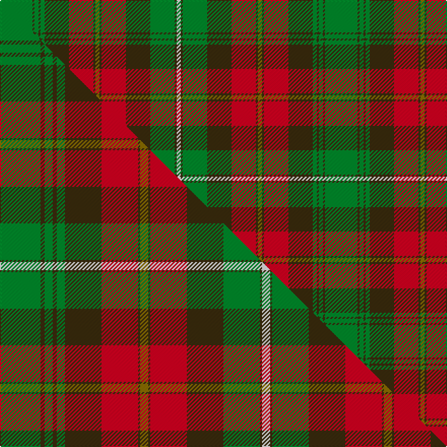

This page is one **sett** — a single exact thread-count. It belongs to the [tartan](/setts/g16dy1g2dy1g2dy12r12dy1y2dy1r12dy12g12dy1w2/)
(the same proportion at any scale), whose colour order is pattern [GGGGGGRGGGRGGGW](/stripes/ggggggrgggrgggw/).

Part of the [Prince Edward Island](/tartans/prince-edward-island/) tartan — the named design grouping this sett with its other cloths.

Sourced from house-of-tartan.  It is a [15 stripe tartan](/stripes/stripes15/).

Original link http://www.house-of-tartan.scotland.net/house/TartanViewjs.asp?colr=Def&tnam=918

## Provenance

Earliest known date: 1964 The warmth and glow of the fertile soil, The green field and tree, The yellow and the brown of Autumn, The white of surf or a summer snow, Rust, green, yellow and white, Yes! That's our Island Tartan.

## Thread count
G/32 DY2 G4 DY2 G4 DY24 R24 DY2 Y4 DY2 R24 DY24 G24 DY2 W/4

One full sett is **320 threads**.

## Palette
<table><thead><tr><th>Colour</th><th>Shade</th><th>OKLCh</th></tr></thead><tbody><tr><td>G</td><td><code style="background-color:#008B2A;">#008B2A</code> <small style="color:#888">#008B2A</small></td><td><small style="color:#888">oklch(55.4% 0.170 145.9)</small></td></tr><tr><td>W</td><td><code style="background-color:#F7F7F7;">#F7F7F7</code> <small style="color:#888">#F7F7F7</small></td><td><small style="color:#888">oklch(97.6% 0.000 89.9)</small></td></tr><tr><td>R</td><td><code style="background-color:#D60020;">#D60020</code> <small style="color:#888">#D60020</small></td><td><small style="color:#888">oklch(55.2% 0.224 25.5)</small></td></tr><tr><td>DY</td><td><code style="background-color:#3A2B0D;">#3A2B0D</code> <small style="color:#888">#3A2B0D</small></td><td><small style="color:#888">oklch(30.0% 0.049 82.0)</small></td></tr><tr><td>Y</td><td><code style="background-color:#8B6E00;">#8B6E00</code> <small style="color:#888">#8B6E00</small></td><td><small style="color:#888">oklch(55.1% 0.113 90.4)</small></td></tr></tbody></table>

# Sample pattern

## Compared to the master

This cloth is one sett of its design; the master sett (the exemplar the design is anchored on) is below for comparison.

Its **ΔTartan distance** from the master is **0.40** — the same measure the nearest-tartans table ranks by (0 is identical; a re-scale of the same cloth is near 0, a recolour or a different proportion further).

<figure class="master-compare" style="margin:0">

this sett
master sett ★

<figcaption style="color:#888;font-size:smaller">One weave of this sett against the <a href="/setts/g20dy2g4dy2g4dy18r18dy1y4dy1r18dy18g18dy1w4/">master sett ★</a>, split on the diagonal: a shared proportion runs seamlessly across it with only the shades shifting; a different proportion breaks on it.</figcaption>
</figure>

## Nearest tartan variants

The nearest existing variants by ΔTartan distance, with this cloth at the top so the swatches line up against it.

ΔTartan

Threads

Variant

Sett

—

320

<a href="/variants/s15/g16dy1g2dy1g2dy12r12dy1y2dy1r12dy12g12dy1w2~x2/">Prince Edward Island District Tartan</a>

<a href="/ttd/edit/#slug=g20dy2g4dy2g4dy18r18dy1y4dy1r18dy18g18dy1w4~x2&amp;base=g16dy1g2dy1g2dy12r12dy1y2dy1r12dy12g12dy1w2~x2" title="compare in the TTD">0.40</a>

484

<a href="/variants/s15/g20dy2g4dy2g4dy18r18dy1y4dy1r18dy18g18dy1w4~x2/">Prince Edward Island (District)</a>

<a href="/ttd/edit/#slug=g6y5w1g2w1g5w1g2w1r15db2w1~x2&amp;base=g16dy1g2dy1g2dy12r12dy1y2dy1r12dy12g12dy1w2~x2" title="compare in the TTD">2.63</a>

154

<a href="/variants/s12/g6y5w1g2w1g5w1g2w1r15db2w1~x2/">Dunblane</a>

<a href="/ttd/edit/#slug=w1db4o8r4w1r4w1r4g16db2w1~x2&amp;base=g16dy1g2dy1g2dy12r12dy1y2dy1r12dy12g12dy1w2~x2" title="compare in the TTD">2.68</a>

180

<a href="/variants/s11/w1db4o8r4w1r4w1r4g16db2w1~x2/">Stuart / Stewart, Riding Cloak</a>

<a href="/ttd/edit/#slug=dr4g20db2g2db2g3db6o26w3o2w2o4~x2&amp;base=g16dy1g2dy1g2dy12r12dy1y2dy1r12dy12g12dy1w2~x2" title="compare in the TTD">2.69</a>

288

<a href="/variants/s12/dr4g20db2g2db2g3db6o26w3o2w2o4~x2/">Dorcas (Fashion)</a>

<a href="/ttd/edit/#slug=dr3g16db2g2db2g3db6o20lr3o2lr2o3~x2&amp;base=g16dy1g2dy1g2dy12r12dy1y2dy1r12dy12g12dy1w2~x2" title="compare in the TTD">2.70</a>

244

<a href="/variants/s12/dr3g16db2g2db2g3db6o20lr3o2lr2o3~x2/">Callum, Blue (Fashion)</a>

<a href="/ttd/edit/#slug=r2ri4g2db2ri6g14ri2db2g2ri12g7r2ri5w1~x2~r1506028-ri2008029&amp;base=g16dy1g2dy1g2dy12r12dy1y2dy1r12dy12g12dy1w2~x2" title="compare in the TTD">2.72</a>

246

<a href="/variants/s14/r2ri4g2db2ri6g14ri2db2g2ri12g7r2ri5w1~x2~r1506028-ri2008029/">MacDonald of Staffa 4</a>

<a href="/ttd/edit/#slug=r26g6dt26r2g26w1r6dt2r6dt13~x2&amp;base=g16dy1g2dy1g2dy12r12dy1y2dy1r12dy12g12dy1w2~x2" title="compare in the TTD">2.83</a>

378

<a href="/variants/s10/r26g6dt26r2g26w1r6dt2r6dt13~x2/">Unnamed C18/19th - Antigonish (A)</a>

<a href="/ttd/edit/#slug=g25r2w2db2w2r13dy28db2r3~x2&amp;base=g16dy1g2dy1g2dy12r12dy1y2dy1r12dy12g12dy1w2~x2" title="compare in the TTD">2.87</a>

260

<a href="/variants/s9/g25r2w2db2w2r13dy28db2r3~x2/">Brousseau (Personal)</a>

<a href="/ttd/edit/#slug=dy24r24w3g21y2r1y2dy6r2~x2&amp;base=g16dy1g2dy1g2dy12r12dy1y2dy1r12dy12g12dy1w2~x2" title="compare in the TTD">2.89</a>

288

<a href="/variants/s9/dy24r24w3g21y2r1y2dy6r2~x2/">Henry W.A. Canadian Tartan</a>

<a href="/ttd/edit/#slug=r3y1dp1r20dr2dp9dr2g20dp1y1g3~x2&amp;base=g16dy1g2dy1g2dy12r12dy1y2dy1r12dy12g12dy1w2~x2" title="compare in the TTD">2.91</a>

240

<a href="/variants/s11/r3y1dp1r20dr2dp9dr2g20dp1y1g3~x2/">Scotland (Personal)</a>

## Neighbour map

Every grey dot is one of 13620 variants placed by the first two principal components of the ΔTartan feature space (42% of its variance). Red is this tartan; blue dots are its nearest — click one to open its page.

<svg viewBox="0 0 640 380" role="img" style="max-width:100%;height:auto;border:1px solid #e0e0e0;border-radius:4px;display:block" xmlns="http://www.w3.org/2000/svg"><image href="/nn/cloud.v1.png" width="640" height="380"/><a href="/variants/s15/g20dy2g4dy2g4dy18r18dy1y4dy1r18dy18g18dy1w4~x2/"><circle cx="203.2" cy="143.3" r="4" fill="#3465a4"><title>Prince Edward Island (District)</title></circle></a><a href="/variants/s12/g6y5w1g2w1g5w1g2w1r15db2w1~x2/"><circle cx="204.7" cy="144.5" r="4" fill="#3465a4"><title>Dunblane</title></circle></a><a href="/variants/s11/w1db4o8r4w1r4w1r4g16db2w1~x2/"><circle cx="177.7" cy="147.3" r="4" fill="#3465a4"><title>Stuart / Stewart, Riding Cloak</title></circle></a><a href="/variants/s12/dr4g20db2g2db2g3db6o26w3o2w2o4~x2/"><circle cx="244.2" cy="149.7" r="4" fill="#3465a4"><title>Dorcas (Fashion)</title></circle></a><a href="/variants/s12/dr3g16db2g2db2g3db6o20lr3o2lr2o3~x2/"><circle cx="228.8" cy="171.0" r="4" fill="#3465a4"><title>Callum, Blue (Fashion)</title></circle></a><a href="/variants/s14/r2ri4g2db2ri6g14ri2db2g2ri12g7r2ri5w1~x2~r1506028-ri2008029/"><circle cx="261.2" cy="155.8" r="4" fill="#3465a4"><title>MacDonald of Staffa 4</title></circle></a><a href="/variants/s10/r26g6dt26r2g26w1r6dt2r6dt13~x2/"><circle cx="241.7" cy="135.1" r="4" fill="#3465a4"><title>Unnamed C18/19th - Antigonish (A)</title></circle></a><a href="/variants/s9/g25r2w2db2w2r13dy28db2r3~x2/"><circle cx="202.8" cy="152.6" r="4" fill="#3465a4"><title>Brousseau (Personal)</title></circle></a><a href="/variants/s9/dy24r24w3g21y2r1y2dy6r2~x2/"><circle cx="228.5" cy="142.0" r="4" fill="#3465a4"><title>Henry W.A. Canadian Tartan</title></circle></a><a href="/variants/s11/r3y1dp1r20dr2dp9dr2g20dp1y1g3~x2/"><circle cx="243.8" cy="128.4" r="4" fill="#3465a4"><title>Scotland (Personal)</title></circle></a><circle cx="210.1" cy="147.3" r="5" fill="#c00000"/><text x="320" y="376" text-anchor="middle" font-size="11" fill="#999">ground</text><text x="11" y="190" text-anchor="middle" font-size="11" fill="#999" transform="rotate(-90 11 190)">complexity</text></svg>

ID: /variants/s15/g16dy1g2dy1g2dy12r12dy1y2dy1r12dy12g12dy1w2~x2/
