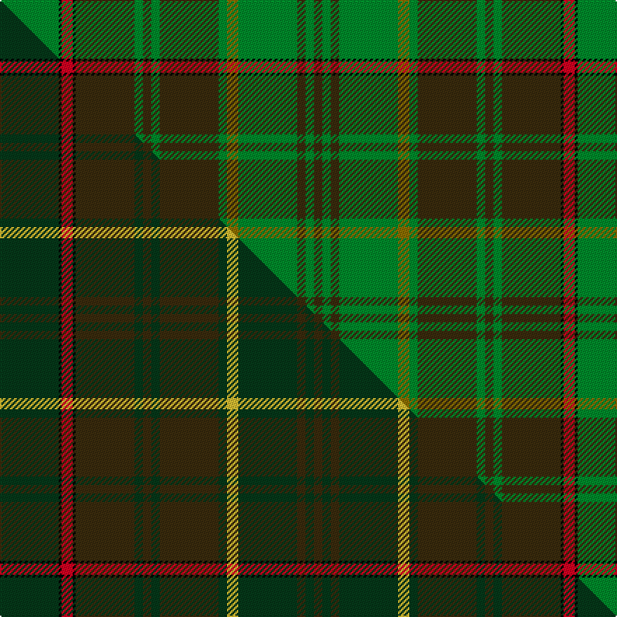

This is one **variant** — a specific cloth: this exact thread count and colourway, with its own
provenance below. It is one weaving of the [sett](/tartans/e/en/ensign-of-ontario/) (the scale-free proportion — the
same cloth at any scale or shade), whose colour order is pattern [GGGGGGGGGGGKRKG](/stripes/gggggggggggkrkg/).

Part of the [Ensign of Ontario](/tartans/e/en/ensign-of-ontario/) tartan — the named design grouping this sett with its other cloths.

Sourced from house-of-tartan.  It is a [15 stripe tartan](/stripes/stripes15/).

Original link [http://www.house-of-tartan.scotland.net/house/TartanViewjs.asp?colr=Def&tnam=2032](http://www.house-of-tartan.scotland.net/house/TartanViewjs.asp?colr=Def&tnam=2032)

## Provenance

Earliest known date: 1965 The Ensign tartan owes its inspiration to the Provincial Coat of Arms which was granted to the province by Royal Warrant of Queen Victoria in 1868. The yellow is taken from the three golden maple leaves of the lower shield and the red from the cross of St George on the upper. The black and brown come from the bear, the moose and the deer. There is also a District tartan called Northern Ontario.

Dataset <small>— provenance for this record, inherited from the source manifest</small>

<dl class="dataset-prov">
<dt>source</dt><dd><a href="/sources/house-of-tartan/">House of Tartan</a></dd>
<dt>data captured from</dt><dd><a href="https://github.com/thetartan/tartan-database/blob/master/data/house-of-tartan/data.csv">https://github.com/thetartan/tartan-database/blob/master/data/house-of-tartan/data.csv</a></dd>
<dt>data date</dt><dd>1965 <small>(this record)</small></dd>
<dt>licence</dt><dd><a href="https://creativecommons.org/licenses/by-nc-nd/4.0/">CC BY-NC-ND 4.0</a></dd>
</dl>

Capture chain <small>— the hands this data passed through, oldest first; each capture carries its own licence</small>

<ol class="capture-chain">
<li><a href="http://www.house-of-tartan.scotland.net/">House of Tartan</a> <small>the weaver/retailer's database — the site is now offline; the URL is kept as the ultimate source's identity</small></li>
<li><a href="https://github.com/thetartan/tartan-database">thetartan/tartan-database</a> <small>2016-2017</small> · <a href="https://creativecommons.org/licenses/by-nc-nd/4.0/">CC BY-NC-ND 4.0</a> <small>Levko Kravets's frozen compilation — the capture we vendored, and where its CC licence text came from</small></li>
<li>this dictionary <small>captured 2026-06-10 · commit 5bf86c7566</small> <small>each re-capture is a git commit to data/sources</small></li>
</ol>

## Thread count
G/42 K2 R8 K2 DY42 G6 DY6 G6 DY42 G6 Y8 G42 DY6 G6 DY/6

One full sett is **412 threads**.

## Palette
<table><thead><tr><th>Colour</th><th>Shade</th><th>OKLCh</th></tr></thead><tbody><tr><td>G</td><td><code style="background-color:#008B2A;">#008B2A</code> <small style="color:#888">#008B2A</small></td><td><small style="color:#888">oklch(55.4% 0.170 145.9)</small></td></tr><tr><td>K</td><td><code style="background-color:#000000;">#000000</code> <small style="color:#888">#000000</small></td><td><small style="color:#888">oklch(0.0% 0.000 0.0)</small></td></tr><tr><td>R</td><td><code style="background-color:#D60020;">#D60020</code> <small style="color:#888">#D60020</small></td><td><small style="color:#888">oklch(55.2% 0.224 25.5)</small></td></tr><tr><td>DY</td><td><code style="background-color:#3A2B0D;">#3A2B0D</code> <small style="color:#888">#3A2B0D</small></td><td><small style="color:#888">oklch(30.0% 0.049 82.0)</small></td></tr><tr><td>Y</td><td><code style="background-color:#8B6E00;">#8B6E00</code> <small style="color:#888">#8B6E00</small></td><td><small style="color:#888">oklch(55.1% 0.113 90.4)</small></td></tr></tbody></table>

# Sample pattern

[Sample sheet (PDF)](swatch.pdf) — the woven sample, thread count and palette on one printable A4, rendered on demand (the same sheet the TTD print page downloads).

## Compared to the master

This cloth is one sett of its design; the master sett (the exemplar the design is anchored on) is below for comparison.

Its **ΔTartan distance** from the master is **0.19** — the same measure the nearest-tartans table ranks by (0 is identical; a re-scale of the same cloth is near 0, a recolour or a different proportion further).

<figure class="master-compare" style="margin:0">

this sett
master sett ★

<figcaption style="color:#888;font-size:smaller">One weave of this sett against the <a href="/setts/dg21k1r4k1dy21dg3dy3dg3dy21dg3ly4dg21dy3dg3dy3/">master sett ★</a>, split on the diagonal: a shared proportion runs seamlessly across it with only the shades shifting; a different proportion breaks on it.</figcaption>
</figure>

## Nearest tartan variants

The nearest existing variants by ΔTartan distance, with this cloth at the top so the swatches line up against it.

ΔTartan

Threads

Variant

Sett

—

412

<a href="/variants/s15/g21k1r4k1dy21g3dy3g3dy21g3y4g21dy3g3dy3~x2/">Ensign of Ontario Canadian Tartan</a>

<a href="/ttd/edit/#slug=g24k1r5k1do20g4do4g4do21g4y5g24do4g4do4~x2&amp;base=g21k1r4k1dy21g3dy3g3dy21g3y4g21dy3g3dy3~x2" title="compare in the TTD">1.00</a>

460

<a href="/variants/s15/g24k1r5k1do20g4do4g4do21g4y5g24do4g4do4~x2/">Ontario</a>

<a href="/ttd/edit/#slug=dg24g2dg4g16dg1k2dg1g16dg3y1dg12n2dg5~x2&amp;base=g21k1r4k1dy21g3dy3g3dy21g3y4g21dy3g3dy3~x2" title="compare in the TTD">2.98</a>

298

<a href="/variants/s13/dg24g2dg4g16dg1k2dg1g16dg3y1dg12n2dg5~x2/">O'Neill, Martin</a>

<a href="/ttd/edit/#slug=g24k1g2y2dg2w1dg12w1dg2w2dg2w1dg12~x2&amp;base=g21k1r4k1dy21g3dy3g3dy21g3y4g21dy3g3dy3~x2" title="compare in the TTD">3.33</a>

184

<a href="/variants/s13/g24k1g2y2dg2w1dg12w1dg2w2dg2w1dg12~x2/">Currie, of Balilone</a>

<a href="/ttd/edit/#slug=g24k1g2dy2dg2w1dg12w1dg2w2dg2w1dg12~x2&amp;base=g21k1r4k1dy21g3dy3g3dy21g3y4g21dy3g3dy3~x2" title="compare in the TTD">3.34</a>

184

<a href="/variants/s13/g24k1g2dy2dg2w1dg12w1dg2w2dg2w1dg12~x2/">Currie of Balilone Family Tartan</a>

<a href="/ttd/edit/#slug=k2g7k1g9dy21n2dy1n1dy2~x2&amp;base=g21k1r4k1dy21g3dy3g3dy21g3y4g21dy3g3dy3~x2" title="compare in the TTD">3.38</a>

176

<a href="/variants/s9/k2g7k1g9dy21n2dy1n1dy2~x2/">Historic Scotland Corporate Tartan</a>

<a href="/ttd/edit/#slug=lb4dy1g1dr30g22k3g22dr30g1dy1lb4g2~x2&amp;base=g21k1r4k1dy21g3dy3g3dy21g3y4g21dy3g3dy3~x2" title="compare in the TTD">3.48</a>

472

<a href="/variants/s12/lb4dy1g1dr30g22k3g22dr30g1dy1lb4g2~x2/">Connemarra Irish District Tartan</a>

<a href="/ttd/edit/#slug=dg39k2dg2k2dg2k3dt13k2lb4k2dt13k3dg24y3~x2~dg4109144-dt3805240-lb8601084&amp;base=g21k1r4k1dy21g3dy3g3dy21g3y4g21dy3g3dy3~x2" title="compare in the TTD">3.54</a>

372

<a href="/variants/s14/dg39k2dg2k2dg2k3dt13k2lb4k2dt13k3dg24y3~x2~dg4109144-dt3805240-lb8601084/">Proctor Name Tartan</a>

<a href="/ttd/edit/#slug=dr6k4dr8g16dr6lb2dr2g2dr2lb2dr6g18dp6g2dp1~x2&amp;base=g21k1r4k1dy21g3dy3g3dy21g3y4g21dy3g3dy3~x2" title="compare in the TTD">3.57</a>

318

<a href="/variants/s15/dr6k4dr8g16dr6lb2dr2g2dr2lb2dr6g18dp6g2dp1~x2/">MacCall Family Tartan</a>

<a href="/ttd/edit/#slug=k3w1g29n8r2n2r2n2r8g7k2~x2&amp;base=g21k1r4k1dy21g3dy3g3dy21g3y4g21dy3g3dy3~x2" title="compare in the TTD">3.65</a>

254

<a href="/variants/s11/k3w1g29n8r2n2r2n2r8g7k2~x2/">Gray Hunting Family Tartan</a>

<a href="/ttd/edit/#slug=dp3k1g16dr5g6dr5g14dr16lo2~x2&amp;base=g21k1r4k1dy21g3dy3g3dy21g3y4g21dy3g3dy3~x2" title="compare in the TTD">3.83</a>

262

<a href="/variants/s9/dp3k1g16dr5g6dr5g14dr16lo2~x2/">Fulton</a>

## Neighbour map

Every grey dot is one of 13662 variants placed by the first two principal components of the ΔTartan feature space (42% of its variance). Red is this tartan; blue dots are its nearest — click one to open its page. The map is a flat projection of a many-dimensional space — [how to read it](/posts/neighbourhood-maps/).

<svg viewBox="0 0 640 380" role="img" style="max-width:100%;height:auto;border:1px solid #e0e0e0;border-radius:4px;display:block" xmlns="http://www.w3.org/2000/svg"><image href="/nn/cloud.v1.png" width="640" height="380"/><a href="/variants/s15/g24k1r5k1do20g4do4g4do21g4y5g24do4g4do4~x2/"><circle cx="295.9" cy="122.9" r="4" fill="#3465a4"><title>Ontario</title></circle></a><a href="/variants/s13/dg24g2dg4g16dg1k2dg1g16dg3y1dg12n2dg5~x2/"><circle cx="367.2" cy="136.1" r="4" fill="#3465a4"><title>O'Neill, Martin</title></circle></a><a href="/variants/s13/g24k1g2y2dg2w1dg12w1dg2w2dg2w1dg12~x2/"><circle cx="268.9" cy="101.2" r="4" fill="#3465a4"><title>Currie, of Balilone</title></circle></a><a href="/variants/s13/g24k1g2dy2dg2w1dg12w1dg2w2dg2w1dg12~x2/"><circle cx="268.7" cy="101.1" r="4" fill="#3465a4"><title>Currie of Balilone Family Tartan</title></circle></a><a href="/variants/s9/k2g7k1g9dy21n2dy1n1dy2~x2/"><circle cx="335.8" cy="144.0" r="4" fill="#3465a4"><title>Historic Scotland Corporate Tartan</title></circle></a><a href="/variants/s12/lb4dy1g1dr30g22k3g22dr30g1dy1lb4g2~x2/"><circle cx="290.0" cy="100.2" r="4" fill="#3465a4"><title>Connemarra Irish District Tartan</title></circle></a><a href="/variants/s14/dg39k2dg2k2dg2k3dt13k2lb4k2dt13k3dg24y3~x2~dg4109144-dt3805240-lb8601084/"><circle cx="343.3" cy="114.8" r="4" fill="#3465a4"><title>Proctor Name Tartan</title></circle></a><a href="/variants/s15/dr6k4dr8g16dr6lb2dr2g2dr2lb2dr6g18dp6g2dp1~x2/"><circle cx="222.1" cy="130.8" r="4" fill="#3465a4"><title>MacCall Family Tartan</title></circle></a><a href="/variants/s11/k3w1g29n8r2n2r2n2r8g7k2~x2/"><circle cx="290.0" cy="94.6" r="4" fill="#3465a4"><title>Gray Hunting Family Tartan</title></circle></a><a href="/variants/s9/dp3k1g16dr5g6dr5g14dr16lo2~x2/"><circle cx="279.3" cy="168.7" r="4" fill="#3465a4"><title>Fulton</title></circle></a><circle cx="292.7" cy="124.4" r="5" fill="#c00000"/><text x="320" y="376" text-anchor="middle" font-size="11" fill="#999">ground</text><text x="11" y="190" text-anchor="middle" font-size="11" fill="#999" transform="rotate(-90 11 190)">complexity</text></svg>

ID: /variants/s15/g21k1r4k1dy21g3dy3g3dy21g3y4g21dy3g3dy3~x2/
