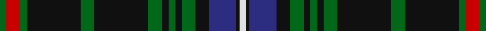
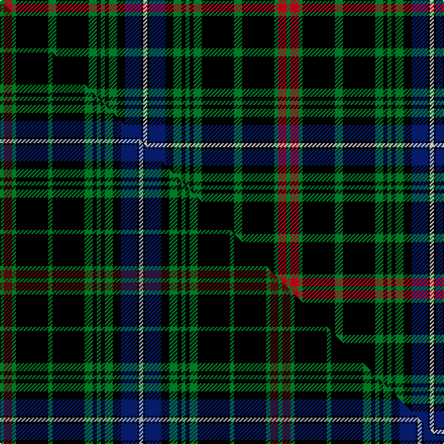

This is one **variant** — a specific cloth: this exact thread count and colourway, with its own
provenance below. It is one weaving of the [sett](/tartans/m/ma/mackean-hunting/) (the scale-free proportion — the
same cloth at any scale or shade), whose colour order is pattern [GRGKGKGKGKGKBKW](/stripes/grgkgkgkgkgkbkw/).

Part of the [MacKean Hunting](/tartans/m/ma/mackean-hunting/) tartan — the named design grouping this sett with its other cloths.

Sourced from house-of-tartan.  It is a [15 stripe tartan](/stripes/stripes15/).

Original link [http://www.house-of-tartan.scotland.net/house/TartanViewjs.asp?colr=Def&tnam=985](http://www.house-of-tartan.scotland.net/house/TartanViewjs.asp?colr=Def&tnam=985)

## Provenance

Earliest known date: 1987 1987

Dataset <small>— provenance for this record, inherited from the source manifest</small>

<dl class="dataset-prov">
<dt>source</dt><dd><a href="/sources/house-of-tartan/">House of Tartan</a></dd>
<dt>data captured from</dt><dd><a href="https://github.com/thetartan/tartan-database/blob/master/data/house-of-tartan/data.csv">https://github.com/thetartan/tartan-database/blob/master/data/house-of-tartan/data.csv</a></dd>
<dt>data date</dt><dd>1987 <small>(this record)</small></dd>
<dt>licence</dt><dd><a href="https://creativecommons.org/licenses/by-nc-nd/4.0/">CC BY-NC-ND 4.0</a></dd>
</dl>

Capture chain <small>— the hands this data passed through, oldest first; each capture carries its own licence</small>

<ol class="capture-chain">
<li><a href="http://www.house-of-tartan.scotland.net/">House of Tartan</a> <small>the weaver/retailer's database — the site is now offline; the URL is kept as the ultimate source's identity</small></li>
<li><a href="https://github.com/thetartan/tartan-database">thetartan/tartan-database</a> <small>2016-2017</small> · <a href="https://creativecommons.org/licenses/by-nc-nd/4.0/">CC BY-NC-ND 4.0</a> <small>Levko Kravets's frozen compilation — the capture we vendored, and where its CC licence text came from</small></li>
<li>this dictionary <small>captured 2026-06-10 · commit 5bf86c7566</small> <small>each re-capture is a git commit to data/sources</small></li>
</ol>

## Thread count
G/4 R8 G4 K32 G8 K32 G8 K4 G4 K4 G8 K8 DB16 K2 W/4

One full sett is **284 threads**.

## Palette
<table><thead><tr><th>Colour</th><th>Shade</th><th>OKLCh</th></tr></thead><tbody><tr><td>DB</td><td><code style="background-color:#082077;">#082077</code> <small style="color:#888">#082077</small></td><td><small style="color:#888">oklch(30.0% 0.149 265.1)</small></td></tr><tr><td>G</td><td><code style="background-color:#008B2A;">#008B2A</code> <small style="color:#888">#008B2A</small></td><td><small style="color:#888">oklch(55.4% 0.170 145.9)</small></td></tr><tr><td>K</td><td><code style="background-color:#000000;">#000000</code> <small style="color:#888">#000000</small></td><td><small style="color:#888">oklch(0.0% 0.000 0.0)</small></td></tr><tr><td>W</td><td><code style="background-color:#F7F7F7;">#F7F7F7</code> <small style="color:#888">#F7F7F7</small></td><td><small style="color:#888">oklch(97.6% 0.000 89.9)</small></td></tr><tr><td>R</td><td><code style="background-color:#D60020;">#D60020</code> <small style="color:#888">#D60020</small></td><td><small style="color:#888">oklch(55.2% 0.224 25.5)</small></td></tr></tbody></table>

# Sample pattern

## Compared to the master

This cloth is one sett of its design; the master sett (the exemplar the design is anchored on) is below for comparison.

Its **ΔTartan distance** from the master is **0.42** — the same measure the nearest-tartans table ranks by (0 is identical; a re-scale of the same cloth is near 0, a recolour or a different proportion further).

<figure class="master-compare" style="margin:0">

this sett
master sett ★

<figcaption style="color:#888;font-size:smaller">One weave of this sett against the <a href="/setts/g2dr4g2k16g2k16g4k2g2k2g4k4db8k1lb2/">master sett ★</a>, split on the diagonal: a shared proportion runs seamlessly across it with only the shades shifting; a different proportion breaks on it.</figcaption>
</figure>

## Nearest tartan variants

The nearest existing variants by ΔTartan distance, with this cloth at the top so the swatches line up against it.

ΔTartan

Threads

Variant

Sett

—

284

<a href="/variants/s15/g2r4g2k16g4k16g4k2g2k2g4k4db8k1w2~x2/">MacKean Hunting Family Tartan</a>

<a href="/ttd/edit/#slug=g2dr4g2k16g2k16g4k2g2k2g4k4db8k1lb2~x2&amp;base=g2r4g2k16g4k16g4k2g2k2g4k4db8k1w2~x2" title="compare in the TTD">0.42</a>

276

<a href="/variants/s15/g2dr4g2k16g2k16g4k2g2k2g4k4db8k1lb2~x2/">MacKean Hunting</a>

<a href="/ttd/edit/#slug=k17n2k3g2k3g2k24t8g4t4g3t8~x2&amp;base=g2r4g2k16g4k16g4k2g2k2g4k4db8k1w2~x2" title="compare in the TTD">2.56</a>

270

<a href="/variants/s12/k17n2k3g2k3g2k24t8g4t4g3t8~x2/">Kells Irish Pubs (Corporate)</a>

<a href="/ttd/edit/#slug=k37g27w2k4r6k4w2g27k37y2~x2&amp;base=g2r4g2k16g4k16g4k2g2k2g4k4db8k1w2~x2" title="compare in the TTD">2.62</a>

514

<a href="/variants/s10/k37g27w2k4r6k4w2g27k37y2~x2/">Highlands of Durham #2</a>

<a href="/ttd/edit/#slug=ly8k26o6g15o6k26w2k26o6g15o6k26ly8k4~x2&amp;base=g2r4g2k16g4k16g4k2g2k2g4k4db8k1w2~x2" title="compare in the TTD">2.63</a>

696

<a href="/variants/s14/ly8k26o6g15o6k26w2k26o6g15o6k26ly8k4~x2/">Holestone</a>

<a href="/ttd/edit/#slug=k36w3k10w3dg28dr6k18~x2~dg1804158&amp;base=g2r4g2k16g4k16g4k2g2k2g4k4db8k1w2~x2" title="compare in the TTD">2.81</a>

308

<a href="/variants/s7/k36w3k10w3dg28dr6k18~x2~dg1804158/">Wild Highlanders</a>

<a href="/ttd/edit/#slug=k43o7k9b3k3b3k3g18do9k3do4dg4~x2&amp;base=g2r4g2k16g4k16g4k2g2k2g4k4db8k1w2~x2" title="compare in the TTD">2.83</a>

342

<a href="/variants/s12/k43o7k9b3k3b3k3g18do9k3do4dg4~x2/">Braveheart -Warrior (hunting)</a>

<a href="/ttd/edit/#slug=k4dg13k4g8k44g8k4dg13k4w3~x2~dg1806142-g2203152&amp;base=g2r4g2k16g4k16g4k2g2k2g4k4db8k1w2~x2" title="compare in the TTD">2.88</a>

406

<a href="/variants/s10/k4dg13k4g8k44g8k4dg13k4w3~x2~dg1806142-g2203152/">Childers</a>

<a href="/ttd/edit/#slug=g12k12r1k1r1k12t12r1t12k12r1k1r1k12g12k1~x4~g2203152&amp;base=g2r4g2k16g4k16g4k2g2k2g4k4db8k1w2~x2" title="compare in the TTD">2.88</a>

780

<a href="/variants/s16/g12k12r1k1r1k12t12r1t12k12r1k1r1k12g12k1~x4~g2203152/">Guthrie</a>

<a href="/ttd/edit/#slug=k4n4k4n18k9r2k9lb1n18db2k3~x2&amp;base=g2r4g2k16g4k16g4k2g2k2g4k4db8k1w2~x2" title="compare in the TTD">2.89</a>

282

<a href="/variants/s11/k4n4k4n18k9r2k9lb1n18db2k3~x2/">Moggach (Strathspey)</a>

<a href="/ttd/edit/#slug=r3n23k3db3k3n18k2n2k2n2k19ly3~x2&amp;base=g2r4g2k16g4k16g4k2g2k2g4k4db8k1w2~x2" title="compare in the TTD">2.93</a>

320

<a href="/variants/s12/r3n23k3db3k3n18k2n2k2n2k19ly3~x2/">MacInnes Homecoming (Clan)</a>

## Neighbour map

Every grey dot is one of 13656 variants placed by the first two principal components of the ΔTartan feature space (42% of its variance). Red is this tartan; blue dots are its nearest — click one to open its page. The map is a flat projection of a many-dimensional space — [how to read it](/posts/neighbourhood-maps/).

<svg viewBox="0 0 640 380" role="img" style="max-width:100%;height:auto;border:1px solid #e0e0e0;border-radius:4px;display:block" xmlns="http://www.w3.org/2000/svg"><image href="/nn/cloud.v1.png" width="640" height="380"/><a href="/variants/s15/g2dr4g2k16g2k16g4k2g2k2g4k4db8k1lb2~x2/"><circle cx="241.7" cy="109.6" r="4" fill="#3465a4"><title>MacKean Hunting</title></circle></a><a href="/variants/s12/k17n2k3g2k3g2k24t8g4t4g3t8~x2/"><circle cx="259.5" cy="141.2" r="4" fill="#3465a4"><title>Kells Irish Pubs (Corporate)</title></circle></a><a href="/variants/s10/k37g27w2k4r6k4w2g27k37y2~x2/"><circle cx="245.1" cy="117.7" r="4" fill="#3465a4"><title>Highlands of Durham #2</title></circle></a><a href="/variants/s14/ly8k26o6g15o6k26w2k26o6g15o6k26ly8k4~x2/"><circle cx="211.7" cy="137.4" r="4" fill="#3465a4"><title>Holestone</title></circle></a><a href="/variants/s7/k36w3k10w3dg28dr6k18~x2~dg1804158/"><circle cx="206.3" cy="154.9" r="4" fill="#3465a4"><title>Wild Highlanders</title></circle></a><a href="/variants/s12/k43o7k9b3k3b3k3g18do9k3do4dg4~x2/"><circle cx="223.0" cy="93.2" r="4" fill="#3465a4"><title>Braveheart -Warrior (hunting)</title></circle></a><a href="/variants/s10/k4dg13k4g8k44g8k4dg13k4w3~x2~dg1806142-g2203152/"><circle cx="269.3" cy="134.0" r="4" fill="#3465a4"><title>Childers</title></circle></a><a href="/variants/s16/g12k12r1k1r1k12t12r1t12k12r1k1r1k12g12k1~x4~g2203152/"><circle cx="185.2" cy="141.6" r="4" fill="#3465a4"><title>Guthrie</title></circle></a><a href="/variants/s11/k4n4k4n18k9r2k9lb1n18db2k3~x2/"><circle cx="253.1" cy="124.0" r="4" fill="#3465a4"><title>Moggach (Strathspey)</title></circle></a><a href="/variants/s12/r3n23k3db3k3n18k2n2k2n2k19ly3~x2/"><circle cx="248.8" cy="125.1" r="4" fill="#3465a4"><title>MacInnes Homecoming (Clan)</title></circle></a><circle cx="222.9" cy="109.9" r="5" fill="#c00000"/><text x="320" y="376" text-anchor="middle" font-size="11" fill="#999">ground</text><text x="11" y="190" text-anchor="middle" font-size="11" fill="#999" transform="rotate(-90 11 190)">complexity</text></svg>

ID: /variants/s15/g2r4g2k16g4k16g4k2g2k2g4k4db8k1w2~x2/
