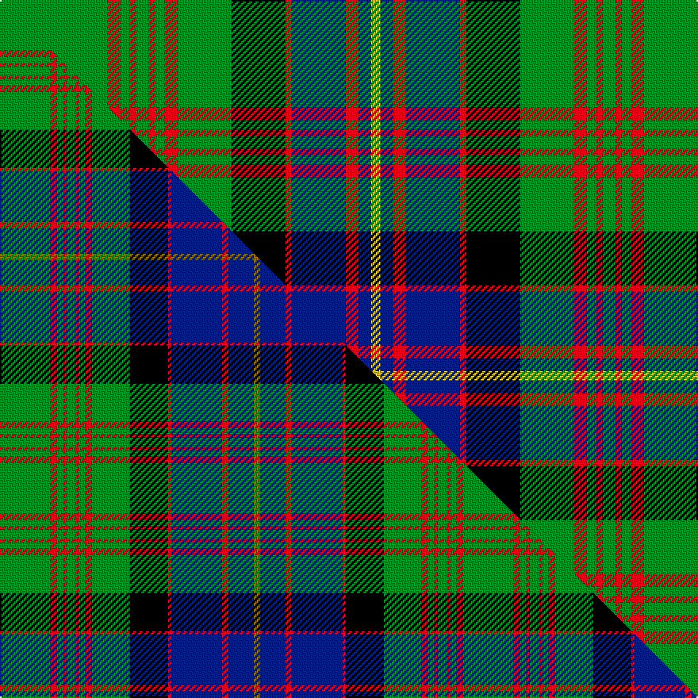

This is one **variant** — a specific cloth: this exact thread count and colourway, with its own
provenance below. It is one weaving of the [sett](/tartans/c/co/cochrane-2/) (the scale-free proportion — the
same cloth at any scale or shade), whose colour order is pattern [GRGRGRGRGKRBRBY](/stripes/grgrgrgrgkrbrby/).

Part of the [Cochrane](/tartans/c/co/cochrane-2/) tartan — the named design grouping this sett with its other cloths.

Sourced from register-of-tartans.  It is a [15 stripe tartan](/stripes/stripes15/).

Original link [https://www.tartanregister.gov.uk/tartanDetails.aspx?ref=695](https://www.tartanregister.gov.uk/tartanDetails.aspx?ref=695)

2 attestations — the source records this cloth was collapsed from (oldest owns this page)

<ul>
<li>01/01/1984 — Cochrane (register-of-tartans, <a href="https://www.tartanregister.gov.uk/tartanDetails.aspx?ref=695">record</a>)  <em>Extremely confusing story: James Scarlett says that this tartan was taken form a portrait and was for long sold as Cochrane but in 1974 the 14th Earl of Dundonald used his prerogative as Chief to vary the design so as to reduce the groups of four red lines to three. In 1984, the 15th Earl of Dundonald had the sett changed back to the original groups of four red lines and recorded with Lord Lyon. Currently, all commercial samples are the version which contain four lines.</em></li>
<li>pre 1984 — Cochrane (Clan) (tartans-authority, <a href="https://web.archive.org/web/*/http://www.tartansauthority.com/tartan-ferret/display/994/*">record</a>)  <em>Extremely confusing story: James Scarlett says that this tartan was taken from a portrait and was for long sold as Cochrane but in 1974 the 14th Earl of Dundonald used his prerogative as Chief to vary the design so as to reduce the groups of four red lines to three. Later notes on the tartan shown here states: "This is said to be the trade version of Cochrane but it is in fact recorded as the clan tartan in the Lord Lyon Book LCB 52 dated 12th November 1984. Lyon count: G68 R8 G6 R4 G8 R4 G6 R8 G34 K34 R4 B34 R8 B8 Y6." STS notes say: "Lord Dundonald originally registered a version missing a red and a green stripe with Lord Lyon in 1974 (see No. 977). There is a story that a fragment of this design was discovered in the foundations of a Perthshire house around the 1930's, thought to be of greater authenticity. However, other reports suggest that the missing stripes were simply a typing error. The sett is based on the old Lochaber district tartan which also provided a base for the MacDonald and the Cameron of Erracht. (All of which have four red stripes)" Resume: Lord D changed the count in 1974 and reduced the red and green lines from four to three. In 1984 the sett was changed back and recorded with Lord Lyon. 2004 commercial samples have four lines.</em></li>
</ul>

Dataset <small>— provenance for this record, inherited from the source manifest</small>

<dl class="dataset-prov">
<dt>source</dt><dd><a href="/sources/register-of-tartans/">Scottish Register of Tartans</a></dd>
<dt>data captured from</dt><dd><a href="https://github.com/thetartan/tartan-database/blob/master/data/register-of-tartans/data.csv">https://github.com/thetartan/tartan-database/blob/master/data/register-of-tartans/data.csv</a></dd>
<dt>data date</dt><dd>1984 <small>(this record)</small></dd>
<dt>licence</dt><dd><a href="https://www.tartanregister.gov.uk/copyright">Crown copyright</a></dd>
</dl>

Capture chain <small>— the hands this data passed through, oldest first; each capture carries its own licence</small>

<ol class="capture-chain">
<li><a href="https://www.tartanregister.gov.uk/">Scottish Register of Tartans</a> · <a href="https://www.tartanregister.gov.uk/copyright">Crown copyright</a> <small>the living register — still published by National Records of Scotland</small></li>
<li><a href="https://github.com/thetartan/tartan-database">thetartan/tartan-database</a> <small>2016-2017</small> · <a href="https://creativecommons.org/licenses/by-nc-nd/4.0/">CC BY-NC-ND 4.0</a> <small>Levko Kravets's frozen compilation — the capture we vendored, and where its CC licence text came from</small></li>
<li>this dictionary <small>captured 2026-06-10 · commit 5bf86c7566</small> <small>each re-capture is a git commit to data/sources</small></li>
</ol>

## Register references

External register numbers recorded for this tartan.

- Scottish Register of Tartans: [695](https://www.tartanregister.gov.uk/tartanDetails.aspx?ref=695)
- Scottish Tartans Authority (ITI): 994
- Scottish Tartans World Register: 994

## Thread count
G/68 R8 G6 R4 G8 R4 G6 R8 G34 K34 R4 DB34 R8 DB8 LY/6

One full sett is **406 threads**.

## Palette
<table><thead><tr><th>Colour</th><th>Shade</th><th>OKLCh</th></tr></thead><tbody><tr><td>DB</td><td><code style="background-color:#082077;">#082077</code> <small style="color:#888">#082077</small></td><td><small style="color:#888">oklch(30.0% 0.149 265.1)</small></td></tr><tr><td>G</td><td><code style="background-color:#008B2A;">#008B2A</code> <small style="color:#888">#008B2A</small></td><td><small style="color:#888">oklch(55.4% 0.170 145.9)</small></td></tr><tr><td>K</td><td><code style="background-color:#000000;">#000000</code> <small style="color:#888">#000000</small></td><td><small style="color:#888">oklch(0.0% 0.000 0.0)</small></td></tr><tr><td>R</td><td><code style="background-color:#D60020;">#D60020</code> <small style="color:#888">#D60020</small></td><td><small style="color:#888">oklch(55.2% 0.224 25.5)</small></td></tr><tr><td>LY</td><td><code style="background-color:#DCBC32;">#DCBC32</code> <small style="color:#888">#DCBC32</small></td><td><small style="color:#888">oklch(80.0% 0.150 95.2)</small></td></tr></tbody></table>

# Sample pattern

## Compared to the master

This cloth is one sett of its design; the master sett (the exemplar the design is anchored on) is below for comparison.

Its **ΔTartan distance** from the master is **0.69** — the same measure the nearest-tartans table ranks by (0 is identical; a re-scale of the same cloth is near 0, a recolour or a different proportion further).

<figure class="master-compare" style="margin:0">

this sett
master sett ★

<figcaption style="color:#888;font-size:smaller">One weave of this sett against the <a href="/setts/g16r2g2r1g3r1g2r2g12k12r1db16r2db8y2/">master sett ★</a>, split on the diagonal: a shared proportion runs seamlessly across it with only the shades shifting; a different proportion breaks on it.</figcaption>
</figure>

## Nearest tartan variants

The nearest existing variants by ΔTartan distance, with this cloth at the top so the swatches line up against it.

ΔTartan

Threads

Variant

Sett

—

406

<a href="/variants/s15/g34r4g3r2g4r2g3r4g17k17r2db17r4db4ly3~x2/">Cochrane</a>

<a href="/ttd/edit/#slug=g34r4g4r2g4r2g3r4g17k17r2db17r4db4y3~x2&amp;base=g34r4g3r2g4r2g3r4g17k17r2db17r4db4ly3~x2" title="compare in the TTD">0.04</a>

410

<a href="/variants/s15/g34r4g4r2g4r2g3r4g17k17r2db17r4db4y3~x2/">Cochrane (1984) Clan Tartan</a>

<a href="/ttd/edit/#slug=g16r2g2r1g3r1g2r2g12k12r1db16r2db8y2~x2&amp;base=g34r4g3r2g4r2g3r4g17k17r2db17r4db4ly3~x2" title="compare in the TTD">0.69</a>

292

<a href="/variants/s15/g16r2g2r1g3r1g2r2g12k12r1db16r2db8y2~x2/">Cochrane Clan Tartan</a>

<a href="/ttd/edit/#slug=g16r2g2r1g3r1g2r2g12k12r1db16r2db8y2&amp;base=g34r4g3r2g4r2g3r4g17k17r2db17r4db4ly3~x2" title="compare in the TTD">0.69</a>

146

<a href="/variants/s15/g16r2g2r1g3r1g2r2g12k12r1db16r2db8y2/">Cochrane</a>

<a href="/ttd/edit/#slug=g5db20g20db2g2db2g25r2g2r17k8g2w2~x2&amp;base=g34r4g3r2g4r2g3r4g17k17r2db17r4db4ly3~x2" title="compare in the TTD">1.53</a>

422

<a href="/variants/s13/g5db20g20db2g2db2g25r2g2r17k8g2w2~x2/">Boyle, Cameron (Personal)</a>

<a href="/ttd/edit/#slug=k15w1k1w1k1w1k1g15r1g15y2r5y2w3~x2&amp;base=g34r4g3r2g4r2g3r4g17k17r2db17r4db4ly3~x2" title="compare in the TTD">1.80</a>

220

<a href="/variants/s14/k15w1k1w1k1w1k1g15r1g15y2r5y2w3~x2/">Courtet-Meyer (Personal)</a>

<a href="/ttd/edit/#slug=k15w1k1w1k1w1k1g15r1g15ly2r5ly2w3~x2&amp;base=g34r4g3r2g4r2g3r4g17k17r2db17r4db4ly3~x2" title="compare in the TTD">1.97</a>

220

<a href="/variants/s14/k15w1k1w1k1w1k1g15r1g15ly2r5ly2w3~x2/">Courtet-Meyer (Personal)</a>

<a href="/ttd/edit/#slug=g16k3g20w2r3k2r3w2g2db18k2r4w2g3~x2&amp;base=g34r4g3r2g4r2g3r4g17k17r2db17r4db4ly3~x2" title="compare in the TTD">1.99</a>

290

<a href="/variants/s14/g16k3g20w2r3k2r3w2g2db18k2r4w2g3~x2/">MacFarlane Hunting Clan Tartan</a>

<a href="/ttd/edit/#slug=t11k3t3k3t4k15g36w3g36k15t4k3t3k3t11r4~x2&amp;base=g34r4g3r2g4r2g3r4g17k17r2db17r4db4ly3~x2" title="compare in the TTD">2.23</a>

598

<a href="/variants/s16/t11k3t3k3t4k15g36w3g36k15t4k3t3k3t11r4~x2/">Semple</a>

<a href="/ttd/edit/#slug=k20r3db10g3db5g25k1g1w3g1k1g25db5g3db10r1db2~x2&amp;base=g34r4g3r2g4r2g3r4g17k17r2db17r4db4ly3~x2" title="compare in the TTD">2.29</a>

432

<a href="/variants/s17/k20r3db10g3db5g25k1g1w3g1k1g25db5g3db10r1db2~x2/">Blairlogie or Blair Athol District Tartan</a>

<a href="/ttd/edit/#slug=dr6g1lb2g24k3g3k3g3k8db8lb2db4~x2&amp;base=g34r4g3r2g4r2g3r4g17k17r2db17r4db4ly3~x2" title="compare in the TTD">2.29</a>

248

<a href="/variants/s12/dr6g1lb2g24k3g3k3g3k8db8lb2db4~x2/">Kerby/Kirby</a>

## Neighbour map

Every grey dot is one of 13657 variants placed by the first two principal components of the ΔTartan feature space (42% of its variance). Red is this tartan; blue dots are its nearest — click one to open its page. The map is a flat projection of a many-dimensional space — [how to read it](/posts/neighbourhood-maps/).

<svg viewBox="0 0 640 380" role="img" style="max-width:100%;height:auto;border:1px solid #e0e0e0;border-radius:4px;display:block" xmlns="http://www.w3.org/2000/svg"><image href="/nn/cloud.v1.png" width="640" height="380"/><a href="/variants/s15/g34r4g4r2g4r2g3r4g17k17r2db17r4db4y3~x2/"><circle cx="211.6" cy="107.1" r="4" fill="#3465a4"><title>Cochrane (1984) Clan Tartan</title></circle></a><a href="/variants/s15/g16r2g2r1g3r1g2r2g12k12r1db16r2db8y2~x2/"><circle cx="168.8" cy="117.7" r="4" fill="#3465a4"><title>Cochrane Clan Tartan</title></circle></a><a href="/variants/s15/g16r2g2r1g3r1g2r2g12k12r1db16r2db8y2/"><circle cx="168.8" cy="117.7" r="4" fill="#3465a4"><title>Cochrane</title></circle></a><a href="/variants/s13/g5db20g20db2g2db2g25r2g2r17k8g2w2~x2/"><circle cx="209.0" cy="131.2" r="4" fill="#3465a4"><title>Boyle, Cameron (Personal)</title></circle></a><a href="/variants/s14/k15w1k1w1k1w1k1g15r1g15y2r5y2w3~x2/"><circle cx="177.1" cy="102.6" r="4" fill="#3465a4"><title>Courtet-Meyer (Personal)</title></circle></a><a href="/variants/s14/k15w1k1w1k1w1k1g15r1g15ly2r5ly2w3~x2/"><circle cx="174.6" cy="102.0" r="4" fill="#3465a4"><title>Courtet-Meyer (Personal)</title></circle></a><a href="/variants/s14/g16k3g20w2r3k2r3w2g2db18k2r4w2g3~x2/"><circle cx="183.9" cy="129.1" r="4" fill="#3465a4"><title>MacFarlane Hunting Clan Tartan</title></circle></a><a href="/variants/s16/t11k3t3k3t4k15g36w3g36k15t4k3t3k3t11r4~x2/"><circle cx="175.6" cy="121.9" r="4" fill="#3465a4"><title>Semple</title></circle></a><a href="/variants/s17/k20r3db10g3db5g25k1g1w3g1k1g25db5g3db10r1db2~x2/"><circle cx="211.4" cy="84.8" r="4" fill="#3465a4"><title>Blairlogie or Blair Athol District Tartan</title></circle></a><a href="/variants/s12/dr6g1lb2g24k3g3k3g3k8db8lb2db4~x2/"><circle cx="193.7" cy="106.4" r="4" fill="#3465a4"><title>Kerby/Kirby</title></circle></a><circle cx="206.9" cy="105.3" r="5" fill="#c00000"/><text x="320" y="376" text-anchor="middle" font-size="11" fill="#999">ground</text><text x="11" y="190" text-anchor="middle" font-size="11" fill="#999" transform="rotate(-90 11 190)">complexity</text></svg>

ID: /variants/s15/g34r4g3r2g4r2g3r4g17k17r2db17r4db4ly3~x2/
