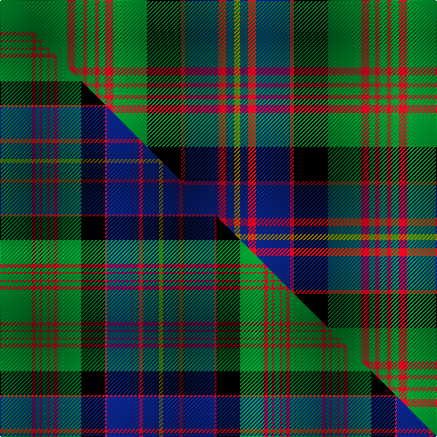

This is one **variant** — a specific cloth: this exact thread count and colourway, with its own
provenance below. It is one weaving of the [sett](/tartans/c/co/cochrane-2/) (the scale-free proportion — the
same cloth at any scale or shade), whose colour order is pattern [GBRBRKGRGRGRGRG](/stripes/gbrbrkgrgrgrgrg/).

Part of the [Cochrane](/tartans/c/co/cochrane-2/) tartan — the named design grouping this sett with its other cloths.

Sourced from house-of-tartan.  It is a [15 stripe tartan](/stripes/stripes15/).

Original link [http://www.house-of-tartan.scotland.net/house/TartanViewjs.asp?colr=Def&tnam=978](http://www.house-of-tartan.scotland.net/house/TartanViewjs.asp?colr=Def&tnam=978)

## Provenance

Earliest known date: 1984 Lord Dundonald originally registered a version missing a red and a green stripe in 1974. There is a story that a fragment of this design was discovered in the foundations of a Perthshire house in 1934. Around that time, a count was recorded from the sample books of Messrs William Anderson. The red and green have been restored in this version, which is now the 'approved' tartan, and appears in the 'Appendix' of the Lyon Court Books dated 12th November 1984.

Dataset <small>— provenance for this record, inherited from the source manifest</small>

<dl class="dataset-prov">
<dt>source</dt><dd><a href="/sources/house-of-tartan/">House of Tartan</a></dd>
<dt>data captured from</dt><dd><a href="https://github.com/thetartan/tartan-database/blob/master/data/house-of-tartan/data.csv">https://github.com/thetartan/tartan-database/blob/master/data/house-of-tartan/data.csv</a></dd>
<dt>data date</dt><dd>1984 <small>(this record)</small></dd>
<dt>licence</dt><dd><a href="https://creativecommons.org/licenses/by-nc-nd/4.0/">CC BY-NC-ND 4.0</a></dd>
</dl>

Capture chain <small>— the hands this data passed through, oldest first; each capture carries its own licence</small>

<ol class="capture-chain">
<li><a href="http://www.house-of-tartan.scotland.net/">House of Tartan</a> <small>the weaver/retailer's database — the site is now offline; the URL is kept as the ultimate source's identity</small></li>
<li><a href="https://github.com/thetartan/tartan-database">thetartan/tartan-database</a> <small>2016-2017</small> · <a href="https://creativecommons.org/licenses/by-nc-nd/4.0/">CC BY-NC-ND 4.0</a> <small>Levko Kravets's frozen compilation — the capture we vendored, and where its CC licence text came from</small></li>
<li>this dictionary <small>captured 2026-06-10 · commit 5bf86c7566</small> <small>each re-capture is a git commit to data/sources</small></li>
</ol>

## Thread count
G/68 R8 G8 R4 G8 R4 G6 R8 G34 K34 R4 DB34 R8 DB8 Y/6

One full sett is **410 threads**.

## Palette
<table><thead><tr><th>Colour</th><th>Shade</th><th>OKLCh</th></tr></thead><tbody><tr><td>DB</td><td><code style="background-color:#082077;">#082077</code> <small style="color:#888">#082077</small></td><td><small style="color:#888">oklch(30.0% 0.149 265.1)</small></td></tr><tr><td>G</td><td><code style="background-color:#008B2A;">#008B2A</code> <small style="color:#888">#008B2A</small></td><td><small style="color:#888">oklch(55.4% 0.170 145.9)</small></td></tr><tr><td>K</td><td><code style="background-color:#000000;">#000000</code> <small style="color:#888">#000000</small></td><td><small style="color:#888">oklch(0.0% 0.000 0.0)</small></td></tr><tr><td>R</td><td><code style="background-color:#D60020;">#D60020</code> <small style="color:#888">#D60020</small></td><td><small style="color:#888">oklch(55.2% 0.224 25.5)</small></td></tr><tr><td>Y</td><td><code style="background-color:#8B6E00;">#8B6E00</code> <small style="color:#888">#8B6E00</small></td><td><small style="color:#888">oklch(55.1% 0.113 90.4)</small></td></tr></tbody></table>

# Sample pattern

## Compared to the master

This cloth is one sett of its design; the master sett (the exemplar the design is anchored on) is below for comparison.

Its **ΔTartan distance** from the master is **0.69** — the same measure the nearest-tartans table ranks by (0 is identical; a re-scale of the same cloth is near 0, a recolour or a different proportion further).

<figure class="master-compare" style="margin:0">

this sett
master sett ★

<figcaption style="color:#888;font-size:smaller">One weave of this sett against the <a href="/setts/g16r2g2r1g3r1g2r2g12k12r1db16r2db8y2/">master sett ★</a>, split on the diagonal: a shared proportion runs seamlessly across it with only the shades shifting; a different proportion breaks on it.</figcaption>
</figure>

## Nearest tartan variants

The nearest existing variants by ΔTartan distance, with this cloth at the top so the swatches line up against it.

ΔTartan

Threads

Variant

Sett

—

410

<a href="/variants/s15/g34r4g4r2g4r2g3r4g17k17r2db17r4db4y3~x2/">Cochrane (1984) Clan Tartan</a>

<a href="/ttd/edit/#slug=g34r4g3r2g4r2g3r4g17k17r2db17r4db4ly3~x2&amp;base=g34r4g4r2g4r2g3r4g17k17r2db17r4db4y3~x2" title="compare in the TTD">0.04</a>

406

<a href="/variants/s15/g34r4g3r2g4r2g3r4g17k17r2db17r4db4ly3~x2/">Cochrane</a>

<a href="/ttd/edit/#slug=g16r2g2r1g3r1g2r2g12k12r1db16r2db8y2~x2&amp;base=g34r4g4r2g4r2g3r4g17k17r2db17r4db4y3~x2" title="compare in the TTD">0.69</a>

292

<a href="/variants/s15/g16r2g2r1g3r1g2r2g12k12r1db16r2db8y2~x2/">Cochrane Clan Tartan</a>

<a href="/ttd/edit/#slug=g16r2g2r1g3r1g2r2g12k12r1db16r2db8y2&amp;base=g34r4g4r2g4r2g3r4g17k17r2db17r4db4y3~x2" title="compare in the TTD">0.69</a>

146

<a href="/variants/s15/g16r2g2r1g3r1g2r2g12k12r1db16r2db8y2/">Cochrane</a>

<a href="/ttd/edit/#slug=g5db20g20db2g2db2g25r2g2r17k8g2w2~x2&amp;base=g34r4g4r2g4r2g3r4g17k17r2db17r4db4y3~x2" title="compare in the TTD">1.48</a>

422

<a href="/variants/s13/g5db20g20db2g2db2g25r2g2r17k8g2w2~x2/">Boyle, Cameron (Personal)</a>

<a href="/ttd/edit/#slug=g22r4g2r2g2r4g12k12r2db10r4db4y3~x2&amp;base=g34r4g4r2g4r2g3r4g17k17r2db17r4db4y3~x2" title="compare in the TTD">1.85</a>

282

<a href="/variants/s13/g22r4g2r2g2r4g12k12r2db10r4db4y3~x2/">Cochrane (1974)</a>

<a href="/ttd/edit/#slug=g22r4g2r2g2r4g12k12r2db10r4db4y3&amp;base=g34r4g4r2g4r2g3r4g17k17r2db17r4db4y3~x2" title="compare in the TTD">1.85</a>

141

<a href="/variants/s13/g22r4g2r2g2r4g12k12r2db10r4db4y3/">Cochrane LC</a>

<a href="/ttd/edit/#slug=g44r4g2r2g2r4g12k12r2db10r4db4ly3~x2&amp;base=g34r4g4r2g4r2g3r4g17k17r2db17r4db4y3~x2" title="compare in the TTD">1.90</a>

326

<a href="/variants/s13/g44r4g2r2g2r4g12k12r2db10r4db4ly3~x2/">Cochrane of Dundonald</a>

<a href="/ttd/edit/#slug=k15w1k1w1k1w1k1g15r1g15y2r5y2w3~x2&amp;base=g34r4g4r2g4r2g3r4g17k17r2db17r4db4y3~x2" title="compare in the TTD">1.99</a>

220

<a href="/variants/s14/k15w1k1w1k1w1k1g15r1g15y2r5y2w3~x2/">Courtet-Meyer (Personal)</a>

<a href="/ttd/edit/#slug=g16k3g20w2r3k2r3w2g2db18k2r4w2g3~x2&amp;base=g34r4g4r2g4r2g3r4g17k17r2db17r4db4y3~x2" title="compare in the TTD">2.05</a>

290

<a href="/variants/s14/g16k3g20w2r3k2r3w2g2db18k2r4w2g3~x2/">MacFarlane Hunting Clan Tartan</a>

<a href="/ttd/edit/#slug=k15w1k1w1k1w1k1g15r1g15ly2r5ly2w3~x2&amp;base=g34r4g4r2g4r2g3r4g17k17r2db17r4db4y3~x2" title="compare in the TTD">2.16</a>

220

<a href="/variants/s14/k15w1k1w1k1w1k1g15r1g15ly2r5ly2w3~x2/">Courtet-Meyer (Personal)</a>

## Neighbour map

Every grey dot is one of 13656 variants placed by the first two principal components of the ΔTartan feature space (42% of its variance). Red is this tartan; blue dots are its nearest — click one to open its page. The map is a flat projection of a many-dimensional space — [how to read it](/posts/neighbourhood-maps/).

<svg viewBox="0 0 640 380" role="img" style="max-width:100%;height:auto;border:1px solid #e0e0e0;border-radius:4px;display:block" xmlns="http://www.w3.org/2000/svg"><image href="/nn/cloud.v1.png" width="640" height="380"/><a href="/variants/s15/g34r4g3r2g4r2g3r4g17k17r2db17r4db4ly3~x2/"><circle cx="206.9" cy="105.3" r="4" fill="#3465a4"><title>Cochrane</title></circle></a><a href="/variants/s15/g16r2g2r1g3r1g2r2g12k12r1db16r2db8y2~x2/"><circle cx="168.8" cy="117.7" r="4" fill="#3465a4"><title>Cochrane Clan Tartan</title></circle></a><a href="/variants/s15/g16r2g2r1g3r1g2r2g12k12r1db16r2db8y2/"><circle cx="168.8" cy="117.7" r="4" fill="#3465a4"><title>Cochrane</title></circle></a><a href="/variants/s13/g5db20g20db2g2db2g25r2g2r17k8g2w2~x2/"><circle cx="209.0" cy="131.2" r="4" fill="#3465a4"><title>Boyle, Cameron (Personal)</title></circle></a><a href="/variants/s13/g22r4g2r2g2r4g12k12r2db10r4db4y3~x2/"><circle cx="161.3" cy="142.0" r="4" fill="#3465a4"><title>Cochrane (1974)</title></circle></a><a href="/variants/s13/g22r4g2r2g2r4g12k12r2db10r4db4y3/"><circle cx="161.3" cy="142.0" r="4" fill="#3465a4"><title>Cochrane LC</title></circle></a><a href="/variants/s13/g44r4g2r2g2r4g12k12r2db10r4db4ly3~x2/"><circle cx="269.4" cy="87.7" r="4" fill="#3465a4"><title>Cochrane of Dundonald</title></circle></a><a href="/variants/s14/k15w1k1w1k1w1k1g15r1g15y2r5y2w3~x2/"><circle cx="177.1" cy="102.6" r="4" fill="#3465a4"><title>Courtet-Meyer (Personal)</title></circle></a><a href="/variants/s14/g16k3g20w2r3k2r3w2g2db18k2r4w2g3~x2/"><circle cx="183.9" cy="129.1" r="4" fill="#3465a4"><title>MacFarlane Hunting Clan Tartan</title></circle></a><a href="/variants/s14/k15w1k1w1k1w1k1g15r1g15ly2r5ly2w3~x2/"><circle cx="174.6" cy="102.0" r="4" fill="#3465a4"><title>Courtet-Meyer (Personal)</title></circle></a><circle cx="211.6" cy="107.1" r="5" fill="#c00000"/><text x="320" y="376" text-anchor="middle" font-size="11" fill="#999">ground</text><text x="11" y="190" text-anchor="middle" font-size="11" fill="#999" transform="rotate(-90 11 190)">complexity</text></svg>

ID: /variants/s15/g34r4g4r2g4r2g3r4g17k17r2db17r4db4y3~x2/
