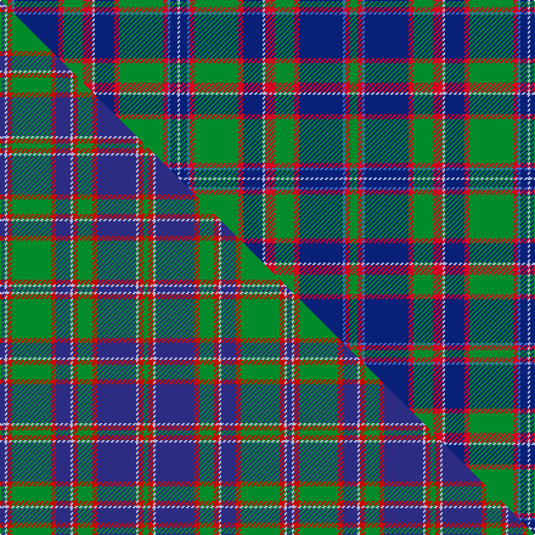

This is one **variant** — a specific cloth: this exact thread count and colourway, with its own
provenance below. It is one weaving of the [sett](/tartans/g/gl/glen-orchy-4/) (the scale-free proportion — the
same cloth at any scale or shade), whose colour order is pattern [GRBBRGRWBRGRBBW](/stripes/grbbrgrwbrgrbbw/).

Part of the [Glen Orchy](/tartans/g/gl/glen-orchy-4/) tartan — the named design grouping this sett with its other cloths.

Sourced from weddslist.  It is a [15 stripe tartan](/stripes/stripes15/).

Original link [http://www.weddslist.com/cgi-bin/tartans/pg.pl?source=sts](http://www.weddslist.com/cgi-bin/tartans/pg.pl?source=sts)

Dataset <small>— provenance for this record, inherited from the source manifest</small>

<dl class="dataset-prov">
<dt>source</dt><dd><a href="/sources/weddslist/">Weddslist</a></dd>
<dt>data captured from</dt><dd><a href="https://github.com/thetartan/tartan-database/blob/master/data/weddslist/data.csv">https://github.com/thetartan/tartan-database/blob/master/data/weddslist/data.csv</a></dd>
<dt>data date</dt><dd>2016-11-17 <small>(dataset default)</small></dd>
<dt>licence</dt><dd><a href="https://creativecommons.org/licenses/by-nc-nd/4.0/">CC BY-NC-ND 4.0</a></dd>
</dl>

Capture chain <small>— the hands this data passed through, oldest first; each capture carries its own licence</small>

<ol class="capture-chain">
<li><a href="https://www.weddslist.com/tartans/">Weddslist</a> <small>the living privately compiled reference</small></li>
<li><a href="https://github.com/thetartan/tartan-database">thetartan/tartan-database</a> <small>2016-2017</small> · <a href="https://creativecommons.org/licenses/by-nc-nd/4.0/">CC BY-NC-ND 4.0</a> <small>Levko Kravets's frozen compilation — the capture we vendored, and where its CC licence text came from</small></li>
<li>this dictionary <small>captured 2026-06-10 · commit 5bf86c7566</small> <small>each re-capture is a git commit to data/sources</small></li>
</ol>

## Thread count
G/6 R4 B2 DB36 R4 G16 R8 LB2 DB16 R4 G36 R4 B2 DB6 LB/2

One full sett is **288 threads**.

## Palette
<table><thead><tr><th>Colour</th><th>Shade</th><th>OKLCh</th></tr></thead><tbody><tr><td>DB</td><td><code style="background-color:#082077;">#082077</code> <small style="color:#888">#082077</small></td><td><small style="color:#888">oklch(30.0% 0.149 265.1)</small></td></tr><tr><td>LB</td><td><code style="background-color:#B5BBDE;">#B5BBDE</code> <small style="color:#888">#B5BBDE</small></td><td><small style="color:#888">oklch(79.9% 0.050 277.6)</small></td></tr><tr><td>G</td><td><code style="background-color:#008B2A;">#008B2A</code> <small style="color:#888">#008B2A</small></td><td><small style="color:#888">oklch(55.4% 0.170 145.9)</small></td></tr><tr><td>B</td><td><code style="background-color:#466CC8;">#466CC8</code> <small style="color:#888">#466CC8</small></td><td><small style="color:#888">oklch(55.1% 0.149 265.0)</small></td></tr><tr><td>R</td><td><code style="background-color:#D60020;">#D60020</code> <small style="color:#888">#D60020</small></td><td><small style="color:#888">oklch(55.2% 0.224 25.5)</small></td></tr></tbody></table>

# Sample pattern

## Compared to the master

This cloth is one sett of its design; the master sett (the exemplar the design is anchored on) is below for comparison.

Its **ΔTartan distance** from the master is **0.83** — the same measure the nearest-tartans table ranks by (0 is identical; a re-scale of the same cloth is near 0, a recolour or a different proportion further).

<figure class="master-compare" style="margin:0">

this sett
master sett ★

<figcaption style="color:#888;font-size:smaller">One weave of this sett against the <a href="/setts/db2lb1r2g16r2db6lb1r2g6r2db16lb1r2g2/">master sett ★</a>, split on the diagonal: a shared proportion runs seamlessly across it with only the shades shifting; a different proportion breaks on it.</figcaption>
</figure>

## Nearest tartan variants

The nearest existing variants by ΔTartan distance, with this cloth at the top so the swatches line up against it.

ΔTartan

Threads

Variant

Sett

—

288

<a href="/variants/s15/g3r2b1db18r2g8r4lb1db8r2g18r2b1db3lb1~x2/">Glen Orchy</a>

<a href="/ttd/edit/#slug=db2lb1r2g16r2db6lb1r2g6r2db16lb1r2g2~x2&amp;base=g3r2b1db18r2g8r4lb1db8r2g18r2b1db3lb1~x2" title="compare in the TTD">0.82</a>

236

<a href="/variants/s14/db2lb1r2g16r2db6lb1r2g6r2db16lb1r2g2~x2/">Glenorchy</a>

<a href="/ttd/edit/#slug=db2lb1r2g16r2db6lb1r2g6r2db16lb1r2g2~x2~db1406275-r2109032&amp;base=g3r2b1db18r2g8r4lb1db8r2g18r2b1db3lb1~x2" title="compare in the TTD">0.83</a>

236

<a href="/variants/s14/db2lb1r2g16r2db6lb1r2g6r2db16lb1r2g2~x2~db1406275-r2109032/">Norwich No.023</a>

<a href="/ttd/edit/#slug=g3r2w1db18r2g8r4lb1db8r2g18r2w1db3lb1~x2~r2209032-w3502055&amp;base=g3r2b1db18r2g8r4lb1db8r2g18r2b1db3lb1~x2" title="compare in the TTD">1.20</a>

288

<a href="/variants/s15/g3r2w1db18r2g8r4lb1db8r2g18r2w1db3lb1~x2~r2209032-w3502055/">Glenorchy #2</a>

<a href="/ttd/edit/#slug=g46r6g6r2g8r2g6r2g6dr36r2db47r6db24ly6&amp;base=g3r2b1db18r2g8r4lb1db8r2g18r2b1db3lb1~x2" title="compare in the TTD">1.79</a>

358

<a href="/variants/s15/g46r6g6r2g8r2g6r2g6dr36r2db47r6db24ly6/">Cochrane Hunting</a>

<a href="/ttd/edit/#slug=g19r1g2r2g15r1dt13w1db2r2db21r1w3~x2&amp;base=g3r2b1db18r2g8r4lb1db8r2g18r2b1db3lb1~x2" title="compare in the TTD">1.92</a>

288

<a href="/variants/s13/g19r1g2r2g15r1dt13w1db2r2db21r1w3~x2/">Ontario (Official)</a>

<a href="/ttd/edit/#slug=g28r12db1w2r1g4db20y2db3y2db3g7db3w1y2w1db20g4r12~x2&amp;base=g3r2b1db18r2g8r4lb1db8r2g18r2b1db3lb1~x2" title="compare in the TTD">2.03</a>

432

<a href="/variants/s19/g28r12db1w2r1g4db20y2db3y2db3g7db3w1y2w1db20g4r12~x2/">O'Kelly Family (Personal)</a>

<a href="/ttd/edit/#slug=g46r6g6r2g8r2g6r2g6dy36r2db47r6db24y6&amp;base=g3r2b1db18r2g8r4lb1db8r2g18r2b1db3lb1~x2" title="compare in the TTD">2.10</a>

358

<a href="/variants/s15/g46r6g6r2g8r2g6r2g6dy36r2db47r6db24y6/">Cochrane Hunting</a>

<a href="/ttd/edit/#slug=g3db2ri1db17r2g8r4lb1db8r2g17r2ri1db3lb1~x2~ri2806019-r2109032&amp;base=g3r2b1db18r2g8r4lb1db8r2g18r2b1db3lb1~x2" title="compare in the TTD">2.21</a>

280

<a href="/variants/s15/g3db2ri1db17r2g8r4lb1db8r2g17r2ri1db3lb1~x2~ri2806019-r2109032/">Glenorchy - National Archives</a>

<a href="/ttd/edit/#slug=db18w1db4w1lo4g1lo2g12r2g4~x2~w4000000-lo2804072&amp;base=g3r2b1db18r2g8r4lb1db8r2g18r2b1db3lb1~x2" title="compare in the TTD">2.23</a>

152

<a href="/variants/s10/db18w1db4w1lo4g1lo2g12r2g4~x2~w4000000-lo2804072/">Michigan, State of (District)</a>

<a href="/ttd/edit/#slug=g27r2g3w3db3y2db14w2db3y3db3w2db14~x2&amp;base=g3r2b1db18r2g8r4lb1db8r2g18r2b1db3lb1~x2" title="compare in the TTD">2.24</a>

242

<a href="/variants/s13/g27r2g3w3db3y2db14w2db3y3db3w2db14~x2/">Holiday Inn Crown Plaza</a>

## Neighbour map

Every grey dot is one of 13657 variants placed by the first two principal components of the ΔTartan feature space (42% of its variance). Red is this tartan; blue dots are its nearest — click one to open its page. The map is a flat projection of a many-dimensional space — [how to read it](/posts/neighbourhood-maps/).

<svg viewBox="0 0 640 380" role="img" style="max-width:100%;height:auto;border:1px solid #e0e0e0;border-radius:4px;display:block" xmlns="http://www.w3.org/2000/svg"><image href="/nn/cloud.v1.png" width="640" height="380"/><a href="/variants/s14/db2lb1r2g16r2db6lb1r2g6r2db16lb1r2g2~x2/"><circle cx="236.7" cy="144.6" r="4" fill="#3465a4"><title>Glenorchy</title></circle></a><a href="/variants/s14/db2lb1r2g16r2db6lb1r2g6r2db16lb1r2g2~x2~db1406275-r2109032/"><circle cx="233.3" cy="125.4" r="4" fill="#3465a4"><title>Norwich No.023</title></circle></a><a href="/variants/s15/g3r2w1db18r2g8r4lb1db8r2g18r2w1db3lb1~x2~r2209032-w3502055/"><circle cx="216.4" cy="124.4" r="4" fill="#3465a4"><title>Glenorchy #2</title></circle></a><a href="/variants/s15/g46r6g6r2g8r2g6r2g6dr36r2db47r6db24ly6/"><circle cx="208.4" cy="117.3" r="4" fill="#3465a4"><title>Cochrane Hunting</title></circle></a><a href="/variants/s13/g19r1g2r2g15r1dt13w1db2r2db21r1w3~x2/"><circle cx="227.9" cy="126.6" r="4" fill="#3465a4"><title>Ontario (Official)</title></circle></a><a href="/variants/s19/g28r12db1w2r1g4db20y2db3y2db3g7db3w1y2w1db20g4r12~x2/"><circle cx="216.0" cy="96.5" r="4" fill="#3465a4"><title>O'Kelly Family (Personal)</title></circle></a><a href="/variants/s15/g46r6g6r2g8r2g6r2g6dy36r2db47r6db24y6/"><circle cx="219.5" cy="122.8" r="4" fill="#3465a4"><title>Cochrane Hunting</title></circle></a><a href="/variants/s15/g3db2ri1db17r2g8r4lb1db8r2g17r2ri1db3lb1~x2~ri2806019-r2109032/"><circle cx="227.3" cy="128.4" r="4" fill="#3465a4"><title>Glenorchy - National Archives</title></circle></a><a href="/variants/s10/db18w1db4w1lo4g1lo2g12r2g4~x2~w4000000-lo2804072/"><circle cx="238.8" cy="142.0" r="4" fill="#3465a4"><title>Michigan, State of (District)</title></circle></a><a href="/variants/s13/g27r2g3w3db3y2db14w2db3y3db3w2db14~x2/"><circle cx="230.7" cy="137.3" r="4" fill="#3465a4"><title>Holiday Inn Crown Plaza</title></circle></a><circle cx="222.9" cy="126.6" r="5" fill="#c00000"/><text x="320" y="376" text-anchor="middle" font-size="11" fill="#999">ground</text><text x="11" y="190" text-anchor="middle" font-size="11" fill="#999" transform="rotate(-90 11 190)">complexity</text></svg>

ID: /variants/s15/g3r2b1db18r2g8r4lb1db8r2g18r2b1db3lb1~x2/
