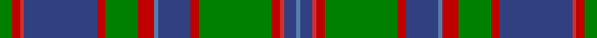

This page is one **sett** — a single exact thread-count. It belongs to the [tartan](/setts/g3ri2r1db18ri2g8ri4t1db8ri2g18ri2r1db3t1/)
(the same proportion at any scale), whose colour order is pattern [BBRRGRBBRGRBRRG](/stripes/bbrrgrbbrgrbrrg/).

Part of the [Glen Orchy](/tartans/glen-orchy/) tartan — the named design grouping this sett with its other cloths.

Sourced from weddslist.  It is a [15 stripe tartan](/stripes/stripes15/).

Original link http://www.weddslist.com/cgi-bin/tartans/pg.pl?source=sts

## Also known as

This cloth is also recorded under:

- Glen Orchy #1

## Thread count
G/6 Ra4 R2 B36 Ra4 G16 Ra8 Ba2 B16 Ra4 G36 Ra4 R2 B6 Ba/2

One full sett is **288 threads**.

## Palette

Palette: <strong>custom</strong>
<table><thead><tr><th>Colour</th><th>Threads</th><th>Shade</th><th>Base</th><th>OKLCh</th></tr></thead><tbody><tr><td>G/</td><td style="text-align:right;font-variant-numeric:tabular-nums">6</td><td><code style="background-color:#008000;">#008000</code> <small style="color:#888">#008000</small></td><td>G <code style="background-color:#006100;">#006100</code></td><td><small style="color:#888">oklch(52.0% 0.177 142.5)</small></td></tr><tr><td>Ra</td><td style="text-align:right;font-variant-numeric:tabular-nums">4</td><td><code style="background-color:#C00000;">#C00000</code> <small style="color:#888">#C00000</small></td><td>R <code style="background-color:#CC0000;">#CC0000</code></td><td><small style="color:#888">oklch(50.7% 0.208 29.2)</small></td></tr><tr><td>R</td><td style="text-align:right;font-variant-numeric:tabular-nums">2</td><td><code style="background-color:#D03030;">#D03030</code> <small style="color:#888">#D03030</small></td><td>R <code style="background-color:#CC0000;">#CC0000</code></td><td><small style="color:#888">oklch(56.4% 0.196 26.2)</small></td></tr><tr><td>B</td><td style="text-align:right;font-variant-numeric:tabular-nums">36</td><td><code style="background-color:#304080;">#304080</code> <small style="color:#888">#304080</small></td><td>B <code style="background-color:#2A418A;">#2A418A</code></td><td><small style="color:#888">oklch(39.4% 0.109 270.2)</small></td></tr><tr><td>Ra</td><td style="text-align:right;font-variant-numeric:tabular-nums">4</td><td><code style="background-color:#C00000;">#C00000</code> <small style="color:#888">#C00000</small></td><td>R <code style="background-color:#CC0000;">#CC0000</code></td><td><small style="color:#888">oklch(50.7% 0.208 29.2)</small></td></tr><tr><td>G</td><td style="text-align:right;font-variant-numeric:tabular-nums">16</td><td><code style="background-color:#008000;">#008000</code> <small style="color:#888">#008000</small></td><td>G <code style="background-color:#006100;">#006100</code></td><td><small style="color:#888">oklch(52.0% 0.177 142.5)</small></td></tr><tr><td>Ra</td><td style="text-align:right;font-variant-numeric:tabular-nums">8</td><td><code style="background-color:#C00000;">#C00000</code> <small style="color:#888">#C00000</small></td><td>R <code style="background-color:#CC0000;">#CC0000</code></td><td><small style="color:#888">oklch(50.7% 0.208 29.2)</small></td></tr><tr><td>Ba</td><td style="text-align:right;font-variant-numeric:tabular-nums">2</td><td><code style="background-color:#5480B0;">#5480B0</code> <small style="color:#888">#5480B0</small></td><td>B <code style="background-color:#2A418A;">#2A418A</code></td><td><small style="color:#888">oklch(58.8% 0.089 251.5)</small></td></tr><tr><td>B</td><td style="text-align:right;font-variant-numeric:tabular-nums">16</td><td><code style="background-color:#304080;">#304080</code> <small style="color:#888">#304080</small></td><td>B <code style="background-color:#2A418A;">#2A418A</code></td><td><small style="color:#888">oklch(39.4% 0.109 270.2)</small></td></tr><tr><td>Ra</td><td style="text-align:right;font-variant-numeric:tabular-nums">4</td><td><code style="background-color:#C00000;">#C00000</code> <small style="color:#888">#C00000</small></td><td>R <code style="background-color:#CC0000;">#CC0000</code></td><td><small style="color:#888">oklch(50.7% 0.208 29.2)</small></td></tr><tr><td>G</td><td style="text-align:right;font-variant-numeric:tabular-nums">36</td><td><code style="background-color:#008000;">#008000</code> <small style="color:#888">#008000</small></td><td>G <code style="background-color:#006100;">#006100</code></td><td><small style="color:#888">oklch(52.0% 0.177 142.5)</small></td></tr><tr><td>Ra</td><td style="text-align:right;font-variant-numeric:tabular-nums">4</td><td><code style="background-color:#C00000;">#C00000</code> <small style="color:#888">#C00000</small></td><td>R <code style="background-color:#CC0000;">#CC0000</code></td><td><small style="color:#888">oklch(50.7% 0.208 29.2)</small></td></tr><tr><td>R</td><td style="text-align:right;font-variant-numeric:tabular-nums">2</td><td><code style="background-color:#D03030;">#D03030</code> <small style="color:#888">#D03030</small></td><td>R <code style="background-color:#CC0000;">#CC0000</code></td><td><small style="color:#888">oklch(56.4% 0.196 26.2)</small></td></tr><tr><td>B</td><td style="text-align:right;font-variant-numeric:tabular-nums">6</td><td><code style="background-color:#304080;">#304080</code> <small style="color:#888">#304080</small></td><td>B <code style="background-color:#2A418A;">#2A418A</code></td><td><small style="color:#888">oklch(39.4% 0.109 270.2)</small></td></tr><tr><td>Ba/</td><td style="text-align:right;font-variant-numeric:tabular-nums">2</td><td><code style="background-color:#5480B0;">#5480B0</code> <small style="color:#888">#5480B0</small></td><td>B <code style="background-color:#2A418A;">#2A418A</code></td><td><small style="color:#888">oklch(58.8% 0.089 251.5)</small></td></tr></tbody></table>

## Compared to the master

This cloth is one sett of its design; the master sett (the exemplar the design is anchored on) is below for comparison.

<figure style="margin:0"><figcaption style="color:#888;font-size:smaller">this sett</figcaption></figure>
<figure style="margin:0"><figcaption style="color:#888;font-size:smaller"><a href="/setts/t2r3db3r5g14r3db2r5g2r3db14r5g3r3t2/">master sett →</a></figcaption></figure>

## Nearest tartans

The nearest existing variants by ΔTartan distance, with this tartan at the top so the swatches line up against it.

ΔTartan

Tartan

Sett

—

<a href="/ttd/edit/#slug=g3ri2r1db18ri2g8ri4t1db8ri2g18ri2r1db3t1~x2">Glen Orchy</a> <a class="nn-out" href="/variants/s15/g3ri2r1db18ri2g8ri4t1db8ri2g18ri2r1db3t1~x2/" title="open its dictionary page">↗</a>

0.75

<a href="/ttd/edit/#slug=g3db2ri1db17r2g8r4t1db8r2g17r2ri1db3t1~x2&amp;base=g3ri2r1db18ri2g8ri4t1db8ri2g18ri2r1db3t1~x2">Glenorchy - National Archives</a> <a class="nn-out" href="/variants/s15/g3db2ri1db17r2g8r4t1db8r2g17r2ri1db3t1~x2/" title="open its dictionary page">↗</a>

0.77

<a href="/ttd/edit/#slug=k2g2r3db18r2g6r4t1db6r3g18r3k2g2~x2&amp;base=g3ri2r1db18ri2g8ri4t1db8ri2g18ri2r1db3t1~x2">Glen Orchy #2 or MacIntyre</a> <a class="nn-out" href="/variants/s14/k2g2r3db18r2g6r4t1db6r3g18r3k2g2~x2/" title="open its dictionary page">↗</a>

0.89

<a href="/ttd/edit/#slug=db2t1r2g16r2db6t1r2g6r2db16t1r2g2~x2&amp;base=g3ri2r1db18ri2g8ri4t1db8ri2g18ri2r1db3t1~x2">Glen Orchy</a> <a class="nn-out" href="/variants/s14/db2t1r2g16r2db6t1r2g6r2db16t1r2g2~x2/" title="open its dictionary page">↗</a>

0.92

<a href="/ttd/edit/#slug=t4r2t3g1t1g2t18r1k12gi21t1k3gi1k2gi4r2~x2&amp;base=g3ri2r1db18ri2g8ri4t1db8ri2g18ri2r1db3t1~x2">Munster</a> <a class="nn-out" href="/variants/s16/t4r2t3g1t1g2t18r1k12gi21t1k3gi1k2gi4r2~x2/" title="open its dictionary page">↗</a>

0.95

<a href="/ttd/edit/#slug=g19r1g2r2g15r1dt13w1db2r2db21r1w3~x2&amp;base=g3ri2r1db18ri2g8ri4t1db8ri2g18ri2r1db3t1~x2">Ontario (Official)</a> <a class="nn-out" href="/variants/s13/g19r1g2r2g15r1dt13w1db2r2db21r1w3~x2/" title="open its dictionary page">↗</a>

0.99

<a href="/variants/s16/k4b4k2b4k2b22dy27ly2r3~x2/">Falkirk District Tartan</a>

0.99

<a href="/ttd/edit/#slug=dg16r2dg2r1dg3r1dg2r2dg12k12r1db16r2db8ly2~x2&amp;base=g3ri2r1db18ri2g8ri4t1db8ri2g18ri2r1db3t1~x2">Cochrane (1984)</a> <a class="nn-out" href="/variants/s15/dg16r2dg2r1dg3r1dg2r2dg12k12r1db16r2db8ly2~x2/" title="open its dictionary page">↗</a>

1.06

<a href="/ttd/edit/#slug=r1k2o2g1ly1o17k1g14k1r2o2k1o2k1o2k2g2k2r1~x4&amp;base=g3ri2r1db18ri2g8ri4t1db8ri2g18ri2r1db3t1~x2">Craig</a> <a class="nn-out" href="/variants/s19/r1k2o2g1ly1o17k1g14k1r2o2k1o2k1o2k2g2k2r1~x4/" title="open its dictionary page">↗</a>

1.07

<a href="/ttd/edit/#slug=dt36k5r2k5g15r2g10w2g10r2g15k5r2k5dt10r2dt2r2dt4w2~x2&amp;base=g3ri2r1db18ri2g8ri4t1db8ri2g18ri2r1db3t1~x2">Ranking Corporate Tartan</a> <a class="nn-out" href="/variants/s20/dt36k5r2k5g15r2g10w2g10r2g15k5r2k5dt10r2dt2r2dt4w2~x2/" title="open its dictionary page">↗</a>

1.09

<a href="/ttd/edit/#slug=t2k1dg15w2dg15k1t2k1r2k20t2k2t2k2t25k1~x2&amp;base=g3ri2r1db18ri2g8ri4t1db8ri2g18ri2r1db3t1~x2">Rankin, John (Personal)</a> <a class="nn-out" href="/variants/s16/t2k1dg15w2dg15k1t2k1r2k20t2k2t2k2t25k1~x2/" title="open its dictionary page">↗</a>

## Neighbour map

Every grey dot is one of 14360 variants placed by the first two principal components of the ΔTartan feature space (44% of its variance). Red is this tartan; blue dots are its nearest — click one to open its page.

<svg viewBox="0 0 640 380" role="img" style="max-width:100%;height:auto;border:1px solid #e0e0e0;border-radius:4px;display:block" xmlns="http://www.w3.org/2000/svg"><image href="/nn/cloud.v1.png" width="640" height="380"/><a href="/variants/s15/g3db2ri1db17r2g8r4t1db8r2g17r2ri1db3t1~x2/"><circle cx="249.0" cy="132.3" r="4" fill="#3465a4"><title>Glenorchy - National Archives</title></circle></a><a href="/variants/s14/k2g2r3db18r2g6r4t1db6r3g18r3k2g2~x2/"><circle cx="225.2" cy="131.4" r="4" fill="#3465a4"><title>Glen Orchy #2 or MacIntyre</title></circle></a><a href="/variants/s14/db2t1r2g16r2db6t1r2g6r2db16t1r2g2~x2/"><circle cx="259.3" cy="149.9" r="4" fill="#3465a4"><title>Glen Orchy</title></circle></a><a href="/variants/s16/t4r2t3g1t1g2t18r1k12gi21t1k3gi1k2gi4r2~x2/"><circle cx="208.8" cy="109.6" r="4" fill="#3465a4"><title>Munster</title></circle></a><a href="/variants/s13/g19r1g2r2g15r1dt13w1db2r2db21r1w3~x2/"><circle cx="236.8" cy="123.1" r="4" fill="#3465a4"><title>Ontario (Official)</title></circle></a><a href="/variants/s16/k4b4k2b4k2b22dy27ly2r3~x2/"><circle cx="267.9" cy="137.2" r="4" fill="#3465a4"><title>Falkirk District Tartan</title></circle></a><a href="/variants/s15/dg16r2dg2r1dg3r1dg2r2dg12k12r1db16r2db8ly2~x2/"><circle cx="232.9" cy="145.4" r="4" fill="#3465a4"><title>Cochrane (1984)</title></circle></a><a href="/variants/s19/r1k2o2g1ly1o17k1g14k1r2o2k1o2k1o2k2g2k2r1~x4/"><circle cx="254.3" cy="96.6" r="4" fill="#3465a4"><title>Craig</title></circle></a><a href="/variants/s20/dt36k5r2k5g15r2g10w2g10r2g15k5r2k5dt10r2dt2r2dt4w2~x2/"><circle cx="219.0" cy="120.8" r="4" fill="#3465a4"><title>Ranking Corporate Tartan</title></circle></a><a href="/variants/s16/t2k1dg15w2dg15k1t2k1r2k20t2k2t2k2t25k1~x2/"><circle cx="225.4" cy="100.8" r="4" fill="#3465a4"><title>Rankin, John (Personal)</title></circle></a><circle cx="241.2" cy="127.0" r="5" fill="#c00000"/></svg>

ID: /variants/s15/g3ri2r1db18ri2g8ri4t1db8ri2g18ri2r1db3t1~x2/
