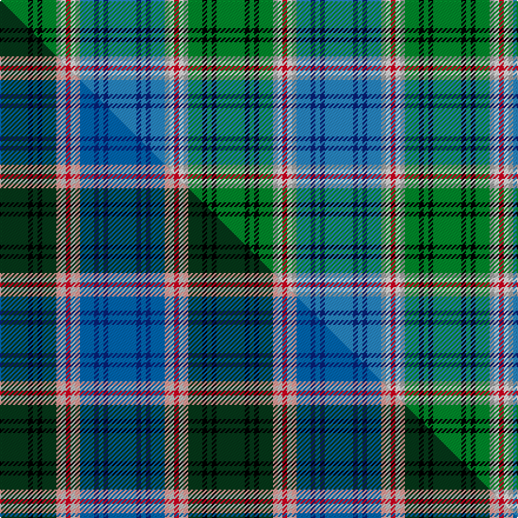

This page is one **sett** — a single exact thread-count. It belongs to the [tartan](/setts/g6k1g1k1g3lr1w1r1w1lr1t3db1t1db1t6/)
(the same proportion at any scale), whose colour order is pattern [BBBBBYWRWYGKGKG](/stripes/bbbbbywrwygkgkg/).

Part of the [McCulloch](/tartans/mcculloch/) tartan — the named design grouping this sett with its other cloths.

Sourced from tartans-authority.  It is a [15 stripe tartan](/stripes/stripes15/).

Original link http://www.tartansauthority.com/tartan-ferret/display/7380/

2 attestations — the source records this cloth was collapsed from (oldest owns this page)

<ul>
<li>pre 2007 — McCulloch (Personal) (tartans-authority, <a href="http://www.tartansauthority.com/tartan-ferret/display/7380/">record</a>)  <em>STWR notes: "Designed for the family of Grant McCulloch to celebrate the connection with the Armed Services since 1296. He himself have been a Royal Scot for 22 years. The colours represent:- Poppy Red for the Mccullochs who fell in the service of King and Queen from 1296-2007. Bottle and Moss Green for those in H.M Force's Army over 807 years of family history.In the immediate family this amounts to 110 years. Slate and Electric Blue, Battleship Grey: This is for father Hay Mcculloch's worldwide Naval service on Aircraft Carriers, Destoyers and Motor Torpedo Boats. Also for mother Christina Mcquid (Veitch) Mcculloch hazadous duties in the !940-45 War in Ammunition factories. It celebrates their silver wedding anniversary of 2006. Silver Grey: In honour of the medals received during the Mcculloch military service taken from 1296, World War 2, Falkland Islands, Gulf One (Desert Storm), Bosnia and over two emergency tours. Use of the tartan is control by Grant McCulloch."</em></li>
<li>undated — McCulloch (Personal) (register-of-tartans, <a href="https://www.tartanregister.gov.uk/tartanDetails.aspx?ref=5479">record</a>)  <em>Scottish Tartans World Register notes: "Designed for the family of Grant McCulloch to celebrate the connection with the Armed Services since 1296. He himself has been a Royal Scot for 22 years. The colours represent:- Poppy Red for the Mccullochs who fell in the service of King and Queen from 1296-2007. Bottle and Moss Green for those in H.M Force's Army over 807 years of family history. In the immediate family this amounts to 110 years. Slate and Electric Blue, Battleship Grey: This is for father Hay Mcculloch's worldwide Naval service on Aircraft Carriers, Destoyers and Motor Torpedo Boats. Also for mother Christina Mcquid (Veitch) Mcculloch hazadous duties in the !940-45 War in Ammunition factories. It celebrates their silver wedding anniversary of 2006. Silver Grey: In honour of the medals received during the Mcculloch military service taken from 1296, World War 2, Falkland Islands, Gulf One (Desert Storm), Bosnia and over two emergency tours Use of the tartan is controlled by Grant McCulloch."</em></li>
</ul>

## Register references

External register numbers recorded for this tartan.

- Scottish Register of Tartans: [5479](https://www.tartanregister.gov.uk/tartanDetails.aspx?ref=5479)
- Scottish Tartans Authority (ITI): 7380

## Thread count
G/24 K4 G4 K4 G12 LR4 W4 R4 W4 LR4 T12 DB4 T4 DB4 T/24

One full sett is **184 threads**.

## Palette
<table><thead><tr><th>Colour</th><th>Shade</th><th>OKLCh</th></tr></thead><tbody><tr><td>T</td><td><code style="background-color:#2888C4;">#2888C4</code> <small style="color:#888">#2888C4</small></td><td><small style="color:#888">oklch(60.1% 0.125 241.5)</small></td></tr><tr><td>DB</td><td><code style="background-color:#082077;">#082077</code> <small style="color:#888">#082077</small></td><td><small style="color:#888">oklch(30.0% 0.149 265.1)</small></td></tr><tr><td>G</td><td><code style="background-color:#008B2A;">#008B2A</code> <small style="color:#888">#008B2A</small></td><td><small style="color:#888">oklch(55.4% 0.170 145.9)</small></td></tr><tr><td>K</td><td><code style="background-color:#000000;">#000000</code> <small style="color:#888">#000000</small></td><td><small style="color:#888">oklch(0.0% 0.000 0.0)</small></td></tr><tr><td>W</td><td><code style="background-color:#F7F7F7;">#F7F7F7</code> <small style="color:#888">#F7F7F7</small></td><td><small style="color:#888">oklch(97.6% 0.000 89.9)</small></td></tr><tr><td>LR</td><td><code style="background-color:#A0A0A0;">#A0A0A0</code> <small style="color:#888">#A0A0A0</small></td><td><small style="color:#888">oklch(70.6% 0.000 89.9)</small></td></tr><tr><td>R</td><td><code style="background-color:#D60020;">#D60020</code> <small style="color:#888">#D60020</small></td><td><small style="color:#888">oklch(55.2% 0.224 25.5)</small></td></tr></tbody></table>

# Sample pattern

## Compared to the master

This cloth is one sett of its design; the master sett (the exemplar the design is anchored on) is below for comparison.

Its **ΔTartan distance** from the master is **1.30** — the same measure the nearest-tartans table ranks by (0 is identical; a re-scale of the same cloth is near 0, a recolour or a different proportion further).

<figure class="master-compare" style="margin:0">

this sett
master sett ★

<figcaption style="color:#888;font-size:smaller">One weave of this sett against the <a href="/setts/dg6k1dg1k1dg3lr1lb1r1lb1lr1dbi3db1dbi1db1dbi6/">master sett ★</a>, split on the diagonal: a shared proportion runs seamlessly across it with only the shades shifting; a different proportion breaks on it.</figcaption>
</figure>

## Nearest variants

The nearest existing variants by ΔTartan distance, with this cloth at the top so the swatches line up against it.

ΔTartan

Threads

Variant

Sett

—

184

<a href="/variants/s15/g6k1g1k1g3lr1w1r1w1lr1t3db1t1db1t6~x4~lr2800000-t2405244/">McCulloch (Personal)</a>

1.20

—

<a href="/variants/s15/dg6k1dg1k1dg3lr1lb1r1lb1lr1dbi3db1dbi1db1dbi6~x4~lb3200000-dbi2006246/">McCulloch (Military Colours)</a>

## Neighbour map

Every grey dot is one of 13620 variants placed by the first two principal components of the ΔTartan feature space (42% of its variance). Red is this tartan; blue dots are its nearest — click one to open its page.

<svg viewBox="0 0 640 380" role="img" style="max-width:100%;height:auto;border:1px solid #e0e0e0;border-radius:4px;display:block" xmlns="http://www.w3.org/2000/svg"><image href="/nn/cloud.v1.png" width="640" height="380"/><a href="/variants/s15/dg6k1dg1k1dg3lr1lb1r1lb1lr1dbi3db1dbi1db1dbi6~x4~lb3200000-dbi2006246/"><circle cx="79.5" cy="143.3" r="4" fill="#3465a4"><title>McCulloch (Military Colours)</title></circle></a><circle cx="72.2" cy="146.7" r="5" fill="#c00000"/><text x="320" y="376" text-anchor="middle" font-size="11" fill="#999">ground</text><text x="11" y="190" text-anchor="middle" font-size="11" fill="#999" transform="rotate(-90 11 190)">complexity</text></svg>

ID: /variants/s15/g6k1g1k1g3lr1w1r1w1lr1t3db1t1db1t6~x4~lr2800000-t2405244/
