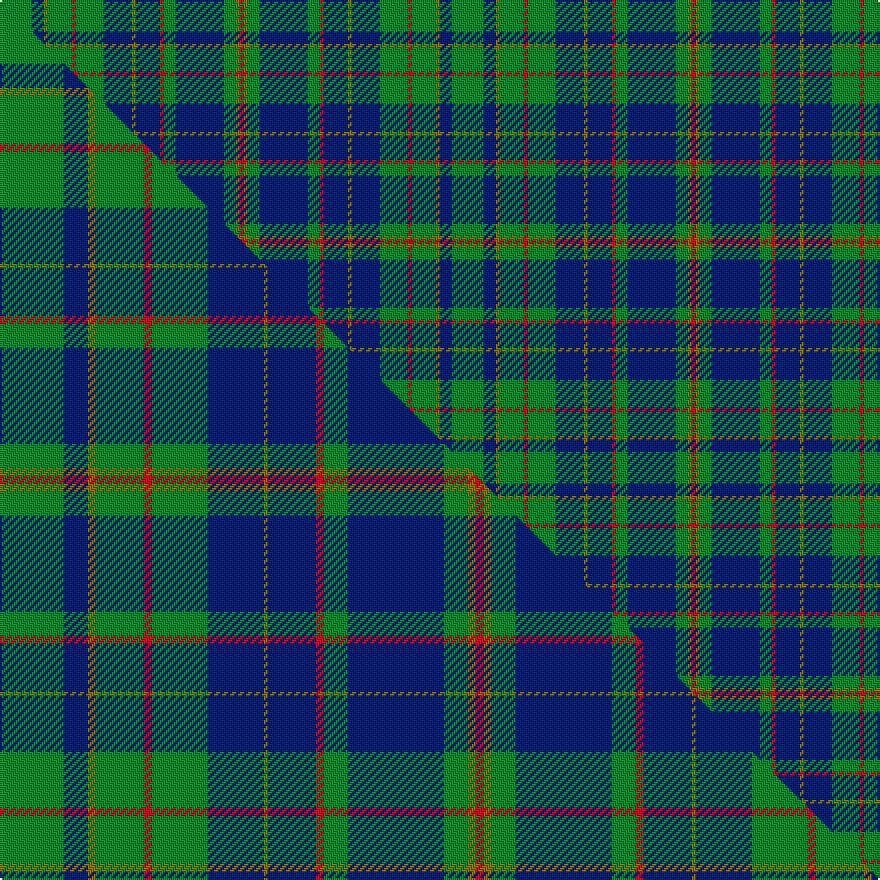

This is one **variant** — a specific cloth: this exact thread count and colourway, with its own
provenance below. It is one weaving of the [sett](/setts/g8db3y1g6r1g7db7y1db6r1g3db12g3y1r1/) (the scale-free proportion — the
same cloth at any scale or shade), whose colour order is pattern [GBGGRGBGBRGBGGR](/stripes/gbggrgbgbrgbggr/).

Part of the [Platt](/tartans/p/pl/platt/) tartan — the named design grouping this sett with its other cloths.

Sourced from house-of-tartan.  It is a [15 stripe tartan](/stripes/stripes15/).

Original link [http://www.house-of-tartan.scotland.net/house/TartanViewjs.asp?colr=Def&tnam=749](http://www.house-of-tartan.scotland.net/house/TartanViewjs.asp?colr=Def&tnam=749)

## Provenance

Earliest known date: pre 1966 Appears near the end of the Provosts collection - 'which he placed in the book in the order of receiving them. The patterns at the end of the book are all modern.' (Arthur Peters, librarian at Inverness Public library)

2 attestations — the source records this cloth was collapsed from (oldest owns this page)

<ul>
<li>pre 1966 — Platt Family Tartan (house-of-tartan, <a href="http://www.house-of-tartan.scotland.net/house/TartanViewjs.asp?colr=Def&tnam=749">record</a>) </li>
<li>undated — Platt (weddslist, <a href="http://www.weddslist.com/cgi-bin/tartans/pg.pl?source=sts">record</a>) </li>
</ul>

Dataset <small>— provenance for this record, inherited from the source manifest</small>

<dl class="dataset-prov">
<dt>source</dt><dd><a href="/sources/house-of-tartan/">House of Tartan</a></dd>
<dt>data captured from</dt><dd><a href="https://github.com/thetartan/tartan-database/blob/master/data/house-of-tartan/data.csv">https://github.com/thetartan/tartan-database/blob/master/data/house-of-tartan/data.csv</a></dd>
<dt>data date</dt><dd>pre 1966 <small>(this record)</small></dd>
<dt>licence</dt><dd><a href="https://creativecommons.org/licenses/by-nc-nd/4.0/">CC BY-NC-ND 4.0</a></dd>
</dl>

Capture chain <small>— the hands this data passed through, oldest first; each capture carries its own licence</small>

<ol class="capture-chain">
<li><a href="http://www.house-of-tartan.scotland.net/">House of Tartan</a> <small>the weaver/retailer's database — the site is now offline; the URL is kept as the ultimate source's identity</small></li>
<li><a href="https://github.com/thetartan/tartan-database">thetartan/tartan-database</a> <small>2016-2017</small> · <a href="https://creativecommons.org/licenses/by-nc-nd/4.0/">CC BY-NC-ND 4.0</a> <small>Levko Kravets's frozen compilation — the capture we vendored, and where its CC licence text came from</small></li>
<li>this dictionary <small>captured 2026-06-10 · commit 5bf86c7566</small> <small>each re-capture is a git commit to data/sources</small></li>
</ol>

## Thread count
G/16 DB6 Y2 G12 R2 G14 DB14 Y2 DB12 R2 G6 DB24 G6 Y2 R/2

One full sett is **226 threads**.

## Palette
<table><thead><tr><th>Colour</th><th>Shade</th><th>OKLCh</th></tr></thead><tbody><tr><td>DB</td><td><code style="background-color:#082077;">#082077</code> <small style="color:#888">#082077</small></td><td><small style="color:#888">oklch(30.0% 0.149 265.1)</small></td></tr><tr><td>G</td><td><code style="background-color:#008B2A;">#008B2A</code> <small style="color:#888">#008B2A</small></td><td><small style="color:#888">oklch(55.4% 0.170 145.9)</small></td></tr><tr><td>R</td><td><code style="background-color:#D60020;">#D60020</code> <small style="color:#888">#D60020</small></td><td><small style="color:#888">oklch(55.2% 0.224 25.5)</small></td></tr><tr><td>Y</td><td><code style="background-color:#8B6E00;">#8B6E00</code> <small style="color:#888">#8B6E00</small></td><td><small style="color:#888">oklch(55.1% 0.113 90.4)</small></td></tr></tbody></table>

# Sample pattern

## Compared to the master

This cloth is one sett of its design; the master sett (the exemplar the design is anchored on) is below for comparison.

Its **ΔTartan distance** from the master is **0.49** — the same measure the nearest-tartans table ranks by (0 is identical; a re-scale of the same cloth is near 0, a recolour or a different proportion further).

<figure class="master-compare" style="margin:0">

this sett
master sett ★

<figcaption style="color:#888;font-size:smaller">One weave of this sett against the <a href="/setts/g16db6y2g12r2g14db14y1db12r2g6db24g6y2r2/">master sett ★</a>, split on the diagonal: a shared proportion runs seamlessly across it with only the shades shifting; a different proportion breaks on it.</figcaption>
</figure>

## Nearest tartan variants

The nearest existing variants by ΔTartan distance, with this cloth at the top so the swatches line up against it.

ΔTartan

Threads

Variant

Sett

—

226

<a href="/variants/s15/g8db3y1g6r1g7db7y1db6r1g3db12g3y1r1~x2/">Platt Family Tartan</a>

<a href="/ttd/edit/#slug=g16db6y2g12r2g14db14y1db12r2g6db24g6y2r2~x2&amp;base=g8db3y1g6r1g7db7y1db6r1g3db12g3y1r1~x2" title="compare in the TTD">0.49</a>

448

<a href="/variants/s15/g16db6y2g12r2g14db14y1db12r2g6db24g6y2r2~x2/">Platt</a>

<a href="/ttd/edit/#slug=dy1r1dy2db11g5db1g8r1~x4~g2408144&amp;base=g8db3y1g6r1g7db7y1db6r1g3db12g3y1r1~x2" title="compare in the TTD">1.53</a>

456

<a href="/variants/s14/dy1r1dy2db11g5db1g8r1g8db1g5db11dy2r1~x4~g2408144/">New Mexico District Tartan</a>

<a href="/ttd/edit/#slug=g11r4g4r7g41db11lb4db41r4db8&amp;base=g8db3y1g6r1g7db7y1db6r1g3db12g3y1r1~x2" title="compare in the TTD">2.64</a>

251

<a href="/variants/s10/g11r4g4r7g41db11lb4db41r4db8/">Stuart/Stewart of Appin #2</a>

<a href="/ttd/edit/#slug=g8r3g3r5g26db7lb3db28r3db6~x2&amp;base=g8db3y1g6r1g7db7y1db6r1g3db12g3y1r1~x2" title="compare in the TTD">2.66</a>

340

<a href="/variants/s10/g8r3g3r5g26db7lb3db28r3db6~x2/">Stewart of Appin Htg (error)</a>

<a href="/ttd/edit/#slug=r1g8db2g2db6g1db6g2db2g8y1~x4&amp;base=g8db3y1g6r1g7db7y1db6r1g3db12g3y1r1~x2" title="compare in the TTD">2.79</a>

304

<a href="/variants/s11/r1g8db2g2db6g1db6g2db2g8y1~x4/">Bruce of Crionaich (Personal)</a>

<a href="/ttd/edit/#slug=g27r2g3r3db3ly2db14r2db3ly3db3r2db14~x2&amp;base=g8db3y1g6r1g7db7y1db6r1g3db12g3y1r1~x2" title="compare in the TTD">2.90</a>

242

<a href="/variants/s13/g27r2g3r3db3ly2db14r2db3ly3db3r2db14~x2/">Crowne Plaza (Corporate)</a>

<a href="/ttd/edit/#slug=dp4db18r2db2r2db9g20db3g4~x2~dp1607327-r1606028&amp;base=g8db3y1g6r1g7db7y1db6r1g3db12g3y1r1~x2" title="compare in the TTD">2.95</a>

240

<a href="/variants/s9/dp4db18r2db2r2db9g20db3g4~x2~dp1607327-r1606028/">St. Andrews New Golf Club</a>

<a href="/ttd/edit/#slug=g4r2g14w2db14r2db14g14db2g5db2g14db14r2db14w2g14r2g4lo3~x2~db1406275&amp;base=g8db3y1g6r1g7db7y1db6r1g3db12g3y1r1~x2" title="compare in the TTD">3.02</a>

562

<a href="/variants/s20/g4r2g14w2db14r2db14g14db2g5db2g14db14r2db14w2g14r2g4lo3~x2~db1406275/">Hunter of Hunterston</a>

<a href="/ttd/edit/#slug=g21db4w4db32g12y4g8r4g6db12&amp;base=g8db3y1g6r1g7db7y1db6r1g3db12g3y1r1~x2" title="compare in the TTD">3.03</a>

181

<a href="/variants/s10/g21db4w4db32g12y4g8r4g6db12/">Harkness Hunting</a>

<a href="/ttd/edit/#slug=db24g4db3g4db24g6w3g4r3g8ly3g8r3g4w3g6~x2&amp;base=g8db3y1g6r1g7db7y1db6r1g3db12g3y1r1~x2" title="compare in the TTD">3.04</a>

380

<a href="/variants/s16/db24g4db3g4db24g6w3g4r3g8ly3g8r3g4w3g6~x2/">Scottish Borders Tourist Board</a>

## Neighbour map

Every grey dot is one of 13656 variants placed by the first two principal components of the ΔTartan feature space (42% of its variance). Red is this tartan; blue dots are its nearest — click one to open its page. The map is a flat projection of a many-dimensional space — [how to read it](/posts/neighbourhood-maps/).

<svg viewBox="0 0 640 380" role="img" style="max-width:100%;height:auto;border:1px solid #e0e0e0;border-radius:4px;display:block" xmlns="http://www.w3.org/2000/svg"><image href="/nn/cloud.v1.png" width="640" height="380"/><a href="/variants/s15/g16db6y2g12r2g14db14y1db12r2g6db24g6y2r2~x2/"><circle cx="289.5" cy="157.3" r="4" fill="#3465a4"><title>Platt</title></circle></a><a href="/variants/s14/dy1r1dy2db11g5db1g8r1g8db1g5db11dy2r1~x4~g2408144/"><circle cx="239.8" cy="177.7" r="4" fill="#3465a4"><title>New Mexico District Tartan</title></circle></a><a href="/variants/s10/g11r4g4r7g41db11lb4db41r4db8/"><circle cx="258.4" cy="182.3" r="4" fill="#3465a4"><title>Stuart/Stewart of Appin #2</title></circle></a><a href="/variants/s10/g8r3g3r5g26db7lb3db28r3db6~x2/"><circle cx="249.9" cy="188.6" r="4" fill="#3465a4"><title>Stewart of Appin Htg (error)</title></circle></a><a href="/variants/s11/r1g8db2g2db6g1db6g2db2g8y1~x4/"><circle cx="297.3" cy="215.5" r="4" fill="#3465a4"><title>Bruce of Crionaich (Personal)</title></circle></a><a href="/variants/s13/g27r2g3r3db3ly2db14r2db3ly3db3r2db14~x2/"><circle cx="258.1" cy="150.8" r="4" fill="#3465a4"><title>Crowne Plaza (Corporate)</title></circle></a><a href="/variants/s9/dp4db18r2db2r2db9g20db3g4~x2~dp1607327-r1606028/"><circle cx="296.6" cy="200.5" r="4" fill="#3465a4"><title>St. Andrews New Golf Club</title></circle></a><a href="/variants/s20/g4r2g14w2db14r2db14g14db2g5db2g14db14r2db14w2g14r2g4lo3~x2~db1406275/"><circle cx="223.0" cy="179.8" r="4" fill="#3465a4"><title>Hunter of Hunterston</title></circle></a><a href="/variants/s10/g21db4w4db32g12y4g8r4g6db12/"><circle cx="223.5" cy="196.0" r="4" fill="#3465a4"><title>Harkness Hunting</title></circle></a><a href="/variants/s16/db24g4db3g4db24g6w3g4r3g8ly3g8r3g4w3g6~x2/"><circle cx="211.5" cy="161.8" r="4" fill="#3465a4"><title>Scottish Borders Tourist Board</title></circle></a><circle cx="264.4" cy="184.1" r="5" fill="#c00000"/><text x="320" y="376" text-anchor="middle" font-size="11" fill="#999">ground</text><text x="11" y="190" text-anchor="middle" font-size="11" fill="#999" transform="rotate(-90 11 190)">complexity</text></svg>

ID: /variants/s15/g8db3y1g6r1g7db7y1db6r1g3db12g3y1r1~x2/
