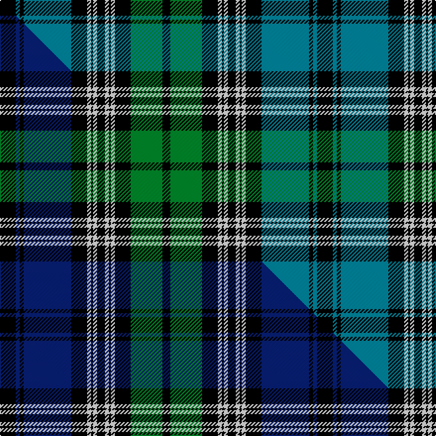

This page is one **sett** — a single exact thread-count. It belongs to the [tartan](/setts/k8t2k2t24k8w2k1w2k4w2k1w2k8g16k4/)
(the same proportion at any scale), whose colour order is pattern [KBKBKWKWKWKWKGK](/stripes/kbkbkwkwkwkwkgk/).

Part of the [Fair Trade](/tartans/fair-trade/) tartan — the named design grouping this sett with its other cloths.

Sourced from tartans-authority.  It is a [15 stripe tartan](/stripes/stripes15/).

Original link http://www.tartansauthority.com/tartan-ferret/display/10980/

## Register references

External register numbers recorded for this tartan.

- Scottish Register of Tartans: [10980](https://www.tartanregister.gov.uk/tartanDetails?ref=10980)
- Scottish Tartans Authority (ITI): 10980

## Thread count
K/16 T4 K4 T48 K16 W4 K2 W4 K8 W4 K2 W4 K16 G32 K/8

One full sett is **320 threads**.

## Palette
<table><thead><tr><th>Colour</th><th>Shade</th><th>OKLCh</th></tr></thead><tbody><tr><td>T</td><td><code style="background-color:#00879F;">#00879F</code> <small style="color:#888">#00879F</small></td><td><small style="color:#888">oklch(57.4% 0.102 216.1)</small></td></tr><tr><td>G</td><td><code style="background-color:#008B2A;">#008B2A</code> <small style="color:#888">#008B2A</small></td><td><small style="color:#888">oklch(55.4% 0.170 145.9)</small></td></tr><tr><td>K</td><td><code style="background-color:#000000;">#000000</code> <small style="color:#888">#000000</small></td><td><small style="color:#888">oklch(0.0% 0.000 0.0)</small></td></tr><tr><td>W</td><td><code style="background-color:#F7F7F7;">#F7F7F7</code> <small style="color:#888">#F7F7F7</small></td><td><small style="color:#888">oklch(97.6% 0.000 89.9)</small></td></tr></tbody></table>

# Sample pattern

## Compared to the master

This cloth is one sett of its design; the master sett (the exemplar the design is anchored on) is below for comparison.

Its **ΔTartan distance** from the master is **0.93** — the same measure the nearest-tartans table ranks by (0 is identical; a re-scale of the same cloth is near 0, a recolour or a different proportion further).

<figure class="master-compare" style="margin:0">

this sett
master sett ★

<figcaption style="color:#888;font-size:smaller">One weave of this sett against the <a href="/setts/k8db2k2db24k8w2k1w2k4w2k1w2k8g16k4/">master sett ★</a>, split on the diagonal: a shared proportion runs seamlessly across it with only the shades shifting; a different proportion breaks on it.</figcaption>
</figure>

## Nearest variants

The nearest existing variants by ΔTartan distance, with this cloth at the top so the swatches line up against it.

ΔTartan

Threads

Variant

Sett

—

320

<a href="/variants/s15/k8t2k2t24k8w2k1w2k4w2k1w2k8g16k4~x2/">Fair Trade</a>

<a href="/ttd/edit/#slug=k8db2k2db24k8w2k1w2k4w2k1w2k8g16k4~x2&amp;base=k8t2k2t24k8w2k1w2k4w2k1w2k8g16k4~x2" title="compare in the TTD">0.00</a>

320

<a href="/variants/s15/k8db2k2db24k8w2k1w2k4w2k1w2k8g16k4~x2/">Fair Trade</a>

## Neighbour map

Every grey dot is one of 13620 variants placed by the first two principal components of the ΔTartan feature space (42% of its variance). Red is this tartan; blue dots are its nearest — click one to open its page.

<svg viewBox="0 0 640 380" role="img" style="max-width:100%;height:auto;border:1px solid #e0e0e0;border-radius:4px;display:block" xmlns="http://www.w3.org/2000/svg"><image href="/nn/cloud.v1.png" width="640" height="380"/><a href="/variants/s15/k8db2k2db24k8w2k1w2k4w2k1w2k8g16k4~x2/"><circle cx="178.6" cy="98.9" r="4" fill="#3465a4"><title>Fair Trade</title></circle></a><circle cx="172.2" cy="100.1" r="5" fill="#c00000"/><text x="320" y="376" text-anchor="middle" font-size="11" fill="#999">ground</text><text x="11" y="190" text-anchor="middle" font-size="11" fill="#999" transform="rotate(-90 11 190)">complexity</text></svg>

ID: /variants/s15/k8t2k2t24k8w2k1w2k4w2k1w2k8g16k4~x2/
