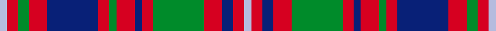

This is one **variant** — a specific cloth: this exact thread count and colourway, with its own
provenance below. It is one weaving of the [sett](/tartans/g/gl/glen-orchy-3/) (the scale-free proportion — the
same cloth at any scale or shade), whose colour order is pattern [WRBRGRBRGRBRGRW](/stripes/wrbrgrbrgrbrgrw/).

Part of the [Glen Orchy](/tartans/g/gl/glen-orchy-3/) tartan — the named design grouping this sett with its other cloths.

Sourced from register-of-tartans.  It is a [15 stripe tartan](/stripes/stripes15/).

Original link [https://www.tartanregister.gov.uk/tartanDetails.aspx?ref=1393](https://www.tartanregister.gov.uk/tartanDetails.aspx?ref=1393)

2 attestations — the source records this cloth was collapsed from (oldest owns this page)

<ul>
<li>undated — Glen Orchy #1 (register-of-tartans, <a href="https://www.tartanregister.gov.uk/tartanDetails.aspx?ref=1393">record</a>)  <em>May have been obtained from a hand made design procured in the Highlands for The Highland Society of London. Also known as MacIntyre of Glen Orchy although the MacIntyres occupied only part of the Glen. This collection is in the National Museum, Edinburgh.</em></li>
<li>undated — Glen Orchy (weddslist, <a href="http://www.weddslist.com/cgi-bin/tartans/pg.pl?source=sts">record</a>) </li>
</ul>

Dataset <small>— provenance for this record, inherited from the source manifest</small>

<dl class="dataset-prov">
<dt>source</dt><dd><a href="/sources/register-of-tartans/">Scottish Register of Tartans</a></dd>
<dt>data captured from</dt><dd><a href="https://github.com/thetartan/tartan-database/blob/master/data/register-of-tartans/data.csv">https://github.com/thetartan/tartan-database/blob/master/data/register-of-tartans/data.csv</a></dd>
<dt>data date</dt><dd>2017-01-06 <small>(dataset default)</small></dd>
<dt>licence</dt><dd><a href="https://www.tartanregister.gov.uk/copyright">Crown copyright</a></dd>
</dl>

Capture chain <small>— the hands this data passed through, oldest first; each capture carries its own licence</small>

<ol class="capture-chain">
<li><a href="https://www.tartanregister.gov.uk/">Scottish Register of Tartans</a> · <a href="https://www.tartanregister.gov.uk/copyright">Crown copyright</a> <small>the living register — still published by National Records of Scotland</small></li>
<li><a href="https://github.com/thetartan/tartan-database">thetartan/tartan-database</a> <small>2016-2017</small> · <a href="https://creativecommons.org/licenses/by-nc-nd/4.0/">CC BY-NC-ND 4.0</a> <small>Levko Kravets's frozen compilation — the capture we vendored, and where its CC licence text came from</small></li>
<li>this dictionary <small>captured 2026-06-10 · commit 5bf86c7566</small> <small>each re-capture is a git commit to data/sources</small></li>
</ol>

## Register references

External register numbers recorded for this tartan.

- Scottish Register of Tartans: [1393](https://www.tartanregister.gov.uk/tartanDetails.aspx?ref=1393)
- Scottish Tartans World Register: 2077

## Thread count
LB/4 R6 G6 R10 DB28 R6 G4 R10 DB4 R6 G28 R10 DB6 R6 LB/4

One full sett is **268 threads**.

## Palette
<table><thead><tr><th>Colour</th><th>Shade</th><th>OKLCh</th></tr></thead><tbody><tr><td>LB</td><td><code style="background-color:#B5BBDE;">#B5BBDE</code> <small style="color:#888">#B5BBDE</small></td><td><small style="color:#888">oklch(79.9% 0.050 277.6)</small></td></tr><tr><td>DB</td><td><code style="background-color:#082077;">#082077</code> <small style="color:#888">#082077</small></td><td><small style="color:#888">oklch(30.0% 0.149 265.1)</small></td></tr><tr><td>G</td><td><code style="background-color:#008B2A;">#008B2A</code> <small style="color:#888">#008B2A</small></td><td><small style="color:#888">oklch(55.4% 0.170 145.9)</small></td></tr><tr><td>R</td><td><code style="background-color:#D60020;">#D60020</code> <small style="color:#888">#D60020</small></td><td><small style="color:#888">oklch(55.2% 0.224 25.5)</small></td></tr></tbody></table>

# Sample pattern

## Nearest tartan variants

The nearest existing variants by ΔTartan distance, with this cloth at the top so the swatches line up against it.

ΔTartan

Threads

Variant

Sett

—

268

<a href="/variants/s15/lb2r3db3r5g14r3db2r5g2r3db14r5g3r3lb2~x2/">Glen Orchy #1</a>

<a href="/ttd/edit/#slug=lb1r1db1r2g8r1db1r2g1r1db8r2g1r1lb1~x4&amp;base=lb2r3db3r5g14r3db2r5g2r3db14r5g3r3lb2~x2" title="compare in the TTD">0.41</a>

248

<a href="/variants/s15/lb1r1db1r2g8r1db1r2g1r1db8r2g1r1lb1~x4/">MacIntyre of Glenorchy Clan Tartan</a>

<a href="/ttd/edit/#slug=lb3r24db4r8g32r4db4r8g4r4db32r8g4r4lb2~x2&amp;base=lb2r3db3r5g14r3db2r5g2r3db14r5g3r3lb2~x2" title="compare in the TTD">0.53</a>

570

<a href="/variants/s15/lb3r24db4r8g32r4db4r8g4r4db32r8g4r4lb2~x2/">MacIntyre (of Gatehouse)</a>

<a href="/ttd/edit/#slug=lb1r2db2r4g16r2db2r4g2r2db16r4g2r2lb1~x2&amp;base=lb2r3db3r5g14r3db2r5g2r3db14r5g3r3lb2~x2" title="compare in the TTD">0.64</a>

244

<a href="/variants/s15/lb1r2db2r4g16r2db2r4g2r2db16r4g2r2lb1~x2/">MacIntyre of Whitehouse (Clan?)</a>

<a href="/ttd/edit/#slug=db16r2db2r2g14r13w2r13g14db14r2db2~x2&amp;base=lb2r3db3r5g14r3db2r5g2r3db14r5g3r3lb2~x2" title="compare in the TTD">1.69</a>

348

<a href="/variants/s12/db16r2db2r2g14r13w2r13g14db14r2db2~x2/">Fraser of Lovat</a>

<a href="/ttd/edit/#slug=r1g1r6db2r1g1w1g6r2db6w1db1r1g2r6g1r1~x6&amp;base=lb2r3db3r5g14r3db2r5g2r3db14r5g3r3lb2~x2" title="compare in the TTD">1.69</a>

468

<a href="/variants/s17/r1g1r6db2r1g1w1g6r2db6w1db1r1g2r6g1r1~x6/">Reid of Straloch (Personal)</a>

<a href="/ttd/edit/#slug=r5db5r3g16r3g3r3db10r3lb5r12db5r3db3r5~x2&amp;base=lb2r3db3r5g14r3db2r5g2r3db14r5g3r3lb2~x2" title="compare in the TTD">1.89</a>

316

<a href="/variants/s15/r5db5r3g16r3g3r3db10r3lb5r12db5r3db3r5~x2/">Grant of Ballindalloch Clan Tartan</a>

<a href="/ttd/edit/#slug=db12w2db2w2db2r10g12r3g12r10db12w2db2~x2&amp;base=lb2r3db3r5g14r3db2r5g2r3db14r5g3r3lb2~x2" title="compare in the TTD">2.08</a>

304

<a href="/variants/s13/db12w2db2w2db2r10g12r3g12r10db12w2db2~x2/">Black Watch (Piper)</a>

<a href="/ttd/edit/#slug=db16r4db4r4db4r29g27r4g27r29db26r4db4~x2&amp;base=lb2r3db3r5g14r3db2r5g2r3db14r5g3r3lb2~x2" title="compare in the TTD">2.08</a>

688

<a href="/variants/s13/db16r4db4r4db4r29g27r4g27r29db26r4db4~x2/">Black Watch (Band Plaid)</a>

<a href="/ttd/edit/#slug=r5g16r5db4w2db4r22db4w2db4r5g16r5db2~x4&amp;base=lb2r3db3r5g14r3db2r5g2r3db14r5g3r3lb2~x2" title="compare in the TTD">2.17</a>

740

<a href="/variants/s14/r5g16r5db4w2db4r22db4w2db4r5g16r5db2~x4/">Chisholm</a>

<a href="/ttd/edit/#slug=db1g4db1r1db1y1db5r6db1y1~x2&amp;base=lb2r3db3r5g14r3db2r5g2r3db14r5g3r3lb2~x2" title="compare in the TTD">2.34</a>

84

<a href="/variants/s10/db1g4db1r1db1y1db5r6db1y1~x2/">Unidentified Specimen #3</a>

## Neighbour map

Every grey dot is one of 13657 variants placed by the first two principal components of the ΔTartan feature space (42% of its variance). Red is this tartan; blue dots are its nearest — click one to open its page. The map is a flat projection of a many-dimensional space — [how to read it](/posts/neighbourhood-maps/).

<svg viewBox="0 0 640 380" role="img" style="max-width:100%;height:auto;border:1px solid #e0e0e0;border-radius:4px;display:block" xmlns="http://www.w3.org/2000/svg"><image href="/nn/cloud.v1.png" width="640" height="380"/><a href="/variants/s15/lb1r1db1r2g8r1db1r2g1r1db8r2g1r1lb1~x4/"><circle cx="173.4" cy="167.7" r="4" fill="#3465a4"><title>MacIntyre of Glenorchy Clan Tartan</title></circle></a><a href="/variants/s15/lb3r24db4r8g32r4db4r8g4r4db32r8g4r4lb2~x2/"><circle cx="236.7" cy="141.3" r="4" fill="#3465a4"><title>MacIntyre (of Gatehouse)</title></circle></a><a href="/variants/s15/lb1r2db2r4g16r2db2r4g2r2db16r4g2r2lb1~x2/"><circle cx="208.0" cy="139.2" r="4" fill="#3465a4"><title>MacIntyre of Whitehouse (Clan?)</title></circle></a><a href="/variants/s12/db16r2db2r2g14r13w2r13g14db14r2db2~x2/"><circle cx="177.1" cy="200.6" r="4" fill="#3465a4"><title>Fraser of Lovat</title></circle></a><a href="/variants/s17/r1g1r6db2r1g1w1g6r2db6w1db1r1g2r6g1r1~x6/"><circle cx="197.0" cy="179.6" r="4" fill="#3465a4"><title>Reid of Straloch (Personal)</title></circle></a><a href="/variants/s15/r5db5r3g16r3g3r3db10r3lb5r12db5r3db3r5~x2/"><circle cx="183.3" cy="208.5" r="4" fill="#3465a4"><title>Grant of Ballindalloch Clan Tartan</title></circle></a><a href="/variants/s13/db12w2db2w2db2r10g12r3g12r10db12w2db2~x2/"><circle cx="145.8" cy="208.4" r="4" fill="#3465a4"><title>Black Watch (Piper)</title></circle></a><a href="/variants/s13/db16r4db4r4db4r29g27r4g27r29db26r4db4~x2/"><circle cx="222.0" cy="209.5" r="4" fill="#3465a4"><title>Black Watch (Band Plaid)</title></circle></a><a href="/variants/s14/r5g16r5db4w2db4r22db4w2db4r5g16r5db2~x4/"><circle cx="225.9" cy="168.7" r="4" fill="#3465a4"><title>Chisholm</title></circle></a><a href="/variants/s10/db1g4db1r1db1y1db5r6db1y1~x2/"><circle cx="207.3" cy="212.6" r="4" fill="#3465a4"><title>Unidentified Specimen #3</title></circle></a><circle cx="183.7" cy="188.7" r="5" fill="#c00000"/><text x="320" y="376" text-anchor="middle" font-size="11" fill="#999">ground</text><text x="11" y="190" text-anchor="middle" font-size="11" fill="#999" transform="rotate(-90 11 190)">complexity</text></svg>

ID: /variants/s15/lb2r3db3r5g14r3db2r5g2r3db14r5g3r3lb2~x2/
