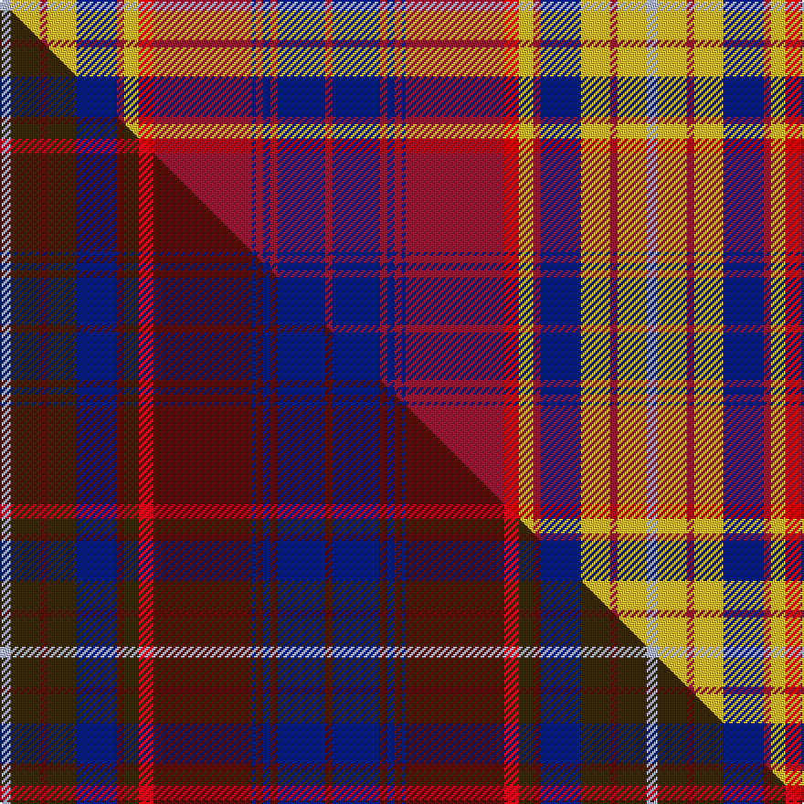

This is one **variant** — a specific cloth: this exact thread count and colourway, with its own
provenance below. It is one weaving of the [sett](/tartans/s/st/strathdon-2/) (the scale-free proportion — the
same cloth at any scale or shade), whose colour order is pattern [RBRBRBRRYRBYRYW](/stripes/rbrbrbrryrbyryw/).

Part of the [Strathdon](/tartans/s/st/strathdon-2/) tartan — the named design grouping this sett with its other cloths.

Sourced from tartans-authority.  It is a [15 stripe tartan](/stripes/stripes15/).

Original link <code>http://www.tartansauthority.com/tartan-ferret/display/10117/</code> — retired · [Internet Archive copy](https://web.archive.org/web/*/http://www.tartansauthority.com/tartan-ferret/display/10117/*)

Dataset <small>— provenance for this record, inherited from the source manifest</small>

<dl class="dataset-prov">
<dt>source</dt><dd><a href="/sources/tartans-authority/">Scottish Tartans Authority</a></dd>
<dt>data captured from</dt><dd><a href="https://github.com/thetartan/tartan-database/blob/master/data/tartans-authority/data.csv">https://github.com/thetartan/tartan-database/blob/master/data/tartans-authority/data.csv</a></dd>
<dt>data date</dt><dd>26th Nov. 2009 <small>(this record)</small></dd>
<dt>licence</dt><dd><a href="https://creativecommons.org/licenses/by-nc-nd/4.0/">CC BY-NC-ND 4.0</a></dd>
</dl>

Capture chain <small>— the hands this data passed through, oldest first; each capture carries its own licence</small>

<ol class="capture-chain">
<li><a href="https://www.tartansauthority.com/">Scottish Tartans Authority</a> <small>the heritage body’s archive — its tartan-ferret record browser is retired; dead record links are shown unlinked, with an Internet Archive copy (ITI numbers are not SRT references)</small></li>
<li><a href="https://github.com/thetartan/tartan-database">thetartan/tartan-database</a> <small>2016-2017</small> · <a href="https://creativecommons.org/licenses/by-nc-nd/4.0/">CC BY-NC-ND 4.0</a> <small>Levko Kravets's frozen compilation — the capture we vendored, and where its CC licence text came from</small></li>
<li>this dictionary <small>captured 2026-06-10 · commit 5bf86c7566</small> <small>each re-capture is a git commit to data/sources</small></li>
</ol>

## Register references

External register numbers recorded for this tartan.

- Scottish Register of Tartans: [10117](https://www.tartanregister.gov.uk/tartanDetails?ref=10117)
- Scottish Tartans Authority (ITI): 10117

## Thread count
LB/6 LY16 R4 LY16 DB22 R4 LY8 Ri8 R54 DB2 R4 DB4 R4 DB26 R/4

One full sett is **354 threads**.

## Palette
<table><thead><tr><th>Colour</th><th>Shade</th><th>OKLCh</th></tr></thead><tbody><tr><td>DB</td><td><code style="background-color:#082077;">#082077</code> <small style="color:#888">#082077</small></td><td><small style="color:#888">oklch(30.0% 0.149 265.1)</small></td></tr><tr><td>R</td><td><code style="background-color:#901C38;">#901C38</code> <small style="color:#888">#901C38</small></td><td><small style="color:#888">oklch(43.2% 0.150 13.1)</small></td></tr><tr><td>LY</td><td><code style="background-color:#DCBC32;">#DCBC32</code> <small style="color:#888">#DCBC32</small></td><td><small style="color:#888">oklch(80.0% 0.150 95.2)</small></td></tr><tr><td>LB</td><td><code style="background-color:#B5BBDE;">#B5BBDE</code> <small style="color:#888">#B5BBDE</small></td><td><small style="color:#888">oklch(79.9% 0.050 277.6)</small></td></tr><tr><td>R</td><td><code style="background-color:#C80000;">#C80000</code> <small style="color:#888">#C80000</small></td><td><small style="color:#888">oklch(52.3% 0.215 29.2)</small></td></tr></tbody></table>

# Sample pattern

## Compared to the master

This cloth is one sett of its design; the master sett (the exemplar the design is anchored on) is below for comparison.

Its **ΔTartan distance** from the master is **0.21** — the same measure the nearest-tartans table ranks by (0 is identical; a re-scale of the same cloth is near 0, a recolour or a different proportion further).

<figure class="master-compare" style="margin:0">

this sett
master sett ★

<figcaption style="color:#888;font-size:smaller">One weave of this sett against the <a href="/setts/lb3dy8dr2dy8db11dr2dy4r4dr27db1dr2db2dr2db13dr2/">master sett ★</a>, split on the diagonal: a shared proportion runs seamlessly across it with only the shades shifting; a different proportion breaks on it.</figcaption>
</figure>

## Nearest tartan variants

The nearest existing variants by ΔTartan distance, with this cloth at the top so the swatches line up against it.

ΔTartan

Threads

Variant

Sett

—

354

<a href="/variants/s15/lb3ly8r2ly8db11r2ly4ri4r27db1r2db2r2db13r2~x2~r1706009-ri2109032/">Strathdon (District?)</a>

<a href="/ttd/edit/#slug=ri6r3ri6db22ri7r2w1ri2db2ri2w1r2ri7g22ri7g2ri2r2~x2~ri2109032-r1807008&amp;base=lb3ly8r2ly8db11r2ly4ri4r27db1r2db2r2db13r2~x2~r1706009-ri2109032" title="compare in the TTD">1.84</a>

376

<a href="/variants/s18/ri6r3ri6db22ri7r2w1ri2db2ri2w1r2ri7g22ri7g2ri2r2~x2~ri2109032-r1807008/">MacColl Hunting</a>

<a href="/ttd/edit/#slug=ri7r3ri6db26ri8b2ri2db2ri2g1r2ri8g26ri8g2ri2r2~x2~ri2008029-r1707016&amp;base=lb3ly8r2ly8db11r2ly4ri4r27db1r2db2r2db13r2~x2~r1706009-ri2109032" title="compare in the TTD">2.10</a>

418

<a href="/variants/s17/ri7r3ri6db26ri8b2ri2db2ri2g1r2ri8g26ri8g2ri2r2~x2~ri2008029-r1707016/">MacColl, Ancient</a>

<a href="/ttd/edit/#slug=r16w1db6w1r6w1db32w1r24b1g16b1r4b1g6b1r4w1db6w1r16~x2&amp;base=lb3ly8r2ly8db11r2ly4ri4r27db1r2db2r2db13r2~x2~r1706009-ri2109032" title="compare in the TTD">2.33</a>

520

<a href="/variants/s21/r16w1db6w1r6w1db32w1r24b1g16b1r4b1g6b1r4w1db6w1r16~x2/">MacDonald of Boisdale</a>

<a href="/ttd/edit/#slug=r16w1db6w1r6w1db32w1r24g1dg16g1r4g1dg6g1r4w1db6w1r16~x2~g2408144-dg1806142&amp;base=lb3ly8r2ly8db11r2ly4ri4r27db1r2db2r2db13r2~x2~r1706009-ri2109032" title="compare in the TTD">2.37</a>

520

<a href="/variants/s21/r16w1db6w1r6w1db32w1r24g1dg16g1r4g1dg6g1r4w1db6w1r16~x2~g2408144-dg1806142/">MacDonald of Boisdale Clan Tartan</a>

<a href="/ttd/edit/#slug=lb33dy22db4dy22r3m2r3m2r3m2r3m2r3m2r3m2r3dy22db4~x2~r2510029-m2610337&amp;base=lb3ly8r2ly8db11r2ly4ri4r27db1r2db2r2db13r2~x2~r1706009-ri2109032" title="compare in the TTD">2.41</a>

486

<a href="/variants/s19/lb33dy22db4dy22r3m2r3m2r3m2r3m2r3m2r3m2r3dy22db4~x2~r2510029-m2610337/">Commonwealth Games Scotland, Team Scotland 2014</a>

<a href="/ttd/edit/#slug=r16lr1db7lr1r6lr1db34lr1r26g1dg16g1r4g1dg7g1r4lr1db7lr1r16~x2~g2408144-dg1806142&amp;base=lb3ly8r2ly8db11r2ly4ri4r27db1r2db2r2db13r2~x2~r1706009-ri2109032" title="compare in the TTD">2.46</a>

548

<a href="/variants/s21/r16lr1db7lr1r6lr1db34lr1r26g1dg16g1r4g1dg7g1r4lr1db7lr1r16~x2~g2408144-dg1806142/">MacDonald of Boisdale</a>

<a href="/ttd/edit/#slug=g28r2lb2r18db9r9lb9y1r3~x2&amp;base=lb3ly8r2ly8db11r2ly4ri4r27db1r2db2r2db13r2~x2~r1706009-ri2109032" title="compare in the TTD">2.47</a>

262

<a href="/variants/s9/g28r2lb2r18db9r9lb9y1r3~x2/">Unidentified Scarlett #10</a>

<a href="/ttd/edit/#slug=ri7r3ri6db26ri8r2ri2db2ri2g1r2ri8g26ri8g2ri2r2~x2~ri2209032-r1707016&amp;base=lb3ly8r2ly8db11r2ly4ri4r27db1r2db2r2db13r2~x2~r1706009-ri2109032" title="compare in the TTD">2.52</a>

418

<a href="/variants/s17/ri7r3ri6db26ri8r2ri2db2ri2g1r2ri8g26ri8g2ri2r2~x2~ri2209032-r1707016/">MacColl Ancient</a>

<a href="/ttd/edit/#slug=r16db2r2db2r2db16g16dy1r16db16r2n2~x2&amp;base=lb3ly8r2ly8db11r2ly4ri4r27db1r2db2r2db13r2~x2~r1706009-ri2109032" title="compare in the TTD">2.63</a>

336

<a href="/variants/s12/r16db2r2db2r2db16g16dy1r16db16r2n2~x2/">Army Medical Services</a>

<a href="/ttd/edit/#slug=ri6r3ri6db22ri7r2w1ri2db2ri2w1r2ri7dg22ri7dg2ri2r2~x2~ri2008029-r1707016&amp;base=lb3ly8r2ly8db11r2ly4ri4r27db1r2db2r2db13r2~x2~r1706009-ri2109032" title="compare in the TTD">2.70</a>

376

<a href="/variants/s18/ri6r3ri6db22ri7r2w1ri2db2ri2w1r2ri7dg22ri7dg2ri2r2~x2~ri2008029-r1707016/">MacColl, hunting</a>

## Neighbour map

Every grey dot is one of 13656 variants placed by the first two principal components of the ΔTartan feature space (42% of its variance). Red is this tartan; blue dots are its nearest — click one to open its page. The map is a flat projection of a many-dimensional space — [how to read it](/posts/neighbourhood-maps/).

<svg viewBox="0 0 640 380" role="img" style="max-width:100%;height:auto;border:1px solid #e0e0e0;border-radius:4px;display:block" xmlns="http://www.w3.org/2000/svg"><image href="/nn/cloud.v1.png" width="640" height="380"/><a href="/variants/s18/ri6r3ri6db22ri7r2w1ri2db2ri2w1r2ri7g22ri7g2ri2r2~x2~ri2109032-r1807008/"><circle cx="218.8" cy="102.8" r="4" fill="#3465a4"><title>MacColl Hunting</title></circle></a><a href="/variants/s17/ri7r3ri6db26ri8b2ri2db2ri2g1r2ri8g26ri8g2ri2r2~x2~ri2008029-r1707016/"><circle cx="236.5" cy="100.4" r="4" fill="#3465a4"><title>MacColl, Ancient</title></circle></a><a href="/variants/s21/r16w1db6w1r6w1db32w1r24b1g16b1r4b1g6b1r4w1db6w1r16~x2/"><circle cx="264.6" cy="70.8" r="4" fill="#3465a4"><title>MacDonald of Boisdale</title></circle></a><a href="/variants/s21/r16w1db6w1r6w1db32w1r24g1dg16g1r4g1dg6g1r4w1db6w1r16~x2~g2408144-dg1806142/"><circle cx="266.4" cy="71.2" r="4" fill="#3465a4"><title>MacDonald of Boisdale Clan Tartan</title></circle></a><a href="/variants/s19/lb33dy22db4dy22r3m2r3m2r3m2r3m2r3m2r3m2r3dy22db4~x2~r2510029-m2610337/"><circle cx="221.6" cy="94.5" r="4" fill="#3465a4"><title>Commonwealth Games Scotland, Team Scotland 2014</title></circle></a><a href="/variants/s21/r16lr1db7lr1r6lr1db34lr1r26g1dg16g1r4g1dg7g1r4lr1db7lr1r16~x2~g2408144-dg1806142/"><circle cx="273.8" cy="70.9" r="4" fill="#3465a4"><title>MacDonald of Boisdale</title></circle></a><a href="/variants/s9/g28r2lb2r18db9r9lb9y1r3~x2/"><circle cx="243.1" cy="114.4" r="4" fill="#3465a4"><title>Unidentified Scarlett #10</title></circle></a><a href="/variants/s17/ri7r3ri6db26ri8r2ri2db2ri2g1r2ri8g26ri8g2ri2r2~x2~ri2209032-r1707016/"><circle cx="244.9" cy="109.5" r="4" fill="#3465a4"><title>MacColl Ancient</title></circle></a><a href="/variants/s12/r16db2r2db2r2db16g16dy1r16db16r2n2~x2/"><circle cx="228.2" cy="147.8" r="4" fill="#3465a4"><title>Army Medical Services</title></circle></a><a href="/variants/s18/ri6r3ri6db22ri7r2w1ri2db2ri2w1r2ri7dg22ri7dg2ri2r2~x2~ri2008029-r1707016/"><circle cx="237.2" cy="107.0" r="4" fill="#3465a4"><title>MacColl, hunting</title></circle></a><circle cx="222.7" cy="100.6" r="5" fill="#c00000"/><text x="320" y="376" text-anchor="middle" font-size="11" fill="#999">ground</text><text x="11" y="190" text-anchor="middle" font-size="11" fill="#999" transform="rotate(-90 11 190)">complexity</text></svg>

ID: /variants/s15/lb3ly8r2ly8db11r2ly4ri4r27db1r2db2r2db13r2~x2~r1706009-ri2109032/
