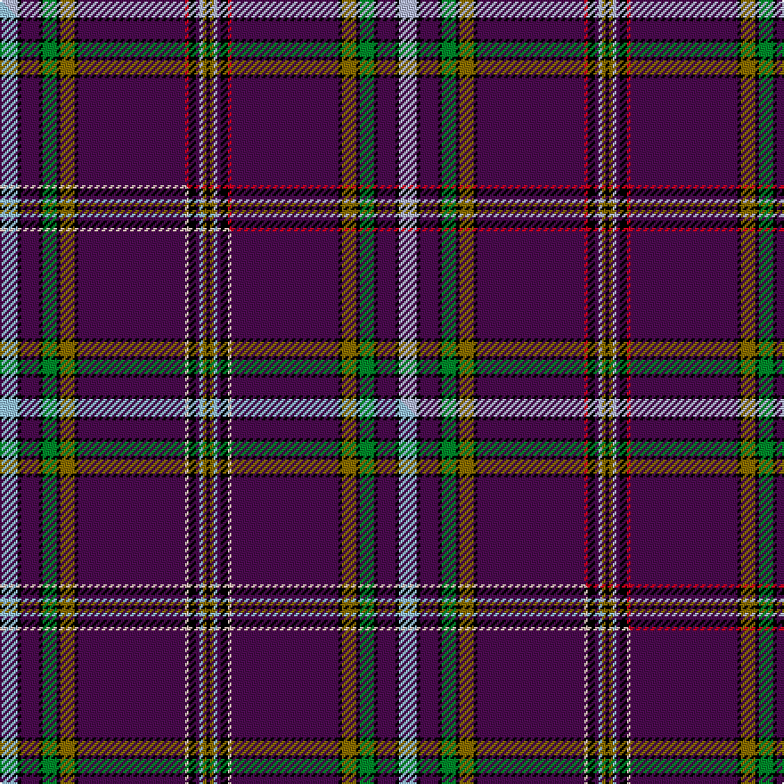

This page is one **sett** — a single exact thread-count. It belongs to the [tartan](/setts/lb5k1dp5k1g4k1y4k1dp30r1k2dp1lb1y1k1/)
(the same proportion at any scale), whose colour order is pattern [KGWBKRBKGKGKBKW](/stripes/kgwbkrbkgkgkbkw/).

Part of the [House of Holland](/tartans/house-of-holland/) tartan — the named design grouping this sett with its other cloths.

Sourced from tartans-authority.  It is a [15 stripe tartan](/stripes/stripes15/).

Original link https://www.tartanregister.gov.uk/tartanDetails.aspx?ref=7540

Dataset <small>— provenance for this record, inherited from the source manifest</small>

<dl class="dataset-prov">
<dt>source</dt><dd><a href="/sources/tartans-authority/">Scottish Tartans Authority</a></dd>
<dt>data captured from</dt><dd><a href="https://github.com/thetartan/tartan-database/blob/master/data/tartans-authority/data.csv">https://github.com/thetartan/tartan-database/blob/master/data/tartans-authority/data.csv</a></dd>
<dt>data date</dt><dd>2007 <small>(this record)</small></dd>
<dt>licence</dt><dd><a href="https://creativecommons.org/licenses/by-nc-nd/4.0/">CC BY-NC-ND 4.0</a></dd>
</dl>

Capture chain <small>— the hands this data passed through, oldest first; each capture carries its own licence</small>

<ol class="capture-chain">
<li><a href="https://www.tartansauthority.com/">Scottish Tartans Authority</a> <small>the heritage body's archive — its tartan-ferret record browser is retired (links repaired to the SRT, above)</small></li>
<li><a href="https://github.com/thetartan/tartan-database">thetartan/tartan-database</a> <small>2016-2017</small> · <a href="https://creativecommons.org/licenses/by-nc-nd/4.0/">CC BY-NC-ND 4.0</a> <small>Levko Kravets's frozen compilation — the capture we vendored, and where its CC licence text came from</small></li>
<li>this dictionary <small>captured 2026-06-10 · commit 5bf86c7566</small> <small>each re-capture is a git commit to data/sources</small></li>
</ol>

## Register references

External register numbers recorded for this tartan.

- Scottish Tartans Authority (ITI): 7540

## Thread count
LB/10 K2 DP10 K2 G8 K2 Y8 K2 DP60 R2 K4 DP2 LB2 Y2 K/2

One full sett is **224 threads**.

## Palette
<table><thead><tr><th>Colour</th><th>Shade</th><th>OKLCh</th></tr></thead><tbody><tr><td>G</td><td><code style="background-color:#008B2A;">#008B2A</code> <small style="color:#888">#008B2A</small></td><td><small style="color:#888">oklch(55.4% 0.170 145.9)</small></td></tr><tr><td>K</td><td><code style="background-color:#000000;">#000000</code> <small style="color:#888">#000000</small></td><td><small style="color:#888">oklch(0.0% 0.000 0.0)</small></td></tr><tr><td>LB</td><td><code style="background-color:#B5BBDE;">#B5BBDE</code> <small style="color:#888">#B5BBDE</small></td><td><small style="color:#888">oklch(79.9% 0.050 277.6)</small></td></tr><tr><td>R</td><td><code style="background-color:#D60020;">#D60020</code> <small style="color:#888">#D60020</small></td><td><small style="color:#888">oklch(55.2% 0.224 25.5)</small></td></tr><tr><td>DP</td><td><code style="background-color:#4B0B4F;">#4B0B4F</code> <small style="color:#888">#4B0B4F</small></td><td><small style="color:#888">oklch(30.1% 0.125 325.4)</small></td></tr><tr><td>Y</td><td><code style="background-color:#8B6E00;">#8B6E00</code> <small style="color:#888">#8B6E00</small></td><td><small style="color:#888">oklch(55.1% 0.113 90.4)</small></td></tr></tbody></table>

# Sample pattern

## Compared to the master

This cloth is one sett of its design; the master sett (the exemplar the design is anchored on) is below for comparison.

Its **ΔTartan distance** from the master is **0.02** — the same measure the nearest-tartans table ranks by (0 is identical; a re-scale of the same cloth is near 0, a recolour or a different proportion further).

<figure class="master-compare" style="margin:0">

this sett
master sett ★

<figcaption style="color:#888;font-size:smaller">One weave of this sett against the <a href="/setts/lb5k1dp5k1g4k1y4k1dp30lbi1k2dp1lb1y1k1/">master sett ★</a>, split on the diagonal: a shared proportion runs seamlessly across it with only the shades shifting; a different proportion breaks on it.</figcaption>
</figure>

## Nearest tartan variants

The nearest existing variants by ΔTartan distance, with this cloth at the top so the swatches line up against it.

ΔTartan

Threads

Variant

Sett

—

224

<a href="/variants/s15/lb5k1dp5k1g4k1y4k1dp30r1k2dp1lb1y1k1~x2/">House of Holland (Fashion)</a>

<a href="/ttd/edit/#slug=lb5k1dp5k1g4k1y4k1dp30lbi1k2dp1lb1y1k1~x2~lb3203246-lbi3402028&amp;base=lb5k1dp5k1g4k1y4k1dp30r1k2dp1lb1y1k1~x2" title="compare in the TTD">0.02</a>

224

<a href="/variants/s15/lb5k1dp5k1g4k1y4k1dp30lbi1k2dp1lb1y1k1~x2~lb3203246-lbi3402028/">House of Holland</a>

<a href="/ttd/edit/#slug=lb32db12k2y2k2db2lb8dr63k2r2dr9~x2&amp;base=lb5k1dp5k1g4k1y4k1dp30r1k2dp1lb1y1k1~x2" title="compare in the TTD">2.22</a>

462

<a href="/variants/s11/lb32db12k2y2k2db2lb8dr63k2r2dr9~x2/">Kirk in the Hills Corporate Tartan</a>

<a href="/ttd/edit/#slug=dp60g4dp4g4dp4k14r2k5r3k3r4k2r5w3~x2&amp;base=lb5k1dp5k1g4k1y4k1dp30r1k2dp1lb1y1k1~x2" title="compare in the TTD">2.24</a>

342

<a href="/variants/s14/dp60g4dp4g4dp4k14r2k5r3k3r4k2r5w3~x2/">Arran (Strathmore)</a>

<a href="/ttd/edit/#slug=dp60lo2dp10k9lb2k2t2k2y28lo3~x2&amp;base=lb5k1dp5k1g4k1y4k1dp30r1k2dp1lb1y1k1~x2" title="compare in the TTD">2.48</a>

354

<a href="/variants/s10/dp60lo2dp10k9lb2k2t2k2y28lo3~x2/">Wcwm 9275-1510-5</a>

<a href="/ttd/edit/#slug=dp25lb1w1k1y1dp3w1y5dp4k1lb2dp2w1lb1w1dp2lb2dp2k2w5~x2&amp;base=lb5k1dp5k1g4k1y4k1dp30r1k2dp1lb1y1k1~x2" title="compare in the TTD">3.15</a>

192

<a href="/variants/s20/dp25lb1w1k1y1dp3w1y5dp4k1lb2dp2w1lb1w1dp2lb2dp2k2w5~x2/">Lions</a>

<a href="/ttd/edit/#slug=dp27y2k3ly2k2w2k2n6dp3k2dp2w2~x2&amp;base=lb5k1dp5k1g4k1y4k1dp30r1k2dp1lb1y1k1~x2" title="compare in the TTD">3.19</a>

162

<a href="/variants/s12/dp27y2k3ly2k2w2k2n6dp3k2dp2w2~x2/">Stevens #4</a>

<a href="/ttd/edit/#slug=db74r6k12y3k3w3r16db8k3r4w3~x2&amp;base=lb5k1dp5k1g4k1y4k1dp30r1k2dp1lb1y1k1~x2" title="compare in the TTD">3.23</a>

386

<a href="/variants/s11/db74r6k12y3k3w3r16db8k3r4w3~x2/">Suffolk County Police (Corporate)</a>

<a href="/ttd/edit/#slug=r2k34w2k2n27g1n2k3n2y1n2r2~x2~k0504259&amp;base=lb5k1dp5k1g4k1y4k1dp30r1k2dp1lb1y1k1~x2" title="compare in the TTD">3.37</a>

312

<a href="/variants/s12/r2k34w2k2n27g1n2k3n2y1n2r2~x2~k0504259/">Hudson's Bay Company</a>

<a href="/ttd/edit/#slug=db72r11k12y2r2w3r2k2r10g18r10k3r3w2~x2&amp;base=lb5k1dp5k1g4k1y4k1dp30r1k2dp1lb1y1k1~x2" title="compare in the TTD">3.44</a>

460

<a href="/variants/s14/db72r11k12y2r2w3r2k2r10g18r10k3r3w2~x2/">Unidentified Specimen</a>

<a href="/ttd/edit/#slug=db20y1o1db3k1n2k1r10k1n2r4~x2&amp;base=lb5k1dp5k1g4k1y4k1dp30r1k2dp1lb1y1k1~x2" title="compare in the TTD">3.44</a>

136

<a href="/variants/s11/db20y1o1db3k1n2k1r10k1n2r4~x2/">Blais</a>

## Neighbour map

Every grey dot is one of 13620 variants placed by the first two principal components of the ΔTartan feature space (42% of its variance). Red is this tartan; blue dots are its nearest — click one to open its page.

<svg viewBox="0 0 640 380" role="img" style="max-width:100%;height:auto;border:1px solid #e0e0e0;border-radius:4px;display:block" xmlns="http://www.w3.org/2000/svg"><image href="/nn/cloud.v1.png" width="640" height="380"/><a href="/variants/s15/lb5k1dp5k1g4k1y4k1dp30lbi1k2dp1lb1y1k1~x2~lb3203246-lbi3402028/"><circle cx="310.2" cy="29.2" r="4" fill="#3465a4"><title>House of Holland</title></circle></a><a href="/variants/s11/lb32db12k2y2k2db2lb8dr63k2r2dr9~x2/"><circle cx="288.0" cy="24.4" r="4" fill="#3465a4"><title>Kirk in the Hills Corporate Tartan</title></circle></a><a href="/variants/s14/dp60g4dp4g4dp4k14r2k5r3k3r4k2r5w3~x2/"><circle cx="318.3" cy="45.0" r="4" fill="#3465a4"><title>Arran (Strathmore)</title></circle></a><a href="/variants/s10/dp60lo2dp10k9lb2k2t2k2y28lo3~x2/"><circle cx="319.6" cy="64.8" r="4" fill="#3465a4"><title>Wcwm 9275-1510-5</title></circle></a><a href="/variants/s20/dp25lb1w1k1y1dp3w1y5dp4k1lb2dp2w1lb1w1dp2lb2dp2k2w5~x2/"><circle cx="289.7" cy="40.0" r="4" fill="#3465a4"><title>Lions</title></circle></a><a href="/variants/s12/dp27y2k3ly2k2w2k2n6dp3k2dp2w2~x2/"><circle cx="259.5" cy="79.0" r="4" fill="#3465a4"><title>Stevens #4</title></circle></a><a href="/variants/s11/db74r6k12y3k3w3r16db8k3r4w3~x2/"><circle cx="319.6" cy="68.5" r="4" fill="#3465a4"><title>Suffolk County Police (Corporate)</title></circle></a><a href="/variants/s12/r2k34w2k2n27g1n2k3n2y1n2r2~x2~k0504259/"><circle cx="278.6" cy="48.9" r="4" fill="#3465a4"><title>Hudson's Bay Company</title></circle></a><a href="/variants/s14/db72r11k12y2r2w3r2k2r10g18r10k3r3w2~x2/"><circle cx="226.3" cy="34.0" r="4" fill="#3465a4"><title>Unidentified Specimen</title></circle></a><a href="/variants/s11/db20y1o1db3k1n2k1r10k1n2r4~x2/"><circle cx="250.2" cy="82.3" r="4" fill="#3465a4"><title>Blais</title></circle></a><circle cx="313.7" cy="28.8" r="5" fill="#c00000"/><text x="320" y="376" text-anchor="middle" font-size="11" fill="#999">ground</text><text x="11" y="190" text-anchor="middle" font-size="11" fill="#999" transform="rotate(-90 11 190)">complexity</text></svg>

ID: /variants/s15/lb5k1dp5k1g4k1y4k1dp30r1k2dp1lb1y1k1~x2/
