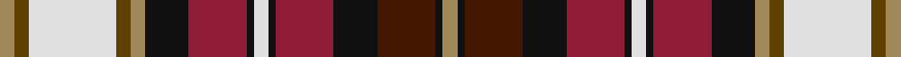

This page is one **sett** — a single exact thread-count. It belongs to the [tartan](/setts/lo2dy2w12dy2lo2k6r8k1w2k1r8k6do8k1lo2/)
(the same proportion at any scale), whose colour order is pattern [YGWGYKRKWKRKBKY](/stripes/ygwgykrkwkrkbky/).

Part of the [Dunkeld](/tartans/dunkeld/) tartan — the named design grouping this sett with its other cloths.

Sourced from register-of-tartans.  It is a [15 stripe tartan](/stripes/stripes15/).

Original link https://www.tartanregister.gov.uk/tartanDetails.aspx?ref=1044

2 attestations — the source records this cloth was collapsed from (oldest owns this page)

<ul>
<li>01/01/1979 — Dunkeld (register-of-tartans, <a href="https://www.tartanregister.gov.uk/tartanDetails.aspx?ref=1044">record</a>)</li>
<li>pre 1998 — Dunkeld (Fashion) (tartans-authority, <a href="http://www.tartansauthority.com/tartan-ferret/display/2423/">record</a>)</li>
</ul>

## Register references

External register numbers recorded for this tartan.

- Scottish Register of Tartans: [1044](https://www.tartanregister.gov.uk/tartanDetails.aspx?ref=1044)
- Scottish Tartans Authority (ITI): 2423
- Scottish Tartans World Register: 2423

## Thread count
LT/4 T4 LN24 T4 LT4 K12 DRa16 K2 LN4 K2 DRa16 K12 DR16 K2 LT/4

One full sett is **244 threads**.

## Palette

Palette: <strong>Tartan Register</strong>
<table><thead><tr><th>Colour</th><th>Threads</th><th>Shade</th><th>Base</th><th>OKLCh</th></tr></thead><tbody><tr><td>LT/</td><td style="text-align:right;font-variant-numeric:tabular-nums">4</td><td><code style="background-color:#A08858;">#A08858</code> <small style="color:#888">#A08858</small></td><td>Y <code style="background-color:#F2BF00;">#F2BF00</code></td><td><small style="color:#888">oklch(63.7% 0.071 84.0)</small></td></tr><tr><td>T</td><td style="text-align:right;font-variant-numeric:tabular-nums">4</td><td><code style="background-color:#604000;">#604000</code> <small style="color:#888">#604000</small></td><td>G <code style="background-color:#006100;">#006100</code></td><td><small style="color:#888">oklch(39.8% 0.083 76.8)</small></td></tr><tr><td>LN</td><td style="text-align:right;font-variant-numeric:tabular-nums">24</td><td><code style="background-color:#E0E0E0;">#E0E0E0</code> <small style="color:#888">#E0E0E0</small></td><td>W <code style="background-color:#F7F7F7;">#F7F7F7</code></td><td><small style="color:#888">oklch(90.7% 0.000 89.9)</small></td></tr><tr><td>T</td><td style="text-align:right;font-variant-numeric:tabular-nums">4</td><td><code style="background-color:#604000;">#604000</code> <small style="color:#888">#604000</small></td><td>G <code style="background-color:#006100;">#006100</code></td><td><small style="color:#888">oklch(39.8% 0.083 76.8)</small></td></tr><tr><td>LT</td><td style="text-align:right;font-variant-numeric:tabular-nums">4</td><td><code style="background-color:#A08858;">#A08858</code> <small style="color:#888">#A08858</small></td><td>Y <code style="background-color:#F2BF00;">#F2BF00</code></td><td><small style="color:#888">oklch(63.7% 0.071 84.0)</small></td></tr><tr><td>K</td><td style="text-align:right;font-variant-numeric:tabular-nums">12</td><td><code style="background-color:#101010;">#101010</code> <small style="color:#888">#101010</small></td><td>K <code style="background-color:#000000;">#000000</code></td><td><small style="color:#888">oklch(17.3% 0.000 89.9)</small></td></tr><tr><td>DRa</td><td style="text-align:right;font-variant-numeric:tabular-nums">16</td><td><code style="background-color:#901C38;">#901C38</code> <small style="color:#888">#901C38</small></td><td>R <code style="background-color:#CC0000;">#CC0000</code></td><td><small style="color:#888">oklch(43.2% 0.150 13.1)</small></td></tr><tr><td>K</td><td style="text-align:right;font-variant-numeric:tabular-nums">2</td><td><code style="background-color:#101010;">#101010</code> <small style="color:#888">#101010</small></td><td>K <code style="background-color:#000000;">#000000</code></td><td><small style="color:#888">oklch(17.3% 0.000 89.9)</small></td></tr><tr><td>LN</td><td style="text-align:right;font-variant-numeric:tabular-nums">4</td><td><code style="background-color:#E0E0E0;">#E0E0E0</code> <small style="color:#888">#E0E0E0</small></td><td>W <code style="background-color:#F7F7F7;">#F7F7F7</code></td><td><small style="color:#888">oklch(90.7% 0.000 89.9)</small></td></tr><tr><td>K</td><td style="text-align:right;font-variant-numeric:tabular-nums">2</td><td><code style="background-color:#101010;">#101010</code> <small style="color:#888">#101010</small></td><td>K <code style="background-color:#000000;">#000000</code></td><td><small style="color:#888">oklch(17.3% 0.000 89.9)</small></td></tr><tr><td>DRa</td><td style="text-align:right;font-variant-numeric:tabular-nums">16</td><td><code style="background-color:#901C38;">#901C38</code> <small style="color:#888">#901C38</small></td><td>R <code style="background-color:#CC0000;">#CC0000</code></td><td><small style="color:#888">oklch(43.2% 0.150 13.1)</small></td></tr><tr><td>K</td><td style="text-align:right;font-variant-numeric:tabular-nums">12</td><td><code style="background-color:#101010;">#101010</code> <small style="color:#888">#101010</small></td><td>K <code style="background-color:#000000;">#000000</code></td><td><small style="color:#888">oklch(17.3% 0.000 89.9)</small></td></tr><tr><td>DR</td><td style="text-align:right;font-variant-numeric:tabular-nums">16</td><td><code style="background-color:#441800;">#441800</code> <small style="color:#888">#441800</small></td><td>B <code style="background-color:#2A418A;">#2A418A</code></td><td><small style="color:#888">oklch(27.3% 0.076 46.3)</small></td></tr><tr><td>K</td><td style="text-align:right;font-variant-numeric:tabular-nums">2</td><td><code style="background-color:#101010;">#101010</code> <small style="color:#888">#101010</small></td><td>K <code style="background-color:#000000;">#000000</code></td><td><small style="color:#888">oklch(17.3% 0.000 89.9)</small></td></tr><tr><td>LT/</td><td style="text-align:right;font-variant-numeric:tabular-nums">4</td><td><code style="background-color:#A08858;">#A08858</code> <small style="color:#888">#A08858</small></td><td>Y <code style="background-color:#F2BF00;">#F2BF00</code></td><td><small style="color:#888">oklch(63.7% 0.071 84.0)</small></td></tr></tbody></table>

## Nearest tartans

The nearest existing variants by ΔTartan distance, with this tartan at the top so the swatches line up against it.

ΔTartan

Tartan

Sett

—

<a href="/ttd/edit/#slug=lo2dy2w12dy2lo2k6r8k1w2k1r8k6do8k1lo2~x2">Dunkeld</a> <a class="nn-out" href="/variants/s15/lo2dy2w12dy2lo2k6r8k1w2k1r8k6do8k1lo2~x2/" title="open its dictionary page">↗</a>

0.61

<a href="/ttd/edit/#slug=o4oi3w24oi4o4k12m16k2w4k2m16k12dr16k2o4&amp;base=lo2dy2w12dy2lo2k6r8k1w2k1r8k6do8k1lo2~x2">Dunkeld</a> <a class="nn-out" href="/variants/s15/o4oi3w24oi4o4k12m16k2w4k2m16k12dr16k2o4/" title="open its dictionary page">↗</a>

0.70

<a href="/variants/s16/r26t7dp8ly3r3w3g20dp10w2~x2/">Wilson's No.227</a>

0.73

<a href="/ttd/edit/#slug=ly2r15ly3m2ly3k14ly2db6w2db6ly2r7db10w1~x2&amp;base=lo2dy2w12dy2lo2k6r8k1w2k1r8k6do8k1lo2~x2">Dalrymple of Castleton Portrait Tartan</a> <a class="nn-out" href="/variants/s14/ly2r15ly3m2ly3k14ly2db6w2db6ly2r7db10w1~x2/" title="open its dictionary page">↗</a>

0.73

<a href="/ttd/edit/#slug=ly2r15ly3ri2ly3k14ly2db6w2db6ly2r7db10w1~x2&amp;base=lo2dy2w12dy2lo2k6r8k1w2k1r8k6do8k1lo2~x2">Dalrymple, of Castleton</a> <a class="nn-out" href="/variants/s14/ly2r15ly3ri2ly3k14ly2db6w2db6ly2r7db10w1~x2/" title="open its dictionary page">↗</a>

0.88

<a href="/ttd/edit/#slug=db12r3db9r4ly1r4ly2r5dy3w5dy6w2dg7r2dg13r7~x2&amp;base=lo2dy2w12dy2lo2k6r8k1w2k1r8k6do8k1lo2~x2">Riley-Utter Union (Personal)</a> <a class="nn-out" href="/variants/s16/db12r3db9r4ly1r4ly2r5dy3w5dy6w2dg7r2dg13r7~x2/" title="open its dictionary page">↗</a>

0.93

<a href="/ttd/edit/#slug=r8k8r3k1lo15k3lo3o15b2o2y10o2b1y3b8y8~x2&amp;base=lo2dy2w12dy2lo2k6r8k1w2k1r8k6do8k1lo2~x2">Du Lion</a> <a class="nn-out" href="/variants/s16/r8k8r3k1lo15k3lo3o15b2o2y10o2b1y3b8y8~x2/" title="open its dictionary page">↗</a>

0.95

<a href="/ttd/edit/#slug=lo2r15lo3dr2lo3k14lo2t6w2t6lo2r7t10w1~x2&amp;base=lo2dy2w12dy2lo2k6r8k1w2k1r8k6do8k1lo2~x2">Dalrymple of Castleton</a> <a class="nn-out" href="/variants/s14/lo2r15lo3dr2lo3k14lo2t6w2t6lo2r7t10w1~x2/" title="open its dictionary page">↗</a>

0.95

<a href="/ttd/edit/#slug=dg6k1db4k1ly6k1ly6k1db4k1r8w1r8k1db4k1dg6db4~x4&amp;base=lo2dy2w12dy2lo2k6r8k1w2k1r8k6do8k1lo2~x2">Buchanan (Wilson)</a> <a class="nn-out" href="/variants/s18/dg6k1db4k1ly6k1ly6k1db4k1r8w1r8k1db4k1dg6db4~x4/" title="open its dictionary page">↗</a>

0.95

<a href="/ttd/edit/#slug=g6k1db4k1ly6k1ly6k1db4k1r8w1r8k1db4k1g6db4~x2&amp;base=lo2dy2w12dy2lo2k6r8k1w2k1r8k6do8k1lo2~x2">Buchanan Clan Tartan</a> <a class="nn-out" href="/variants/s18/g6k1db4k1ly6k1ly6k1db4k1r8w1r8k1db4k1g6db4~x2/" title="open its dictionary page">↗</a>

0.96

<a href="/ttd/edit/#slug=db23r6db6k10ly3k2w2k2g11r12k2r10w2~x2&amp;base=lo2dy2w12dy2lo2k6r8k1w2k1r8k6do8k1lo2~x2">Prince Albert</a> <a class="nn-out" href="/variants/s13/db23r6db6k10ly3k2w2k2g11r12k2r10w2~x2/" title="open its dictionary page">↗</a>

## Neighbour map

Every grey dot is one of 14360 variants placed by the first two principal components of the ΔTartan feature space (44% of its variance). Red is this tartan; blue dots are its nearest — click one to open its page.

<svg viewBox="0 0 640 380" role="img" style="max-width:100%;height:auto;border:1px solid #e0e0e0;border-radius:4px;display:block" xmlns="http://www.w3.org/2000/svg"><image href="/nn/cloud.v1.png" width="640" height="380"/><a href="/variants/s15/o4oi3w24oi4o4k12m16k2w4k2m16k12dr16k2o4/"><circle cx="45.1" cy="109.2" r="4" fill="#3465a4"><title>Dunkeld</title></circle></a><a href="/variants/s16/r26t7dp8ly3r3w3g20dp10w2~x2/"><circle cx="89.1" cy="111.4" r="4" fill="#3465a4"><title>Wilson's No.227</title></circle></a><a href="/variants/s14/ly2r15ly3m2ly3k14ly2db6w2db6ly2r7db10w1~x2/"><circle cx="93.4" cy="105.2" r="4" fill="#3465a4"><title>Dalrymple of Castleton Portrait Tartan</title></circle></a><a href="/variants/s14/ly2r15ly3ri2ly3k14ly2db6w2db6ly2r7db10w1~x2/"><circle cx="85.0" cy="102.6" r="4" fill="#3465a4"><title>Dalrymple, of Castleton</title></circle></a><a href="/variants/s16/db12r3db9r4ly1r4ly2r5dy3w5dy6w2dg7r2dg13r7~x2/"><circle cx="71.9" cy="128.8" r="4" fill="#3465a4"><title>Riley-Utter Union (Personal)</title></circle></a><a href="/variants/s16/r8k8r3k1lo15k3lo3o15b2o2y10o2b1y3b8y8~x2/"><circle cx="54.7" cy="110.0" r="4" fill="#3465a4"><title>Du Lion</title></circle></a><a href="/variants/s14/lo2r15lo3dr2lo3k14lo2t6w2t6lo2r7t10w1~x2/"><circle cx="94.6" cy="108.4" r="4" fill="#3465a4"><title>Dalrymple of Castleton</title></circle></a><a href="/variants/s18/dg6k1db4k1ly6k1ly6k1db4k1r8w1r8k1db4k1dg6db4~x4/"><circle cx="31.1" cy="130.4" r="4" fill="#3465a4"><title>Buchanan (Wilson)</title></circle></a><a href="/variants/s18/g6k1db4k1ly6k1ly6k1db4k1r8w1r8k1db4k1g6db4~x2/"><circle cx="29.9" cy="130.7" r="4" fill="#3465a4"><title>Buchanan Clan Tartan</title></circle></a><a href="/variants/s13/db23r6db6k10ly3k2w2k2g11r12k2r10w2~x2/"><circle cx="96.0" cy="122.6" r="4" fill="#3465a4"><title>Prince Albert</title></circle></a><circle cx="50.8" cy="112.0" r="5" fill="#c00000"/></svg>

ID: /variants/s15/lo2dy2w12dy2lo2k6r8k1w2k1r8k6do8k1lo2~x2/
