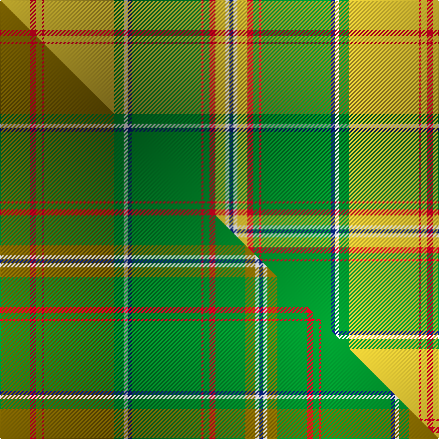

This page is one **sett** — a single exact thread-count. It belongs to the [tartan](/setts/ly15r3ly3r1ly35g5w2db2g35r1g3r3ly5w2db2/)
(the same proportion at any scale), whose colour order is pattern [BWYRGRGBWGYRYRY](/stripes/bwyrgrgbwgyryry/).

Part of the [Keilar](/tartans/keilar/) tartan — the named design grouping this sett with its other cloths.

Sourced from tartans-authority.  It is a [15 stripe tartan](/stripes/stripes15/).

Original link [https://www.tartanregister.gov.uk/tartanDetails.aspx?ref=10853](https://www.tartanregister.gov.uk/tartanDetails.aspx?ref=10853)

Dataset <small>— provenance for this record, inherited from the source manifest</small>

<dl class="dataset-prov">
<dt>source</dt><dd><a href="/sources/tartans-authority/">Scottish Tartans Authority</a></dd>
<dt>data captured from</dt><dd><a href="https://github.com/thetartan/tartan-database/blob/master/data/tartans-authority/data.csv">https://github.com/thetartan/tartan-database/blob/master/data/tartans-authority/data.csv</a></dd>
<dt>data date</dt><dd>pre 2013 <small>(this record)</small></dd>
<dt>licence</dt><dd><a href="https://creativecommons.org/licenses/by-nc-nd/4.0/">CC BY-NC-ND 4.0</a></dd>
</dl>

Capture chain <small>— the hands this data passed through, oldest first; each capture carries its own licence</small>

<ol class="capture-chain">
<li><a href="https://www.tartansauthority.com/">Scottish Tartans Authority</a> <small>the heritage body's archive — its tartan-ferret record browser is retired (links repaired to the SRT, above)</small></li>
<li><a href="https://github.com/thetartan/tartan-database">thetartan/tartan-database</a> <small>2016-2017</small> · <a href="https://creativecommons.org/licenses/by-nc-nd/4.0/">CC BY-NC-ND 4.0</a> <small>Levko Kravets's frozen compilation — the capture we vendored, and where its CC licence text came from</small></li>
<li>this dictionary <small>captured 2026-06-10 · commit 5bf86c7566</small> <small>each re-capture is a git commit to data/sources</small></li>
</ol>

## Register references

External register numbers recorded for this tartan.

- Scottish Register of Tartans: [10853](https://www.tartanregister.gov.uk/tartanDetails?ref=10853)
- Scottish Tartans Authority (ITI): 10853

## Thread count
LY/30 R6 LY6 R2 LY70 G10 W4 DB4 G70 R2 G6 R6 LY10 W4 DB/4

One full sett is **434 threads**.

## Palette
<table><thead><tr><th>Colour</th><th>Shade</th><th>OKLCh</th></tr></thead><tbody><tr><td>DB</td><td><code style="background-color:#082077;">#082077</code> <small style="color:#888">#082077</small></td><td><small style="color:#888">oklch(30.0% 0.149 265.1)</small></td></tr><tr><td>G</td><td><code style="background-color:#008B2A;">#008B2A</code> <small style="color:#888">#008B2A</small></td><td><small style="color:#888">oklch(55.4% 0.170 145.9)</small></td></tr><tr><td>R</td><td><code style="background-color:#D60020;">#D60020</code> <small style="color:#888">#D60020</small></td><td><small style="color:#888">oklch(55.2% 0.224 25.5)</small></td></tr><tr><td>W</td><td><code style="background-color:#F7F7F7;">#F7F7F7</code> <small style="color:#888">#F7F7F7</small></td><td><small style="color:#888">oklch(97.6% 0.000 89.9)</small></td></tr><tr><td>LY</td><td><code style="background-color:#DCBC32;">#DCBC32</code> <small style="color:#888">#DCBC32</small></td><td><small style="color:#888">oklch(80.0% 0.150 95.2)</small></td></tr></tbody></table>

# Sample pattern

## Compared to the master

This cloth is one sett of its design; the master sett (the exemplar the design is anchored on) is below for comparison.

Its **ΔTartan distance** from the master is **1.15** — the same measure the nearest-tartans table ranks by (0 is identical; a re-scale of the same cloth is near 0, a recolour or a different proportion further).

<figure class="master-compare" style="margin:0">

this sett
master sett ★

<figcaption style="color:#888;font-size:smaller">One weave of this sett against the <a href="/setts/y15r3y3r1y35g5w2db2g35r1g3r3g15y5w2db2/">master sett ★</a>, split on the diagonal: a shared proportion runs seamlessly across it with only the shades shifting; a different proportion breaks on it.</figcaption>
</figure>

## Nearest tartan variants

The nearest existing variants by ΔTartan distance, with this cloth at the top so the swatches line up against it.

ΔTartan

Threads

Variant

Sett

—

434

<a href="/variants/s15/ly15r3ly3r1ly35g5w2db2g35r1g3r3ly5w2db2~x2/">Keilar (2013)</a>

<a href="/ttd/edit/#slug=g40ly2r3w2g4ly1r18w1g2ly1t4w1ly3~x2&amp;base=ly15r3ly3r1ly35g5w2db2g35r1g3r3ly5w2db2~x2" title="compare in the TTD">2.58</a>

242

<a href="/variants/s13/g40ly2r3w2g4ly1r18w1g2ly1t4w1ly3~x2/">Morgan Jocelyn . . . (Personal)</a>

<a href="/ttd/edit/#slug=g40dy2r3w2g4dy1r18w1g2dy1db4w1dy3~x2&amp;base=ly15r3ly3r1ly35g5w2db2g35r1g3r3ly5w2db2~x2" title="compare in the TTD">3.43</a>

242

<a href="/variants/s13/g40dy2r3w2g4dy1r18w1g2dy1db4w1dy3~x2/">Morgan Jocelyn Osmélian Peregrine (Personal)</a>

<a href="/ttd/edit/#slug=g56n6ly6y2w2y2w16n10w2g6r3~x2&amp;base=ly15r3ly3r1ly35g5w2db2g35r1g3r3ly5w2db2~x2" title="compare in the TTD">3.55</a>

326

<a href="/variants/s11/g56n6ly6y2w2y2w16n10w2g6r3~x2/">McAleavy (2014)</a>

<a href="/ttd/edit/#slug=g4n4g2ly36n14ly2lb4g7r5ly3~x2&amp;base=ly15r3ly3r1ly35g5w2db2g35r1g3r3ly5w2db2~x2" title="compare in the TTD">3.59</a>

310

<a href="/variants/s10/g4n4g2ly36n14ly2lb4g7r5ly3~x2/">Rikaco Eve (Fashion)</a>

<a href="/ttd/edit/#slug=g21r2w1y3r2g5r21y1ly1y1r1g8~x2~y2405105-ly3307090&amp;base=ly15r3ly3r1ly35g5w2db2g35r1g3r3ly5w2db2~x2" title="compare in the TTD">3.61</a>

210

<a href="/variants/s12/g21r2w1y3r2g5r21y1ly1y1r1g8~x2~y2405105-ly3307090/">Glendronach</a>

<a href="/ttd/edit/#slug=g56lb6ly6lyi2w2lyi2w16lb10w2g6r3~x2~ly3104101-lyi3407090&amp;base=ly15r3ly3r1ly35g5w2db2g35r1g3r3ly5w2db2~x2" title="compare in the TTD">3.70</a>

326

<a href="/variants/s11/g56lb6ly6lyi2w2lyi2w16lb10w2g6r3~x2~ly3104101-lyi3407090/">McAleavy (2014)</a>

## Neighbour map

Every grey dot is one of 13621 variants placed by the first two principal components of the ΔTartan feature space (42% of its variance). Red is this tartan; blue dots are its nearest — click one to open its page.

<svg viewBox="0 0 640 380" role="img" style="max-width:100%;height:auto;border:1px solid #e0e0e0;border-radius:4px;display:block" xmlns="http://www.w3.org/2000/svg"><image href="/nn/cloud.v1.png" width="640" height="380"/><a href="/variants/s13/g40ly2r3w2g4ly1r18w1g2ly1t4w1ly3~x2/"><circle cx="370.6" cy="83.5" r="4" fill="#3465a4"><title>Morgan Jocelyn . . . (Personal)</title></circle></a><a href="/variants/s13/g40dy2r3w2g4dy1r18w1g2dy1db4w1dy3~x2/"><circle cx="350.0" cy="73.1" r="4" fill="#3465a4"><title>Morgan Jocelyn Osmélian Peregrine (Personal)</title></circle></a><a href="/variants/s11/g56n6ly6y2w2y2w16n10w2g6r3~x2/"><circle cx="318.0" cy="97.2" r="4" fill="#3465a4"><title>McAleavy (2014)</title></circle></a><a href="/variants/s10/g4n4g2ly36n14ly2lb4g7r5ly3~x2/"><circle cx="315.5" cy="150.3" r="4" fill="#3465a4"><title>Rikaco Eve (Fashion)</title></circle></a><a href="/variants/s12/g21r2w1y3r2g5r21y1ly1y1r1g8~x2~y2405105-ly3307090/"><circle cx="339.6" cy="126.7" r="4" fill="#3465a4"><title>Glendronach</title></circle></a><a href="/variants/s11/g56lb6ly6lyi2w2lyi2w16lb10w2g6r3~x2~ly3104101-lyi3407090/"><circle cx="314.5" cy="96.7" r="4" fill="#3465a4"><title>McAleavy (2014)</title></circle></a><circle cx="327.7" cy="94.2" r="5" fill="#c00000"/><text x="320" y="376" text-anchor="middle" font-size="11" fill="#999">ground</text><text x="11" y="190" text-anchor="middle" font-size="11" fill="#999" transform="rotate(-90 11 190)">complexity</text></svg>

ID: /variants/s15/ly15r3ly3r1ly35g5w2db2g35r1g3r3ly5w2db2~x2/
