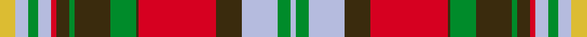

This page is one **sett** — a single exact thread-count. It belongs to the [tartan](/setts/ly6lb5g4lb5r2dy5g2dy14g10dy1r30dy10lb14g5lb2/)
(the same proportion at any scale), whose colour order is pattern [WGWGRGGGGGRWGWY](/stripes/wgwgrgggggrwgwy/).

Sourced from tartans-authority.  It is a [15 stripe tartan](/stripes/stripes15/).

Original link http://www.tartansauthority.com/tartan-ferret/display/10890/

## Register references

External register numbers recorded for this tartan.

- Scottish Register of Tartans: [10890](https://www.tartanregister.gov.uk/tartanDetails?ref=10890)
- Scottish Tartans Authority (ITI): 10890

## Thread count
LY/12 LB10 G8 LB10 R4 DY10 G4 DY28 G20 DY2 R60 DY20 LB28 G10 LB/4

One full sett is **444 threads**.

## Palette
<table><thead><tr><th>Colour</th><th>Shade</th><th>OKLCh</th></tr></thead><tbody><tr><td>LB</td><td><code style="background-color:#B5BBDE;">#B5BBDE</code> <small style="color:#888">#B5BBDE</small></td><td><small style="color:#888">oklch(79.9% 0.050 277.6)</small></td></tr><tr><td>G</td><td><code style="background-color:#008B2A;">#008B2A</code> <small style="color:#888">#008B2A</small></td><td><small style="color:#888">oklch(55.4% 0.170 145.9)</small></td></tr><tr><td>R</td><td><code style="background-color:#D60020;">#D60020</code> <small style="color:#888">#D60020</small></td><td><small style="color:#888">oklch(55.2% 0.224 25.5)</small></td></tr><tr><td>LY</td><td><code style="background-color:#DCBC32;">#DCBC32</code> <small style="color:#888">#DCBC32</small></td><td><small style="color:#888">oklch(80.0% 0.150 95.2)</small></td></tr><tr><td>DY</td><td><code style="background-color:#3A2B0D;">#3A2B0D</code> <small style="color:#888">#3A2B0D</small></td><td><small style="color:#888">oklch(30.0% 0.049 82.0)</small></td></tr></tbody></table>

# Sample pattern

ID: /variants/s15/ly6lb5g4lb5r2dy5g2dy14g10dy1r30dy10lb14g5lb2~x2/
