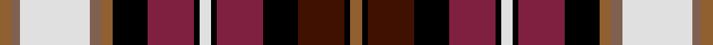

This page is one **sett** — a single exact thread-count. It belongs to the [tartan](/setts/o4oi3w24oi4o4k12m16k2w4k2m16k12dr16k2o4/)
(the same proportion at any scale), whose colour order is pattern [RKBKRKWKRKRRWRR](/stripes/rkbkrkwkrkrrwrr/).

Part of the [Dunkeld](/tartans/dunkeld/) tartan — the named design grouping this sett with its other cloths.

Sourced from weddslist.  It is a [15 stripe tartan](/stripes/stripes15/).

Original link http://www.weddslist.com/cgi-bin/tartans/pg.pl?source=sts

## Thread count
LT/4 LTa3 LN24 LTa4 LT4 K12 DR16 K2 LN4 K2 DR16 K12 DRa16 K2 LT/4

One full sett is **242 threads**.

## Palette

Palette: <strong>Tartan Register</strong> <small style="color:#888">(2 of 6 colours)</small>
<table><thead><tr><th>Colour</th><th>Threads</th><th>Shade</th><th>Base</th><th>OKLCh</th></tr></thead><tbody><tr><td>LT/</td><td style="text-align:right;font-variant-numeric:tabular-nums">4</td><td><code style="background-color:#906030;">#906030</code> <small style="color:#888">#906030</small></td><td>R <code style="background-color:#CC0000;">#CC0000</code></td><td><small style="color:#888">oklch(53.1% 0.089 63.7)</small></td></tr><tr><td>LTa</td><td style="text-align:right;font-variant-numeric:tabular-nums">3</td><td><code style="background-color:#806050;">#806050</code> <small style="color:#888">#806050</small></td><td>R <code style="background-color:#CC0000;">#CC0000</code></td><td><small style="color:#888">oklch(51.7% 0.049 47.8)</small></td></tr><tr><td>LN</td><td style="text-align:right;font-variant-numeric:tabular-nums">24</td><td><code style="background-color:#E0E0E0;">#E0E0E0</code> <small style="color:#888">#E0E0E0</small></td><td>W <code style="background-color:#F7F7F7;">#F7F7F7</code></td><td><small style="color:#888">oklch(90.7% 0.000 89.9)</small></td></tr><tr><td>LTa</td><td style="text-align:right;font-variant-numeric:tabular-nums">4</td><td><code style="background-color:#806050;">#806050</code> <small style="color:#888">#806050</small></td><td>R <code style="background-color:#CC0000;">#CC0000</code></td><td><small style="color:#888">oklch(51.7% 0.049 47.8)</small></td></tr><tr><td>LT</td><td style="text-align:right;font-variant-numeric:tabular-nums">4</td><td><code style="background-color:#906030;">#906030</code> <small style="color:#888">#906030</small></td><td>R <code style="background-color:#CC0000;">#CC0000</code></td><td><small style="color:#888">oklch(53.1% 0.089 63.7)</small></td></tr><tr><td>K</td><td style="text-align:right;font-variant-numeric:tabular-nums">12</td><td><code style="background-color:#000000;">#000000</code> <small style="color:#888">#000000</small></td><td>K <code style="background-color:#000000;">#000000</code></td><td><small style="color:#888">oklch(0.0% 0.000 0.0)</small></td></tr><tr><td>DR</td><td style="text-align:right;font-variant-numeric:tabular-nums">16</td><td><code style="background-color:#802040;">#802040</code> <small style="color:#888">#802040</small></td><td>R <code style="background-color:#CC0000;">#CC0000</code></td><td><small style="color:#888">oklch(40.8% 0.132 5.2)</small></td></tr><tr><td>K</td><td style="text-align:right;font-variant-numeric:tabular-nums">2</td><td><code style="background-color:#000000;">#000000</code> <small style="color:#888">#000000</small></td><td>K <code style="background-color:#000000;">#000000</code></td><td><small style="color:#888">oklch(0.0% 0.000 0.0)</small></td></tr><tr><td>LN</td><td style="text-align:right;font-variant-numeric:tabular-nums">4</td><td><code style="background-color:#E0E0E0;">#E0E0E0</code> <small style="color:#888">#E0E0E0</small></td><td>W <code style="background-color:#F7F7F7;">#F7F7F7</code></td><td><small style="color:#888">oklch(90.7% 0.000 89.9)</small></td></tr><tr><td>K</td><td style="text-align:right;font-variant-numeric:tabular-nums">2</td><td><code style="background-color:#000000;">#000000</code> <small style="color:#888">#000000</small></td><td>K <code style="background-color:#000000;">#000000</code></td><td><small style="color:#888">oklch(0.0% 0.000 0.0)</small></td></tr><tr><td>DR</td><td style="text-align:right;font-variant-numeric:tabular-nums">16</td><td><code style="background-color:#802040;">#802040</code> <small style="color:#888">#802040</small></td><td>R <code style="background-color:#CC0000;">#CC0000</code></td><td><small style="color:#888">oklch(40.8% 0.132 5.2)</small></td></tr><tr><td>K</td><td style="text-align:right;font-variant-numeric:tabular-nums">12</td><td><code style="background-color:#000000;">#000000</code> <small style="color:#888">#000000</small></td><td>K <code style="background-color:#000000;">#000000</code></td><td><small style="color:#888">oklch(0.0% 0.000 0.0)</small></td></tr><tr><td>DRa</td><td style="text-align:right;font-variant-numeric:tabular-nums">16</td><td><code style="background-color:#401000;">#401000</code> <small style="color:#888">#401000</small></td><td>B <code style="background-color:#2A418A;">#2A418A</code></td><td><small style="color:#888">oklch(25.3% 0.079 39.9)</small></td></tr><tr><td>K</td><td style="text-align:right;font-variant-numeric:tabular-nums">2</td><td><code style="background-color:#000000;">#000000</code> <small style="color:#888">#000000</small></td><td>K <code style="background-color:#000000;">#000000</code></td><td><small style="color:#888">oklch(0.0% 0.000 0.0)</small></td></tr><tr><td>LT/</td><td style="text-align:right;font-variant-numeric:tabular-nums">4</td><td><code style="background-color:#906030;">#906030</code> <small style="color:#888">#906030</small></td><td>R <code style="background-color:#CC0000;">#CC0000</code></td><td><small style="color:#888">oklch(53.1% 0.089 63.7)</small></td></tr></tbody></table>

## Compared to the master

This cloth is one sett of its design; the master sett (the exemplar the design is anchored on) is below for comparison.

<figure style="margin:0"><figcaption style="color:#888;font-size:smaller">this sett</figcaption></figure>
<figure style="margin:0"><figcaption style="color:#888;font-size:smaller"><a href="/setts/lo2dy2w12dy2lo2k6r8k1w2k1r8k6do8k1lo2/">master sett →</a></figcaption></figure>

## Nearest tartans

The nearest existing variants by ΔTartan distance, with this tartan at the top so the swatches line up against it.

ΔTartan

Tartan

Sett

—

<a href="/ttd/edit/#slug=o4oi3w24oi4o4k12m16k2w4k2m16k12dr16k2o4">Dunkeld</a> <a class="nn-out" href="/variants/s15/o4oi3w24oi4o4k12m16k2w4k2m16k12dr16k2o4/" title="open its dictionary page">↗</a>

0.61

<a href="/ttd/edit/#slug=lo2dy2w12dy2lo2k6r8k1w2k1r8k6do8k1lo2~x2&amp;base=o4oi3w24oi4o4k12m16k2w4k2m16k12dr16k2o4">Dunkeld</a> <a class="nn-out" href="/variants/s15/lo2dy2w12dy2lo2k6r8k1w2k1r8k6do8k1lo2~x2/" title="open its dictionary page">↗</a>

0.67

<a href="/ttd/edit/#slug=ly2r15ly3ri2ly3k14ly2db6w2db6ly2r7db10w1~x2&amp;base=o4oi3w24oi4o4k12m16k2w4k2m16k12dr16k2o4">Dalrymple, of Castleton</a> <a class="nn-out" href="/variants/s14/ly2r15ly3ri2ly3k14ly2db6w2db6ly2r7db10w1~x2/" title="open its dictionary page">↗</a>

0.84

<a href="/ttd/edit/#slug=db23r6db6k10ly3k2w2k2g11r12k2r10w2~x2&amp;base=o4oi3w24oi4o4k12m16k2w4k2m16k12dr16k2o4">Prince Albert</a> <a class="nn-out" href="/variants/s13/db23r6db6k10ly3k2w2k2g11r12k2r10w2~x2/" title="open its dictionary page">↗</a>

0.89

<a href="/ttd/edit/#slug=ly2r15ly3m2ly3k14ly2db6w2db6ly2r7db10w1~x2&amp;base=o4oi3w24oi4o4k12m16k2w4k2m16k12dr16k2o4">Dalrymple of Castleton Portrait Tartan</a> <a class="nn-out" href="/variants/s14/ly2r15ly3m2ly3k14ly2db6w2db6ly2r7db10w1~x2/" title="open its dictionary page">↗</a>

0.91

<a href="/ttd/edit/#slug=r6db2r6g10ly1k10db6k1db2k1db6r6w2k2r2~x2&amp;base=o4oi3w24oi4o4k12m16k2w4k2m16k12dr16k2o4">MacPherson 10</a> <a class="nn-out" href="/variants/s15/r6db2r6g10ly1k10db6k1db2k1db6r6w2k2r2~x2/" title="open its dictionary page">↗</a>

0.96

<a href="/ttd/edit/#slug=r13w2r13k3ri13dg21n3k18n9k2n2k2n15w2~x2&amp;base=o4oi3w24oi4o4k12m16k2w4k2m16k12dr16k2o4">Taiwan Scottish</a> <a class="nn-out" href="/variants/s14/r13w2r13k3ri13dg21n3k18n9k2n2k2n15w2~x2/" title="open its dictionary page">↗</a>

1.00

<a href="/ttd/edit/#slug=g3k2r12t9k2t9k16ly3k3w5k3g25r13k4r5w3~x2&amp;base=o4oi3w24oi4o4k12m16k2w4k2m16k12dr16k2o4">Wilson's, No 152</a> <a class="nn-out" href="/variants/s16/g3k2r12t9k2t9k16ly3k3w5k3g25r13k4r5w3~x2/" title="open its dictionary page">↗</a>

1.05

<a href="/variants/s16/r22lt3db5ly2r2w2dg11db4w3~x2/">Norwich No.014</a>

1.06

<a href="/ttd/edit/#slug=g4k3r1k3r2k2r4k1r4g3k2lo2k2r2k6db6lb14k3lb3r3~x2&amp;base=o4oi3w24oi4o4k12m16k2w4k2m16k12dr16k2o4">Quadra</a> <a class="nn-out" href="/variants/s20/g4k3r1k3r2k2r4k1r4g3k2lo2k2r2k6db6lb14k3lb3r3~x2/" title="open its dictionary page">↗</a>

1.13

<a href="/variants/s16/r26t7dp8ly3r3w3g20dp10w2~x2/">Wilson's No.227</a>

## Neighbour map

Every grey dot is one of 14360 variants placed by the first two principal components of the ΔTartan feature space (44% of its variance). Red is this tartan; blue dots are its nearest — click one to open its page.

<svg viewBox="0 0 640 380" role="img" style="max-width:100%;height:auto;border:1px solid #e0e0e0;border-radius:4px;display:block" xmlns="http://www.w3.org/2000/svg"><image href="/nn/cloud.v1.png" width="640" height="380"/><a href="/variants/s15/lo2dy2w12dy2lo2k6r8k1w2k1r8k6do8k1lo2~x2/"><circle cx="50.8" cy="112.0" r="4" fill="#3465a4"><title>Dunkeld</title></circle></a><a href="/variants/s14/ly2r15ly3ri2ly3k14ly2db6w2db6ly2r7db10w1~x2/"><circle cx="85.0" cy="102.6" r="4" fill="#3465a4"><title>Dalrymple, of Castleton</title></circle></a><a href="/variants/s13/db23r6db6k10ly3k2w2k2g11r12k2r10w2~x2/"><circle cx="96.0" cy="122.6" r="4" fill="#3465a4"><title>Prince Albert</title></circle></a><a href="/variants/s14/ly2r15ly3m2ly3k14ly2db6w2db6ly2r7db10w1~x2/"><circle cx="93.4" cy="105.2" r="4" fill="#3465a4"><title>Dalrymple of Castleton Portrait Tartan</title></circle></a><a href="/variants/s15/r6db2r6g10ly1k10db6k1db2k1db6r6w2k2r2~x2/"><circle cx="75.2" cy="133.7" r="4" fill="#3465a4"><title>MacPherson 10</title></circle></a><a href="/variants/s14/r13w2r13k3ri13dg21n3k18n9k2n2k2n15w2~x2/"><circle cx="54.8" cy="134.6" r="4" fill="#3465a4"><title>Taiwan Scottish</title></circle></a><a href="/variants/s16/g3k2r12t9k2t9k16ly3k3w5k3g25r13k4r5w3~x2/"><circle cx="52.0" cy="106.9" r="4" fill="#3465a4"><title>Wilson's, No 152</title></circle></a><a href="/variants/s16/r22lt3db5ly2r2w2dg11db4w3~x2/"><circle cx="82.5" cy="97.2" r="4" fill="#3465a4"><title>Norwich No.014</title></circle></a><a href="/variants/s20/g4k3r1k3r2k2r4k1r4g3k2lo2k2r2k6db6lb14k3lb3r3~x2/"><circle cx="79.3" cy="103.8" r="4" fill="#3465a4"><title>Quadra</title></circle></a><a href="/variants/s16/r26t7dp8ly3r3w3g20dp10w2~x2/"><circle cx="89.1" cy="111.4" r="4" fill="#3465a4"><title>Wilson's No.227</title></circle></a><circle cx="45.1" cy="109.2" r="5" fill="#c00000"/></svg>

ID: /variants/s15/o4oi3w24oi4o4k12m16k2w4k2m16k12dr16k2o4/
