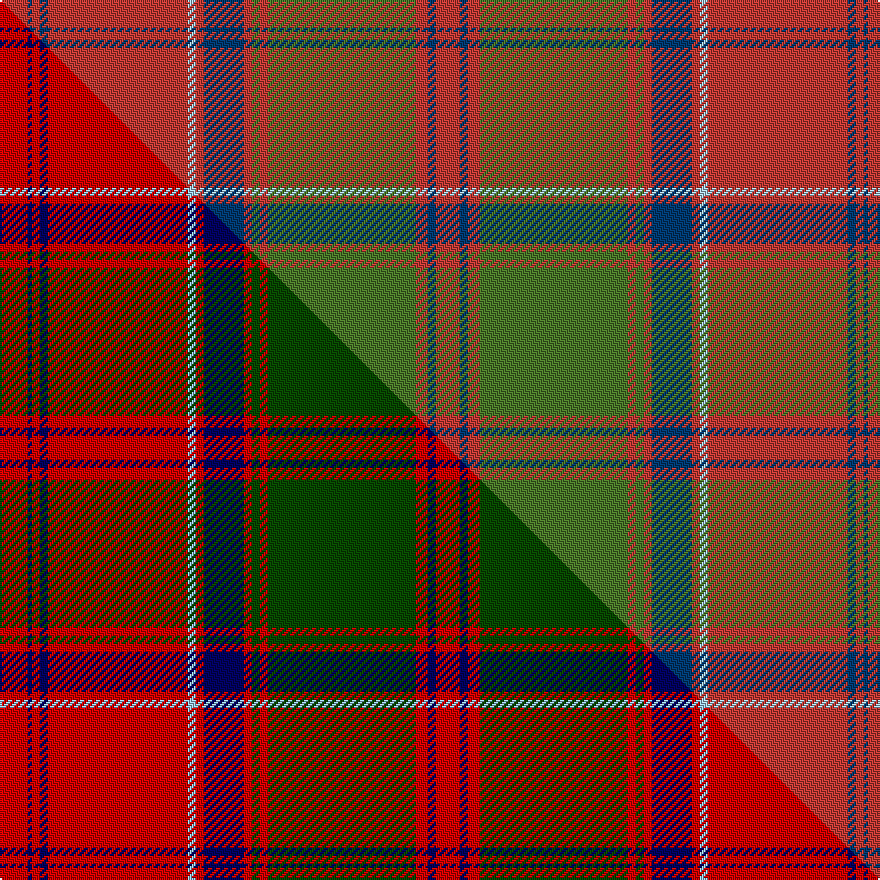

This page is one **sett** — a single exact thread-count. It belongs to the [tartan](/setts/o7db1o2db2o35lb2o2db10o2g2o2g37o3db2o6/)
(the same proportion at any scale), whose colour order is pattern [RBRBRWRBRGRGRBR](/stripes/rbrbrwrbrgrgrbr/).

Part of the [Drummond of Megginch](/tartans/drummond-of-megginch/) tartan — the named design grouping this sett with its other cloths.

Sourced from research.  It is a [15 stripe tartan](/stripes/stripes15/).

Original link https://tartandictionary.org/posts/drummondsofmegginch/

## Thread count
O/14 DB2 O4 DB4 O70 LB4 O4 DB20 O4 G4 O4 G74 O6 DB4 O/12

One full sett is **434 threads**.

## Palette
<table><thead><tr><th>Colour</th><th>Shade</th><th>OKLCh</th></tr></thead><tbody><tr><td>DB</td><td><code style="background-color:#003A70;">#003A70</code> <small style="color:#888">#003A70</small></td><td><small style="color:#888">oklch(34.9% 0.108 253.1)</small></td></tr><tr><td>G</td><td><code style="background-color:#4A7729;">#4A7729</code> <small style="color:#888">#4A7729</small></td><td><small style="color:#888">oklch(51.9% 0.119 134.3)</small></td></tr><tr><td>LB</td><td><code style="background-color:#A4C8E1;">#A4C8E1</code> <small style="color:#888">#A4C8E1</small></td><td><small style="color:#888">oklch(81.5% 0.052 238.6)</small></td></tr><tr><td>O</td><td><code style="background-color:#BE3A34;">#BE3A34</code> <small style="color:#888">#BE3A34</small></td><td><small style="color:#888">oklch(54.2% 0.170 27.0)</small></td></tr></tbody></table>

# Sample pattern

## Compared to the master

This cloth is one sett of its design; the master sett (the exemplar the design is anchored on) is below for comparison.

Its **ΔTartan distance** from the master is **1.87** — the same measure the nearest-tartans table ranks by (0 is identical; a re-scale of the same cloth is near 0, a recolour or a different proportion further).

<figure class="master-compare" style="margin:0">

this sett
master sett ★

<figcaption style="color:#888;font-size:smaller">One weave of this sett against the <a href="/setts/r7db1r2db2r35lb2r2db10r2dg2r2dg37r3db2r6/">master sett ★</a>, split on the diagonal: a shared proportion runs seamlessly across it with only the shades shifting; a different proportion breaks on it.</figcaption>
</figure>

## Nearest variants

The nearest existing variants by ΔTartan distance, with this cloth at the top so the swatches line up against it.

ΔTartan

Threads

Variant

Sett

—

434

<a href="/variants/s15/o7db1o2db2o35lb2o2db10o2g2o2g37o3db2o6~x2~o2207025-db1404259-lb3302249-g2105139/">Drummond of Megginch - 2023 BertieLexa</a>

0.00

—

<a href="/variants/s15/o7dt1o2dt2o35lt2o2dt10o2g2o2g37o3dt2o6~x2~o2207033-dt1204259-lt3002249-g2005139/">Drummond of Megginch - 1849 Kilt (faded)</a>

<a href="/ttd/edit/#slug=r7db1r2db2r35lb2r2db10r2dg2r2dg37r3db2r6~x2~r2109032-db0906265-lb3203246-dg1405139&amp;base=o7db1o2db2o35lb2o2db10o2g2o2g37o3db2o6~x2~o2207025-db1404259-lb3302249-g2105139" title="compare in the TTD">0.00</a>

434

<a href="/variants/s15/r7db1r2db2r35lb2r2db10r2dg2r2dg37r3db2r6~x2~r2109032-db0906265-lb3203246-dg1405139/">Drummond of Megginch - 1849 Kilt</a>

<a href="/ttd/edit/#slug=r6t2r2g24r2g2r2t8r2lb1r32t2r2t1r6~x2&amp;base=o7db1o2db2o35lb2o2db10o2g2o2g37o3db2o6~x2~o2207025-db1404259-lb3302249-g2105139" title="compare in the TTD">0.41</a>

352

<a href="/variants/s15/r6t2r2g24r2g2r2t8r2lb1r32t2r2t1r6~x2/">Drummond</a>

<a href="/ttd/edit/#slug=r26db2r6db6r126lb6r6db38r6dg6r6dg130r19db6r18~r2109032-db0906265-lb3203246-dg1405139&amp;base=o7db1o2db2o35lb2o2db10o2g2o2g37o3db2o6~x2~o2207025-db1404259-lb3302249-g2105139" title="compare in the TTD">0.47</a>

770

<a href="/variants/s15/r26db2r6db6r126lb6r6db38r6dg6r6dg130r19db6r18~r2109032-db0906265-lb3203246-dg1405139/">Drummond of Megginch - 1820 Plaid</a>

<a href="/ttd/edit/#slug=r15dp1r2dp2r78lb1r2dp21r3g2r3g79r2dp2r10&amp;base=o7db1o2db2o35lb2o2db10o2g2o2g37o3db2o6~x2~o2207025-db1404259-lb3302249-g2105139" title="compare in the TTD">2.02</a>

421

<a href="/variants/s15/r15dp1r2dp2r78lb1r2dp21r3g2r3g79r2dp2r10/">Grant - 1819 (Clan)</a>

<a href="/ttd/edit/#slug=r15dp1r2dp2r78lg1r2dp21r3g2r3g89r2dp2r10&amp;base=o7db1o2db2o35lb2o2db10o2g2o2g37o3db2o6~x2~o2207025-db1404259-lb3302249-g2105139" title="compare in the TTD">2.09</a>

441

<a href="/variants/s15/r15dp1r2dp2r78lg1r2dp21r3g2r3g89r2dp2r10/">Bruce - 1819 (New)</a>

## Neighbour map

Every grey dot is one of 13620 variants placed by the first two principal components of the ΔTartan feature space (42% of its variance). Red is this tartan; blue dots are its nearest — click one to open its page.

<svg viewBox="0 0 640 380" role="img" style="max-width:100%;height:auto;border:1px solid #e0e0e0;border-radius:4px;display:block" xmlns="http://www.w3.org/2000/svg"><image href="/nn/cloud.v1.png" width="640" height="380"/><a href="/variants/s15/o7dt1o2dt2o35lt2o2dt10o2g2o2g37o3dt2o6~x2~o2207033-dt1204259-lt3002249-g2005139/"><circle cx="391.8" cy="101.6" r="4" fill="#3465a4"><title>Drummond of Megginch - 1849 Kilt (faded)</title></circle></a><a href="/variants/s15/r7db1r2db2r35lb2r2db10r2dg2r2dg37r3db2r6~x2~r2109032-db0906265-lb3203246-dg1405139/"><circle cx="350.2" cy="84.4" r="4" fill="#3465a4"><title>Drummond of Megginch - 1849 Kilt</title></circle></a><a href="/variants/s15/r6t2r2g24r2g2r2t8r2lb1r32t2r2t1r6~x2/"><circle cx="396.3" cy="100.3" r="4" fill="#3465a4"><title>Drummond</title></circle></a><a href="/variants/s15/r26db2r6db6r126lb6r6db38r6dg6r6dg130r19db6r18~r2109032-db0906265-lb3203246-dg1405139/"><circle cx="366.5" cy="72.5" r="4" fill="#3465a4"><title>Drummond of Megginch - 1820 Plaid</title></circle></a><a href="/variants/s15/r15dp1r2dp2r78lb1r2dp21r3g2r3g79r2dp2r10/"><circle cx="381.7" cy="65.9" r="4" fill="#3465a4"><title>Grant - 1819 (Clan)</title></circle></a><a href="/variants/s15/r15dp1r2dp2r78lg1r2dp21r3g2r3g89r2dp2r10/"><circle cx="373.8" cy="65.7" r="4" fill="#3465a4"><title>Bruce - 1819 (New)</title></circle></a><circle cx="406.5" cy="106.7" r="5" fill="#c00000"/><text x="320" y="376" text-anchor="middle" font-size="11" fill="#999">ground</text><text x="11" y="190" text-anchor="middle" font-size="11" fill="#999" transform="rotate(-90 11 190)">complexity</text></svg>

ID: /variants/s15/o7db1o2db2o35lb2o2db10o2g2o2g37o3db2o6~x2~o2207025-db1404259-lb3302249-g2105139/
