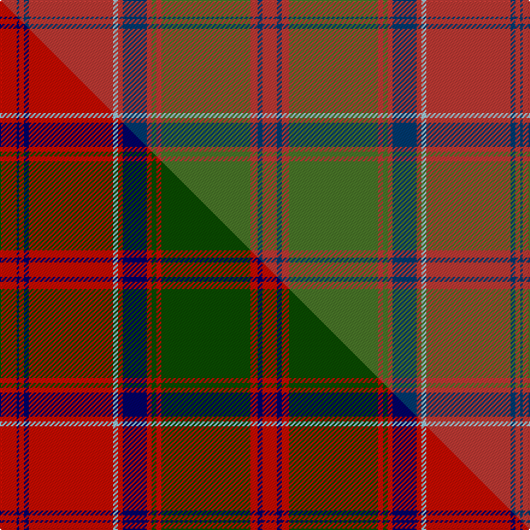

This is one **variant** — a specific cloth: this exact thread count and colourway, with its own
provenance below. It is one weaving of the [sett](/tartans/d/dr/drummond-of-megginch/) (the scale-free proportion — the
same cloth at any scale or shade), whose colour order is pattern [RBRBRWRBRGRGRBR](/stripes/rbrbrwrbrgrgrbr/).

Part of the [Drummond of Megginch](/tartans/d/dr/drummond-of-megginch/) tartan — the named design grouping this sett with its other cloths.

Sourced from research.  It is a [15 stripe tartan](/stripes/stripes15/).

Original link [https://tartandictionary.org/posts/drummondsofmegginch/](https://tartandictionary.org/posts/drummondsofmegginch/)

Dataset <small>— provenance for this record, inherited from the source manifest</small>

<dl class="dataset-prov">
<dt>source</dt><dd><a href="/sources/research/">Our own research</a></dd>
<dt>licence</dt><dd><a href="https://creativecommons.org/licenses/by-sa/4.0/">CC BY-SA 4.0</a></dd>
<dt>captured</dt><dd>2025-11-01</dd>
</dl>

## Thread count
O/14 DB2 O4 DB4 O70 LB4 O4 DB20 O4 G4 O4 G74 O6 DB4 O/12

One full sett is **434 threads**.

## Palette
<table><thead><tr><th>Colour</th><th>Shade</th><th>OKLCh</th></tr></thead><tbody><tr><td>DB</td><td><code style="background-color:#003A70;">#003A70</code> <small style="color:#888">#003A70</small></td><td><small style="color:#888">oklch(34.9% 0.108 253.1)</small></td></tr><tr><td>G</td><td><code style="background-color:#4A7729;">#4A7729</code> <small style="color:#888">#4A7729</small></td><td><small style="color:#888">oklch(51.9% 0.119 134.3)</small></td></tr><tr><td>LB</td><td><code style="background-color:#A4C8E1;">#A4C8E1</code> <small style="color:#888">#A4C8E1</small></td><td><small style="color:#888">oklch(81.5% 0.052 238.6)</small></td></tr><tr><td>O</td><td><code style="background-color:#BE3A34;">#BE3A34</code> <small style="color:#888">#BE3A34</small></td><td><small style="color:#888">oklch(54.2% 0.170 27.0)</small></td></tr></tbody></table>

# Sample pattern

## Compared to the master

This cloth is one sett of its design; the master sett (the exemplar the design is anchored on) is below for comparison.

Its **ΔTartan distance** from the master is **0.15** — the same measure the nearest-tartans table ranks by (0 is identical; a re-scale of the same cloth is near 0, a recolour or a different proportion further).

<figure class="master-compare" style="margin:0">

this sett
master sett ★

<figcaption style="color:#888;font-size:smaller">One weave of this sett against the <a href="/setts/r7db1r2db2r35lb2r2db10r2dg2r2dg37r3db2r6/">master sett ★</a>, split on the diagonal: a shared proportion runs seamlessly across it with only the shades shifting; a different proportion breaks on it.</figcaption>
</figure>

## Nearest tartan variants

The nearest existing variants by ΔTartan distance, with this cloth at the top so the swatches line up against it.

ΔTartan

Threads

Variant

Sett

—

434

<a href="/variants/s15/o7db1o2db2o35lb2o2db10o2g2o2g37o3db2o6~x2~o5417027-db3511252-lb8105240-g5112135/">Drummond of Megginch - 2022 Proposal</a>

<a href="/ttd/edit/#slug=o7db1o2db2o35lb2o2db10o2g2o2g37o3db2o6~x2~o5517027-db3511252-lb8105243-g5112135&amp;base=o7db1o2db2o35lb2o2db10o2g2o2g37o3db2o6~x2~o5417027-db3511252-lb8105240-g5112135" title="compare in the TTD">0.02</a>

434

<a href="/variants/s15/o7db1o2db2o35lb2o2db10o2g2o2g37o3db2o6~x2~o5517027-db3511252-lb8105243-g5112135/">Drummond of Megginch - 2023 BertieLexa</a>

<a href="/ttd/edit/#slug=o7dt1o2dt2o35lt2o2dt10o2g2o2g37o3dt2o6~x2~o5417030-dt3009261-lt7505240-g5113138&amp;base=o7db1o2db2o35lb2o2db10o2g2o2g37o3db2o6~x2~o5417027-db3511252-lb8105240-g5112135" title="compare in the TTD">0.05</a>

434

<a href="/variants/s15/o7dt1o2dt2o35lt2o2dt10o2g2o2g37o3dt2o6~x2~o5417030-dt3009261-lt7505240-g5113138/">Drummond of Megginch - 1849 Kilt (faded)</a>

<a href="/ttd/edit/#slug=r7db1r2db2r35lb2r2db10r2dg2r2dg37r3db2r6~x2~r5221030-db2316264-lb8007237-dg3612141&amp;base=o7db1o2db2o35lb2o2db10o2g2o2g37o3db2o6~x2~o5417027-db3511252-lb8105240-g5112135" title="compare in the TTD">0.16</a>

434

<a href="/variants/s15/r7db1r2db2r35lb2r2db10r2dg2r2dg37r3db2r6~x2~r5221030-db2316264-lb8007237-dg3612141/">Drummond of Megginch - 1849 Kilt</a>

<a href="/ttd/edit/#slug=r7dt2r3dg32r2dg2r2dt10r2lb2r31dt2r2dt1r6~x2~r4715027-dt2903288-dg3904177-lb8007237&amp;base=o7db1o2db2o35lb2o2db10o2g2o2g37o3db2o6~x2~o5417027-db3511252-lb8105240-g5112135" title="compare in the TTD">0.30</a>

398

<a href="/variants/s15/r7dt2r3dg32r2dg2r2dt10r2lb2r31dt2r2dt1r6~x2~r4715027-dt2903288-dg3904177-lb8007237/">Drummond of Megginch - 1997 Kilt</a>

<a href="/ttd/edit/#slug=r6db2r2g24r2g2r2db8r2lb2r32db2r2db1r6~x2&amp;base=o7db1o2db2o35lb2o2db10o2g2o2g37o3db2o6~x2~o5417027-db3511252-lb8105240-g5112135" title="compare in the TTD">0.46</a>

356

<a href="/variants/s15/r6db2r2g24r2g2r2db8r2lb2r32db2r2db1r6~x2/">Grant or Drummond Clan Tartan</a>

<a href="/ttd/edit/#slug=r6db2r2g24r2g2r2db8r2lb1r32db2r2db1r6~x2&amp;base=o7db1o2db2o35lb2o2db10o2g2o2g37o3db2o6~x2~o5417027-db3511252-lb8105240-g5112135" title="compare in the TTD">0.46</a>

352

<a href="/variants/s15/r6db2r2g24r2g2r2db8r2lb1r32db2r2db1r6~x2/">Grant, or Drummond</a>

<a href="/ttd/edit/#slug=r6t2r2g24r2g2r2t8r2lb1r32t2r2t1r6~x2&amp;base=o7db1o2db2o35lb2o2db10o2g2o2g37o3db2o6~x2~o5417027-db3511252-lb8105240-g5112135" title="compare in the TTD">0.48</a>

352

<a href="/variants/s15/r6t2r2g24r2g2r2t8r2lb1r32t2r2t1r6~x2/">Drummond</a>

<a href="/ttd/edit/#slug=r26db2r6db6r126lb6r6db38r6dg6r6dg130r19db6r18~r5221030-db2316264-lb8007237-dg3612141&amp;base=o7db1o2db2o35lb2o2db10o2g2o2g37o3db2o6~x2~o5417027-db3511252-lb8105240-g5112135" title="compare in the TTD">0.55</a>

770

<a href="/variants/s15/r26db2r6db6r126lb6r6db38r6dg6r6dg130r19db6r18~r5221030-db2316264-lb8007237-dg3612141/">Drummond of Megginch - 1820 Plaid</a>

<a href="/ttd/edit/#slug=r6db1r2db2r28lb2r2db9r2g2r2g24r3db2r6db2~x2&amp;base=o7db1o2db2o35lb2o2db10o2g2o2g37o3db2o6~x2~o5417027-db3511252-lb8105240-g5112135" title="compare in the TTD">1.38</a>

364

<a href="/variants/s16/r6db1r2db2r28lb2r2db9r2g2r2g24r3db2r6db2~x2/">Drummond Clan Tartan</a>

<a href="/ttd/edit/#slug=r6db2r2g24r2db2r2db8r2w1r32db2r2db1r6~x2&amp;base=o7db1o2db2o35lb2o2db10o2g2o2g37o3db2o6~x2~o5417027-db3511252-lb8105240-g5112135" title="compare in the TTD">1.73</a>

352

<a href="/variants/s15/r6db2r2g24r2db2r2db8r2w1r32db2r2db1r6~x2/">Grant</a>

## Neighbour map

Every grey dot is one of 13662 variants placed by the first two principal components of the ΔTartan feature space (42% of its variance). Red is this tartan; blue dots are its nearest — click one to open its page. The map is a flat projection of a many-dimensional space — [how to read it](/posts/neighbourhood-maps/).

<svg viewBox="0 0 640 380" role="img" style="max-width:100%;height:auto;border:1px solid #e0e0e0;border-radius:4px;display:block" xmlns="http://www.w3.org/2000/svg"><image href="/nn/cloud.v1.png" width="640" height="380"/><a href="/variants/s15/o7db1o2db2o35lb2o2db10o2g2o2g37o3db2o6~x2~o5517027-db3511252-lb8105243-g5112135/"><circle cx="404.9" cy="105.9" r="4" fill="#3465a4"><title>Drummond of Megginch - 2023 BertieLexa</title></circle></a><a href="/variants/s15/o7dt1o2dt2o35lt2o2dt10o2g2o2g37o3dt2o6~x2~o5417030-dt3009261-lt7505240-g5113138/"><circle cx="392.0" cy="101.5" r="4" fill="#3465a4"><title>Drummond of Megginch - 1849 Kilt (faded)</title></circle></a><a href="/variants/s15/r7db1r2db2r35lb2r2db10r2dg2r2dg37r3db2r6~x2~r5221030-db2316264-lb8007237-dg3612141/"><circle cx="350.4" cy="84.1" r="4" fill="#3465a4"><title>Drummond of Megginch - 1849 Kilt</title></circle></a><a href="/variants/s15/r7dt2r3dg32r2dg2r2dt10r2lb2r31dt2r2dt1r6~x2~r4715027-dt2903288-dg3904177-lb8007237/"><circle cx="454.8" cy="134.2" r="4" fill="#3465a4"><title>Drummond of Megginch - 1997 Kilt</title></circle></a><a href="/variants/s15/r6db2r2g24r2g2r2db8r2lb2r32db2r2db1r6~x2/"><circle cx="365.1" cy="90.8" r="4" fill="#3465a4"><title>Grant or Drummond Clan Tartan</title></circle></a><a href="/variants/s15/r6db2r2g24r2g2r2db8r2lb1r32db2r2db1r6~x2/"><circle cx="371.7" cy="89.8" r="4" fill="#3465a4"><title>Grant, or Drummond</title></circle></a><a href="/variants/s15/r6t2r2g24r2g2r2t8r2lb1r32t2r2t1r6~x2/"><circle cx="396.6" cy="100.0" r="4" fill="#3465a4"><title>Drummond</title></circle></a><a href="/variants/s15/r26db2r6db6r126lb6r6db38r6dg6r6dg130r19db6r18~r5221030-db2316264-lb8007237-dg3612141/"><circle cx="366.7" cy="72.2" r="4" fill="#3465a4"><title>Drummond of Megginch - 1820 Plaid</title></circle></a><a href="/variants/s16/r6db1r2db2r28lb2r2db9r2g2r2g24r3db2r6db2~x2/"><circle cx="336.6" cy="98.5" r="4" fill="#3465a4"><title>Drummond Clan Tartan</title></circle></a><a href="/variants/s15/r6db2r2g24r2db2r2db8r2w1r32db2r2db1r6~x2/"><circle cx="365.9" cy="88.2" r="4" fill="#3465a4"><title>Grant</title></circle></a><circle cx="406.7" cy="106.6" r="5" fill="#c00000"/><text x="320" y="376" text-anchor="middle" font-size="11" fill="#999">ground</text><text x="11" y="190" text-anchor="middle" font-size="11" fill="#999" transform="rotate(-90 11 190)">complexity</text></svg>

ID: /variants/s15/o7db1o2db2o35lb2o2db10o2g2o2g37o3db2o6~x2~o5417027-db3511252-lb8105240-g5112135/
