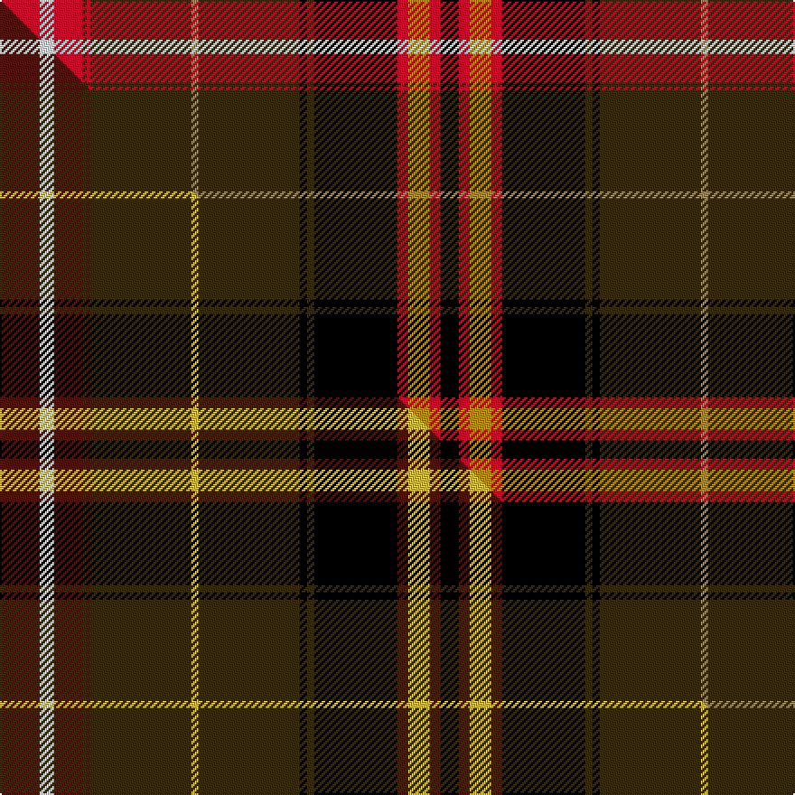

This page is one **sett** — a single exact thread-count. It belongs to the [tartan](/setts/r11w4r8dy1r1dy28ly2dy28k2dy2k23r3lyi6r3k5/)
(the same proportion at any scale), whose colour order is pattern [KRYRKGKGYGRGRWR](/stripes/kryrkgkgygrgrwr/).

Part of the [Scottish Register of Tartans](/tartans/scottish-register-of-tartans/) tartan — the named design grouping this sett with its other cloths.

Sourced from tartans-authority.  It is a [15 stripe tartan](/stripes/stripes15/).

Original link http://www.tartansauthority.com/tartan-ferret/display/10000/

## Register references

External register numbers recorded for this tartan.

- Scottish Tartans Authority (ITI): 10000

## Thread count
R/22 W8 R16 DY2 R2 DY56 LY4 DY56 K4 DY4 K46 R6 LYi12 R6 K/10

One full sett is **476 threads**.

## Palette
<table><thead><tr><th>Colour</th><th>Shade</th><th>OKLCh</th></tr></thead><tbody><tr><td>LY</td><td><code style="background-color:#BC8C00;">#BC8C00</code> <small style="color:#888">#BC8C00</small></td><td><small style="color:#888">oklch(66.8% 0.137 84.1)</small></td></tr><tr><td>K</td><td><code style="background-color:#000000;">#000000</code> <small style="color:#888">#000000</small></td><td><small style="color:#888">oklch(0.0% 0.000 0.0)</small></td></tr><tr><td>W</td><td><code style="background-color:#F7F7F7;">#F7F7F7</code> <small style="color:#888">#F7F7F7</small></td><td><small style="color:#888">oklch(97.6% 0.000 89.9)</small></td></tr><tr><td>LY</td><td><code style="background-color:#A08858;">#A08858</code> <small style="color:#888">#A08858</small></td><td><small style="color:#888">oklch(63.7% 0.071 84.0)</small></td></tr><tr><td>R</td><td><code style="background-color:#D60020;">#D60020</code> <small style="color:#888">#D60020</small></td><td><small style="color:#888">oklch(55.2% 0.224 25.5)</small></td></tr><tr><td>DY</td><td><code style="background-color:#3A2B0D;">#3A2B0D</code> <small style="color:#888">#3A2B0D</small></td><td><small style="color:#888">oklch(30.0% 0.049 82.0)</small></td></tr></tbody></table>

# Sample pattern

## Compared to the master

This cloth is one sett of its design; the master sett (the exemplar the design is anchored on) is below for comparison.

Its **ΔTartan distance** from the master is **0.38** — the same measure the nearest-tartans table ranks by (0 is identical; a re-scale of the same cloth is near 0, a recolour or a different proportion further).

<figure class="master-compare" style="margin:0">

this sett
master sett ★

<figcaption style="color:#888;font-size:smaller">One weave of this sett against the <a href="/setts/dr11w4dr8dy1dr1dy28ly2dy28k2dy2k23dr3ly6dr3k5/">master sett ★</a>, split on the diagonal: a shared proportion runs seamlessly across it with only the shades shifting; a different proportion breaks on it.</figcaption>
</figure>

## Nearest tartan variants

The nearest existing variants by ΔTartan distance, with this cloth at the top so the swatches line up against it.

ΔTartan

Threads

Variant

Sett

—

476

<a href="/variants/s15/r11w4r8dy1r1dy28ly2dy28k2dy2k23r3lyi6r3k5~x2~ly2503076-lyi2705081/">Scottish Register of Tartans (Corp)</a>

<a href="/ttd/edit/#slug=dr11w4dr8dy1dr1dy28ly2dy28k2dy2k23dr3ly6dr3k5~x2&amp;base=r11w4r8dy1r1dy28ly2dy28k2dy2k23r3lyi6r3k5~x2~ly2503076-lyi2705081" title="compare in the TTD">0.38</a>

476

<a href="/variants/s15/dr11w4dr8dy1dr1dy28ly2dy28k2dy2k23dr3ly6dr3k5~x2/">Scottish Register of Tartans Corporate Tartan</a>

<a href="/ttd/edit/#slug=y4w2r19n8k1n3k2n2k3n2k26lb4~x2&amp;base=r11w4r8dy1r1dy28ly2dy28k2dy2k23r3lyi6r3k5~x2~ly2503076-lyi2705081" title="compare in the TTD">2.24</a>

288

<a href="/variants/s12/y4w2r19n8k1n3k2n2k3n2k26lb4~x2/">Aberdeen Forever</a>

<a href="/ttd/edit/#slug=dr32db2k8lo1k2lb2k2g18dr10k2dr2lb2~x4&amp;base=r11w4r8dy1r1dy28ly2dy28k2dy2k23r3lyi6r3k5~x2~ly2503076-lyi2705081" title="compare in the TTD">2.48</a>

528

<a href="/variants/s12/dr32db2k8lo1k2lb2k2g18dr10k2dr2lb2~x4/">Stewart - Pr Ch Ed - Pendleton</a>

<a href="/ttd/edit/#slug=y4w2r16n8k1n3k2n2k3n2k22lb4~x2&amp;base=r11w4r8dy1r1dy28ly2dy28k2dy2k23r3lyi6r3k5~x2~ly2503076-lyi2705081" title="compare in the TTD">2.50</a>

260

<a href="/variants/s12/y4w2r16n8k1n3k2n2k3n2k22lb4~x2/">Aberdeen Forever (District)</a>

<a href="/ttd/edit/#slug=w4db4r18n4r1n36k1n4k6r2k6r6k2r6k4r2~x2~r2109032&amp;base=r11w4r8dy1r1dy28ly2dy28k2dy2k23r3lyi6r3k5~x2~ly2503076-lyi2705081" title="compare in the TTD">2.52</a>

412

<a href="/variants/s16/w4db4r18n4r1n36k1n4k6r2k6r6k2r6k4r2~x2~r2109032/">Mehrtens (Personal)</a>

<a href="/ttd/edit/#slug=do28r3k2n2k2r3n8o2k8o5k3ly2k2o3k1~x2~o2503076-ly3104101&amp;base=r11w4r8dy1r1dy28ly2dy28k2dy2k23r3lyi6r3k5~x2~ly2503076-lyi2705081" title="compare in the TTD">2.57</a>

238

<a href="/variants/s15/do28r3k2n2k2r3n8ly2k8ly5k3lyi2k2ly3k1~x2~ly2503076-lyi3104101/">Caithness</a>

<a href="/ttd/edit/#slug=r20w6r100db15k10db15k40y5g54r15k5r15k6w8&amp;base=r11w4r8dy1r1dy28ly2dy28k2dy2k23r3lyi6r3k5~x2~ly2503076-lyi2705081" title="compare in the TTD">2.59</a>

600

<a href="/variants/s14/r20w6r100db15k10db15k40y5g54r15k5r15k6w8/">Unidentified Bedspread</a>

<a href="/ttd/edit/#slug=w4db4r18n4r1n36k1n4k6r2k6r6k4r2~x2&amp;base=r11w4r8dy1r1dy28ly2dy28k2dy2k23r3lyi6r3k5~x2~ly2503076-lyi2705081" title="compare in the TTD">2.60</a>

380

<a href="/variants/s14/w4db4r18n4r1n36k1n4k6r2k6r6k4r2~x2/">Mehrtens variant (Personal)</a>

<a href="/ttd/edit/#slug=dy28r3k2n2k2r3n8o2k8o5k3ly2k2o3k1~x2~o2503076-ly3104101&amp;base=r11w4r8dy1r1dy28ly2dy28k2dy2k23r3lyi6r3k5~x2~ly2503076-lyi2705081" title="compare in the TTD">2.67</a>

238

<a href="/variants/s15/dy28r3k2n2k2r3n8ly2k8ly5k3lyi2k2ly3k1~x2~ly2503076-lyi3104101/">Caithness (District)</a>

<a href="/ttd/edit/#slug=r4do4r4do12k32o15ri1o7ly1ri1~x2~r1706009-o2503076-ri2607041-ly2705081&amp;base=r11w4r8dy1r1dy28ly2dy28k2dy2k23r3lyi6r3k5~x2~ly2503076-lyi2705081" title="compare in the TTD">2.67</a>

314

<a href="/variants/s10/r4do4r4do12k32ly15ri1ly7lyi1ri1~x2~r1706009-ly2503076-ri2607041-lyi2705081/">Hard Rock Cafe (Corporate)</a>

## Neighbour map

Every grey dot is one of 13620 variants placed by the first two principal components of the ΔTartan feature space (42% of its variance). Red is this tartan; blue dots are its nearest — click one to open its page.

<svg viewBox="0 0 640 380" role="img" style="max-width:100%;height:auto;border:1px solid #e0e0e0;border-radius:4px;display:block" xmlns="http://www.w3.org/2000/svg"><image href="/nn/cloud.v1.png" width="640" height="380"/><a href="/variants/s15/dr11w4dr8dy1dr1dy28ly2dy28k2dy2k23dr3ly6dr3k5~x2/"><circle cx="233.6" cy="90.4" r="4" fill="#3465a4"><title>Scottish Register of Tartans Corporate Tartan</title></circle></a><a href="/variants/s12/y4w2r19n8k1n3k2n2k3n2k26lb4~x2/"><circle cx="168.0" cy="70.4" r="4" fill="#3465a4"><title>Aberdeen Forever</title></circle></a><a href="/variants/s12/dr32db2k8lo1k2lb2k2g18dr10k2dr2lb2~x4/"><circle cx="262.1" cy="65.7" r="4" fill="#3465a4"><title>Stewart - Pr Ch Ed - Pendleton</title></circle></a><a href="/variants/s12/y4w2r16n8k1n3k2n2k3n2k22lb4~x2/"><circle cx="149.0" cy="83.7" r="4" fill="#3465a4"><title>Aberdeen Forever (District)</title></circle></a><a href="/variants/s16/w4db4r18n4r1n36k1n4k6r2k6r6k2r6k4r2~x2~r2109032/"><circle cx="198.6" cy="46.0" r="4" fill="#3465a4"><title>Mehrtens (Personal)</title></circle></a><a href="/variants/s15/do28r3k2n2k2r3n8ly2k8ly5k3lyi2k2ly3k1~x2~ly2503076-lyi3104101/"><circle cx="167.0" cy="61.8" r="4" fill="#3465a4"><title>Caithness</title></circle></a><a href="/variants/s14/r20w6r100db15k10db15k40y5g54r15k5r15k6w8/"><circle cx="177.7" cy="72.5" r="4" fill="#3465a4"><title>Unidentified Bedspread</title></circle></a><a href="/variants/s14/w4db4r18n4r1n36k1n4k6r2k6r6k4r2~x2/"><circle cx="211.6" cy="49.8" r="4" fill="#3465a4"><title>Mehrtens variant (Personal)</title></circle></a><a href="/variants/s15/dy28r3k2n2k2r3n8ly2k8ly5k3lyi2k2ly3k1~x2~ly2503076-lyi3104101/"><circle cx="165.4" cy="62.1" r="4" fill="#3465a4"><title>Caithness (District)</title></circle></a><a href="/variants/s10/r4do4r4do12k32ly15ri1ly7lyi1ri1~x2~r1706009-ly2503076-ri2607041-lyi2705081/"><circle cx="175.8" cy="80.7" r="4" fill="#3465a4"><title>Hard Rock Cafe (Corporate)</title></circle></a><circle cx="199.6" cy="67.4" r="5" fill="#c00000"/><text x="320" y="376" text-anchor="middle" font-size="11" fill="#999">ground</text><text x="11" y="190" text-anchor="middle" font-size="11" fill="#999" transform="rotate(-90 11 190)">complexity</text></svg>

ID: /variants/s15/r11w4r8dy1r1dy28ly2dy28k2dy2k23r3lyi6r3k5~x2~ly2503076-lyi2705081/
