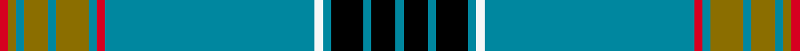

This page is one **sett** — a single exact thread-count. It belongs to the [tartan](/setts/r1y1t1y3t1y4t1r1t26w1t1k4t1k3t1/)
(the same proportion at any scale), whose colour order is pattern [BKBKBWBRBGBGBGR](/stripes/bkbkbwbrbgbgbgr/).

Part of the [Laing](/tartans/laing/) tartan — the named design grouping this sett with its other cloths.

Sourced from tartans-authority.  It is a [15 stripe tartan](/stripes/stripes15/).

Original link http://www.tartansauthority.com/tartan-ferret/display/6096/

2 attestations — the source records this cloth was collapsed from (oldest owns this page)

<ul>
<li>pre 1765 — Laing (Clan) (tartans-authority, <a href="http://www.tartansauthority.com/tartan-ferret/display/6096/">record</a>)  <em>This is the official Clan Laing Society tartan which was recovered from the grave of George Henry Laing who died in 1853 in East Texas. George had moved to Texas from Liberty County adjacent to the Gaelic speaking community of Darien in Georgia. James, his grandfather, had moved to The North Carolina Scottish Colony of the Cape Fear River from Scotland some time between 1745 and 1765 bringing the sett with him. The relatively dry climate and local soil conditions are accredited with the remarkable preservation of sufficient portions of his great kilt to allow the reconstruction of the sett. The exhumation came about through the construction of a pond adjacent to the cemetery which necessitated the removal of 56 graves - one of which was that of George H Laing. Laing of Colington as chief endorsed this tartan as the Clan/Family tartan. Threadcount from Laing website. Pivots may need to be doubled.</em></li>
<li>01/01/1770 — Laing (register-of-tartans, <a href="https://www.tartanregister.gov.uk/tartanDetails.aspx?ref=2027">record</a>)  <em>This is the official Clan Laing Society tartan which was recovered from the grave of George Henry Laing who died in 1853 in East Texas. George had moved to Texas from Liberty County adjacent to the Gaelic speaking community of Darien in Georgia. James, his grandfather, had moved to The North Carolina Scottish Colony of the Cape Fear River from Scotland some time between 1745 and 1765 bringing the sett with him. The relatively dry climate and local soil conditions are accredited with the remarkable preservation of sufficient portions of his great kilt to allow the reconstruction of the sett. The exhumation came about through the construction of a pond adjacent to the cemetry which necessitated the removal of 56 graves - one of which was that of George H Laing. Threadcount from Laing website. Pivots may need to be doubled.</em></li>
</ul>

## Register references

External register numbers recorded for this tartan.

- Scottish Register of Tartans: [2027](https://www.tartanregister.gov.uk/tartanDetails.aspx?ref=2027)
- Scottish Tartans Authority (ITI): 6096
- Scottish Tartans World Register: 2801

## Thread count
R/4 Y4 T4 Y12 T4 Y16 T4 R4 T104 W4 T4 K16 T4 K12 T/4

One full sett is **392 threads**.

## Palette
<table><thead><tr><th>Colour</th><th>Shade</th><th>OKLCh</th></tr></thead><tbody><tr><td>T</td><td><code style="background-color:#00879F;">#00879F</code> <small style="color:#888">#00879F</small></td><td><small style="color:#888">oklch(57.4% 0.102 216.1)</small></td></tr><tr><td>K</td><td><code style="background-color:#000000;">#000000</code> <small style="color:#888">#000000</small></td><td><small style="color:#888">oklch(0.0% 0.000 0.0)</small></td></tr><tr><td>R</td><td><code style="background-color:#D60020;">#D60020</code> <small style="color:#888">#D60020</small></td><td><small style="color:#888">oklch(55.2% 0.224 25.5)</small></td></tr><tr><td>W</td><td><code style="background-color:#F7F7F7;">#F7F7F7</code> <small style="color:#888">#F7F7F7</small></td><td><small style="color:#888">oklch(97.6% 0.000 89.9)</small></td></tr><tr><td>Y</td><td><code style="background-color:#8B6E00;">#8B6E00</code> <small style="color:#888">#8B6E00</small></td><td><small style="color:#888">oklch(55.1% 0.113 90.4)</small></td></tr></tbody></table>

# Sample pattern

## Nearest tartan variants

The nearest existing variants by ΔTartan distance, with this cloth at the top so the swatches line up against it.

ΔTartan

Threads

Variant

Sett

—

392

<a href="/variants/s15/r1y1t1y3t1y4t1r1t26w1t1k4t1k3t1~x4/">Laing (Clan)</a>

<a href="/ttd/edit/#slug=t106r3t4r6t8k28g8w4g12k8&amp;base=r1y1t1y3t1y4t1r1t26w1t1k4t1k3t1~x4" title="compare in the TTD">2.45</a>

260

<a href="/variants/s10/t106r3t4r6t8k28g8w4g12k8/">Parr</a>

<a href="/ttd/edit/#slug=r1y1t1y3t1y4t1r1t26k1t1k4t1k3t1~x4&amp;base=r1y1t1y3t1y4t1r1t26w1t1k4t1k3t1~x4" title="compare in the TTD">2.73</a>

776

<a href="/variants/s28/r1y1t1y3t1y4t1r1t26k1t1k4t1k3t1k3t1k4t1k1t26r1t1y4t1y3t1y1~x4/">Laing Clan/Family Tartan</a>

<a href="/ttd/edit/#slug=t50r3t4k8n4k2y3k2r12w2r4t4~x2&amp;base=r1y1t1y3t1y4t1r1t26w1t1k4t1k3t1~x4" title="compare in the TTD">3.04</a>

284

<a href="/variants/s12/t50r3t4k8n4k2y3k2r12w2r4t4~x2/">City of Barrie</a>

<a href="/ttd/edit/#slug=db3k1dr1n24dr1n4lo3db1k4dr1n8dr1k1~x4&amp;base=r1y1t1y3t1y4t1r1t26w1t1k4t1k3t1~x4" title="compare in the TTD">3.45</a>

408

<a href="/variants/s13/db3k1dr1n24dr1n4lo3db1k4dr1n8dr1k1~x4/">Wcwm 1445</a>

<a href="/ttd/edit/#slug=n38k5g5k5n5w2n12k10dy5k5dy10k9n76k9g2k5~x2&amp;base=r1y1t1y3t1y4t1r1t26w1t1k4t1k3t1~x4" title="compare in the TTD">3.45</a>

726

<a href="/variants/s16/n38k5g5k5n5w2n12k10dy5k5dy10k9n76k9g2k5~x2/">Guildford Town Centre (British Columbia)</a>

<a href="/ttd/edit/#slug=g36k1g1k1g1k1db12k1w1k1db12k1y1k1g12k2r2&amp;base=r1y1t1y3t1y4t1r1t26w1t1k4t1k3t1~x4" title="compare in the TTD">3.55</a>

136

<a href="/variants/s17/g36k1g1k1g1k1db12k1w1k1db12k1y1k1g12k2r2/">Cockburn</a>

<a href="/ttd/edit/#slug=g36k1g1k1g1k1db12k1w1k1db12k1y1k1g12k2r2~x2&amp;base=r1y1t1y3t1y4t1r1t26w1t1k4t1k3t1~x4" title="compare in the TTD">3.55</a>

272

<a href="/variants/s17/g36k1g1k1g1k1db12k1w1k1db12k1y1k1g12k2r2~x2/">Cockburn</a>

<a href="/ttd/edit/#slug=n68t5k9lo3k3lb3k3n20dr9k3dr5lb4&amp;base=r1y1t1y3t1y4t1r1t26w1t1k4t1k3t1~x4" title="compare in the TTD">3.60</a>

198

<a href="/variants/s12/n68t5k9lo3k3lb3k3n20dr9k3dr5lb4/">British Caledonian Airways #2</a>

<a href="/ttd/edit/#slug=y8g84db21k10db10k10db10k10db21g62r3g6r3g10y3g5r6~x2&amp;base=r1y1t1y3t1y4t1r1t26w1t1k4t1k3t1~x4" title="compare in the TTD">3.63</a>

1100

<a href="/variants/s17/y8g84db21k10db10k10db10k10db21g62r3g6r3g10y3g5r6~x2/">King Edward VII</a>

<a href="/ttd/edit/#slug=dg39k2dg2k2dg2k3t13k2w4k2t13k3dg24y3~x2&amp;base=r1y1t1y3t1y4t1r1t26w1t1k4t1k3t1~x4" title="compare in the TTD">3.69</a>

372

<a href="/variants/s14/dg39k2dg2k2dg2k3t13k2w4k2t13k3dg24y3~x2/">Proctor (Name)</a>

## Neighbour map

Every grey dot is one of 13620 variants placed by the first two principal components of the ΔTartan feature space (42% of its variance). Red is this tartan; blue dots are its nearest — click one to open its page.

<svg viewBox="0 0 640 380" role="img" style="max-width:100%;height:auto;border:1px solid #e0e0e0;border-radius:4px;display:block" xmlns="http://www.w3.org/2000/svg"><image href="/nn/cloud.v1.png" width="640" height="380"/><a href="/variants/s10/t106r3t4r6t8k28g8w4g12k8/"><circle cx="340.9" cy="70.9" r="4" fill="#3465a4"><title>Parr</title></circle></a><a href="/variants/s28/r1y1t1y3t1y4t1r1t26k1t1k4t1k3t1k3t1k4t1k1t26r1t1y4t1y3t1y1~x4/"><circle cx="336.0" cy="37.4" r="4" fill="#3465a4"><title>Laing Clan/Family Tartan</title></circle></a><a href="/variants/s12/t50r3t4k8n4k2y3k2r12w2r4t4~x2/"><circle cx="292.9" cy="61.7" r="4" fill="#3465a4"><title>City of Barrie</title></circle></a><a href="/variants/s13/db3k1dr1n24dr1n4lo3db1k4dr1n8dr1k1~x4/"><circle cx="388.6" cy="83.7" r="4" fill="#3465a4"><title>Wcwm 1445</title></circle></a><a href="/variants/s16/n38k5g5k5n5w2n12k10dy5k5dy10k9n76k9g2k5~x2/"><circle cx="357.2" cy="53.8" r="4" fill="#3465a4"><title>Guildford Town Centre (British Columbia)</title></circle></a><a href="/variants/s17/g36k1g1k1g1k1db12k1w1k1db12k1y1k1g12k2r2/"><circle cx="290.5" cy="33.9" r="4" fill="#3465a4"><title>Cockburn</title></circle></a><a href="/variants/s17/g36k1g1k1g1k1db12k1w1k1db12k1y1k1g12k2r2~x2/"><circle cx="290.5" cy="33.9" r="4" fill="#3465a4"><title>Cockburn</title></circle></a><a href="/variants/s12/n68t5k9lo3k3lb3k3n20dr9k3dr5lb4/"><circle cx="350.7" cy="71.3" r="4" fill="#3465a4"><title>British Caledonian Airways #2</title></circle></a><a href="/variants/s17/y8g84db21k10db10k10db10k10db21g62r3g6r3g10y3g5r6~x2/"><circle cx="297.4" cy="80.2" r="4" fill="#3465a4"><title>King Edward VII</title></circle></a><a href="/variants/s14/dg39k2dg2k2dg2k3t13k2w4k2t13k3dg24y3~x2/"><circle cx="298.7" cy="99.6" r="4" fill="#3465a4"><title>Proctor (Name)</title></circle></a><circle cx="349.6" cy="60.4" r="5" fill="#c00000"/><text x="320" y="376" text-anchor="middle" font-size="11" fill="#999">ground</text><text x="11" y="190" text-anchor="middle" font-size="11" fill="#999" transform="rotate(-90 11 190)">complexity</text></svg>

ID: /variants/s15/r1y1t1y3t1y4t1r1t26w1t1k4t1k3t1~x4/
