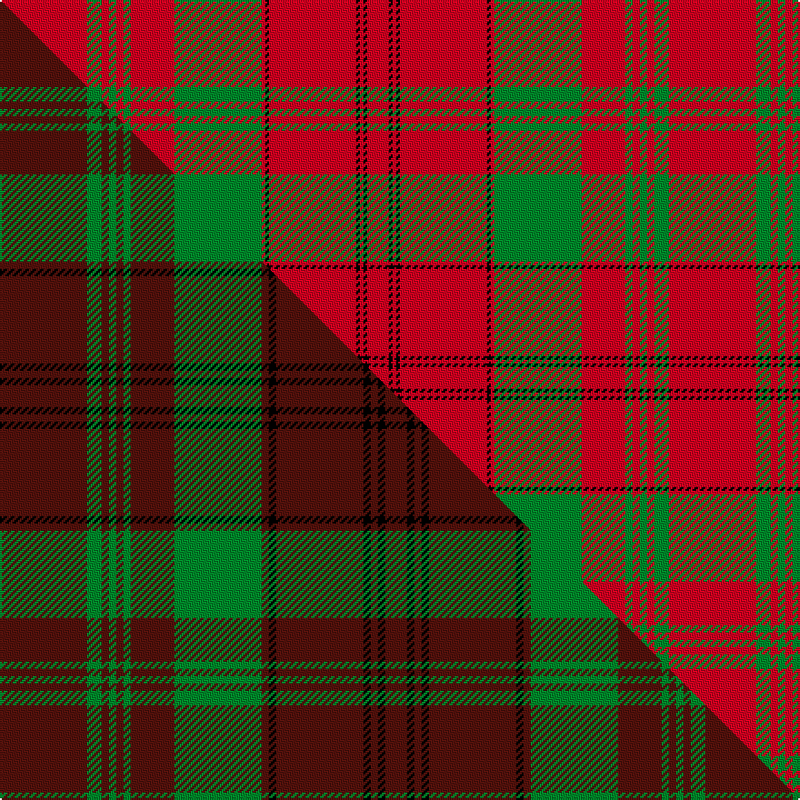

This is one **variant** — a specific cloth: this exact thread count and colourway, with its own
provenance below. It is one weaving of the [sett](/tartans/m/ma/macdonell-of-keppoch-3/) (the scale-free proportion — the
same cloth at any scale or shade), whose colour order is pattern [RGRGRGRGRKRKRKR](/stripes/rgrgrgrgrkrkrkr/).

Part of the [MacDonell of Keppoch](/tartans/m/ma/macdonell-of-keppoch-3/) tartan — the named design grouping this sett with its other cloths.

Sourced from weddslist.  It is a [15 stripe tartan](/stripes/stripes15/).

Original link [http://www.weddslist.com/cgi-bin/tartans/pg.pl?source=sts](http://www.weddslist.com/cgi-bin/tartans/pg.pl?source=sts)

Dataset <small>— provenance for this record, inherited from the source manifest</small>

<dl class="dataset-prov">
<dt>source</dt><dd><a href="/sources/weddslist/">Weddslist</a></dd>
<dt>data captured from</dt><dd><a href="https://github.com/thetartan/tartan-database/blob/master/data/weddslist/data.csv">https://github.com/thetartan/tartan-database/blob/master/data/weddslist/data.csv</a></dd>
<dt>data date</dt><dd>2016-11-17 <small>(dataset default)</small></dd>
<dt>licence</dt><dd><a href="https://creativecommons.org/licenses/by-nc-nd/4.0/">CC BY-NC-ND 4.0</a></dd>
</dl>

Capture chain <small>— the hands this data passed through, oldest first; each capture carries its own licence</small>

<ol class="capture-chain">
<li><a href="https://www.weddslist.com/tartans/">Weddslist</a> <small>the living privately compiled reference</small></li>
<li><a href="https://github.com/thetartan/tartan-database">thetartan/tartan-database</a> <small>2016-2017</small> · <a href="https://creativecommons.org/licenses/by-nc-nd/4.0/">CC BY-NC-ND 4.0</a> <small>Levko Kravets's frozen compilation — the capture we vendored, and where its CC licence text came from</small></li>
<li>this dictionary <small>captured 2026-06-10 · commit 5bf86c7566</small> <small>each re-capture is a git commit to data/sources</small></li>
</ol>

## Thread count
R/48 G8 R4 G4 R4 G4 R24 G48 R2 K2 R48 K2 R2 K2 R/12

One full sett is **368 threads**.

## Palette
<table><thead><tr><th>Colour</th><th>Shade</th><th>OKLCh</th></tr></thead><tbody><tr><td>G</td><td><code style="background-color:#008B2A;">#008B2A</code> <small style="color:#888">#008B2A</small></td><td><small style="color:#888">oklch(55.4% 0.170 145.9)</small></td></tr><tr><td>K</td><td><code style="background-color:#000000;">#000000</code> <small style="color:#888">#000000</small></td><td><small style="color:#888">oklch(0.0% 0.000 0.0)</small></td></tr><tr><td>R</td><td><code style="background-color:#D60020;">#D60020</code> <small style="color:#888">#D60020</small></td><td><small style="color:#888">oklch(55.2% 0.224 25.5)</small></td></tr></tbody></table>

# Sample pattern

## Compared to the master

This cloth is one sett of its design; the master sett (the exemplar the design is anchored on) is below for comparison.

Its **ΔTartan distance** from the master is **0.60** — the same measure the nearest-tartans table ranks by (0 is identical; a re-scale of the same cloth is near 0, a recolour or a different proportion further).

<figure class="master-compare" style="margin:0">

this sett
master sett ★

<figcaption style="color:#888;font-size:smaller">One weave of this sett against the <a href="/setts/dr12g2dr1g1dr1g1dr6g12dr1k1dr12k1dr1k1dr3/">master sett ★</a>, split on the diagonal: a shared proportion runs seamlessly across it with only the shades shifting; a different proportion breaks on it.</figcaption>
</figure>

## Nearest tartan variants

The nearest existing variants by ΔTartan distance, with this cloth at the top so the swatches line up against it.

ΔTartan

Threads

Variant

Sett

—

368

<a href="/variants/s15/r24g4r2g2r2g2r12g24r1k1r24k1r1k1r6~x2/">MacDonell of Keppoch</a>

<a href="/ttd/edit/#slug=r5g25r5g2r2g2r8db6r2db6r62g2r5g5~x2&amp;base=r24g4r2g2r2g2r12g24r1k1r24k1r1k1r6~x2" title="compare in the TTD">2.75</a>

528

<a href="/variants/s14/r5g25r5g2r2g2r8db6r2db6r62g2r5g5~x2/">Ross #7</a>

<a href="/ttd/edit/#slug=r90k6r6k6r90g6r6g45r6k4r3&amp;base=r24g4r2g2r2g2r12g24r1k1r24k1r1k1r6~x2" title="compare in the TTD">2.80</a>

443

<a href="/variants/s11/r90k6r6k6r90g6r6g45r6k4r3/">MacPherson-Grant</a>

<a href="/ttd/edit/#slug=w8r83g7r5g7r7g28r7g28r7g7r5g7r83w4r4w8&amp;base=r24g4r2g2r2g2r12g24r1k1r24k1r1k1r6~x2" title="compare in the TTD">3.08</a>

594

<a href="/variants/s17/w8r83g7r5g7r7g28r7g28r7g7r5g7r83w4r4w8/">Rothesay (Red)</a>

<a href="/ttd/edit/#slug=w8r83dg7r5dg7r7dg28r7dg28r7dg7r5dg7r83w4r4w8&amp;base=r24g4r2g2r2g2r12g24r1k1r24k1r1k1r6~x2" title="compare in the TTD">3.25</a>

594

<a href="/variants/s17/w8r83dg7r5dg7r7dg28r7dg28r7dg7r5dg7r83w4r4w8/">Rothesay, Red (Royal)</a>

<a href="/ttd/edit/#slug=w2r32dg2r3dg2r4dg17r4dg16r4dg2r3dg2r32w1r1w2~x2&amp;base=r24g4r2g2r2g2r12g24r1k1r24k1r1k1r6~x2" title="compare in the TTD">3.26</a>

508

<a href="/variants/s17/w2r32dg2r3dg2r4dg17r4dg16r4dg2r3dg2r32w1r1w2~x2/">Rothesay District Tartan</a>

<a href="/ttd/edit/#slug=r96g24r10g12k1w4k1g12r10g24r48~x2&amp;base=r24g4r2g2r2g2r12g24r1k1r24k1r1k1r6~x2" title="compare in the TTD">3.33</a>

680

<a href="/variants/s11/r96g24r10g12k1w4k1g12r10g24r48~x2/">MacGregor</a>

<a href="/ttd/edit/#slug=g19r7g7r7g7r14db3r3g19r3db3r66db7r14~x2&amp;base=r24g4r2g2r2g2r12g24r1k1r24k1r1k1r6~x2" title="compare in the TTD">3.34</a>

650

<a href="/variants/s14/g19r7g7r7g7r14db3r3g19r3db3r66db7r14~x2/">MacGillivray Hunting Clan Tartan</a>

<a href="/ttd/edit/#slug=r96dg24r10dg12r10dg12k1w4k1dg12r10dg24r48~x2&amp;base=r24g4r2g2r2g2r12g24r1k1r24k1r1k1r6~x2" title="compare in the TTD">3.43</a>

768

<a href="/variants/s13/r96dg24r10dg12r10dg12k1w4k1dg12r10dg24r48~x2/">MacGregor</a>

<a href="/ttd/edit/#slug=r9g4r6k2r4k2r8g14r24k2r4~x2&amp;base=r24g4r2g2r2g2r12g24r1k1r24k1r1k1r6~x2" title="compare in the TTD">3.62</a>

290

<a href="/variants/s11/r9g4r6k2r4k2r8g14r24k2r4~x2/">MacDonell of Keppach</a>

<a href="/ttd/edit/#slug=r96dg24r10dg12k1w4k1dg12r10dg24r48~x2&amp;base=r24g4r2g2r2g2r12g24r1k1r24k1r1k1r6~x2" title="compare in the TTD">3.65</a>

680

<a href="/variants/s11/r96dg24r10dg12k1w4k1dg12r10dg24r48~x2/">Maconachie of Meadowbank</a>

## Neighbour map

Every grey dot is one of 13656 variants placed by the first two principal components of the ΔTartan feature space (42% of its variance). Red is this tartan; blue dots are its nearest — click one to open its page. The map is a flat projection of a many-dimensional space — [how to read it](/posts/neighbourhood-maps/).

<svg viewBox="0 0 640 380" role="img" style="max-width:100%;height:auto;border:1px solid #e0e0e0;border-radius:4px;display:block" xmlns="http://www.w3.org/2000/svg"><image href="/nn/cloud.v1.png" width="640" height="380"/><a href="/variants/s14/r5g25r5g2r2g2r8db6r2db6r62g2r5g5~x2/"><circle cx="457.4" cy="100.4" r="4" fill="#3465a4"><title>Ross #7</title></circle></a><a href="/variants/s11/r90k6r6k6r90g6r6g45r6k4r3/"><circle cx="486.4" cy="96.6" r="4" fill="#3465a4"><title>MacPherson-Grant</title></circle></a><a href="/variants/s17/w8r83g7r5g7r7g28r7g28r7g7r5g7r83w4r4w8/"><circle cx="435.6" cy="115.6" r="4" fill="#3465a4"><title>Rothesay (Red)</title></circle></a><a href="/variants/s17/w8r83dg7r5dg7r7dg28r7dg28r7dg7r5dg7r83w4r4w8/"><circle cx="421.7" cy="108.0" r="4" fill="#3465a4"><title>Rothesay, Red (Royal)</title></circle></a><a href="/variants/s17/w2r32dg2r3dg2r4dg17r4dg16r4dg2r3dg2r32w1r1w2~x2/"><circle cx="434.2" cy="98.1" r="4" fill="#3465a4"><title>Rothesay District Tartan</title></circle></a><a href="/variants/s11/r96g24r10g12k1w4k1g12r10g24r48~x2/"><circle cx="457.2" cy="85.3" r="4" fill="#3465a4"><title>MacGregor</title></circle></a><a href="/variants/s14/g19r7g7r7g7r14db3r3g19r3db3r66db7r14~x2/"><circle cx="428.2" cy="132.3" r="4" fill="#3465a4"><title>MacGillivray Hunting Clan Tartan</title></circle></a><a href="/variants/s13/r96dg24r10dg12r10dg12k1w4k1dg12r10dg24r48~x2/"><circle cx="432.4" cy="72.0" r="4" fill="#3465a4"><title>MacGregor</title></circle></a><a href="/variants/s11/r9g4r6k2r4k2r8g14r24k2r4~x2/"><circle cx="385.8" cy="160.1" r="4" fill="#3465a4"><title>MacDonell of Keppach</title></circle></a><a href="/variants/s11/r96dg24r10dg12k1w4k1dg12r10dg24r48~x2/"><circle cx="446.8" cy="78.5" r="4" fill="#3465a4"><title>Maconachie of Meadowbank</title></circle></a><circle cx="430.6" cy="106.9" r="5" fill="#c00000"/><text x="320" y="376" text-anchor="middle" font-size="11" fill="#999">ground</text><text x="11" y="190" text-anchor="middle" font-size="11" fill="#999" transform="rotate(-90 11 190)">complexity</text></svg>

ID: /variants/s15/r24g4r2g2r2g2r12g24r1k1r24k1r1k1r6~x2/
