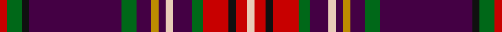

This page is one **sett** — a single exact thread-count. It belongs to the [tartan](/setts/r2g4k2dp25g4dp4lo2dp2lb2dp5g3r7k2r3lb2/)
(the same proportion at any scale), whose colour order is pattern [RGKBGBYBWBGRKRW](/stripes/rgkbgbybwbgrkrw/).

Sourced from tartans-authority.  It is a [15 stripe tartan](/stripes/stripes15/).

Original link http://www.tartansauthority.com/tartan-ferret/display/10743/

## Also known as

This cloth is also recorded under:

- Hueg Scottish Blue Thistle (Personal

## Register references

External register numbers recorded for this tartan.

- Scottish Register of Tartans: [10743](https://www.tartanregister.gov.uk/tartanDetails?ref=10743)
- Scottish Tartans Authority (ITI): 10743

## Thread count
R/4 G8 K4 DP50 G8 DP8 DY4 DP4 LR4 DP10 G6 R14 K4 R6 LR/4

One full sett is **268 threads**.

## Palette

Palette: <strong>Tartan Register</strong>
<table><thead><tr><th>Colour</th><th>Threads</th><th>Shade</th><th>Base</th><th>OKLCh</th></tr></thead><tbody><tr><td>R/</td><td style="text-align:right;font-variant-numeric:tabular-nums">4</td><td><code style="background-color:#C80000;">#C80000</code> <small style="color:#888">#C80000</small></td><td>R <code style="background-color:#CC0000;">#CC0000</code></td><td><small style="color:#888">oklch(52.3% 0.215 29.2)</small></td></tr><tr><td>G</td><td style="text-align:right;font-variant-numeric:tabular-nums">8</td><td><code style="background-color:#006818;">#006818</code> <small style="color:#888">#006818</small></td><td>G <code style="background-color:#006100;">#006100</code></td><td><small style="color:#888">oklch(45.0% 0.142 145.0)</small></td></tr><tr><td>K</td><td style="text-align:right;font-variant-numeric:tabular-nums">4</td><td><code style="background-color:#101010;">#101010</code> <small style="color:#888">#101010</small></td><td>K <code style="background-color:#000000;">#000000</code></td><td><small style="color:#888">oklch(17.3% 0.000 89.9)</small></td></tr><tr><td>DP</td><td style="text-align:right;font-variant-numeric:tabular-nums">50</td><td><code style="background-color:#440044;">#440044</code> <small style="color:#888">#440044</small></td><td>B <code style="background-color:#2A418A;">#2A418A</code></td><td><small style="color:#888">oklch(27.1% 0.125 328.4)</small></td></tr><tr><td>G</td><td style="text-align:right;font-variant-numeric:tabular-nums">8</td><td><code style="background-color:#006818;">#006818</code> <small style="color:#888">#006818</small></td><td>G <code style="background-color:#006100;">#006100</code></td><td><small style="color:#888">oklch(45.0% 0.142 145.0)</small></td></tr><tr><td>DP</td><td style="text-align:right;font-variant-numeric:tabular-nums">8</td><td><code style="background-color:#440044;">#440044</code> <small style="color:#888">#440044</small></td><td>B <code style="background-color:#2A418A;">#2A418A</code></td><td><small style="color:#888">oklch(27.1% 0.125 328.4)</small></td></tr><tr><td>DY</td><td style="text-align:right;font-variant-numeric:tabular-nums">4</td><td><code style="background-color:#BC8C00;">#BC8C00</code> <small style="color:#888">#BC8C00</small></td><td>Y <code style="background-color:#F2BF00;">#F2BF00</code></td><td><small style="color:#888">oklch(66.8% 0.137 84.1)</small></td></tr><tr><td>DP</td><td style="text-align:right;font-variant-numeric:tabular-nums">4</td><td><code style="background-color:#440044;">#440044</code> <small style="color:#888">#440044</small></td><td>B <code style="background-color:#2A418A;">#2A418A</code></td><td><small style="color:#888">oklch(27.1% 0.125 328.4)</small></td></tr><tr><td>LR</td><td style="text-align:right;font-variant-numeric:tabular-nums">4</td><td><code style="background-color:#E8CCB8;">#E8CCB8</code> <small style="color:#888">#E8CCB8</small></td><td>W <code style="background-color:#F7F7F7;">#F7F7F7</code></td><td><small style="color:#888">oklch(86.3% 0.042 57.7)</small></td></tr><tr><td>DP</td><td style="text-align:right;font-variant-numeric:tabular-nums">10</td><td><code style="background-color:#440044;">#440044</code> <small style="color:#888">#440044</small></td><td>B <code style="background-color:#2A418A;">#2A418A</code></td><td><small style="color:#888">oklch(27.1% 0.125 328.4)</small></td></tr><tr><td>G</td><td style="text-align:right;font-variant-numeric:tabular-nums">6</td><td><code style="background-color:#006818;">#006818</code> <small style="color:#888">#006818</small></td><td>G <code style="background-color:#006100;">#006100</code></td><td><small style="color:#888">oklch(45.0% 0.142 145.0)</small></td></tr><tr><td>R</td><td style="text-align:right;font-variant-numeric:tabular-nums">14</td><td><code style="background-color:#C80000;">#C80000</code> <small style="color:#888">#C80000</small></td><td>R <code style="background-color:#CC0000;">#CC0000</code></td><td><small style="color:#888">oklch(52.3% 0.215 29.2)</small></td></tr><tr><td>K</td><td style="text-align:right;font-variant-numeric:tabular-nums">4</td><td><code style="background-color:#101010;">#101010</code> <small style="color:#888">#101010</small></td><td>K <code style="background-color:#000000;">#000000</code></td><td><small style="color:#888">oklch(17.3% 0.000 89.9)</small></td></tr><tr><td>R</td><td style="text-align:right;font-variant-numeric:tabular-nums">6</td><td><code style="background-color:#C80000;">#C80000</code> <small style="color:#888">#C80000</small></td><td>R <code style="background-color:#CC0000;">#CC0000</code></td><td><small style="color:#888">oklch(52.3% 0.215 29.2)</small></td></tr><tr><td>LR/</td><td style="text-align:right;font-variant-numeric:tabular-nums">4</td><td><code style="background-color:#E8CCB8;">#E8CCB8</code> <small style="color:#888">#E8CCB8</small></td><td>W <code style="background-color:#F7F7F7;">#F7F7F7</code></td><td><small style="color:#888">oklch(86.3% 0.042 57.7)</small></td></tr></tbody></table>

## Nearest tartans

The nearest existing variants by ΔTartan distance, with this tartan at the top so the swatches line up against it.

ΔTartan

Tartan

Sett

—

<a href="/ttd/edit/#slug=r2g4k2dp25g4dp4lo2dp2lb2dp5g3r7k2r3lb2~x2">Hueg Scottish Blue Thistle (Personal</a> <a class="nn-out" href="/variants/s15/r2g4k2dp25g4dp4lo2dp2lb2dp5g3r7k2r3lb2~x2/" title="open its dictionary page">↗</a>

0.84

<a href="/variants/s14/dp3lo2r19ri4dpi6k36dpi2lo3~x2/">Hyland Evening (Personal)</a>

1.00

<a href="/ttd/edit/#slug=dt10k3g3k8m9g3m10b3m28g3k3w3k3~x2&amp;base=r2g4k2dp25g4dp4lo2dp2lb2dp5g3r7k2r3lb2~x2">Clifford</a> <a class="nn-out" href="/variants/s13/dt10k3g3k8m9g3m10b3m28g3k3w3k3~x2/" title="open its dictionary page">↗</a>

1.09

<a href="/ttd/edit/#slug=r2dg4k2dp25dg4dp4lo2dp2w2dp5dg3r7k2r3w2~x2&amp;base=r2g4k2dp25g4dp4lo2dp2lb2dp5g3r7k2r3lb2~x2">Hueg (Bavaria) Scottish Blue Thistle (Personal)</a> <a class="nn-out" href="/variants/s15/r2dg4k2dp25dg4dp4lo2dp2w2dp5dg3r7k2r3w2~x2/" title="open its dictionary page">↗</a>

1.10

<a href="/ttd/edit/#slug=n31k4n4k4n4k4n6w5k4o3dp19o3n4r3~x2&amp;base=r2g4k2dp25g4dp4lo2dp2lb2dp5g3r7k2r3lb2~x2">Sydney Academy</a> <a class="nn-out" href="/variants/s14/n31k4n4k4n4k4n6w5k4o3dp19o3n4r3~x2/" title="open its dictionary page">↗</a>

1.15

<a href="/ttd/edit/#slug=r12b2r12dg8ly1k6b4k1b1k1b4r12lr1k1r1~x2&amp;base=r2g4k2dp25g4dp4lo2dp2lb2dp5g3r7k2r3lb2~x2">MacPherson</a> <a class="nn-out" href="/variants/s15/r12b2r12dg8ly1k6b4k1b1k1b4r12lr1k1r1~x2/" title="open its dictionary page">↗</a>

1.17

<a href="/ttd/edit/#slug=r3db10n3db2n2db2r3k5r2k5r22dg2r3dg2~x2&amp;base=r2g4k2dp25g4dp4lo2dp2lb2dp5g3r7k2r3lb2~x2">Lochcarron Dress</a> <a class="nn-out" href="/variants/s14/r3db10n3db2n2db2r3k5r2k5r22dg2r3dg2~x2/" title="open its dictionary page">↗</a>

1.18

<a href="/variants/s16/r4ly2r34db10y4db4t4db23w3~x2/">Heirloom Red Alba</a>

1.21

<a href="/variants/s12/k7dbi4r31db3ly2db27lb4~x2/">Wishart Dress</a>

1.21

<a href="/ttd/edit/#slug=w3r30dg3db3r3lo3db8g3lo3db3w3~x2&amp;base=r2g4k2dp25g4dp4lo2dp2lb2dp5g3r7k2r3lb2~x2">Lansdowne Course, Blairgowrie Golf Club</a> <a class="nn-out" href="/variants/s11/w3r30dg3db3r3lo3db8g3lo3db3w3~x2/" title="open its dictionary page">↗</a>

1.22

<a href="/ttd/edit/#slug=k2db12r12db2r2t2r2t2r12db6r2dg12k2ly1r1ly1~x2&amp;base=r2g4k2dp25g4dp4lo2dp2lb2dp5g3r7k2r3lb2~x2">Catalan Dance</a> <a class="nn-out" href="/variants/s16/k2db12r12db2r2t2r2t2r12db6r2dg12k2ly1r1ly1~x2/" title="open its dictionary page">↗</a>

## Neighbour map

Every grey dot is one of 14360 variants placed by the first two principal components of the ΔTartan feature space (44% of its variance). Red is this tartan; blue dots are its nearest — click one to open its page.

<svg viewBox="0 0 640 380" role="img" style="max-width:100%;height:auto;border:1px solid #e0e0e0;border-radius:4px;display:block" xmlns="http://www.w3.org/2000/svg"><image href="/nn/cloud.v1.png" width="640" height="380"/><a href="/variants/s14/dp3lo2r19ri4dpi6k36dpi2lo3~x2/"><circle cx="255.9" cy="95.6" r="4" fill="#3465a4"><title>Hyland Evening (Personal)</title></circle></a><a href="/variants/s13/dt10k3g3k8m9g3m10b3m28g3k3w3k3~x2/"><circle cx="217.9" cy="131.0" r="4" fill="#3465a4"><title>Clifford</title></circle></a><a href="/variants/s15/r2dg4k2dp25dg4dp4lo2dp2w2dp5dg3r7k2r3w2~x2/"><circle cx="261.2" cy="112.8" r="4" fill="#3465a4"><title>Hueg (Bavaria) Scottish Blue Thistle (Personal)</title></circle></a><a href="/variants/s14/n31k4n4k4n4k4n6w5k4o3dp19o3n4r3~x2/"><circle cx="229.0" cy="124.0" r="4" fill="#3465a4"><title>Sydney Academy</title></circle></a><a href="/variants/s15/r12b2r12dg8ly1k6b4k1b1k1b4r12lr1k1r1~x2/"><circle cx="247.4" cy="114.2" r="4" fill="#3465a4"><title>MacPherson</title></circle></a><a href="/variants/s14/r3db10n3db2n2db2r3k5r2k5r22dg2r3dg2~x2/"><circle cx="229.7" cy="119.9" r="4" fill="#3465a4"><title>Lochcarron Dress</title></circle></a><a href="/variants/s16/r4ly2r34db10y4db4t4db23w3~x2/"><circle cx="249.2" cy="107.2" r="4" fill="#3465a4"><title>Heirloom Red Alba</title></circle></a><a href="/variants/s12/k7dbi4r31db3ly2db27lb4~x2/"><circle cx="220.1" cy="110.9" r="4" fill="#3465a4"><title>Wishart Dress</title></circle></a><a href="/variants/s11/w3r30dg3db3r3lo3db8g3lo3db3w3~x2/"><circle cx="218.5" cy="100.0" r="4" fill="#3465a4"><title>Lansdowne Course, Blairgowrie Golf Club</title></circle></a><a href="/variants/s16/k2db12r12db2r2t2r2t2r12db6r2dg12k2ly1r1ly1~x2/"><circle cx="183.4" cy="113.6" r="4" fill="#3465a4"><title>Catalan Dance</title></circle></a><circle cx="246.9" cy="100.0" r="5" fill="#c00000"/></svg>

ID: /variants/s15/r2g4k2dp25g4dp4lo2dp2lb2dp5g3r7k2r3lb2~x2/
