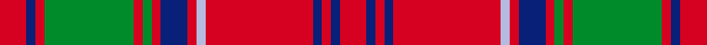

This page is one **sett** — a single exact thread-count. It belongs to the [tartan](/setts/r3db1r1g10r1g1r1db3r1lb1r12db1r1db1r3/)
(the same proportion at any scale), whose colour order is pattern [RBRBRWRBRGRGRBR](/stripes/rbrbrwrbrgrgrbr/).

Part of the [Grant D](/tartans/grant-d/) tartan — the named design grouping this sett with its other cloths.

Sourced from weddslist.  It is a [15 stripe tartan](/stripes/stripes15/).

Original link http://www.weddslist.com/cgi-bin/tartans/pg.pl?source=x

## Thread count
R/6 DB2 R2 G20 R2 G2 R2 DB6 R2 LB2 R24 DB2 R2 DB2 R/6

One full sett is **152 threads**.

## Palette
<table><thead><tr><th>Colour</th><th>Shade</th><th>OKLCh</th></tr></thead><tbody><tr><td>B</td><td><code style="background-color:#B5BBDE;">#B5BBDE</code> <small style="color:#888">#B5BBDE</small></td><td><small style="color:#888">oklch(79.9% 0.050 277.6)</small></td></tr><tr><td>DB</td><td><code style="background-color:#082077;">#082077</code> <small style="color:#888">#082077</small></td><td><small style="color:#888">oklch(30.0% 0.149 265.1)</small></td></tr><tr><td>DG</td><td><code style="background-color:#008B2A;">#008B2A</code> <small style="color:#888">#008B2A</small></td><td><small style="color:#888">oklch(55.4% 0.170 145.9)</small></td></tr><tr><td>DR</td><td><code style="background-color:#D60020;">#D60020</code> <small style="color:#888">#D60020</small></td><td><small style="color:#888">oklch(55.2% 0.224 25.5)</small></td></tr></tbody></table>

# Sample pattern

## Nearest variants

The nearest existing variants by ΔTartan distance, with this cloth at the top so the swatches line up against it.

ΔTartan

Threads

Variant

Sett

—

152

<a href="/variants/s15/r3db1r1g10r1g1r1db3r1lb1r12db1r1db1r3~x2/">Grant D</a>

<a href="/ttd/edit/#slug=r3db1r1g10r1g1r1db3r1lb1r12db1r1db1r3~x4&amp;base=r3db1r1g10r1g1r1db3r1lb1r12db1r1db1r3~x2" title="compare in the TTD">0.00</a>

304

<a href="/variants/s15/r3db1r1g10r1g1r1db3r1lb1r12db1r1db1r3~x4/">Grant D</a>

<a href="/ttd/edit/#slug=r3db1r1g10r1g1r1db3r1w1r12db1r1db1r3~x2&amp;base=r3db1r1g10r1g1r1db3r1lb1r12db1r1db1r3~x2" title="compare in the TTD">0.30</a>

152

<a href="/variants/s15/r3db1r1g10r1g1r1db3r1w1r12db1r1db1r3~x2/">Grant D</a>

<a href="/ttd/edit/#slug=r8db2r2db2r32lb2r2db8r2g2r2g27r2db2r2~x2&amp;base=r3db1r1g10r1g1r1db3r1lb1r12db1r1db1r3~x2" title="compare in the TTD">0.38</a>

368

<a href="/variants/s15/r8db2r2db2r32lb2r2db8r2g2r2g27r2db2r2~x2/">Grant (Official)</a>

<a href="/ttd/edit/#slug=r12db3r4db4r36lb6r4db18r4dg2r4dg36r4db4r8~r2109032-db0906265-lb3203246-dg1405139&amp;base=r3db1r1g10r1g1r1db3r1lb1r12db1r1db1r3~x2" title="compare in the TTD">0.48</a>

278

<a href="/variants/s15/r12db3r4db4r36lb6r4db18r4dg2r4dg36r4db4r8~r2109032-db0906265-lb3203246-dg1405139/">Drummond of Megginch - 1969 Carpet</a>

<a href="/ttd/edit/#slug=r6db2r3dg12r2dg2r2db4r2lb2r14db2r2db1r6~x2~r2109032-db0906265-dg1405139-lb3203246&amp;base=r3db1r1g10r1g1r1db3r1lb1r12db1r1db1r3~x2" title="compare in the TTD">0.48</a>

224

<a href="/variants/s15/r6db2r3dg12r2dg2r2db4r2lb2r14db2r2db1r6~x2~r2109032-db0906265-dg1405139-lb3203246/">Drummond of Megginch - Child's Kilt (c.1890)</a>

<a href="/ttd/edit/#slug=r9db2r21lb2r2db8r2g2r2g17r2db2r8~x2&amp;base=r3db1r1g10r1g1r1db3r1lb1r12db1r1db1r3~x2" title="compare in the TTD">1.65</a>

282

<a href="/variants/s13/r9db2r21lb2r2db8r2g2r2g17r2db2r8~x2/">London, Caledonian</a>

<a href="/ttd/edit/#slug=r12db1r1g8r2db1r1db3r1db1r12g1r1g4~x4&amp;base=r3db1r1g10r1g1r1db3r1lb1r12db1r1db1r3~x2" title="compare in the TTD">2.23</a>

328

<a href="/variants/s14/r12db1r1g8r2db1r1db3r1db1r12g1r1g4~x4/">MacColl</a>

<a href="/ttd/edit/#slug=r12db1r1g8r2db1r1db3r1db1r12g1r1g4~x2&amp;base=r3db1r1g10r1g1r1db3r1lb1r12db1r1db1r3~x2" title="compare in the TTD">2.23</a>

164

<a href="/variants/s14/r12db1r1g8r2db1r1db3r1db1r12g1r1g4~x2/">MacColl</a>

<a href="/ttd/edit/#slug=r45db4r4g48r4db4r4db15r4db4r40g4r4g30&amp;base=r3db1r1g10r1g1r1db3r1lb1r12db1r1db1r3~x2" title="compare in the TTD">2.42</a>

353

<a href="/variants/s14/r45db4r4g48r4db4r4db15r4db4r40g4r4g30/">Bruce Old</a>

<a href="/ttd/edit/#slug=g36r3g3r3db9r3lb2r40db3r3db2r6~x2&amp;base=r3db1r1g10r1g1r1db3r1lb1r12db1r1db1r3~x2" title="compare in the TTD">2.87</a>

368

<a href="/variants/s12/g36r3g3r3db9r3lb2r40db3r3db2r6~x2/">MacLintock - 1880 (Clan)</a>

## Neighbour map

Every grey dot is one of 13620 variants placed by the first two principal components of the ΔTartan feature space (42% of its variance). Red is this tartan; blue dots are its nearest — click one to open its page.

<svg viewBox="0 0 640 380" role="img" style="max-width:100%;height:auto;border:1px solid #e0e0e0;border-radius:4px;display:block" xmlns="http://www.w3.org/2000/svg"><image href="/nn/cloud.v1.png" width="640" height="380"/><a href="/variants/s15/r3db1r1g10r1g1r1db3r1lb1r12db1r1db1r3~x4/"><circle cx="320.9" cy="136.0" r="4" fill="#3465a4"><title>Grant D</title></circle></a><a href="/variants/s15/r3db1r1g10r1g1r1db3r1w1r12db1r1db1r3~x2/"><circle cx="315.7" cy="134.4" r="4" fill="#3465a4"><title>Grant D</title></circle></a><a href="/variants/s15/r8db2r2db2r32lb2r2db8r2g2r2g27r2db2r2~x2/"><circle cx="326.4" cy="115.6" r="4" fill="#3465a4"><title>Grant (Official)</title></circle></a><a href="/variants/s15/r12db3r4db4r36lb6r4db18r4dg2r4dg36r4db4r8~r2109032-db0906265-lb3203246-dg1405139/"><circle cx="289.1" cy="127.7" r="4" fill="#3465a4"><title>Drummond of Megginch - 1969 Carpet</title></circle></a><a href="/variants/s15/r6db2r3dg12r2dg2r2db4r2lb2r14db2r2db1r6~x2~r2109032-db0906265-dg1405139-lb3203246/"><circle cx="327.2" cy="149.0" r="4" fill="#3465a4"><title>Drummond of Megginch - Child's Kilt (c.1890)</title></circle></a><a href="/variants/s13/r9db2r21lb2r2db8r2g2r2g17r2db2r8~x2/"><circle cx="320.6" cy="159.3" r="4" fill="#3465a4"><title>London, Caledonian</title></circle></a><a href="/variants/s14/r12db1r1g8r2db1r1db3r1db1r12g1r1g4~x4/"><circle cx="376.8" cy="159.6" r="4" fill="#3465a4"><title>MacColl</title></circle></a><a href="/variants/s14/r12db1r1g8r2db1r1db3r1db1r12g1r1g4~x2/"><circle cx="376.8" cy="159.6" r="4" fill="#3465a4"><title>MacColl</title></circle></a><a href="/variants/s14/r45db4r4g48r4db4r4db15r4db4r40g4r4g30/"><circle cx="311.7" cy="167.1" r="4" fill="#3465a4"><title>Bruce Old</title></circle></a><a href="/variants/s12/g36r3g3r3db9r3lb2r40db3r3db2r6~x2/"><circle cx="332.4" cy="123.0" r="4" fill="#3465a4"><title>MacLintock - 1880 (Clan)</title></circle></a><circle cx="320.9" cy="136.0" r="5" fill="#c00000"/><text x="320" y="376" text-anchor="middle" font-size="11" fill="#999">ground</text><text x="11" y="190" text-anchor="middle" font-size="11" fill="#999" transform="rotate(-90 11 190)">complexity</text></svg>

ID: /variants/s15/r3db1r1g10r1g1r1db3r1lb1r12db1r1db1r3~x2/
