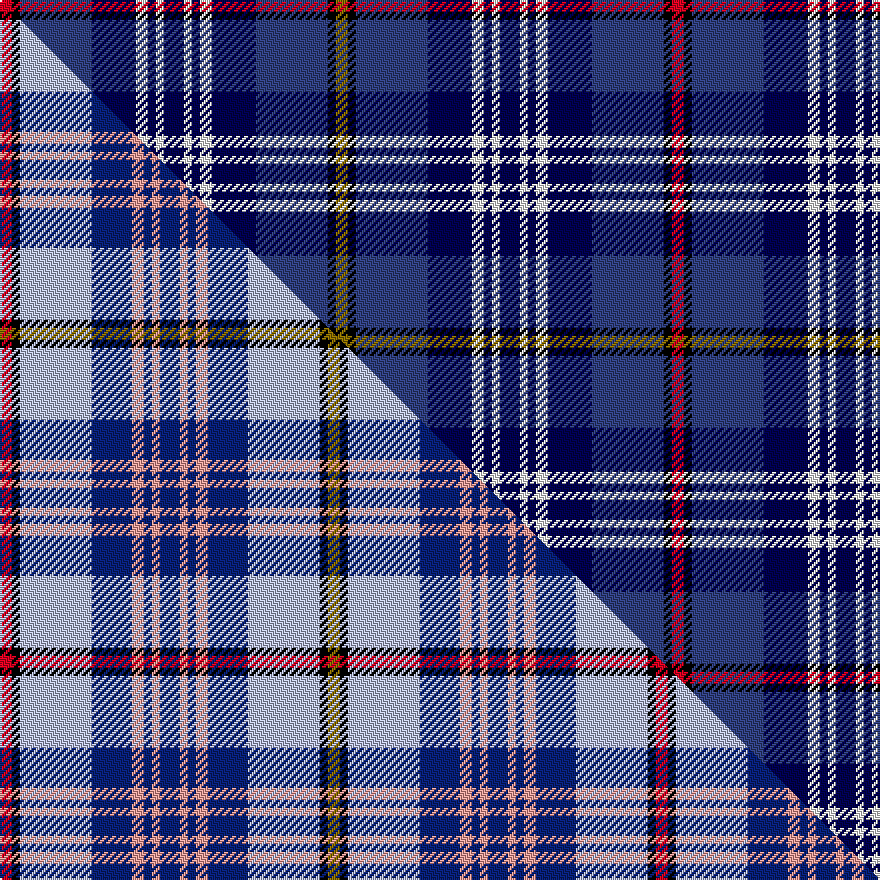

This page is one **sett** — a single exact thread-count. It belongs to the [tartan](/setts/r3k2dbi18db11w3db2w2db5w2db2w3db11dbi18k2y3/)
(the same proportion at any scale), whose colour order is pattern [GKBBWBWBWBWBBKR](/stripes/gkbbwbwbwbwbbkr/).

Part of the [Citadel Military Academy](/tartans/citadel-military-academy/) tartan — the named design grouping this sett with its other cloths.

Sourced from weddslist.  It is a [15 stripe tartan](/stripes/stripes15/).

Original link http://www.weddslist.com/cgi-bin/tartans/pg.pl?source=sts

Dataset <small>— provenance for this record, inherited from the source manifest</small>

<dl class="dataset-prov">
<dt>source</dt><dd><a href="/sources/weddslist/">Weddslist</a></dd>
<dt>data captured from</dt><dd><a href="https://github.com/thetartan/tartan-database/blob/master/data/weddslist/data.csv">https://github.com/thetartan/tartan-database/blob/master/data/weddslist/data.csv</a></dd>
<dt>data date</dt><dd>2016-11-17 <small>(dataset default)</small></dd>
<dt>licence</dt><dd><a href="https://creativecommons.org/licenses/by-nc-nd/4.0/">CC BY-NC-ND 4.0</a></dd>
</dl>

Capture chain <small>— the hands this data passed through, oldest first; each capture carries its own licence</small>

<ol class="capture-chain">
<li><a href="https://www.weddslist.com/tartans/">Weddslist</a> <small>the living privately compiled reference</small></li>
<li><a href="https://github.com/thetartan/tartan-database">thetartan/tartan-database</a> <small>2016-2017</small> · <a href="https://creativecommons.org/licenses/by-nc-nd/4.0/">CC BY-NC-ND 4.0</a> <small>Levko Kravets's frozen compilation — the capture we vendored, and where its CC licence text came from</small></li>
<li>this dictionary <small>captured 2026-06-10 · commit 5bf86c7566</small> <small>each re-capture is a git commit to data/sources</small></li>
</ol>

## Thread count
R/6 K4 DBi36 DB22 W6 DB4 W4 DB10 W4 DB4 W6 DB22 DBi36 K4 Y/6

One full sett is **336 threads**.

## Palette
<table><thead><tr><th>Colour</th><th>Shade</th><th>OKLCh</th></tr></thead><tbody><tr><td>DB</td><td><code style="background-color:#304080;">#304080</code> <small style="color:#888">#304080</small></td><td><small style="color:#888">oklch(39.4% 0.109 270.2)</small></td></tr><tr><td>DB</td><td><code style="background-color:#000050;">#000050</code> <small style="color:#888">#000050</small></td><td><small style="color:#888">oklch(19.5% 0.135 264.1)</small></td></tr><tr><td>K</td><td><code style="background-color:#000000;">#000000</code> <small style="color:#888">#000000</small></td><td><small style="color:#888">oklch(0.0% 0.000 0.0)</small></td></tr><tr><td>W</td><td><code style="background-color:#F7F7F7;">#F7F7F7</code> <small style="color:#888">#F7F7F7</small></td><td><small style="color:#888">oklch(97.6% 0.000 89.9)</small></td></tr><tr><td>R</td><td><code style="background-color:#D60020;">#D60020</code> <small style="color:#888">#D60020</small></td><td><small style="color:#888">oklch(55.2% 0.224 25.5)</small></td></tr><tr><td>Y</td><td><code style="background-color:#8B6E00;">#8B6E00</code> <small style="color:#888">#8B6E00</small></td><td><small style="color:#888">oklch(55.1% 0.113 90.4)</small></td></tr></tbody></table>

# Sample pattern

## Compared to the master

This cloth is one sett of its design; the master sett (the exemplar the design is anchored on) is below for comparison.

Its **ΔTartan distance** from the master is **1.27** — the same measure the nearest-tartans table ranks by (0 is identical; a re-scale of the same cloth is near 0, a recolour or a different proportion further).

<figure class="master-compare" style="margin:0">

this sett
master sett ★

<figcaption style="color:#888;font-size:smaller">One weave of this sett against the <a href="/setts/r3k2lb18db10lr3db2lr2db5lr2db2lr3db10lb18k2y3/">master sett ★</a>, split on the diagonal: a shared proportion runs seamlessly across it with only the shades shifting; a different proportion breaks on it.</figcaption>
</figure>

## Nearest tartan variants

The nearest existing variants by ΔTartan distance, with this cloth at the top so the swatches line up against it.

ΔTartan

Threads

Variant

Sett

—

336

<a href="/variants/s15/r3k2dbi18db11w3db2w2db5w2db2w3db11dbi18k2y3~x2~dbi1604274-db0805267/">Citadel, Military Academy</a>

<a href="/ttd/edit/#slug=r3k2lb18dt11w3dt2w2dt5w2dt2w3dt11lb18k2y3~x2~dt1204274&amp;base=r3k2dbi18db11w3db2w2db5w2db2w3db11dbi18k2y3~x2~dbi1604274-db0805267" title="compare in the TTD">0.22</a>

336

<a href="/variants/s15/r3k2lb18db11w3db2w2db5w2db2w3db11lb18k2y3~x2~db1204274/">Citadel Military Academy Regimental Tartan</a>

<a href="/ttd/edit/#slug=r3k2lb18db10lr3db2lr2db5lr2db2lr3db10lb18k2y3~x2&amp;base=r3k2dbi18db11w3db2w2db5w2db2w3db11dbi18k2y3~x2~dbi1604274-db0805267" title="compare in the TTD">1.27</a>

328

<a href="/variants/s15/r3k2lb18db10lr3db2lr2db5lr2db2lr3db10lb18k2y3~x2/">Citadel Military Academy</a>

<a href="/ttd/edit/#slug=db4dy3db22r6w2k6w2db6n20k3n4~x2&amp;base=r3k2dbi18db11w3db2w2db5w2db2w3db11dbi18k2y3~x2~dbi1604274-db0805267" title="compare in the TTD">2.52</a>

296

<a href="/variants/s11/db4dy3db22r6w2k6w2db6n20k3n4~x2/">Asman Hunting (Name)</a>

<a href="/ttd/edit/#slug=r6b2r2b8k2y2k2y2k10db2k2db23w2db2w2~x2&amp;base=r3k2dbi18db11w3db2w2db5w2db2w3db11dbi18k2y3~x2~dbi1604274-db0805267" title="compare in the TTD">2.53</a>

260

<a href="/variants/s15/r6b2r2b8k2y2k2y2k10db2k2db23w2db2w2~x2/">Estes</a>

<a href="/ttd/edit/#slug=db53g10k20y5k5w5k7r18db10k6db6w6&amp;base=r3k2dbi18db11w3db2w2db5w2db2w3db11dbi18k2y3~x2~dbi1604274-db0805267" title="compare in the TTD">2.55</a>

243

<a href="/variants/s12/db53g10k20y5k5w5k7r18db10k6db6w6/">Broager (Name)</a>

<a href="/ttd/edit/#slug=db20b6k8y2k4w4k4db13r7k4w2~x2&amp;base=r3k2dbi18db11w3db2w2db5w2db2w3db11dbi18k2y3~x2~dbi1604274-db0805267" title="compare in the TTD">2.60</a>

252

<a href="/variants/s11/db20b6k8y2k4w4k4db13r7k4w2~x2/">Stewart Black</a>

<a href="/ttd/edit/#slug=db20dr3k10lo2lb15w2lb4w2lb15lo2k10dr3db20~x2&amp;base=r3k2dbi18db11w3db2w2db5w2db2w3db11dbi18k2y3~x2~dbi1604274-db0805267" title="compare in the TTD">2.68</a>

352

<a href="/variants/s13/db20dr3k10lo2lb15w2lb4w2lb15lo2k10dr3db20~x2/">U.S. Forces Thurso</a>

<a href="/ttd/edit/#slug=db14k2g3k2g3k2db12dr4db10dr3db10dr4lb28dr4~x2&amp;base=r3k2dbi18db11w3db2w2db5w2db2w3db11dbi18k2y3~x2~dbi1604274-db0805267" title="compare in the TTD">2.69</a>

368

<a href="/variants/s14/db14k2g3k2g3k2db12dr4db10dr3db10dr4lb28dr4~x2/">Wcwm 1138</a>

<a href="/ttd/edit/#slug=db2r5db8y2r3k9r2db18k9dbi4w2~x2~db1108266-dbi1208266&amp;base=r3k2dbi18db11w3db2w2db5w2db2w3db11dbi18k2y3~x2~dbi1604274-db0805267" title="compare in the TTD">2.69</a>

248

<a href="/variants/s11/db2r5db8y2r3k9r2db18k9dbi4w2~x2~db1108266-dbi1208266/">Royal Gourock Yacht Club, The</a>

<a href="/ttd/edit/#slug=b2w1b12db6k3dg1w1dg4w2k1w1r1~x4&amp;base=r3k2dbi18db11w3db2w2db5w2db2w3db11dbi18k2y3~x2~dbi1604274-db0805267" title="compare in the TTD">2.72</a>

268

<a href="/variants/s12/b2w1b12db6k3dg1w1dg4w2k1w1r1~x4/">Diana Princess of Wales Memorial, The</a>

## Neighbour map

Every grey dot is one of 13620 variants placed by the first two principal components of the ΔTartan feature space (42% of its variance). Red is this tartan; blue dots are its nearest — click one to open its page.

<svg viewBox="0 0 640 380" role="img" style="max-width:100%;height:auto;border:1px solid #e0e0e0;border-radius:4px;display:block" xmlns="http://www.w3.org/2000/svg"><image href="/nn/cloud.v1.png" width="640" height="380"/><a href="/variants/s15/r3k2lb18db11w3db2w2db5w2db2w3db11lb18k2y3~x2~db1204274/"><circle cx="121.5" cy="120.1" r="4" fill="#3465a4"><title>Citadel Military Academy Regimental Tartan</title></circle></a><a href="/variants/s15/r3k2lb18db10lr3db2lr2db5lr2db2lr3db10lb18k2y3~x2/"><circle cx="130.6" cy="121.3" r="4" fill="#3465a4"><title>Citadel Military Academy</title></circle></a><a href="/variants/s11/db4dy3db22r6w2k6w2db6n20k3n4~x2/"><circle cx="158.2" cy="138.9" r="4" fill="#3465a4"><title>Asman Hunting (Name)</title></circle></a><a href="/variants/s15/r6b2r2b8k2y2k2y2k10db2k2db23w2db2w2~x2/"><circle cx="120.1" cy="97.0" r="4" fill="#3465a4"><title>Estes</title></circle></a><a href="/variants/s12/db53g10k20y5k5w5k7r18db10k6db6w6/"><circle cx="144.6" cy="114.8" r="4" fill="#3465a4"><title>Broager (Name)</title></circle></a><a href="/variants/s11/db20b6k8y2k4w4k4db13r7k4w2~x2/"><circle cx="123.8" cy="142.7" r="4" fill="#3465a4"><title>Stewart Black</title></circle></a><a href="/variants/s13/db20dr3k10lo2lb15w2lb4w2lb15lo2k10dr3db20~x2/"><circle cx="92.8" cy="137.1" r="4" fill="#3465a4"><title>U.S. Forces Thurso</title></circle></a><a href="/variants/s14/db14k2g3k2g3k2db12dr4db10dr3db10dr4lb28dr4~x2/"><circle cx="177.5" cy="124.0" r="4" fill="#3465a4"><title>Wcwm 1138</title></circle></a><a href="/variants/s11/db2r5db8y2r3k9r2db18k9dbi4w2~x2~db1108266-dbi1208266/"><circle cx="133.6" cy="144.6" r="4" fill="#3465a4"><title>Royal Gourock Yacht Club, The</title></circle></a><a href="/variants/s12/b2w1b12db6k3dg1w1dg4w2k1w1r1~x4/"><circle cx="120.1" cy="117.3" r="4" fill="#3465a4"><title>Diana Princess of Wales Memorial, The</title></circle></a><circle cx="136.5" cy="124.9" r="5" fill="#c00000"/><text x="320" y="376" text-anchor="middle" font-size="11" fill="#999">ground</text><text x="11" y="190" text-anchor="middle" font-size="11" fill="#999" transform="rotate(-90 11 190)">complexity</text></svg>

ID: /variants/s15/r3k2dbi18db11w3db2w2db5w2db2w3db11dbi18k2y3~x2~dbi1604274-db0805267/
