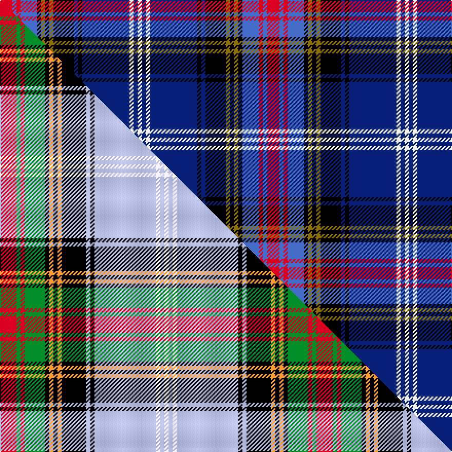

This page is one **sett** — a single exact thread-count. It belongs to the [tartan](/setts/r6b2r2b8k2y2k2y2k10db2k2db23w2db2w2/)
(the same proportion at any scale), whose colour order is pattern [RBRBKGKGKBKBWBW](/stripes/rbrbkgkgkbkbwbw/).

Part of the [Estes](/tartans/estes/) tartan — the named design grouping this sett with its other cloths.

Sourced from weddslist.  It is a [15 stripe tartan](/stripes/stripes15/).

Original link [http://www.weddslist.com/cgi-bin/tartans/pg.pl?source=sts](http://www.weddslist.com/cgi-bin/tartans/pg.pl?source=sts)

Dataset <small>— provenance for this record, inherited from the source manifest</small>

<dl class="dataset-prov">
<dt>source</dt><dd><a href="/sources/weddslist/">Weddslist</a></dd>
<dt>data captured from</dt><dd><a href="https://github.com/thetartan/tartan-database/blob/master/data/weddslist/data.csv">https://github.com/thetartan/tartan-database/blob/master/data/weddslist/data.csv</a></dd>
<dt>data date</dt><dd>2016-11-17 <small>(dataset default)</small></dd>
<dt>licence</dt><dd><a href="https://creativecommons.org/licenses/by-nc-nd/4.0/">CC BY-NC-ND 4.0</a></dd>
</dl>

Capture chain <small>— the hands this data passed through, oldest first; each capture carries its own licence</small>

<ol class="capture-chain">
<li><a href="https://www.weddslist.com/tartans/">Weddslist</a> <small>the living privately compiled reference</small></li>
<li><a href="https://github.com/thetartan/tartan-database">thetartan/tartan-database</a> <small>2016-2017</small> · <a href="https://creativecommons.org/licenses/by-nc-nd/4.0/">CC BY-NC-ND 4.0</a> <small>Levko Kravets's frozen compilation — the capture we vendored, and where its CC licence text came from</small></li>
<li>this dictionary <small>captured 2026-06-10 · commit 5bf86c7566</small> <small>each re-capture is a git commit to data/sources</small></li>
</ol>

## Thread count
R/12 B4 R4 B16 K4 Y4 K4 Y4 K20 DB4 K4 DB46 W4 DB4 W/4

One full sett is **260 threads**.

## Palette
<table><thead><tr><th>Colour</th><th>Shade</th><th>OKLCh</th></tr></thead><tbody><tr><td>DB</td><td><code style="background-color:#082077;">#082077</code> <small style="color:#888">#082077</small></td><td><small style="color:#888">oklch(30.0% 0.149 265.1)</small></td></tr><tr><td>B</td><td><code style="background-color:#466CC8;">#466CC8</code> <small style="color:#888">#466CC8</small></td><td><small style="color:#888">oklch(55.1% 0.149 265.0)</small></td></tr><tr><td>K</td><td><code style="background-color:#000000;">#000000</code> <small style="color:#888">#000000</small></td><td><small style="color:#888">oklch(0.0% 0.000 0.0)</small></td></tr><tr><td>W</td><td><code style="background-color:#F7F7F7;">#F7F7F7</code> <small style="color:#888">#F7F7F7</small></td><td><small style="color:#888">oklch(97.6% 0.000 89.9)</small></td></tr><tr><td>R</td><td><code style="background-color:#D60020;">#D60020</code> <small style="color:#888">#D60020</small></td><td><small style="color:#888">oklch(55.2% 0.224 25.5)</small></td></tr><tr><td>Y</td><td><code style="background-color:#8B6E00;">#8B6E00</code> <small style="color:#888">#8B6E00</small></td><td><small style="color:#888">oklch(55.1% 0.113 90.4)</small></td></tr></tbody></table>

# Sample pattern

## Compared to the master

This cloth is one sett of its design; the master sett (the exemplar the design is anchored on) is below for comparison.

Its **ΔTartan distance** from the master is **1.48** — the same measure the nearest-tartans table ranks by (0 is identical; a re-scale of the same cloth is near 0, a recolour or a different proportion further).

<figure class="master-compare" style="margin:0">

this sett
master sett ★

<figcaption style="color:#888;font-size:smaller">One weave of this sett against the <a href="/setts/r4g1r1g5k1lo1k1lo1k6lb1k1lb15w1lb1w1/">master sett ★</a>, split on the diagonal: a shared proportion runs seamlessly across it with only the shades shifting; a different proportion breaks on it.</figcaption>
</figure>

## Nearest tartan variants

The nearest existing variants by ΔTartan distance, with this cloth at the top so the swatches line up against it.

ΔTartan

Threads

Variant

Sett

—

260

<a href="/variants/s15/r6b2r2b8k2y2k2y2k10db2k2db23w2db2w2~x2/">Estes</a>

<a href="/ttd/edit/#slug=r6g2r2g8k2y2k2y2k10db2k2db23w2db2w2~x2&amp;base=r6b2r2b8k2y2k2y2k10db2k2db23w2db2w2~x2" title="compare in the TTD">0.60</a>

260

<a href="/variants/s15/r6g2r2g8k2y2k2y2k10db2k2db23w2db2w2~x2/">Estes Family Tartan</a>

<a href="/ttd/edit/#slug=db24lo2r12k3w2k3lo2k4db4k4lo2k3w2k3dbi14lo2dbi24~x2~db1106275-dbi1406275&amp;base=r6b2r2b8k2y2k2y2k10db2k2db23w2db2w2~x2" title="compare in the TTD">1.58</a>

344

<a href="/variants/s17/db24lo2r12k3w2k3lo2k4db4k4lo2k3w2k3dbi14lo2dbi24~x2~db1106275-dbi1406275/">Total</a>

<a href="/ttd/edit/#slug=k5lb5y2lb5k5db25k5lb3dg5r2dg5lb3k5~x2&amp;base=r6b2r2b8k2y2k2y2k10db2k2db23w2db2w2~x2" title="compare in the TTD">2.10</a>

280

<a href="/variants/s13/k5lb5y2lb5k5db25k5lb3dg5r2dg5lb3k5~x2/">Liberton</a>

<a href="/ttd/edit/#slug=w2r5k2ly3k4db28r4dg14k4w2~x2&amp;base=r6b2r2b8k2y2k2y2k10db2k2db23w2db2w2~x2" title="compare in the TTD">2.32</a>

264

<a href="/variants/s10/w2r5k2ly3k4db28r4dg14k4w2~x2/">Loch Lomond &amp; the Trossachs (Fashion</a>

<a href="/ttd/edit/#slug=db24g2db12k2w2k3dp2k3t4k3dp2k3w2k2r12g2t24~x2&amp;base=r6b2r2b8k2y2k2y2k10db2k2db23w2db2w2~x2" title="compare in the TTD">2.43</a>

320

<a href="/variants/s17/db24g2db12k2w2k3dp2k3t4k3dp2k3w2k2r12g2t24~x2/">Selkirk, New (District)</a>

<a href="/ttd/edit/#slug=db33r8k12dy2k4w4k4g12db8k4db4w2~x2&amp;base=r6b2r2b8k2y2k2y2k10db2k2db23w2db2w2~x2" title="compare in the TTD">2.48</a>

318

<a href="/variants/s12/db33r8k12dy2k4w4k4g12db8k4db4w2~x2/">MacLulich</a>

<a href="/ttd/edit/#slug=db33r8k12y2k4w4k4g12db8k4db4w2~x2&amp;base=r6b2r2b8k2y2k2y2k10db2k2db23w2db2w2~x2" title="compare in the TTD">2.48</a>

318

<a href="/variants/s12/db33r8k12y2k4w4k4g12db8k4db4w2~x2/">MacBeth/Stewart Brydone 1862</a>

<a href="/ttd/edit/#slug=db24b2db12k2w2k3dg2k3n4k3dg2k3w2k2r12b2n24~x2~db0805267-n1604274&amp;base=r6b2r2b8k2y2k2y2k10db2k2db23w2db2w2~x2" title="compare in the TTD">2.52</a>

320

<a href="/variants/s17/db24b2db12k2w2k3dg2k3dbi4k3dg2k3w2k2r12b2dbi24~x2~db0805267-dbi1604274/">Selkirk</a>

<a href="/ttd/edit/#slug=r3k2n18db11w3db2w2db5w2db2w3db11n18k2y3~x2~n1604274-db0805267&amp;base=r6b2r2b8k2y2k2y2k10db2k2db23w2db2w2~x2" title="compare in the TTD">2.53</a>

336

<a href="/variants/s15/r3k2dbi18db11w3db2w2db5w2db2w3db11dbi18k2y3~x2~dbi1604274-db0805267/">Citadel, Military Academy</a>

<a href="/ttd/edit/#slug=db53g10k20y5k5w5k7r18db10k6db6w6&amp;base=r6b2r2b8k2y2k2y2k10db2k2db23w2db2w2~x2" title="compare in the TTD">2.55</a>

243

<a href="/variants/s12/db53g10k20y5k5w5k7r18db10k6db6w6/">Broager (Name)</a>

## Neighbour map

Every grey dot is one of 13621 variants placed by the first two principal components of the ΔTartan feature space (42% of its variance). Red is this tartan; blue dots are its nearest — click one to open its page.

<svg viewBox="0 0 640 380" role="img" style="max-width:100%;height:auto;border:1px solid #e0e0e0;border-radius:4px;display:block" xmlns="http://www.w3.org/2000/svg"><image href="/nn/cloud.v1.png" width="640" height="380"/><a href="/variants/s15/r6g2r2g8k2y2k2y2k10db2k2db23w2db2w2~x2/"><circle cx="115.0" cy="97.5" r="4" fill="#3465a4"><title>Estes Family Tartan</title></circle></a><a href="/variants/s17/db24lo2r12k3w2k3lo2k4db4k4lo2k3w2k3dbi14lo2dbi24~x2~db1106275-dbi1406275/"><circle cx="106.4" cy="97.6" r="4" fill="#3465a4"><title>Total</title></circle></a><a href="/variants/s13/k5lb5y2lb5k5db25k5lb3dg5r2dg5lb3k5~x2/"><circle cx="87.2" cy="113.5" r="4" fill="#3465a4"><title>Liberton</title></circle></a><a href="/variants/s10/w2r5k2ly3k4db28r4dg14k4w2~x2/"><circle cx="145.4" cy="110.1" r="4" fill="#3465a4"><title>Loch Lomond &amp; the Trossachs (Fashion</title></circle></a><a href="/variants/s17/db24g2db12k2w2k3dp2k3t4k3dp2k3w2k2r12g2t24~x2/"><circle cx="87.2" cy="83.2" r="4" fill="#3465a4"><title>Selkirk, New (District)</title></circle></a><a href="/variants/s12/db33r8k12dy2k4w4k4g12db8k4db4w2~x2/"><circle cx="163.1" cy="103.3" r="4" fill="#3465a4"><title>MacLulich</title></circle></a><a href="/variants/s12/db33r8k12y2k4w4k4g12db8k4db4w2~x2/"><circle cx="162.1" cy="103.0" r="4" fill="#3465a4"><title>MacBeth/Stewart Brydone 1862</title></circle></a><a href="/variants/s17/db24b2db12k2w2k3dg2k3dbi4k3dg2k3w2k2r12b2dbi24~x2~db0805267-dbi1604274/"><circle cx="101.3" cy="85.1" r="4" fill="#3465a4"><title>Selkirk</title></circle></a><a href="/variants/s15/r3k2dbi18db11w3db2w2db5w2db2w3db11dbi18k2y3~x2~dbi1604274-db0805267/"><circle cx="136.4" cy="125.1" r="4" fill="#3465a4"><title>Citadel, Military Academy</title></circle></a><a href="/variants/s12/db53g10k20y5k5w5k7r18db10k6db6w6/"><circle cx="144.5" cy="115.1" r="4" fill="#3465a4"><title>Broager (Name)</title></circle></a><circle cx="119.9" cy="97.1" r="5" fill="#c00000"/><text x="320" y="376" text-anchor="middle" font-size="11" fill="#999">ground</text><text x="11" y="190" text-anchor="middle" font-size="11" fill="#999" transform="rotate(-90 11 190)">complexity</text></svg>

ID: /variants/s15/r6b2r2b8k2y2k2y2k10db2k2db23w2db2w2~x2/
