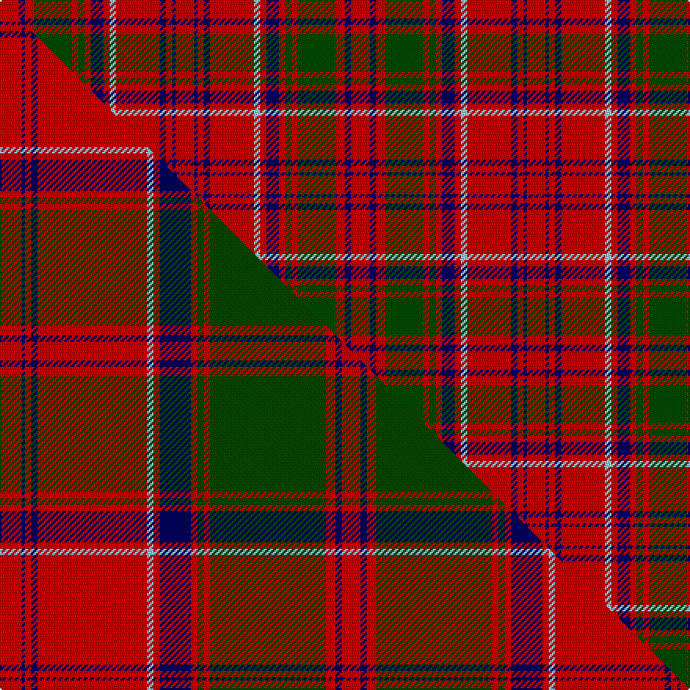

This page is one **sett** — a single exact thread-count. It belongs to the [tartan](/setts/r6db2r3dg12r2dg2r2db4r2lb2r14db2r2db1r6/)
(the same proportion at any scale), whose colour order is pattern [RBRBRWRBRGRGRBR](/stripes/rbrbrwrbrgrgrbr/).

Part of the [Drummond of Megginch](/tartans/drummond-of-megginch/) tartan — the named design grouping this sett with its other cloths.

Sourced from research.  It is a [15 stripe tartan](/stripes/stripes15/).

Original link https://tartandictionary.org/posts/drummondsofmegginch/

Dataset <small>— provenance for this record, inherited from the source manifest</small>

<dl class="dataset-prov">
<dt>source</dt><dd><a href="/sources/research/">Our own research</a></dd>
<dt>licence</dt><dd><a href="https://creativecommons.org/licenses/by-sa/4.0/">CC BY-SA 4.0</a></dd>
<dt>captured</dt><dd>2025-11-01</dd>
</dl>

## Thread count
R/12 DB4 R6 DG24 R4 DG4 R4 DB8 R4 LB4 R28 DB4 R4 DB2 R/12

One full sett is **224 threads**.

## Palette

Palette (<a href="/colour/tartan-register/">Tartan Register</a>)
<table><thead><tr><th>Colour</th><th>Shade</th><th>Ref</th><th>OKLCh</th></tr></thead><tbody><tr><td>DB</td><td><code style="background-color:#000064;">#000064</code> <small style="color:#888">#000064</small></td><td><a href="/colour/tartan-register/#s-000064" title="Dark Blue">DB6</a></td><td><small style="color:#888">oklch(22.7% 0.158 264.1)</small></td></tr><tr><td>DG</td><td><code style="background-color:#004C00;">#004C00</code> <small style="color:#888">#004C00</small></td><td><a href="/colour/tartan-register/#s-004c00" title="Green">G12</a></td><td><small style="color:#888">oklch(36.1% 0.123 142.5)</small></td></tr><tr><td>LB</td><td><code style="background-color:#98C8E8;">#98C8E8</code> <small style="color:#888">#98C8E8</small></td><td><a href="/colour/tartan-register/#s-98c8e8" title="Light Blue">LB1</a></td><td><small style="color:#888">oklch(81.0% 0.068 237.9)</small></td></tr><tr><td>R</td><td><code style="background-color:#C80000;">#C80000</code> <small style="color:#888">#C80000</small></td><td><a href="/colour/tartan-register/#s-c80000" title="Red">R5</a></td><td><small style="color:#888">oklch(52.3% 0.215 29.2)</small></td></tr></tbody></table>

# Sample pattern

## Compared to the master

This cloth is one sett of its design; the master sett (the exemplar the design is anchored on) is below for comparison.

Its **ΔTartan distance** from the master is **0.75** — the same measure the nearest-tartans table ranks by (0 is identical; a re-scale of the same cloth is near 0, a recolour or a different proportion further).

<figure class="master-compare" style="margin:0">

this sett
master sett ★

<figcaption style="color:#888;font-size:smaller">One weave of this sett against the <a href="/setts/r7db1r2db2r35lb2r2db10r2dg2r2dg37r3db2r6/">master sett ★</a>, split on the diagonal: a shared proportion runs seamlessly across it with only the shades shifting; a different proportion breaks on it.</figcaption>
</figure>

## Nearest tartan variants

The nearest existing variants by ΔTartan distance, with this cloth at the top so the swatches line up against it.

ΔTartan

Threads

Variant

Sett

—

224

<a href="/variants/s15/r6db2r3dg12r2dg2r2db4r2lb2r14db2r2db1r6~x2~r2109032-db0906265-dg1405139-lb3203246/">Drummond of Megginch - Child's Kilt (c.1890)</a>

<a href="/ttd/edit/#slug=r12db3r4db4r36lb6r4db18r4dg2r4dg36r4db4r8~r2109032-db0906265-lb3203246-dg1405139&amp;base=r6db2r3dg12r2dg2r2db4r2lb2r14db2r2db1r6~x2~r2109032-db0906265-dg1405139-lb3203246" title="compare in the TTD">0.46</a>

278

<a href="/variants/s15/r12db3r4db4r36lb6r4db18r4dg2r4dg36r4db4r8~r2109032-db0906265-lb3203246-dg1405139/">Drummond of Megginch - 1969 Carpet</a>

<a href="/ttd/edit/#slug=r3db1r1g10r1g1r1db3r1lb1r12db1r1db1r3~x4&amp;base=r6db2r3dg12r2dg2r2db4r2lb2r14db2r2db1r6~x2~r2109032-db0906265-dg1405139-lb3203246" title="compare in the TTD">0.57</a>

304

<a href="/variants/s15/r3db1r1g10r1g1r1db3r1lb1r12db1r1db1r3~x4/">Grant D</a>

<a href="/ttd/edit/#slug=r3db1r1g10r1g1r1db3r1lb1r12db1r1db1r3~x2&amp;base=r6db2r3dg12r2dg2r2db4r2lb2r14db2r2db1r6~x2~r2109032-db0906265-dg1405139-lb3203246" title="compare in the TTD">0.57</a>

152

<a href="/variants/s15/r3db1r1g10r1g1r1db3r1lb1r12db1r1db1r3~x2/">Grant D</a>

<a href="/ttd/edit/#slug=r8db2r2db2r32lb2r2db8r2g2r2g27r2db2r2~x2&amp;base=r6db2r3dg12r2dg2r2db4r2lb2r14db2r2db1r6~x2~r2109032-db0906265-dg1405139-lb3203246" title="compare in the TTD">0.62</a>

368

<a href="/variants/s15/r8db2r2db2r32lb2r2db8r2g2r2g27r2db2r2~x2/">Grant (Official)</a>

<a href="/ttd/edit/#slug=r3db1r1g10r1g1r1db3r1w1r12db1r1db1r3~x2&amp;base=r6db2r3dg12r2dg2r2db4r2lb2r14db2r2db1r6~x2~r2109032-db0906265-dg1405139-lb3203246" title="compare in the TTD">0.83</a>

152

<a href="/variants/s15/r3db1r1g10r1g1r1db3r1w1r12db1r1db1r3~x2/">Grant D</a>

<a href="/ttd/edit/#slug=r9db2r21lb2r2db8r2g2r2g17r2db2r8~x2&amp;base=r6db2r3dg12r2dg2r2db4r2lb2r14db2r2db1r6~x2~r2109032-db0906265-dg1405139-lb3203246" title="compare in the TTD">1.76</a>

282

<a href="/variants/s13/r9db2r21lb2r2db8r2g2r2g17r2db2r8~x2/">London, Caledonian</a>

<a href="/ttd/edit/#slug=db4r1db1r18db10r1g1r6g10r6w1r4db1~x2&amp;base=r6db2r3dg12r2dg2r2db4r2lb2r14db2r2db1r6~x2~r2109032-db0906265-dg1405139-lb3203246" title="compare in the TTD">2.22</a>

246

<a href="/variants/s13/db4r1db1r18db10r1g1r6g10r6w1r4db1~x2/">Cameron of Locheil</a>

<a href="/ttd/edit/#slug=r9dp2r21y2r2dp8r2g2r2g17r2dp2r8~x2&amp;base=r6db2r3dg12r2dg2r2db4r2lb2r14db2r2db1r6~x2~r2109032-db0906265-dg1405139-lb3203246" title="compare in the TTD">2.23</a>

282

<a href="/variants/s13/r9dp2r21y2r2dp8r2g2r2g17r2dp2r8~x2/">London Caledonian Games Association</a>

<a href="/ttd/edit/#slug=r12g1r1dy8r2dy1r1db3r1dy1r12g1r1g4~x2&amp;base=r6db2r3dg12r2dg2r2db4r2lb2r14db2r2db1r6~x2~r2109032-db0906265-dg1405139-lb3203246" title="compare in the TTD">2.27</a>

164

<a href="/variants/s14/r12g1r1dy8r2dy1r1db3r1dy1r12g1r1g4~x2/">MacColl #2</a>

<a href="/ttd/edit/#slug=r12db1r1g8r2db1r1db3r1db1r12g1r1g4~x4&amp;base=r6db2r3dg12r2dg2r2db4r2lb2r14db2r2db1r6~x2~r2109032-db0906265-dg1405139-lb3203246" title="compare in the TTD">2.27</a>

328

<a href="/variants/s14/r12db1r1g8r2db1r1db3r1db1r12g1r1g4~x4/">MacColl</a>

## Neighbour map

Every grey dot is one of 13620 variants placed by the first two principal components of the ΔTartan feature space (42% of its variance). Red is this tartan; blue dots are its nearest — click one to open its page.

<svg viewBox="0 0 640 380" role="img" style="max-width:100%;height:auto;border:1px solid #e0e0e0;border-radius:4px;display:block" xmlns="http://www.w3.org/2000/svg"><image href="/nn/cloud.v1.png" width="640" height="380"/><a href="/variants/s15/r12db3r4db4r36lb6r4db18r4dg2r4dg36r4db4r8~r2109032-db0906265-lb3203246-dg1405139/"><circle cx="289.1" cy="127.7" r="4" fill="#3465a4"><title>Drummond of Megginch - 1969 Carpet</title></circle></a><a href="/variants/s15/r3db1r1g10r1g1r1db3r1lb1r12db1r1db1r3~x4/"><circle cx="320.9" cy="136.0" r="4" fill="#3465a4"><title>Grant D</title></circle></a><a href="/variants/s15/r3db1r1g10r1g1r1db3r1lb1r12db1r1db1r3~x2/"><circle cx="320.9" cy="136.0" r="4" fill="#3465a4"><title>Grant D</title></circle></a><a href="/variants/s15/r8db2r2db2r32lb2r2db8r2g2r2g27r2db2r2~x2/"><circle cx="326.4" cy="115.6" r="4" fill="#3465a4"><title>Grant (Official)</title></circle></a><a href="/variants/s15/r3db1r1g10r1g1r1db3r1w1r12db1r1db1r3~x2/"><circle cx="315.7" cy="134.4" r="4" fill="#3465a4"><title>Grant D</title></circle></a><a href="/variants/s13/r9db2r21lb2r2db8r2g2r2g17r2db2r8~x2/"><circle cx="320.6" cy="159.3" r="4" fill="#3465a4"><title>London, Caledonian</title></circle></a><a href="/variants/s13/db4r1db1r18db10r1g1r6g10r6w1r4db1~x2/"><circle cx="320.4" cy="138.4" r="4" fill="#3465a4"><title>Cameron of Locheil</title></circle></a><a href="/variants/s13/r9dp2r21y2r2dp8r2g2r2g17r2dp2r8~x2/"><circle cx="341.3" cy="164.0" r="4" fill="#3465a4"><title>London Caledonian Games Association</title></circle></a><a href="/variants/s14/r12g1r1dy8r2dy1r1db3r1dy1r12g1r1g4~x2/"><circle cx="366.3" cy="148.0" r="4" fill="#3465a4"><title>MacColl #2</title></circle></a><a href="/variants/s14/r12db1r1g8r2db1r1db3r1db1r12g1r1g4~x4/"><circle cx="376.8" cy="159.6" r="4" fill="#3465a4"><title>MacColl</title></circle></a><circle cx="327.2" cy="149.0" r="5" fill="#c00000"/><text x="320" y="376" text-anchor="middle" font-size="11" fill="#999">ground</text><text x="11" y="190" text-anchor="middle" font-size="11" fill="#999" transform="rotate(-90 11 190)">complexity</text></svg>

ID: /variants/s15/r6db2r3dg12r2dg2r2db4r2lb2r14db2r2db1r6~x2~r2109032-db0906265-dg1405139-lb3203246/
