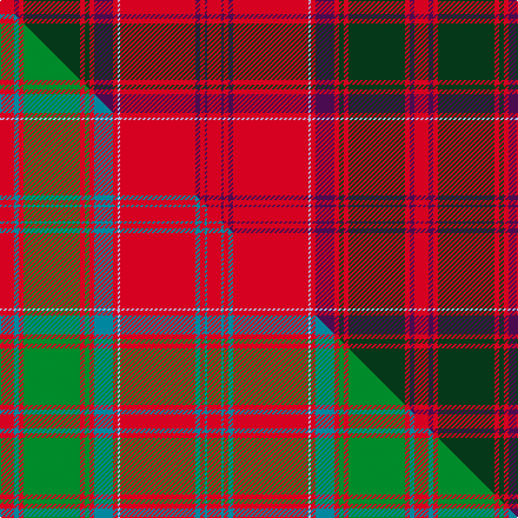

This page is one **sett** — a single exact thread-count. It belongs to the [tartan](/setts/r6dp2r2dg24r2dg2r2dp8r2lb1r32dp2r2dp1r6/)
(the same proportion at any scale), whose colour order is pattern [RBRBRWRBRGRGRBR](/stripes/rbrbrwrbrgrgrbr/).

Part of the [Drummond](/tartans/drummond-2/) tartan — the named design grouping this sett with its other cloths.

Sourced from tartans-authority.  It is a [15 stripe tartan](/stripes/stripes15/).

Original link http://www.tartansauthority.com/tartan-ferret/display/457/

## Register references

External register numbers recorded for this tartan.

- Scottish Tartans Authority (ITI): 457

## Thread count
R/12 DP4 R4 DG48 R4 DG4 R4 DP16 R4 LB2 R64 DP4 R4 DP2 R/12

One full sett is **352 threads**.

## Palette
<table><thead><tr><th>Colour</th><th>Shade</th><th>OKLCh</th></tr></thead><tbody><tr><td>LB</td><td><code style="background-color:#B5BBDE;">#B5BBDE</code> <small style="color:#888">#B5BBDE</small></td><td><small style="color:#888">oklch(79.9% 0.050 277.6)</small></td></tr><tr><td>DP</td><td><code style="background-color:#4B0B4F;">#4B0B4F</code> <small style="color:#888">#4B0B4F</small></td><td><small style="color:#888">oklch(30.1% 0.125 325.4)</small></td></tr><tr><td>DG</td><td><code style="background-color:#053819;">#053819</code> <small style="color:#888">#053819</small></td><td><small style="color:#888">oklch(30.0% 0.075 151.3)</small></td></tr><tr><td>R</td><td><code style="background-color:#D60020;">#D60020</code> <small style="color:#888">#D60020</small></td><td><small style="color:#888">oklch(55.2% 0.224 25.5)</small></td></tr></tbody></table>

# Sample pattern

## Compared to the master

This cloth is one sett of its design; the master sett (the exemplar the design is anchored on) is below for comparison.

Its **ΔTartan distance** from the master is **1.34** — the same measure the nearest-tartans table ranks by (0 is identical; a re-scale of the same cloth is near 0, a recolour or a different proportion further).

<figure class="master-compare" style="margin:0">

this sett
master sett ★

<figcaption style="color:#888;font-size:smaller">One weave of this sett against the <a href="/setts/r6t2r2g24r2g2r2t8r2lb1r32t2r2t1r6/">master sett ★</a>, split on the diagonal: a shared proportion runs seamlessly across it with only the shades shifting; a different proportion breaks on it.</figcaption>
</figure>

## Nearest tartan variants

The nearest existing variants by ΔTartan distance, with this cloth at the top so the swatches line up against it.

ΔTartan

Threads

Variant

Sett

—

352

<a href="/variants/s15/r6dp2r2dg24r2dg2r2dp8r2lb1r32dp2r2dp1r6~x2/">Drummond - 1819 (Clan)</a>

<a href="/ttd/edit/#slug=r6db2r2g24r2g2r2db8r2lb1r32db2r2db1r6~x2&amp;base=r6dp2r2dg24r2dg2r2dp8r2lb1r32dp2r2dp1r6~x2" title="compare in the TTD">1.50</a>

352

<a href="/variants/s15/r6db2r2g24r2g2r2db8r2lb1r32db2r2db1r6~x2/">Grant, or Drummond</a>

<a href="/ttd/edit/#slug=r6db2r2g24r2g2r2db8r2lb2r32db2r2db1r6~x2&amp;base=r6dp2r2dg24r2dg2r2dp8r2lb1r32dp2r2dp1r6~x2" title="compare in the TTD">1.50</a>

356

<a href="/variants/s15/r6db2r2g24r2g2r2db8r2lb2r32db2r2db1r6~x2/">Grant or Drummond Clan Tartan</a>

<a href="/ttd/edit/#slug=r6t2r2g24r2g2r2t8r2lb1r32t2r2t1r6~x2&amp;base=r6dp2r2dg24r2dg2r2dp8r2lb1r32dp2r2dp1r6~x2" title="compare in the TTD">1.50</a>

352

<a href="/variants/s15/r6t2r2g24r2g2r2t8r2lb1r32t2r2t1r6~x2/">Drummond</a>

<a href="/ttd/edit/#slug=r7db1r2db2r35lb2r2db10r2dg2r2dg37r3db2r6~x2~r2109032-db0906265-lb3203246-dg1405139&amp;base=r6dp2r2dg24r2dg2r2dp8r2lb1r32dp2r2dp1r6~x2" title="compare in the TTD">1.88</a>

434

<a href="/variants/s15/r7db1r2db2r35lb2r2db10r2dg2r2dg37r3db2r6~x2~r2109032-db0906265-lb3203246-dg1405139/">Drummond of Megginch - 1849 Kilt</a>

<a href="/ttd/edit/#slug=r26db2r6db6r126lb6r6db38r6dg6r6dg130r19db6r18~r2109032-db0906265-lb3203246-dg1405139&amp;base=r6dp2r2dg24r2dg2r2dp8r2lb1r32dp2r2dp1r6~x2" title="compare in the TTD">2.15</a>

770

<a href="/variants/s15/r26db2r6db6r126lb6r6db38r6dg6r6dg130r19db6r18~r2109032-db0906265-lb3203246-dg1405139/">Drummond of Megginch - 1820 Plaid</a>

<a href="/ttd/edit/#slug=r2dp17r2dg3r2dp2r20dg1ly1r1dg2r2dp18r2dg2r24dg3w1~x2&amp;base=r6dp2r2dg24r2dg2r2dp8r2lb1r32dp2r2dp1r6~x2" title="compare in the TTD">2.47</a>

414

<a href="/variants/s18/r2dp17r2dg3r2dp2r20dg1ly1r1dg2r2dp18r2dg2r24dg3w1~x2/">Plowman (Personal)</a>

<a href="/ttd/edit/#slug=r6db2r2g24r2g2r2db8r34db2r2db1r6~x2&amp;base=r6dp2r2dg24r2dg2r2dp8r2lb1r32dp2r2dp1r6~x2" title="compare in the TTD">2.77</a>

348

<a href="/variants/s13/r6db2r2g24r2g2r2db8r34db2r2db1r6~x2/">Grant of Glenmoriston (Clan)</a>

<a href="/ttd/edit/#slug=r3g12r2g1r1g1r4db3r1db3r28db1r3db2~x2&amp;base=r6dp2r2dg24r2dg2r2dp8r2lb1r32dp2r2dp1r6~x2" title="compare in the TTD">2.96</a>

250

<a href="/variants/s14/r3g12r2g1r1g1r4db3r1db3r28db1r3db2~x2/">Ross #2</a>

## Neighbour map

Every grey dot is one of 13620 variants placed by the first two principal components of the ΔTartan feature space (42% of its variance). Red is this tartan; blue dots are its nearest — click one to open its page.

<svg viewBox="0 0 640 380" role="img" style="max-width:100%;height:auto;border:1px solid #e0e0e0;border-radius:4px;display:block" xmlns="http://www.w3.org/2000/svg"><image href="/nn/cloud.v1.png" width="640" height="380"/><a href="/variants/s15/r6db2r2g24r2g2r2db8r2lb1r32db2r2db1r6~x2/"><circle cx="371.3" cy="90.2" r="4" fill="#3465a4"><title>Grant, or Drummond</title></circle></a><a href="/variants/s15/r6db2r2g24r2g2r2db8r2lb2r32db2r2db1r6~x2/"><circle cx="364.8" cy="91.2" r="4" fill="#3465a4"><title>Grant or Drummond Clan Tartan</title></circle></a><a href="/variants/s15/r6t2r2g24r2g2r2t8r2lb1r32t2r2t1r6~x2/"><circle cx="396.3" cy="100.3" r="4" fill="#3465a4"><title>Drummond</title></circle></a><a href="/variants/s15/r7db1r2db2r35lb2r2db10r2dg2r2dg37r3db2r6~x2~r2109032-db0906265-lb3203246-dg1405139/"><circle cx="350.2" cy="84.4" r="4" fill="#3465a4"><title>Drummond of Megginch - 1849 Kilt</title></circle></a><a href="/variants/s15/r26db2r6db6r126lb6r6db38r6dg6r6dg130r19db6r18~r2109032-db0906265-lb3203246-dg1405139/"><circle cx="366.5" cy="72.5" r="4" fill="#3465a4"><title>Drummond of Megginch - 1820 Plaid</title></circle></a><a href="/variants/s18/r2dp17r2dg3r2dp2r20dg1ly1r1dg2r2dp18r2dg2r24dg3w1~x2/"><circle cx="341.5" cy="89.3" r="4" fill="#3465a4"><title>Plowman (Personal)</title></circle></a><a href="/variants/s13/r6db2r2g24r2g2r2db8r34db2r2db1r6~x2/"><circle cx="396.7" cy="109.8" r="4" fill="#3465a4"><title>Grant of Glenmoriston (Clan)</title></circle></a><a href="/variants/s14/r3g12r2g1r1g1r4db3r1db3r28db1r3db2~x2/"><circle cx="439.3" cy="105.6" r="4" fill="#3465a4"><title>Ross #2</title></circle></a><circle cx="388.3" cy="90.8" r="5" fill="#c00000"/><text x="320" y="376" text-anchor="middle" font-size="11" fill="#999">ground</text><text x="11" y="190" text-anchor="middle" font-size="11" fill="#999" transform="rotate(-90 11 190)">complexity</text></svg>

ID: /variants/s15/r6dp2r2dg24r2dg2r2dp8r2lb1r32dp2r2dp1r6~x2/
