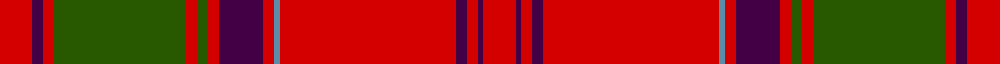

This page is one **sett** — a single exact thread-count. It belongs to the [tartan](/setts/r6dp2r2dg24r2dg2r2dp8r2t1r32dp2r2dp1r6/)
(the same proportion at any scale), whose colour order is pattern [RBRBRBRBRGRGRBR](/stripes/rbrbrbrbrgrgrbr/).

Part of the [Drummond](/tartans/drummond/) tartan — the named design grouping this sett with its other cloths.

Sourced from tartans-authority.  It is a [15 stripe tartan](/stripes/stripes15/).

Original link http://www.tartansauthority.com/tartan-ferret/display/457/

## Also known as

This cloth is also recorded under:

- Drummond #2
- Drummond Ancient
- Drummond,
- Drummond, Ancient
- Drummond, Grey
- Grant
- Grant, or Drummond

## Register references

External register numbers recorded for this tartan.

- Scottish Tartans Authority (ITI): 457

## Thread count
R/12 DP4 R4 G48 R4 G4 R4 DP16 R4 B2 R64 DP4 R4 DP2 R/12

One full sett is **352 threads**.

## Palette

Palette: <strong>Tartan Register</strong> <small style="color:#888">(3 of 4 colours)</small>
<table><thead><tr><th>Colour</th><th>Threads</th><th>Shade</th><th>Base</th><th>OKLCh</th></tr></thead><tbody><tr><td>R/</td><td style="text-align:right;font-variant-numeric:tabular-nums">12</td><td><code style="background-color:#D40000;">#D40000</code> <small style="color:#888">#D40000</small></td><td>R <code style="background-color:#CC0000;">#CC0000</code></td><td><small style="color:#888">oklch(54.6% 0.224 29.2)</small></td></tr><tr><td>DP</td><td style="text-align:right;font-variant-numeric:tabular-nums">4</td><td><code style="background-color:#440044;">#440044</code> <small style="color:#888">#440044</small></td><td>B <code style="background-color:#2A418A;">#2A418A</code></td><td><small style="color:#888">oklch(27.1% 0.125 328.4)</small></td></tr><tr><td>R</td><td style="text-align:right;font-variant-numeric:tabular-nums">4</td><td><code style="background-color:#D40000;">#D40000</code> <small style="color:#888">#D40000</small></td><td>R <code style="background-color:#CC0000;">#CC0000</code></td><td><small style="color:#888">oklch(54.6% 0.224 29.2)</small></td></tr><tr><td>G</td><td style="text-align:right;font-variant-numeric:tabular-nums">48</td><td><code style="background-color:#285800;">#285800</code> <small style="color:#888">#285800</small></td><td>G <code style="background-color:#006100;">#006100</code></td><td><small style="color:#888">oklch(41.0% 0.122 135.8)</small></td></tr><tr><td>R</td><td style="text-align:right;font-variant-numeric:tabular-nums">4</td><td><code style="background-color:#D40000;">#D40000</code> <small style="color:#888">#D40000</small></td><td>R <code style="background-color:#CC0000;">#CC0000</code></td><td><small style="color:#888">oklch(54.6% 0.224 29.2)</small></td></tr><tr><td>G</td><td style="text-align:right;font-variant-numeric:tabular-nums">4</td><td><code style="background-color:#285800;">#285800</code> <small style="color:#888">#285800</small></td><td>G <code style="background-color:#006100;">#006100</code></td><td><small style="color:#888">oklch(41.0% 0.122 135.8)</small></td></tr><tr><td>R</td><td style="text-align:right;font-variant-numeric:tabular-nums">4</td><td><code style="background-color:#D40000;">#D40000</code> <small style="color:#888">#D40000</small></td><td>R <code style="background-color:#CC0000;">#CC0000</code></td><td><small style="color:#888">oklch(54.6% 0.224 29.2)</small></td></tr><tr><td>DP</td><td style="text-align:right;font-variant-numeric:tabular-nums">16</td><td><code style="background-color:#440044;">#440044</code> <small style="color:#888">#440044</small></td><td>B <code style="background-color:#2A418A;">#2A418A</code></td><td><small style="color:#888">oklch(27.1% 0.125 328.4)</small></td></tr><tr><td>R</td><td style="text-align:right;font-variant-numeric:tabular-nums">4</td><td><code style="background-color:#D40000;">#D40000</code> <small style="color:#888">#D40000</small></td><td>R <code style="background-color:#CC0000;">#CC0000</code></td><td><small style="color:#888">oklch(54.6% 0.224 29.2)</small></td></tr><tr><td>B</td><td style="text-align:right;font-variant-numeric:tabular-nums">2</td><td><code style="background-color:#5C8CA8;">#5C8CA8</code> <small style="color:#888">#5C8CA8</small></td><td>B <code style="background-color:#2A418A;">#2A418A</code></td><td><small style="color:#888">oklch(61.7% 0.067 235.0)</small></td></tr><tr><td>R</td><td style="text-align:right;font-variant-numeric:tabular-nums">64</td><td><code style="background-color:#D40000;">#D40000</code> <small style="color:#888">#D40000</small></td><td>R <code style="background-color:#CC0000;">#CC0000</code></td><td><small style="color:#888">oklch(54.6% 0.224 29.2)</small></td></tr><tr><td>DP</td><td style="text-align:right;font-variant-numeric:tabular-nums">4</td><td><code style="background-color:#440044;">#440044</code> <small style="color:#888">#440044</small></td><td>B <code style="background-color:#2A418A;">#2A418A</code></td><td><small style="color:#888">oklch(27.1% 0.125 328.4)</small></td></tr><tr><td>R</td><td style="text-align:right;font-variant-numeric:tabular-nums">4</td><td><code style="background-color:#D40000;">#D40000</code> <small style="color:#888">#D40000</small></td><td>R <code style="background-color:#CC0000;">#CC0000</code></td><td><small style="color:#888">oklch(54.6% 0.224 29.2)</small></td></tr><tr><td>DP</td><td style="text-align:right;font-variant-numeric:tabular-nums">2</td><td><code style="background-color:#440044;">#440044</code> <small style="color:#888">#440044</small></td><td>B <code style="background-color:#2A418A;">#2A418A</code></td><td><small style="color:#888">oklch(27.1% 0.125 328.4)</small></td></tr><tr><td>R/</td><td style="text-align:right;font-variant-numeric:tabular-nums">12</td><td><code style="background-color:#D40000;">#D40000</code> <small style="color:#888">#D40000</small></td><td>R <code style="background-color:#CC0000;">#CC0000</code></td><td><small style="color:#888">oklch(54.6% 0.224 29.2)</small></td></tr></tbody></table>

## Compared to the master

This cloth is one sett of its design; the master sett (the exemplar the design is anchored on) is below for comparison.

<figure style="margin:0"><figcaption style="color:#888;font-size:smaller">this sett</figcaption></figure>
<figure style="margin:0"><figcaption style="color:#888;font-size:smaller"><a href="/setts/r6db2r2dg24r2dg2r2db8r2b1r32db2r2db1r6/">master sett →</a></figcaption></figure>

## Nearest tartans

The nearest existing variants by ΔTartan distance, with this tartan at the top so the swatches line up against it.

ΔTartan

Tartan

Sett

—

<a href="/ttd/edit/#slug=r6dp2r2dg24r2dg2r2dp8r2t1r32dp2r2dp1r6~x2">Drummond - 1819 (Clan)</a> <a class="nn-out" href="/variants/s15/r6dp2r2dg24r2dg2r2dp8r2t1r32dp2r2dp1r6~x2/" title="open its dictionary page">↗</a>

0.68

<a href="/ttd/edit/#slug=r6db2r2g24r2g2r2db8r2t2r32db2r2db1r6~x2&amp;base=r6dp2r2dg24r2dg2r2dp8r2t1r32dp2r2dp1r6~x2">Grant or Drummond Clan Tartan</a> <a class="nn-out" href="/variants/s15/r6db2r2g24r2g2r2db8r2t2r32db2r2db1r6~x2/" title="open its dictionary page">↗</a>

0.84

<a href="/ttd/edit/#slug=r4t1db1r32t2r2db12r2g16r4t1r4db2~x2&amp;base=r6dp2r2dg24r2dg2r2dp8r2t1r32dp2r2dp1r6~x2">MacGillivray</a> <a class="nn-out" href="/variants/s13/r4t1db1r32t2r2db12r2g16r4t1r4db2~x2/" title="open its dictionary page">↗</a>

0.84

<a href="/ttd/edit/#slug=r6db2r2g24r2g2r2db8r2t1r32db2r2db1r6~x2&amp;base=r6dp2r2dg24r2dg2r2dp8r2t1r32dp2r2dp1r6~x2">Grant, or Drummond</a> <a class="nn-out" href="/variants/s15/r6db2r2g24r2g2r2db8r2t1r32db2r2db1r6~x2/" title="open its dictionary page">↗</a>

0.86

<a href="/ttd/edit/#slug=r40w2db1r3dg31r3db1w2r3db8r3w2db1r34dg4r4dg4~x2&amp;base=r6dp2r2dg24r2dg2r2dp8r2t1r32dp2r2dp1r6~x2">Dalziel #1</a> <a class="nn-out" href="/variants/s17/r40w2db1r3dg31r3db1w2r3db8r3w2db1r34dg4r4dg4~x2/" title="open its dictionary page">↗</a>

0.86

<a href="/ttd/edit/#slug=r6b2r2g24r2g2r2b8r2t1r32b2r2b1r6~x2&amp;base=r6dp2r2dg24r2dg2r2dp8r2t1r32dp2r2dp1r6~x2">Drummond</a> <a class="nn-out" href="/variants/s15/r6b2r2g24r2g2r2b8r2t1r32b2r2b1r6~x2/" title="open its dictionary page">↗</a>

0.89

<a href="/ttd/edit/#slug=r24lb1db2r4dg32r4db2lb1r4db6r4lb1db2r32dg2r3dg6~x2&amp;base=r6dp2r2dg24r2dg2r2dp8r2t1r32dp2r2dp1r6~x2">Dalzell</a> <a class="nn-out" href="/variants/s17/r24lb1db2r4dg32r4db2lb1r4db6r4lb1db2r32dg2r3dg6~x2/" title="open its dictionary page">↗</a>

0.93

<a href="/ttd/edit/#slug=r6t1dt1r57t2r2dt23r4g30r6t1r6dt2~x2&amp;base=r6dp2r2dg24r2dg2r2dp8r2t1r32dp2r2dp1r6~x2">MacGillivray - 1819 (Clan)</a> <a class="nn-out" href="/variants/s13/r6t1dt1r57t2r2dt23r4g30r6t1r6dt2~x2/" title="open its dictionary page">↗</a>

0.98

<a href="/ttd/edit/#slug=r40w2db1r3g31r3db1w2r3db8r3w2db1r34g4r4g4~x2&amp;base=r6dp2r2dg24r2dg2r2dp8r2t1r32dp2r2dp1r6~x2">Dalziel</a> <a class="nn-out" href="/variants/s17/r40w2db1r3g31r3db1w2r3db8r3w2db1r34g4r4g4~x2/" title="open its dictionary page">↗</a>

1.00

<a href="/ttd/edit/#slug=r6db2r2dg24r2db2r2db8r2lb1r32db2r2db1r6~x2&amp;base=r6dp2r2dg24r2dg2r2dp8r2t1r32dp2r2dp1r6~x2">Grant</a> <a class="nn-out" href="/variants/s15/r6db2r2dg24r2db2r2db8r2lb1r32db2r2db1r6~x2/" title="open its dictionary page">↗</a>

1.01

<a href="/ttd/edit/#slug=r24ly1db1r3dg16r3db1ly1r3db6r3ly1db1r16dg2r2dg2~x2&amp;base=r6dp2r2dg24r2dg2r2dp8r2t1r32dp2r2dp1r6~x2">Munro</a> <a class="nn-out" href="/variants/s17/r24ly1db1r3dg16r3db1ly1r3db6r3ly1db1r16dg2r2dg2~x2/" title="open its dictionary page">↗</a>

## Neighbour map

Every grey dot is one of 14360 variants placed by the first two principal components of the ΔTartan feature space (44% of its variance). Red is this tartan; blue dots are its nearest — click one to open its page.

<svg viewBox="0 0 640 380" role="img" style="max-width:100%;height:auto;border:1px solid #e0e0e0;border-radius:4px;display:block" xmlns="http://www.w3.org/2000/svg"><image href="/nn/cloud.v1.png" width="640" height="380"/><a href="/variants/s15/r6db2r2g24r2g2r2db8r2t2r32db2r2db1r6~x2/"><circle cx="389.9" cy="92.9" r="4" fill="#3465a4"><title>Grant or Drummond Clan Tartan</title></circle></a><a href="/variants/s13/r4t1db1r32t2r2db12r2g16r4t1r4db2~x2/"><circle cx="394.4" cy="103.1" r="4" fill="#3465a4"><title>MacGillivray</title></circle></a><a href="/variants/s15/r6db2r2g24r2g2r2db8r2t1r32db2r2db1r6~x2/"><circle cx="397.7" cy="93.8" r="4" fill="#3465a4"><title>Grant, or Drummond</title></circle></a><a href="/variants/s17/r40w2db1r3dg31r3db1w2r3db8r3w2db1r34dg4r4dg4~x2/"><circle cx="418.0" cy="66.4" r="4" fill="#3465a4"><title>Dalziel #1</title></circle></a><a href="/variants/s15/r6b2r2g24r2g2r2b8r2t1r32b2r2b1r6~x2/"><circle cx="399.8" cy="94.4" r="4" fill="#3465a4"><title>Drummond</title></circle></a><a href="/variants/s17/r24lb1db2r4dg32r4db2lb1r4db6r4lb1db2r32dg2r3dg6~x2/"><circle cx="380.2" cy="84.1" r="4" fill="#3465a4"><title>Dalzell</title></circle></a><a href="/variants/s13/r6t1dt1r57t2r2dt23r4g30r6t1r6dt2~x2/"><circle cx="411.4" cy="79.2" r="4" fill="#3465a4"><title>MacGillivray - 1819 (Clan)</title></circle></a><a href="/variants/s17/r40w2db1r3g31r3db1w2r3db8r3w2db1r34g4r4g4~x2/"><circle cx="422.5" cy="72.8" r="4" fill="#3465a4"><title>Dalziel</title></circle></a><a href="/variants/s15/r6db2r2dg24r2db2r2db8r2lb1r32db2r2db1r6~x2/"><circle cx="376.2" cy="84.3" r="4" fill="#3465a4"><title>Grant</title></circle></a><a href="/variants/s17/r24ly1db1r3dg16r3db1ly1r3db6r3ly1db1r16dg2r2dg2~x2/"><circle cx="393.2" cy="93.1" r="4" fill="#3465a4"><title>Munro</title></circle></a><circle cx="400.8" cy="89.1" r="5" fill="#c00000"/></svg>

ID: /variants/s15/r6dp2r2dg24r2dg2r2dp8r2t1r32dp2r2dp1r6~x2/
