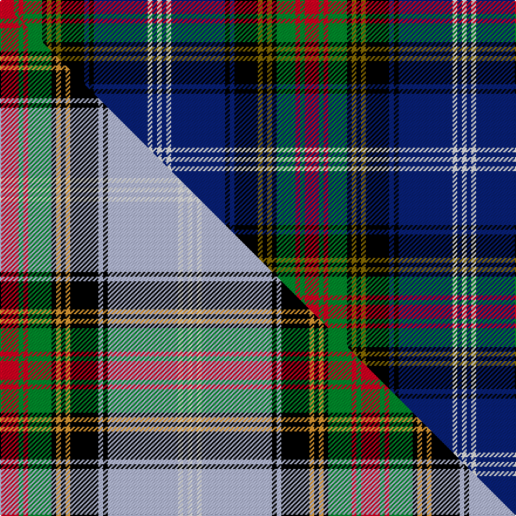

This page is one **sett** — a single exact thread-count. It belongs to the [tartan](/setts/r6g2r2g8k2y2k2y2k10db2k2db23w2db2w2/)
(the same proportion at any scale), whose colour order is pattern [RGRGKGKGKBKBWBW](/stripes/rgrgkgkgkbkbwbw/).

Part of the [Estes](/tartans/estes/) tartan — the named design grouping this sett with its other cloths.

Sourced from house-of-tartan.  It is a [15 stripe tartan](/stripes/stripes15/).

Original link http://www.house-of-tartan.scotland.net/house/TartanViewjs.asp?colr=Def&tnam=1520

## Provenance

Earliest known date: 1985 Woven by D.C.Dalgleish. Sample in STA's Johnston Collection. 'Tartans' (1999) by Johnston/Smith gives the blue ground as lavender. Blue/white for Scotland. Red/green for Wales and saffron for Ireland.

## Thread count
R/12 G4 R4 G16 K4 Y4 K4 Y4 K20 DB4 K4 DB46 W4 DB4 W/4

One full sett is **260 threads**.

## Palette
<table><thead><tr><th>Colour</th><th>Shade</th><th>OKLCh</th></tr></thead><tbody><tr><td>DB</td><td><code style="background-color:#082077;">#082077</code> <small style="color:#888">#082077</small></td><td><small style="color:#888">oklch(30.0% 0.149 265.1)</small></td></tr><tr><td>G</td><td><code style="background-color:#008B2A;">#008B2A</code> <small style="color:#888">#008B2A</small></td><td><small style="color:#888">oklch(55.4% 0.170 145.9)</small></td></tr><tr><td>K</td><td><code style="background-color:#000000;">#000000</code> <small style="color:#888">#000000</small></td><td><small style="color:#888">oklch(0.0% 0.000 0.0)</small></td></tr><tr><td>W</td><td><code style="background-color:#F7F7F7;">#F7F7F7</code> <small style="color:#888">#F7F7F7</small></td><td><small style="color:#888">oklch(97.6% 0.000 89.9)</small></td></tr><tr><td>R</td><td><code style="background-color:#D60020;">#D60020</code> <small style="color:#888">#D60020</small></td><td><small style="color:#888">oklch(55.2% 0.224 25.5)</small></td></tr><tr><td>Y</td><td><code style="background-color:#8B6E00;">#8B6E00</code> <small style="color:#888">#8B6E00</small></td><td><small style="color:#888">oklch(55.1% 0.113 90.4)</small></td></tr></tbody></table>

# Sample pattern

## Compared to the master

This cloth is one sett of its design; the master sett (the exemplar the design is anchored on) is below for comparison.

Its **ΔTartan distance** from the master is **0.90** — the same measure the nearest-tartans table ranks by (0 is identical; a re-scale of the same cloth is near 0, a recolour or a different proportion further).

<figure class="master-compare" style="margin:0">

this sett
master sett ★

<figcaption style="color:#888;font-size:smaller">One weave of this sett against the <a href="/setts/r4g1r1g5k1lo1k1lo1k6lb1k1lb15w1lb1w1/">master sett ★</a>, split on the diagonal: a shared proportion runs seamlessly across it with only the shades shifting; a different proportion breaks on it.</figcaption>
</figure>

## Nearest tartan variants

The nearest existing variants by ΔTartan distance, with this cloth at the top so the swatches line up against it.

ΔTartan

Threads

Variant

Sett

—

260

<a href="/variants/s15/r6g2r2g8k2y2k2y2k10db2k2db23w2db2w2~x2/">Estes Family Tartan</a>

<a href="/ttd/edit/#slug=r6b2r2b8k2y2k2y2k10db2k2db23w2db2w2~x2&amp;base=r6g2r2g8k2y2k2y2k10db2k2db23w2db2w2~x2" title="compare in the TTD">0.60</a>

260

<a href="/variants/s15/r6b2r2b8k2y2k2y2k10db2k2db23w2db2w2~x2/">Estes</a>

<a href="/ttd/edit/#slug=k5lb5y2lb5k5db25k5lb3dg5r2dg5lb3k5~x2&amp;base=r6g2r2g8k2y2k2y2k10db2k2db23w2db2w2~x2" title="compare in the TTD">2.02</a>

280

<a href="/variants/s13/k5lb5y2lb5k5db25k5lb3dg5r2dg5lb3k5~x2/">Liberton</a>

<a href="/ttd/edit/#slug=w2r5k2ly3k4db28r4dg14k4w2~x2&amp;base=r6g2r2g8k2y2k2y2k10db2k2db23w2db2w2~x2" title="compare in the TTD">2.05</a>

264

<a href="/variants/s10/w2r5k2ly3k4db28r4dg14k4w2~x2/">Loch Lomond &amp; the Trossachs (Fashion</a>

<a href="/ttd/edit/#slug=r8g2k2ly2k2y2k2g18db2g2db29k3~x2&amp;base=r6g2r2g8k2y2k2y2k10db2k2db23w2db2w2~x2" title="compare in the TTD">2.32</a>

274

<a href="/variants/s12/r8g2k2ly2k2y2k2g18db2g2db29k3~x2/">Cats Winter (Fashion)</a>

<a href="/ttd/edit/#slug=db10k1g1k1g1k1db10r3k10r3g10k1y1k1w1k1g10&amp;base=r6g2r2g8k2y2k2y2k10db2k2db23w2db2w2~x2" title="compare in the TTD">2.33</a>

112

<a href="/variants/s17/db10k1g1k1g1k1db10r3k10r3g10k1y1k1w1k1g10/">MacNicol Hunting</a>

<a href="/ttd/edit/#slug=db10k1g1k1g1k1db10r3k10r3g10k1y1k1w1k1g10~x2&amp;base=r6g2r2g8k2y2k2y2k10db2k2db23w2db2w2~x2" title="compare in the TTD">2.33</a>

224

<a href="/variants/s17/db10k1g1k1g1k1db10r3k10r3g10k1y1k1w1k1g10~x2/">Cunningham, hunting</a>

<a href="/ttd/edit/#slug=db3r2lb2db16k2g2k2g2k2db16g2k10g4r4g12w3~x2&amp;base=r6g2r2g8k2y2k2y2k10db2k2db23w2db2w2~x2" title="compare in the TTD">2.35</a>

324

<a href="/variants/s16/db3r2lb2db16k2g2k2g2k2db16g2k10g4r4g12w3~x2/">Annandale (Personal)</a>

<a href="/ttd/edit/#slug=db20r2db2r5db30r2k32w2g30r5g4r2g4w2&amp;base=r6g2r2g8k2y2k2y2k10db2k2db23w2db2w2~x2" title="compare in the TTD">2.38</a>

262

<a href="/variants/s14/db20r2db2r5db30r2k32w2g30r5g4r2g4w2/">MacDonald of Clanranald #5</a>

<a href="/ttd/edit/#slug=k2dp4o4dp3g20dp5k4dp3k7dp3k3db35w2~x2&amp;base=r6g2r2g8k2y2k2y2k10db2k2db23w2db2w2~x2" title="compare in the TTD">2.39</a>

372

<a href="/variants/s13/k2dp4o4dp3g20dp5k4dp3k7dp3k3db35w2~x2/">Spirit of Bannockburn (Fashion)</a>

<a href="/ttd/edit/#slug=db53g10k20y5k5w5k7r18db10k6db6w6&amp;base=r6g2r2g8k2y2k2y2k10db2k2db23w2db2w2~x2" title="compare in the TTD">2.40</a>

243

<a href="/variants/s12/db53g10k20y5k5w5k7r18db10k6db6w6/">Broager (Name)</a>

## Neighbour map

Every grey dot is one of 13620 variants placed by the first two principal components of the ΔTartan feature space (42% of its variance). Red is this tartan; blue dots are its nearest — click one to open its page.

<svg viewBox="0 0 640 380" role="img" style="max-width:100%;height:auto;border:1px solid #e0e0e0;border-radius:4px;display:block" xmlns="http://www.w3.org/2000/svg"><image href="/nn/cloud.v1.png" width="640" height="380"/><a href="/variants/s15/r6b2r2b8k2y2k2y2k10db2k2db23w2db2w2~x2/"><circle cx="120.1" cy="97.0" r="4" fill="#3465a4"><title>Estes</title></circle></a><a href="/variants/s13/k5lb5y2lb5k5db25k5lb3dg5r2dg5lb3k5~x2/"><circle cx="87.3" cy="113.3" r="4" fill="#3465a4"><title>Liberton</title></circle></a><a href="/variants/s10/w2r5k2ly3k4db28r4dg14k4w2~x2/"><circle cx="145.5" cy="109.9" r="4" fill="#3465a4"><title>Loch Lomond &amp; the Trossachs (Fashion</title></circle></a><a href="/variants/s12/r8g2k2ly2k2y2k2g18db2g2db29k3~x2/"><circle cx="167.5" cy="94.9" r="4" fill="#3465a4"><title>Cats Winter (Fashion)</title></circle></a><a href="/variants/s17/db10k1g1k1g1k1db10r3k10r3g10k1y1k1w1k1g10/"><circle cx="89.6" cy="112.7" r="4" fill="#3465a4"><title>MacNicol Hunting</title></circle></a><a href="/variants/s17/db10k1g1k1g1k1db10r3k10r3g10k1y1k1w1k1g10~x2/"><circle cx="89.6" cy="112.7" r="4" fill="#3465a4"><title>Cunningham, hunting</title></circle></a><a href="/variants/s16/db3r2lb2db16k2g2k2g2k2db16g2k10g4r4g12w3~x2/"><circle cx="111.4" cy="128.3" r="4" fill="#3465a4"><title>Annandale (Personal)</title></circle></a><a href="/variants/s14/db20r2db2r5db30r2k32w2g30r5g4r2g4w2/"><circle cx="141.5" cy="106.9" r="4" fill="#3465a4"><title>MacDonald of Clanranald #5</title></circle></a><a href="/variants/s13/k2dp4o4dp3g20dp5k4dp3k7dp3k3db35w2~x2/"><circle cx="153.9" cy="96.1" r="4" fill="#3465a4"><title>Spirit of Bannockburn (Fashion)</title></circle></a><a href="/variants/s12/db53g10k20y5k5w5k7r18db10k6db6w6/"><circle cx="144.6" cy="114.8" r="4" fill="#3465a4"><title>Broager (Name)</title></circle></a><circle cx="115.1" cy="97.3" r="5" fill="#c00000"/><text x="320" y="376" text-anchor="middle" font-size="11" fill="#999">ground</text><text x="11" y="190" text-anchor="middle" font-size="11" fill="#999" transform="rotate(-90 11 190)">complexity</text></svg>

ID: /variants/s15/r6g2r2g8k2y2k2y2k10db2k2db23w2db2w2~x2/
