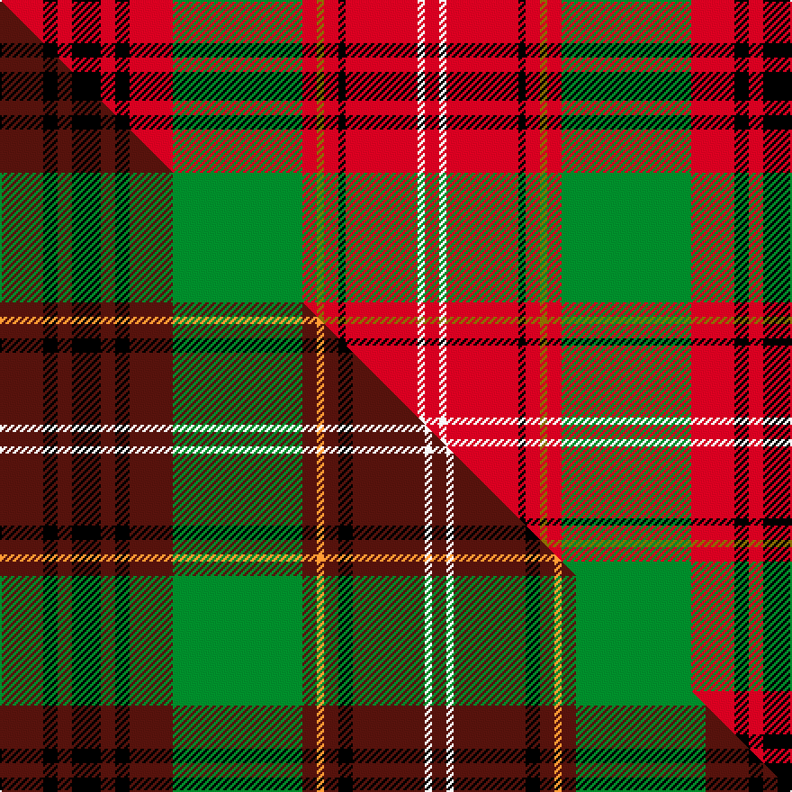

This page is one **sett** — a single exact thread-count. It belongs to the [tartan](/setts/r6k2r2k4r2k2r6g18r2y1r2k1r10w1r2/)
(the same proportion at any scale), whose colour order is pattern [RKRKRKRGRGRKRWR](/stripes/rkrkrkrgrgrkrwr/).

Part of the [Ainslie](/tartans/ainslie-2/) tartan — the named design grouping this sett with its other cloths.

Sourced from weddslist.  It is a [15 stripe tartan](/stripes/stripes15/).

Original link http://www.weddslist.com/cgi-bin/tartans/pg.pl?source=sts

## Thread count
R/24 K8 R8 K16 R8 K8 R24 G72 R8 Y4 R8 K4 R40 W4 R/8

One full sett is **456 threads**.

## Palette
<table><thead><tr><th>Colour</th><th>Shade</th><th>OKLCh</th></tr></thead><tbody><tr><td>G</td><td><code style="background-color:#008B2A;">#008B2A</code> <small style="color:#888">#008B2A</small></td><td><small style="color:#888">oklch(55.4% 0.170 145.9)</small></td></tr><tr><td>K</td><td><code style="background-color:#000000;">#000000</code> <small style="color:#888">#000000</small></td><td><small style="color:#888">oklch(0.0% 0.000 0.0)</small></td></tr><tr><td>W</td><td><code style="background-color:#F7F7F7;">#F7F7F7</code> <small style="color:#888">#F7F7F7</small></td><td><small style="color:#888">oklch(97.6% 0.000 89.9)</small></td></tr><tr><td>R</td><td><code style="background-color:#D60020;">#D60020</code> <small style="color:#888">#D60020</small></td><td><small style="color:#888">oklch(55.2% 0.224 25.5)</small></td></tr><tr><td>Y</td><td><code style="background-color:#8B6E00;">#8B6E00</code> <small style="color:#888">#8B6E00</small></td><td><small style="color:#888">oklch(55.1% 0.113 90.4)</small></td></tr></tbody></table>

# Sample pattern

## Compared to the master

This cloth is one sett of its design; the master sett (the exemplar the design is anchored on) is below for comparison.

Its **ΔTartan distance** from the master is **0.46** — the same measure the nearest-tartans table ranks by (0 is identical; a re-scale of the same cloth is near 0, a recolour or a different proportion further).

<figure class="master-compare" style="margin:0">

this sett
master sett ★

<figcaption style="color:#888;font-size:smaller">One weave of this sett against the <a href="/setts/dr6k2dr2k4dr2k2dr6g18dr2lo1dr2k2dr10w1dr2/">master sett ★</a>, split on the diagonal: a shared proportion runs seamlessly across it with only the shades shifting; a different proportion breaks on it.</figcaption>
</figure>

## Nearest tartan variants

The nearest existing variants by ΔTartan distance, with this cloth at the top so the swatches line up against it.

ΔTartan

Threads

Variant

Sett

—

456

<a href="/variants/s15/r6k2r2k4r2k2r6g18r2y1r2k1r10w1r2~x4/">Ainslie</a>

<a href="/ttd/edit/#slug=r31g3r2g2r3g2r2g3r15k15g2lb15g3lb3w2~x2&amp;base=r6k2r2k4r2k2r6g18r2y1r2k1r10w1r2~x4" title="compare in the TTD">2.02</a>

346

<a href="/variants/s15/r31g3r2g2r3g2r2g3r15k15g2lb15g3lb3w2~x2/">Moir (Loch Insch) (Personal)</a>

<a href="/ttd/edit/#slug=y1r2k4r14g8r2g3y1g3r2g8r13k2r2k2r1y1~x2&amp;base=r6k2r2k4r2k2r6g18r2y1r2k1r10w1r2~x4" title="compare in the TTD">2.23</a>

272

<a href="/variants/s17/y1r2k4r14g8r2g3y1g3r2g8r13k2r2k2r1y1~x2/">Gaffney (2016)</a>

<a href="/ttd/edit/#slug=o19k2r1dy3w1dy1w1dy1k6o3dy1o3w1~x4&amp;base=r6k2r2k4r2k2r6g18r2y1r2k1r10w1r2~x4" title="compare in the TTD">2.32</a>

264

<a href="/variants/s13/o19k2r1dy3w1dy1w1dy1k6o3dy1o3w1~x4/">Leando (Coldingham) Hunting (Personal)</a>

<a href="/ttd/edit/#slug=k5lb2r50k50r5w2r5g42r50k5w2&amp;base=r6k2r2k4r2k2r6g18r2y1r2k1r10w1r2~x4" title="compare in the TTD">2.34</a>

429

<a href="/variants/s11/k5lb2r50k50r5w2r5g42r50k5w2/">MacDonald of Glenaladale - 1772 (Cla</a>

<a href="/ttd/edit/#slug=r31g3r2g2r3g2r2g3r15k15g2k15g3k3w2~x2&amp;base=r6k2r2k4r2k2r6g18r2y1r2k1r10w1r2~x4" title="compare in the TTD">2.34</a>

346

<a href="/variants/s15/r31g3r2g2r3g2r2g3r15k15g2k15g3k3w2~x2/">Moir (Loch Insh) (Personal)</a>

<a href="/ttd/edit/#slug=b1r2g1k1r5g11r1k2g1r11g4b1r2w1~x2&amp;base=r6k2r2k4r2k2r6g18r2y1r2k1r10w1r2~x4" title="compare in the TTD">2.34</a>

172

<a href="/variants/s14/b1r2g1k1r5g11r1k2g1r11g4b1r2w1~x2/">MacKinnon 2</a>

<a href="/ttd/edit/#slug=r1ri2g1k1ri5g11ri1k2g1ri11g4r1ri2w1~x2~r2208029-ri2209032&amp;base=r6k2r2k4r2k2r6g18r2y1r2k1r10w1r2~x4" title="compare in the TTD">2.38</a>

172

<a href="/variants/s14/r1ri2g1k1ri5g11ri1k2g1ri11g4r1ri2w1~x2~r2208029-ri2209032/">MacKinnon #9</a>

<a href="/ttd/edit/#slug=o40k10n2k2lr2k3dr8o6k2o8lr2~x2&amp;base=r6k2r2k4r2k2r6g18r2y1r2k1r10w1r2~x4" title="compare in the TTD">2.41</a>

256

<a href="/variants/s11/o40k10n2k2lr2k3dr8o6k2o8lr2~x2/">Islay</a>

<a href="/ttd/edit/#slug=o6k2g2k4r3k2r3k4g2o24y2~x2&amp;base=r6k2r2k4r2k2r6g18r2y1r2k1r10w1r2~x4" title="compare in the TTD">2.44</a>

200

<a href="/variants/s11/o6k2g2k4r3k2r3k4g2o24y2~x2/">Finnegan</a>

<a href="/ttd/edit/#slug=r5k1r2k2r16lb2r2k9r2g2r2g13r2k2r4~x2&amp;base=r6k2r2k4r2k2r6g18r2y1r2k1r10w1r2~x4" title="compare in the TTD">2.45</a>

246

<a href="/variants/s15/r5k1r2k2r16lb2r2k9r2g2r2g13r2k2r4~x2/">Unidentified No 3 #2</a>

## Neighbour map

Every grey dot is one of 13620 variants placed by the first two principal components of the ΔTartan feature space (42% of its variance). Red is this tartan; blue dots are its nearest — click one to open its page.

<svg viewBox="0 0 640 380" role="img" style="max-width:100%;height:auto;border:1px solid #e0e0e0;border-radius:4px;display:block" xmlns="http://www.w3.org/2000/svg"><image href="/nn/cloud.v1.png" width="640" height="380"/><a href="/variants/s15/r31g3r2g2r3g2r2g3r15k15g2lb15g3lb3w2~x2/"><circle cx="214.5" cy="89.8" r="4" fill="#3465a4"><title>Moir (Loch Insch) (Personal)</title></circle></a><a href="/variants/s17/y1r2k4r14g8r2g3y1g3r2g8r13k2r2k2r1y1~x2/"><circle cx="248.1" cy="121.6" r="4" fill="#3465a4"><title>Gaffney (2016)</title></circle></a><a href="/variants/s13/o19k2r1dy3w1dy1w1dy1k6o3dy1o3w1~x4/"><circle cx="276.9" cy="77.4" r="4" fill="#3465a4"><title>Leando (Coldingham) Hunting (Personal)</title></circle></a><a href="/variants/s11/k5lb2r50k50r5w2r5g42r50k5w2/"><circle cx="232.1" cy="89.1" r="4" fill="#3465a4"><title>MacDonald of Glenaladale - 1772 (Cla</title></circle></a><a href="/variants/s15/r31g3r2g2r3g2r2g3r15k15g2k15g3k3w2~x2/"><circle cx="208.1" cy="86.3" r="4" fill="#3465a4"><title>Moir (Loch Insh) (Personal)</title></circle></a><a href="/variants/s14/b1r2g1k1r5g11r1k2g1r11g4b1r2w1~x2/"><circle cx="222.4" cy="122.9" r="4" fill="#3465a4"><title>MacKinnon 2</title></circle></a><a href="/variants/s14/r1ri2g1k1ri5g11ri1k2g1ri11g4r1ri2w1~x2~r2208029-ri2209032/"><circle cx="226.1" cy="123.2" r="4" fill="#3465a4"><title>MacKinnon #9</title></circle></a><a href="/variants/s11/o40k10n2k2lr2k3dr8o6k2o8lr2~x2/"><circle cx="241.3" cy="66.9" r="4" fill="#3465a4"><title>Islay</title></circle></a><a href="/variants/s11/o6k2g2k4r3k2r3k4g2o24y2~x2/"><circle cx="254.0" cy="113.1" r="4" fill="#3465a4"><title>Finnegan</title></circle></a><a href="/variants/s15/r5k1r2k2r16lb2r2k9r2g2r2g13r2k2r4~x2/"><circle cx="239.1" cy="112.8" r="4" fill="#3465a4"><title>Unidentified No 3 #2</title></circle></a><circle cx="237.2" cy="93.0" r="5" fill="#c00000"/><text x="320" y="376" text-anchor="middle" font-size="11" fill="#999">ground</text><text x="11" y="190" text-anchor="middle" font-size="11" fill="#999" transform="rotate(-90 11 190)">complexity</text></svg>

ID: /variants/s15/r6k2r2k4r2k2r6g18r2y1r2k1r10w1r2~x4/
