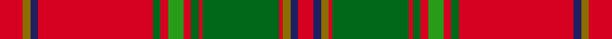

This page is one **sett** — a single exact thread-count. It belongs to the [tartan](/setts/r6y2db2r30dg2r2g4r2dg2r1dg20r1y2db2r4/)
(the same proportion at any scale), whose colour order is pattern [RBGRGRGRGRGRBGR](/stripes/rbgrgrgrgrgrbgr/).

Sourced from register-of-tartans.  It is a [15 stripe tartan](/stripes/stripes15/).

Original link https://www.tartanregister.gov.uk/tartanDetails.aspx?ref=54

## Provenance

Earliest known date: 1997 Part of a collection produced by Lochcarron in 1997 to acknowledge the early historical and cultural links between the Scots and Irish. Lochcarron sample.

2 attestations — the source records this cloth was collapsed from (oldest owns this page)

<ul>
<li>01/01/1997 — All Ireland Red (register-of-tartans, <a href="https://www.tartanregister.gov.uk/tartanDetails.aspx?ref=54">record</a>)  <em>Part of a series of tartans produced by Lochcarron in 1997 to acknowledge the early historical and cultural links between the Scots and Irish.</em></li>
<li>undated — All Irish Red Irish District Tartan (house-of-tartan, <a href="http://www.house-of-tartan.scotland.net/house/TartanViewjs.asp?colr=Def&tnam=4067">record</a>) </li>
</ul>

## Register references

External register numbers recorded for this tartan.

- Scottish Register of Tartans: [54](https://www.tartanregister.gov.uk/tartanDetails.aspx?ref=54)
- Scottish Tartans Authority (ITI): 4067

## Thread count
R/12 Y4 DB4 R60 DG4 R4 G8 R4 DG4 R2 DG40 R2 Y4 DB4 R/8

One full sett is **308 threads**.

## Palette
<table><thead><tr><th>Colour</th><th>Shade</th><th>OKLCh</th></tr></thead><tbody><tr><td>DB</td><td><code style="background-color:#2C2C80;">#2C2C80</code> <small style="color:#888">#2C2C80</small></td><td><small style="color:#888">oklch(35.0% 0.138 276.6)</small></td></tr><tr><td>DB</td><td><code style="background-color:#202060;">#202060</code> <small style="color:#888">#202060</small></td><td><small style="color:#888">oklch(28.9% 0.111 276.9)</small></td></tr><tr><td>DG</td><td><code style="background-color:#006818;">#006818</code> <small style="color:#888">#006818</small></td><td><small style="color:#888">oklch(45.0% 0.142 145.0)</small></td></tr><tr><td>G</td><td><code style="background-color:#289C18;">#289C18</code> <small style="color:#888">#289C18</small></td><td><small style="color:#888">oklch(60.6% 0.191 141.6)</small></td></tr><tr><td>G</td><td><code style="background-color:#5C6428;">#5C6428</code> <small style="color:#888">#5C6428</small></td><td><small style="color:#888">oklch(48.3% 0.084 116.0)</small></td></tr><tr><td>LB</td><td><code style="background-color:#B5BBDE;">#B5BBDE</code> <small style="color:#888">#B5BBDE</small></td><td><small style="color:#888">oklch(79.9% 0.050 277.6)</small></td></tr><tr><td>Y</td><td><code style="background-color:#8B6E00;">#8B6E00</code> <small style="color:#888">#8B6E00</small></td><td><small style="color:#888">oklch(55.1% 0.113 90.4)</small></td></tr><tr><td>R</td><td><code style="background-color:#D60020;">#D60020</code> <small style="color:#888">#D60020</small></td><td><small style="color:#888">oklch(55.2% 0.224 25.5)</small></td></tr></tbody></table>

# Sample pattern

## Nearest tartan variants

The nearest existing variants by ΔTartan distance, with this cloth at the top so the swatches line up against it.

ΔTartan

Threads

Variant

Sett

—

308

<a href="/variants/s15/r6y2db2r30dg2r2g4r2dg2r1dg20r1y2db2r4~x2~db1204274-dg1806142-g2408144/">All Ireland Red</a>

<a href="/ttd/edit/#slug=r6y2db2r30dg2r2g4r2dg2r1dg20r1y2db2r4~x2~dg1806142-g2408144&amp;base=r6y2db2r30dg2r2g4r2dg2r1dg20r1y2db2r4~x2~db1204274-dg1806142-g2408144" title="compare in the TTD">0.00</a>

308

<a href="/variants/s15/r6y2db2r30dg2r2g4r2dg2r1dg20r1y2db2r4~x2~dg1806142-g2408144/">All Ireland Red (Fashion)</a>

<a href="/ttd/edit/#slug=r19y1db1r2g18r2db1y1r2db4r2y1db1r19g2r2g2~x2&amp;base=r6y2db2r30dg2r2g4r2dg2r1dg20r1y2db2r4~x2~db1204274-dg1806142-g2408144" title="compare in the TTD">2.16</a>

278

<a href="/variants/s17/r19y1db1r2g18r2db1y1r2db4r2y1db1r19g2r2g2~x2/">Munro (Logan)</a>

<a href="/ttd/edit/#slug=r24y1db1r3g16r3db1y1r3db6r3y1db1r16g2r2g2~x2&amp;base=r6y2db2r30dg2r2g4r2dg2r1dg20r1y2db2r4~x2~db1204274-dg1806142-g2408144" title="compare in the TTD">2.27</a>

292

<a href="/variants/s17/r24y1db1r3g16r3db1y1r3db6r3y1db1r16g2r2g2~x2/">Munro</a>

<a href="/ttd/edit/#slug=r24w1db2r4g32r4db2w1r4db6r4w1db2r32g2r3g6~x2&amp;base=r6y2db2r30dg2r2g4r2dg2r1dg20r1y2db2r4~x2~db1204274-dg1806142-g2408144" title="compare in the TTD">2.40</a>

460

<a href="/variants/s17/r24w1db2r4g32r4db2w1r4db6r4w1db2r32g2r3g6~x2/">Dalzell</a>

<a href="/ttd/edit/#slug=r12dp2r4dp4r39lb2r4dp11r6g4r6g45r4dp4db10&amp;base=r6y2db2r30dg2r2g4r2dg2r1dg20r1y2db2r4~x2~db1204274-dg1806142-g2408144" title="compare in the TTD">2.99</a>

292

<a href="/variants/s15/r12dp2r4dp4r39lb2r4dp11r6g4r6g45r4dp4db10/">Grant or New Bruce</a>

## Neighbour map

Every grey dot is one of 13620 variants placed by the first two principal components of the ΔTartan feature space (42% of its variance). Red is this tartan; blue dots are its nearest — click one to open its page.

<svg viewBox="0 0 640 380" role="img" style="max-width:100%;height:auto;border:1px solid #e0e0e0;border-radius:4px;display:block" xmlns="http://www.w3.org/2000/svg"><image href="/nn/cloud.v1.png" width="640" height="380"/><a href="/variants/s15/r6y2db2r30dg2r2g4r2dg2r1dg20r1y2db2r4~x2~dg1806142-g2408144/"><circle cx="367.3" cy="85.6" r="4" fill="#3465a4"><title>All Ireland Red (Fashion)</title></circle></a><a href="/variants/s17/r19y1db1r2g18r2db1y1r2db4r2y1db1r19g2r2g2~x2/"><circle cx="381.2" cy="111.0" r="4" fill="#3465a4"><title>Munro (Logan)</title></circle></a><a href="/variants/s17/r24y1db1r3g16r3db1y1r3db6r3y1db1r16g2r2g2~x2/"><circle cx="399.1" cy="104.3" r="4" fill="#3465a4"><title>Munro</title></circle></a><a href="/variants/s17/r24w1db2r4g32r4db2w1r4db6r4w1db2r32g2r3g6~x2/"><circle cx="370.7" cy="90.6" r="4" fill="#3465a4"><title>Dalzell</title></circle></a><a href="/variants/s15/r12dp2r4dp4r39lb2r4dp11r6g4r6g45r4dp4db10/"><circle cx="282.1" cy="105.4" r="4" fill="#3465a4"><title>Grant or New Bruce</title></circle></a><circle cx="369.7" cy="86.2" r="5" fill="#c00000"/><text x="320" y="376" text-anchor="middle" font-size="11" fill="#999">ground</text><text x="11" y="190" text-anchor="middle" font-size="11" fill="#999" transform="rotate(-90 11 190)">complexity</text></svg>

ID: /variants/s15/r6y2db2r30dg2r2g4r2dg2r1dg20r1y2db2r4~x2~db1204274-dg1806142-g2408144/
