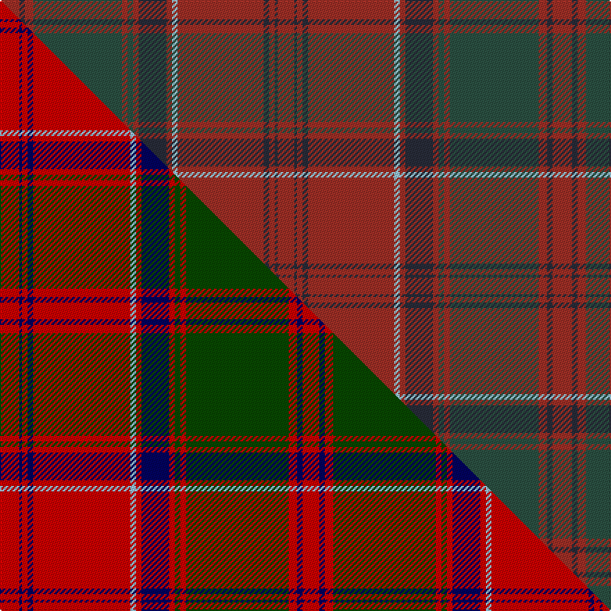

This page is one **sett** — a single exact thread-count. It belongs to the [tartan](/setts/r7dt2r3dg32r2dg2r2dt10r2lb2r31dt2r2dt1r6/)
(the same proportion at any scale), whose colour order is pattern [RBRBRWRBRGRGRBR](/stripes/rbrbrwrbrgrgrbr/).

Part of the [Drummond of Megginch](/tartans/drummond-of-megginch/) tartan — the named design grouping this sett with its other cloths.

Sourced from research.  It is a [15 stripe tartan](/stripes/stripes15/).

Original link https://tartandictionary.org/posts/drummondsofmegginch/

Dataset <small>— provenance for this record, inherited from the source manifest</small>

<dl class="dataset-prov">
<dt>source</dt><dd><a href="/sources/research/">Our own research</a></dd>
<dt>licence</dt><dd><a href="https://creativecommons.org/licenses/by-sa/4.0/">CC BY-SA 4.0</a></dd>
<dt>captured</dt><dd>2025-11-01</dd>
</dl>

## Thread count
R/14 DT4 R6 DG64 R4 DG4 R4 DT20 R4 LB4 R62 DT4 R4 DT2 R/12

One full sett is **398 threads**.

## Palette
<table><thead><tr><th>Colour</th><th>Shade</th><th>OKLCh</th></tr></thead><tbody><tr><td>DT</td><td><code style="background-color:#282C39;">#282C39</code> <small style="color:#888">#282C39</small></td><td><small style="color:#888">oklch(29.5% 0.024 271.5)</small></td></tr><tr><td>R</td><td><code style="background-color:#983029;">#983029</code> <small style="color:#888">#983029</small></td><td><small style="color:#888">oklch(46.4% 0.140 27.7)</small></td></tr><tr><td>LB</td><td><code style="background-color:#98C8E8;">#98C8E8</code> <small style="color:#888">#98C8E8</small></td><td><small style="color:#888">oklch(81.0% 0.068 237.9)</small></td></tr><tr><td>DG</td><td><code style="background-color:#304F45;">#304F45</code> <small style="color:#888">#304F45</small></td><td><small style="color:#888">oklch(40.0% 0.041 171.8)</small></td></tr></tbody></table>

# Sample pattern

## Compared to the master

This cloth is one sett of its design; the master sett (the exemplar the design is anchored on) is below for comparison.

Its **ΔTartan distance** from the master is **0.30** — the same measure the nearest-tartans table ranks by (0 is identical; a re-scale of the same cloth is near 0, a recolour or a different proportion further).

<figure class="master-compare" style="margin:0">

this sett
master sett ★

<figcaption style="color:#888;font-size:smaller">One weave of this sett against the <a href="/setts/r7db1r2db2r35lb2r2db10r2dg2r2dg37r3db2r6/">master sett ★</a>, split on the diagonal: a shared proportion runs seamlessly across it with only the shades shifting; a different proportion breaks on it.</figcaption>
</figure>

## Nearest tartan variants

The nearest existing variants by ΔTartan distance, with this cloth at the top so the swatches line up against it.

ΔTartan

Threads

Variant

Sett

—

398

<a href="/variants/s15/r7dt2r3dg32r2dg2r2dt10r2lb2r31dt2r2dt1r6~x2~r1906028-dt1201300-dg1602166-lb3203246/">Drummond of Megginch - 1997 Kilt</a>

<a href="/ttd/edit/#slug=o7db1o2db2o35lg2o2db10o2g2o2g37o3db2o6~x2~o2207033-db1204259-lg3002249-g2005139&amp;base=r7dt2r3dg32r2dg2r2dt10r2lb2r31dt2r2dt1r6~x2~r1906028-dt1201300-dg1602166-lb3203246" title="compare in the TTD">0.30</a>

434

<a href="/variants/s15/o7dt1o2dt2o35lt2o2dt10o2g2o2g37o3dt2o6~x2~o2207033-dt1204259-lt3002249-g2005139/">Drummond of Megginch - 1849 Kilt (faded)</a>

<a href="/ttd/edit/#slug=o7db1o2db2o35lb2o2db10o2g2o2g37o3db2o6~x2~o2207025-db1404259-lb3302249-g2105139&amp;base=r7dt2r3dg32r2dg2r2dt10r2lb2r31dt2r2dt1r6~x2~r1906028-dt1201300-dg1602166-lb3203246" title="compare in the TTD">0.30</a>

434

<a href="/variants/s15/o7db1o2db2o35lb2o2db10o2g2o2g37o3db2o6~x2~o2207025-db1404259-lb3302249-g2105139/">Drummond of Megginch - 2023 BertieLexa</a>

<a href="/ttd/edit/#slug=y3dt4r12dt27y2r65y2dt27r12dt4y3~x2~dt1502277-r1606028&amp;base=r7dt2r3dg32r2dg2r2dt10r2lb2r31dt2r2dt1r6~x2~r1906028-dt1201300-dg1602166-lb3203246" title="compare in the TTD">3.39</a>

632

<a href="/variants/s11/y3dp4r12dp27y2r65y2dp27r12dp4y3~x2~dp1502277-r1606028/">Bell's</a>

<a href="/ttd/edit/#slug=n126r3y16n20y4n4y4n4y4n4y4n4y4n4y4n4y4n4y4n4y4do130n10&amp;base=r7dt2r3dg32r2dg2r2dt10r2lb2r31dt2r2dt1r6~x2~r1906028-dt1201300-dg1602166-lb3203246" title="compare in the TTD">3.70</a>

610

<a href="/variants/s23/n126r3y16n20y4n4y4n4y4n4y4n4y4n4y4n4y4n4y4n4y4do130n10/">Unidentified Plaid #13</a>

<a href="/ttd/edit/#slug=dg3dr2t1dr19dg1dr1dg1dr8dg1t8dr1dg8dr1dg1dr1dg28dy1dg2o2~x2&amp;base=r7dt2r3dg32r2dg2r2dt10r2lb2r31dt2r2dt1r6~x2~r1906028-dt1201300-dg1602166-lb3203246" title="compare in the TTD">3.72</a>

350

<a href="/variants/s19/dg3dr2t1dr19dg1dr1dg1dr8dg1t8dr1dg8dr1dg1dr1dg28dy1dg2o2~x2/">Brewer</a>

<a href="/ttd/edit/#slug=o4do31o2dr2o2dr2o2do2dy2do4dy11o4~do1103038-dy1402055&amp;base=r7dt2r3dg32r2dg2r2dt10r2lb2r31dt2r2dt1r6~x2~r1906028-dt1201300-dg1602166-lb3203246" title="compare in the TTD">3.92</a>

128

<a href="/variants/s12/o4do31o2dr2o2dr2o2do2doi2do4doi11o4~do1103038-doi1402055/">Beanpole Brown Trial</a>

<a href="/ttd/edit/#slug=oi50do6o3do3y3do3dt10oi8do3oi6y3oi6do3oi8dt10do3y3do3o3do6oi4~x2~oi2004072-do1103038&amp;base=r7dt2r3dg32r2dg2r2dt10r2lb2r31dt2r2dt1r6~x2~r1906028-dt1201300-dg1602166-lb3203246" title="compare in the TTD">3.95</a>

480

<a href="/variants/s21/yi50do6o3do3y3do3dt10yi8do3yi6y3yi6do3yi8dt10do3y3do3o3do6yi4~x2~yi2004072-do1103038/">Williams #2</a>

<a href="/ttd/edit/#slug=dr50o6do7dg2do2lr2do2o14dr8do2dr9dg3~x2~do1001060-dg1603171&amp;base=r7dt2r3dg32r2dg2r2dt10r2lb2r31dt2r2dt1r6~x2~r1906028-dt1201300-dg1602166-lb3203246" title="compare in the TTD">3.97</a>

322

<a href="/variants/s12/dr50o6dg7dgi2dg2lr2dg2o14dr8dg2dr9dgi3~x2~dg1001060-dgi1603171/">Tyrone Irish County Tartan</a>

<a href="/ttd/edit/#slug=do44oii5o8oii2o2oii2o2oii14oi9o2oi4oii2~x2~oii2104058-o1604043-oi2102055&amp;base=r7dt2r3dg32r2dg2r2dt10r2lb2r31dt2r2dt1r6~x2~r1906028-dt1201300-dg1602166-lb3203246" title="compare in the TTD">3.97</a>

292

<a href="/variants/s12/do44oii5o8oii2o2oii2o2oii14oi9o2oi4oii2~x2~oii2104058-o1604043-oi2102055/">Waverly, Check</a>

<a href="/ttd/edit/#slug=dr3r1db1dr1dg13dr3db4lb1dr16dg2dr2r1dg3~x2&amp;base=r7dt2r3dg32r2dg2r2dt10r2lb2r31dt2r2dt1r6~x2~r1906028-dt1201300-dg1602166-lb3203246" title="compare in the TTD">3.98</a>

192

<a href="/variants/s13/dr3r1db1dr1dg13dr3db4lb1dr16dg2dr2r1dg3~x2/">MacDonald of Glencoe</a>

## Neighbour map

Every grey dot is one of 13620 variants placed by the first two principal components of the ΔTartan feature space (42% of its variance). Red is this tartan; blue dots are its nearest — click one to open its page.

<svg viewBox="0 0 640 380" role="img" style="max-width:100%;height:auto;border:1px solid #e0e0e0;border-radius:4px;display:block" xmlns="http://www.w3.org/2000/svg"><image href="/nn/cloud.v1.png" width="640" height="380"/><a href="/variants/s15/o7dt1o2dt2o35lt2o2dt10o2g2o2g37o3dt2o6~x2~o2207033-dt1204259-lt3002249-g2005139/"><circle cx="391.8" cy="101.6" r="4" fill="#3465a4"><title>Drummond of Megginch - 1849 Kilt (faded)</title></circle></a><a href="/variants/s15/o7db1o2db2o35lb2o2db10o2g2o2g37o3db2o6~x2~o2207025-db1404259-lb3302249-g2105139/"><circle cx="406.5" cy="106.7" r="4" fill="#3465a4"><title>Drummond of Megginch - 2023 BertieLexa</title></circle></a><a href="/variants/s11/y3dp4r12dp27y2r65y2dp27r12dp4y3~x2~dp1502277-r1606028/"><circle cx="544.4" cy="176.7" r="4" fill="#3465a4"><title>Bell's</title></circle></a><a href="/variants/s23/n126r3y16n20y4n4y4n4y4n4y4n4y4n4y4n4y4n4y4n4y4do130n10/"><circle cx="495.2" cy="92.7" r="4" fill="#3465a4"><title>Unidentified Plaid #13</title></circle></a><a href="/variants/s19/dg3dr2t1dr19dg1dr1dg1dr8dg1t8dr1dg8dr1dg1dr1dg28dy1dg2o2~x2/"><circle cx="429.0" cy="121.2" r="4" fill="#3465a4"><title>Brewer</title></circle></a><a href="/variants/s12/o4do31o2dr2o2dr2o2do2doi2do4doi11o4~do1103038-doi1402055/"><circle cx="480.0" cy="182.7" r="4" fill="#3465a4"><title>Beanpole Brown Trial</title></circle></a><a href="/variants/s21/yi50do6o3do3y3do3dt10yi8do3yi6y3yi6do3yi8dt10do3y3do3o3do6yi4~x2~yi2004072-do1103038/"><circle cx="433.9" cy="142.0" r="4" fill="#3465a4"><title>Williams #2</title></circle></a><a href="/variants/s12/dr50o6dg7dgi2dg2lr2dg2o14dr8dg2dr9dgi3~x2~dg1001060-dgi1603171/"><circle cx="476.0" cy="127.8" r="4" fill="#3465a4"><title>Tyrone Irish County Tartan</title></circle></a><a href="/variants/s12/do44oii5o8oii2o2oii2o2oii14oi9o2oi4oii2~x2~oii2104058-o1604043-oi2102055/"><circle cx="452.1" cy="175.7" r="4" fill="#3465a4"><title>Waverly, Check</title></circle></a><a href="/variants/s13/dr3r1db1dr1dg13dr3db4lb1dr16dg2dr2r1dg3~x2/"><circle cx="388.7" cy="165.3" r="4" fill="#3465a4"><title>MacDonald of Glencoe</title></circle></a><circle cx="467.3" cy="139.4" r="5" fill="#c00000"/><text x="320" y="376" text-anchor="middle" font-size="11" fill="#999">ground</text><text x="11" y="190" text-anchor="middle" font-size="11" fill="#999" transform="rotate(-90 11 190)">complexity</text></svg>

ID: /variants/s15/r7dt2r3dg32r2dg2r2dt10r2lb2r31dt2r2dt1r6~x2~r1906028-dt1201300-dg1602166-lb3203246/
