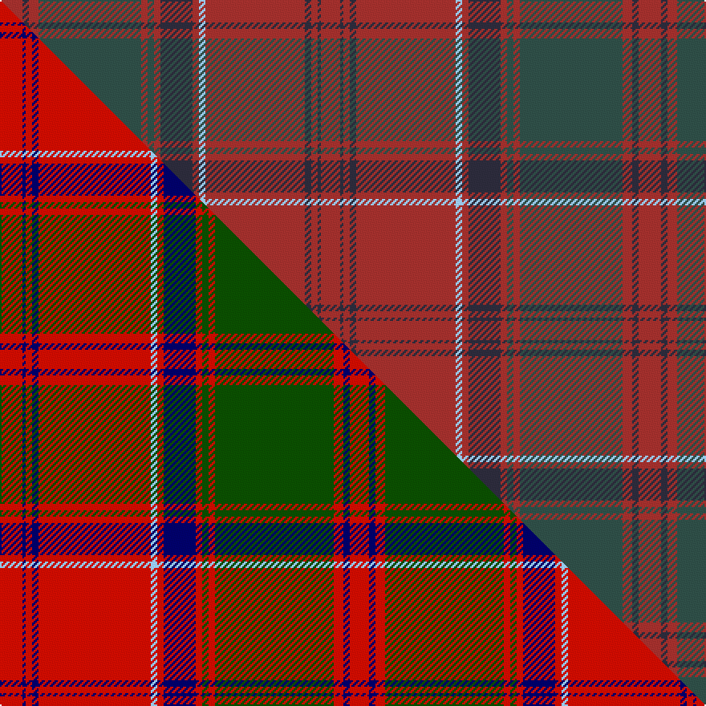

This is one **variant** — a specific cloth: this exact thread count and colourway, with its own
provenance below. It is one weaving of the [sett](/tartans/d/dr/drummond-of-megginch/) (the scale-free proportion — the
same cloth at any scale or shade), whose colour order is pattern [RBRBRWRBRGRGRBR](/stripes/rbrbrwrbrgrgrbr/).

Part of the [Drummond of Megginch](/tartans/d/dr/drummond-of-megginch/) tartan — the named design grouping this sett with its other cloths.

Sourced from research.  It is a [15 stripe tartan](/stripes/stripes15/).

Original link [https://tartandictionary.org/posts/drummondsofmegginch/](https://tartandictionary.org/posts/drummondsofmegginch/)

Dataset <small>— provenance for this record, inherited from the source manifest</small>

<dl class="dataset-prov">
<dt>source</dt><dd><a href="/sources/research/">Our own research</a></dd>
<dt>licence</dt><dd><a href="https://creativecommons.org/licenses/by-sa/4.0/">CC BY-SA 4.0</a></dd>
<dt>captured</dt><dd>2025-11-01</dd>
</dl>

## Thread count
R/14 DT4 R6 DG64 R4 DG4 R4 DT20 R4 LB4 R62 DT4 R4 DT2 R/12

One full sett is **398 threads**.

## Palette
<table><thead><tr><th>Colour</th><th>Shade</th><th>OKLCh</th></tr></thead><tbody><tr><td>DT</td><td><code style="background-color:#2B2A3A;">#2B2A3A</code> <small style="color:#888">#2B2A3A</small></td><td><small style="color:#888">oklch(29.3% 0.029 287.3)</small></td></tr><tr><td>R</td><td><code style="background-color:#9E2E2B;">#9E2E2B</code> <small style="color:#888">#9E2E2B</small></td><td><small style="color:#888">oklch(47.2% 0.148 26.2)</small></td></tr><tr><td>LB</td><td><code style="background-color:#98C8E8;">#98C8E8</code> <small style="color:#888">#98C8E8</small></td><td><small style="color:#888">oklch(81.0% 0.068 237.9)</small></td></tr><tr><td>DG</td><td><code style="background-color:#2D4C45;">#2D4C45</code> <small style="color:#888">#2D4C45</small></td><td><small style="color:#888">oklch(39.0% 0.039 178.2)</small></td></tr></tbody></table>

# Sample pattern

[Sample sheet (PDF)](swatch.pdf) — the woven sample, thread count and palette on one printable A4, rendered on demand (the same sheet the TTD print page downloads).

## Compared to the master

This cloth is one sett of its design; the master sett (the exemplar the design is anchored on) is below for comparison.

Its **ΔTartan distance** from the master is **0.29** — the same measure the nearest-tartans table ranks by (0 is identical; a re-scale of the same cloth is near 0, a recolour or a different proportion further).

<figure class="master-compare" style="margin:0">

this sett
master sett ★

<figcaption style="color:#888;font-size:smaller">One weave of this sett against the <a href="/setts/r7db1r2db2r35lb2r2db10r2dg2r2dg37r3db2r6/">master sett ★</a>, split on the diagonal: a shared proportion runs seamlessly across it with only the shades shifting; a different proportion breaks on it.</figcaption>
</figure>

## Nearest tartan variants

The nearest existing variants by ΔTartan distance, with this cloth at the top so the swatches line up against it.

ΔTartan

Threads

Variant

Sett

—

398

<a href="/variants/s15/r7dt2r3dg32r2dg2r2dt10r2lb2r31dt2r2dt1r6~x2~r4715027-dt2903288-dg3904177-lb8007237/">Drummond of Megginch - 1997 Kilt</a>

<a href="/ttd/edit/#slug=o7dt1o2dt2o35lt2o2dt10o2g2o2g37o3dt2o6~x2~o5417030-dt3009261-lt7505240-g5113138&amp;base=r7dt2r3dg32r2dg2r2dt10r2lb2r31dt2r2dt1r6~x2~r4715027-dt2903288-dg3904177-lb8007237" title="compare in the TTD">0.30</a>

434

<a href="/variants/s15/o7dt1o2dt2o35lt2o2dt10o2g2o2g37o3dt2o6~x2~o5417030-dt3009261-lt7505240-g5113138/">Drummond of Megginch - 1849 Kilt (faded)</a>

<a href="/ttd/edit/#slug=o7db1o2db2o35lb2o2db10o2g2o2g37o3db2o6~x2~o5417027-db3511252-lb8105240-g5112135&amp;base=r7dt2r3dg32r2dg2r2dt10r2lb2r31dt2r2dt1r6~x2~r4715027-dt2903288-dg3904177-lb8007237" title="compare in the TTD">0.30</a>

434

<a href="/variants/s15/o7db1o2db2o35lb2o2db10o2g2o2g37o3db2o6~x2~o5417027-db3511252-lb8105240-g5112135/">Drummond of Megginch - 2022 Proposal</a>

<a href="/ttd/edit/#slug=o7db1o2db2o35lb2o2db10o2g2o2g37o3db2o6~x2~o5517027-db3511252-lb8105243-g5112135&amp;base=r7dt2r3dg32r2dg2r2dt10r2lb2r31dt2r2dt1r6~x2~r4715027-dt2903288-dg3904177-lb8007237" title="compare in the TTD">0.30</a>

434

<a href="/variants/s15/o7db1o2db2o35lb2o2db10o2g2o2g37o3db2o6~x2~o5517027-db3511252-lb8105243-g5112135/">Drummond of Megginch - 2023 BertieLexa</a>

<a href="/ttd/edit/#slug=o8db3o3dg20o3dg3o3db6o3b3o20db3o3db2o6~x2~o3113030-dg4314141&amp;base=r7dt2r3dg32r2dg2r2dt10r2lb2r31dt2r2dt1r6~x2~r4715027-dt2903288-dg3904177-lb8007237" title="compare in the TTD">0.73</a>

328

<a href="/variants/s15/o8db3o3dg20o3dg3o3db6o3b3o20db3o3db2o6~x2~o3113030-dg4314141/">Glenfarclas Distillery</a>

<a href="/ttd/edit/#slug=dr50o6do7dg2do2lr2do2o14dr8do2dr9dg3~x2~do2403087-dg4007180&amp;base=r7dt2r3dg32r2dg2r2dt10r2lb2r31dt2r2dt1r6~x2~r4715027-dt2903288-dg3904177-lb8007237" title="compare in the TTD">3.60</a>

322

<a href="/variants/s12/dr50o6dg7dgi2dg2lr2dg2o14dr8dg2dr9dgi3~x2~dg2403087-dgi4007180/">Tyrone Irish County Tartan</a>

<a href="/ttd/edit/#slug=y3dp4r12dp27y2r65y2dp27r12dp4y3~x2~dp3706282-r3916030&amp;base=r7dt2r3dg32r2dg2r2dt10r2lb2r31dt2r2dt1r6~x2~r4715027-dt2903288-dg3904177-lb8007237" title="compare in the TTD">3.63</a>

632

<a href="/variants/s11/y3dp4r12dp27y2r65y2dp27r12dp4y3~x2~dp3706282-r3916030/">Bell's</a>

<a href="/ttd/edit/#slug=dr3r1db1dr1dg13dr3db4lb1dr16dg2dr2r1dg3~x2&amp;base=r7dt2r3dg32r2dg2r2dt10r2lb2r31dt2r2dt1r6~x2~r4715027-dt2903288-dg3904177-lb8007237" title="compare in the TTD">3.88</a>

192

<a href="/variants/s13/dr3r1db1dr1dg13dr3db4lb1dr16dg2dr2r1dg3~x2/">MacDonald of Glencoe</a>

<a href="/ttd/edit/#slug=dg3dr2t1dr19dg1dr1dg1dr8dg1t8dr1dg8dr1dg1dr1dg28dy1dg2o2~x2&amp;base=r7dt2r3dg32r2dg2r2dt10r2lb2r31dt2r2dt1r6~x2~r4715027-dt2903288-dg3904177-lb8007237" title="compare in the TTD">3.89</a>

350

<a href="/variants/s19/dg3dr2t1dr19dg1dr1dg1dr8dg1t8dr1dg8dr1dg1dr1dg28dy1dg2o2~x2/">Brewer</a>

## Neighbour map

Every grey dot is one of 13662 variants placed by the first two principal components of the ΔTartan feature space (42% of its variance). Red is this tartan; blue dots are its nearest — click one to open its page. The map is a flat projection of a many-dimensional space — [how to read it](/posts/neighbourhood-maps/).

<svg viewBox="0 0 640 380" role="img" style="max-width:100%;height:auto;border:1px solid #e0e0e0;border-radius:4px;display:block" xmlns="http://www.w3.org/2000/svg"><image href="/nn/cloud.v1.png" width="640" height="380"/><a href="/variants/s15/o7dt1o2dt2o35lt2o2dt10o2g2o2g37o3dt2o6~x2~o5417030-dt3009261-lt7505240-g5113138/"><circle cx="392.0" cy="101.5" r="4" fill="#3465a4"><title>Drummond of Megginch - 1849 Kilt (faded)</title></circle></a><a href="/variants/s15/o7db1o2db2o35lb2o2db10o2g2o2g37o3db2o6~x2~o5417027-db3511252-lb8105240-g5112135/"><circle cx="406.7" cy="106.6" r="4" fill="#3465a4"><title>Drummond of Megginch - 2022 Proposal</title></circle></a><a href="/variants/s15/o7db1o2db2o35lb2o2db10o2g2o2g37o3db2o6~x2~o5517027-db3511252-lb8105243-g5112135/"><circle cx="404.9" cy="105.9" r="4" fill="#3465a4"><title>Drummond of Megginch - 2023 BertieLexa</title></circle></a><a href="/variants/s15/o8db3o3dg20o3dg3o3db6o3b3o20db3o3db2o6~x2~o3113030-dg4314141/"><circle cx="353.2" cy="184.2" r="4" fill="#3465a4"><title>Glenfarclas Distillery</title></circle></a><a href="/variants/s12/dr50o6dg7dgi2dg2lr2dg2o14dr8dg2dr9dgi3~x2~dg2403087-dgi4007180/"><circle cx="476.1" cy="127.8" r="4" fill="#3465a4"><title>Tyrone Irish County Tartan</title></circle></a><a href="/variants/s11/y3dp4r12dp27y2r65y2dp27r12dp4y3~x2~dp3706282-r3916030/"><circle cx="544.5" cy="176.7" r="4" fill="#3465a4"><title>Bell's</title></circle></a><a href="/variants/s13/dr3r1db1dr1dg13dr3db4lb1dr16dg2dr2r1dg3~x2/"><circle cx="388.6" cy="165.6" r="4" fill="#3465a4"><title>MacDonald of Glencoe</title></circle></a><a href="/variants/s19/dg3dr2t1dr19dg1dr1dg1dr8dg1t8dr1dg8dr1dg1dr1dg28dy1dg2o2~x2/"><circle cx="428.9" cy="121.7" r="4" fill="#3465a4"><title>Brewer</title></circle></a><circle cx="454.8" cy="134.2" r="5" fill="#c00000"/><text x="320" y="376" text-anchor="middle" font-size="11" fill="#999">ground</text><text x="11" y="190" text-anchor="middle" font-size="11" fill="#999" transform="rotate(-90 11 190)">complexity</text></svg>

ID: /variants/s15/r7dt2r3dg32r2dg2r2dt10r2lb2r31dt2r2dt1r6~x2~r4715027-dt2903288-dg3904177-lb8007237/
