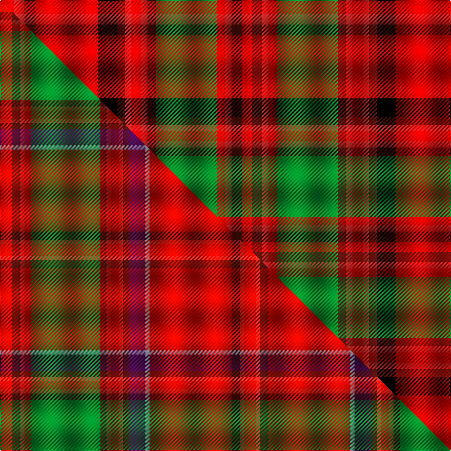

This page is one **sett** — a single exact thread-count. It belongs to the [tartan](/setts/ri7r5dr5ri31k9dr4r3ri5r3dr4g30ri4r3dr5ri5/)
(the same proportion at any scale), whose colour order is pattern [RBRRGBRRRBKRBRR](/stripes/rbrrgbrrrbkrbrr/).

Part of the [MacDougall](/tartans/macdougall-3/) tartan — the named design grouping this sett with its other cloths.

Sourced from register-of-tartans.  It is a [15 stripe tartan](/stripes/stripes15/).

Original link https://www.tartanregister.gov.uk/tartanDetails.aspx?ref=2393

## Register references

External register numbers recorded for this tartan.

- Scottish Register of Tartans: [2393](https://www.tartanregister.gov.uk/tartanDetails.aspx?ref=2393)
- Scottish Tartans World Register: 1647

## Thread count
Ri/14 R10 DR10 Ri62 K18 DR8 R6 Ri10 R6 DR8 G60 Ri8 R6 DR10 Ri/10

One full sett is **468 threads**.

## Palette
<table><thead><tr><th>Colour</th><th>Shade</th><th>OKLCh</th></tr></thead><tbody><tr><td>DR</td><td><code style="background-color:#55120C;">#55120C</code> <small style="color:#888">#55120C</small></td><td><small style="color:#888">oklch(30.0% 0.099 29.3)</small></td></tr><tr><td>G</td><td><code style="background-color:#008B2A;">#008B2A</code> <small style="color:#888">#008B2A</small></td><td><small style="color:#888">oklch(55.4% 0.170 145.9)</small></td></tr><tr><td>K</td><td><code style="background-color:#000000;">#000000</code> <small style="color:#888">#000000</small></td><td><small style="color:#888">oklch(0.0% 0.000 0.0)</small></td></tr><tr><td>R</td><td><code style="background-color:#DC0000;">#DC0000</code> <small style="color:#888">#DC0000</small></td><td><small style="color:#888">oklch(56.2% 0.230 29.2)</small></td></tr><tr><td>R</td><td><code style="background-color:#C82828;">#C82828</code> <small style="color:#888">#C82828</small></td><td><small style="color:#888">oklch(54.2% 0.196 26.8)</small></td></tr></tbody></table>

# Sample pattern

## Compared to the master

This cloth is one sett of its design; the master sett (the exemplar the design is anchored on) is below for comparison.

Its **ΔTartan distance** from the master is **2.13** — the same measure the nearest-tartans table ranks by (0 is identical; a re-scale of the same cloth is near 0, a recolour or a different proportion further).

<figure class="master-compare" style="margin:0">

this sett
master sett ★

<figcaption style="color:#888;font-size:smaller">One weave of this sett against the <a href="/setts/ri6dr4r2ri3g34dr3r2ri4r2dr3dp8lb2ri40dr4r2ri6/">master sett ★</a>, split on the diagonal: a shared proportion runs seamlessly across it with only the shades shifting; a different proportion breaks on it.</figcaption>
</figure>

ID: /variants/s15/ri7r5dr5ri31k9dr4r3ri5r3dr4g30ri4r3dr5ri5~x2~ri2209032-r2208029/
