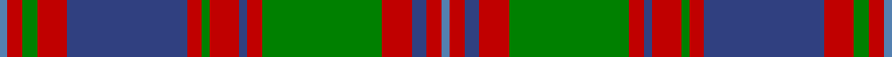

This page is one **sett** — a single exact thread-count. It belongs to the [tartan](/setts/t1r2db2r4g16r2db1r4g1r2db16r4g2r2t1/)
(the same proportion at any scale), whose colour order is pattern [BRBRGRBRGRBRGRB](/stripes/brbrgrbrgrbrgrb/).

Sourced from weddslist.  It is a [15 stripe tartan](/stripes/stripes15/).

Original link http://www.weddslist.com/cgi-bin/tartans/pg.pl?source=sts

## Thread count
Ba/2 R4 G4 R8 B32 R4 G2 R8 B2 R4 G32 R8 B4 R4 Ba/2

One full sett is **236 threads**.

## Palette

Palette: <strong>custom</strong>
<table><thead><tr><th>Colour</th><th>Threads</th><th>Shade</th><th>Base</th><th>OKLCh</th></tr></thead><tbody><tr><td>Ba/</td><td style="text-align:right;font-variant-numeric:tabular-nums">2</td><td><code style="background-color:#5480B0;">#5480B0</code> <small style="color:#888">#5480B0</small></td><td>B <code style="background-color:#2A418A;">#2A418A</code></td><td><small style="color:#888">oklch(58.8% 0.089 251.5)</small></td></tr><tr><td>R</td><td style="text-align:right;font-variant-numeric:tabular-nums">4</td><td><code style="background-color:#C00000;">#C00000</code> <small style="color:#888">#C00000</small></td><td>R <code style="background-color:#CC0000;">#CC0000</code></td><td><small style="color:#888">oklch(50.7% 0.208 29.2)</small></td></tr><tr><td>G</td><td style="text-align:right;font-variant-numeric:tabular-nums">4</td><td><code style="background-color:#008000;">#008000</code> <small style="color:#888">#008000</small></td><td>G <code style="background-color:#006100;">#006100</code></td><td><small style="color:#888">oklch(52.0% 0.177 142.5)</small></td></tr><tr><td>R</td><td style="text-align:right;font-variant-numeric:tabular-nums">8</td><td><code style="background-color:#C00000;">#C00000</code> <small style="color:#888">#C00000</small></td><td>R <code style="background-color:#CC0000;">#CC0000</code></td><td><small style="color:#888">oklch(50.7% 0.208 29.2)</small></td></tr><tr><td>B</td><td style="text-align:right;font-variant-numeric:tabular-nums">32</td><td><code style="background-color:#304080;">#304080</code> <small style="color:#888">#304080</small></td><td>B <code style="background-color:#2A418A;">#2A418A</code></td><td><small style="color:#888">oklch(39.4% 0.109 270.2)</small></td></tr><tr><td>R</td><td style="text-align:right;font-variant-numeric:tabular-nums">4</td><td><code style="background-color:#C00000;">#C00000</code> <small style="color:#888">#C00000</small></td><td>R <code style="background-color:#CC0000;">#CC0000</code></td><td><small style="color:#888">oklch(50.7% 0.208 29.2)</small></td></tr><tr><td>G</td><td style="text-align:right;font-variant-numeric:tabular-nums">2</td><td><code style="background-color:#008000;">#008000</code> <small style="color:#888">#008000</small></td><td>G <code style="background-color:#006100;">#006100</code></td><td><small style="color:#888">oklch(52.0% 0.177 142.5)</small></td></tr><tr><td>R</td><td style="text-align:right;font-variant-numeric:tabular-nums">8</td><td><code style="background-color:#C00000;">#C00000</code> <small style="color:#888">#C00000</small></td><td>R <code style="background-color:#CC0000;">#CC0000</code></td><td><small style="color:#888">oklch(50.7% 0.208 29.2)</small></td></tr><tr><td>B</td><td style="text-align:right;font-variant-numeric:tabular-nums">2</td><td><code style="background-color:#304080;">#304080</code> <small style="color:#888">#304080</small></td><td>B <code style="background-color:#2A418A;">#2A418A</code></td><td><small style="color:#888">oklch(39.4% 0.109 270.2)</small></td></tr><tr><td>R</td><td style="text-align:right;font-variant-numeric:tabular-nums">4</td><td><code style="background-color:#C00000;">#C00000</code> <small style="color:#888">#C00000</small></td><td>R <code style="background-color:#CC0000;">#CC0000</code></td><td><small style="color:#888">oklch(50.7% 0.208 29.2)</small></td></tr><tr><td>G</td><td style="text-align:right;font-variant-numeric:tabular-nums">32</td><td><code style="background-color:#008000;">#008000</code> <small style="color:#888">#008000</small></td><td>G <code style="background-color:#006100;">#006100</code></td><td><small style="color:#888">oklch(52.0% 0.177 142.5)</small></td></tr><tr><td>R</td><td style="text-align:right;font-variant-numeric:tabular-nums">8</td><td><code style="background-color:#C00000;">#C00000</code> <small style="color:#888">#C00000</small></td><td>R <code style="background-color:#CC0000;">#CC0000</code></td><td><small style="color:#888">oklch(50.7% 0.208 29.2)</small></td></tr><tr><td>B</td><td style="text-align:right;font-variant-numeric:tabular-nums">4</td><td><code style="background-color:#304080;">#304080</code> <small style="color:#888">#304080</small></td><td>B <code style="background-color:#2A418A;">#2A418A</code></td><td><small style="color:#888">oklch(39.4% 0.109 270.2)</small></td></tr><tr><td>R</td><td style="text-align:right;font-variant-numeric:tabular-nums">4</td><td><code style="background-color:#C00000;">#C00000</code> <small style="color:#888">#C00000</small></td><td>R <code style="background-color:#CC0000;">#CC0000</code></td><td><small style="color:#888">oklch(50.7% 0.208 29.2)</small></td></tr><tr><td>Ba/</td><td style="text-align:right;font-variant-numeric:tabular-nums">2</td><td><code style="background-color:#5480B0;">#5480B0</code> <small style="color:#888">#5480B0</small></td><td>B <code style="background-color:#2A418A;">#2A418A</code></td><td><small style="color:#888">oklch(58.8% 0.089 251.5)</small></td></tr></tbody></table>

## Nearest tartans

The nearest existing variants by ΔTartan distance, with this tartan at the top so the swatches line up against it.

ΔTartan

Tartan

Sett

—

<a href="/ttd/edit/#slug=t1r2db2r4g16r2db1r4g1r2db16r4g2r2t1~x2">MacIntyre, and Glenorchy</a> <a class="nn-out" href="/variants/s15/t1r2db2r4g16r2db1r4g1r2db16r4g2r2t1~x2/" title="open its dictionary page">↗</a>

0.57

<a href="/ttd/edit/#slug=t1r2db2r4g16r2db2r4g2r2db16r4g2r2t1~x2&amp;base=t1r2db2r4g16r2db1r4g1r2db16r4g2r2t1~x2">MacIntyre of Whitehouse (Clan?)</a> <a class="nn-out" href="/variants/s15/t1r2db2r4g16r2db2r4g2r2db16r4g2r2t1~x2/" title="open its dictionary page">↗</a>

0.86

<a href="/ttd/edit/#slug=r20p1r1db2r1p1r4db4g2db4g2db4g19r1p2~x2&amp;base=t1r2db2r4g16r2db1r4g1r2db16r4g2r2t1~x2">Ladybird</a> <a class="nn-out" href="/variants/s15/r20p1r1db2r1p1r4db4g2db4g2db4g19r1p2~x2/" title="open its dictionary page">↗</a>

1.07

<a href="/ttd/edit/#slug=o4n12k12n4oi18n1o1n1oi2n1o2n1oi4n1o4~x4&amp;base=t1r2db2r4g16r2db1r4g1r2db16r4g2r2t1~x2">Ettrick (Fashion)</a> <a class="nn-out" href="/variants/s15/o4n12k12n4oi18n1o1n1oi2n1o2n1oi4n1o4~x4/" title="open its dictionary page">↗</a>

1.07

<a href="/ttd/edit/#slug=t3r24db4r8g32r4db4r8g4r4db32r8g4r4t2~x2&amp;base=t1r2db2r4g16r2db1r4g1r2db16r4g2r2t1~x2">MacIntyre (of Gatehouse)</a> <a class="nn-out" href="/variants/s15/t3r24db4r8g32r4db4r8g4r4db32r8g4r4t2~x2/" title="open its dictionary page">↗</a>

1.16

<a href="/ttd/edit/#slug=db2t1r2g16r2db6t1r2g6r2db16t1r2g2~x2&amp;base=t1r2db2r4g16r2db1r4g1r2db16r4g2r2t1~x2">Glen Orchy</a> <a class="nn-out" href="/variants/s14/db2t1r2g16r2db6t1r2g6r2db16t1r2g2~x2/" title="open its dictionary page">↗</a>

1.21

<a href="/ttd/edit/#slug=t1r1db1r2g8r1db1r2g1r1db8r2g1r1t1~x4&amp;base=t1r2db2r4g16r2db1r4g1r2db16r4g2r2t1~x2">MacIntyre of Glenorchy Clan Tartan</a> <a class="nn-out" href="/variants/s15/t1r1db1r2g8r1db1r2g1r1db8r2g1r1t1~x4/" title="open its dictionary page">↗</a>

1.21

<a href="/ttd/edit/#slug=db16r1db1r1g12r16w2r16g12db12r1db1~x2&amp;base=t1r2db2r4g16r2db1r4g1r2db16r4g2r2t1~x2">Fraser of Lovat</a> <a class="nn-out" href="/variants/s12/db16r1db1r1g12r16w2r16g12db12r1db1~x2/" title="open its dictionary page">↗</a>

1.24

<a href="/ttd/edit/#slug=g6r2g2r24t1db1r2db12r2db1t1r2g24r2~x2&amp;base=t1r2db2r4g16r2db1r4g1r2db16r4g2r2t1~x2">Unidentified, coat</a> <a class="nn-out" href="/variants/s14/g6r2g2r24t1db1r2db12r2db1t1r2g24r2~x2/" title="open its dictionary page">↗</a>

1.25

<a href="/ttd/edit/#slug=k10y26k2y4k2y26k3r36k3g30k3r2&amp;base=t1r2db2r4g16r2db1r4g1r2db16r4g2r2t1~x2">Pope (Welsh Name)</a> <a class="nn-out" href="/variants/s12/k10y26k2y4k2y26k3r36k3g30k3r2/" title="open its dictionary page">↗</a>

1.26

<a href="/variants/s18/r47g14k5ly2k3g7k3ly2k5g14~x2/">Harbor Club</a>

## Neighbour map

Every grey dot is one of 14360 variants placed by the first two principal components of the ΔTartan feature space (44% of its variance). Red is this tartan; blue dots are its nearest — click one to open its page.

<svg viewBox="0 0 640 380" role="img" style="max-width:100%;height:auto;border:1px solid #e0e0e0;border-radius:4px;display:block" xmlns="http://www.w3.org/2000/svg"><image href="/nn/cloud.v1.png" width="640" height="380"/><a href="/variants/s15/t1r2db2r4g16r2db2r4g2r2db16r4g2r2t1~x2/"><circle cx="211.9" cy="129.9" r="4" fill="#3465a4"><title>MacIntyre of Whitehouse (Clan?)</title></circle></a><a href="/variants/s15/r20p1r1db2r1p1r4db4g2db4g2db4g19r1p2~x2/"><circle cx="269.1" cy="114.7" r="4" fill="#3465a4"><title>Ladybird</title></circle></a><a href="/variants/s15/o4n12k12n4oi18n1o1n1oi2n1o2n1oi4n1o4~x4/"><circle cx="196.6" cy="123.7" r="4" fill="#3465a4"><title>Ettrick (Fashion)</title></circle></a><a href="/variants/s15/t3r24db4r8g32r4db4r8g4r4db32r8g4r4t2~x2/"><circle cx="251.3" cy="137.8" r="4" fill="#3465a4"><title>MacIntyre (of Gatehouse)</title></circle></a><a href="/variants/s14/db2t1r2g16r2db6t1r2g6r2db16t1r2g2~x2/"><circle cx="259.3" cy="149.9" r="4" fill="#3465a4"><title>Glen Orchy</title></circle></a><a href="/variants/s15/t1r1db1r2g8r1db1r2g1r1db8r2g1r1t1~x4/"><circle cx="185.3" cy="163.1" r="4" fill="#3465a4"><title>MacIntyre of Glenorchy Clan Tartan</title></circle></a><a href="/variants/s12/db16r1db1r1g12r16w2r16g12db12r1db1~x2/"><circle cx="230.1" cy="160.0" r="4" fill="#3465a4"><title>Fraser of Lovat</title></circle></a><a href="/variants/s14/g6r2g2r24t1db1r2db12r2db1t1r2g24r2~x2/"><circle cx="297.5" cy="111.8" r="4" fill="#3465a4"><title>Unidentified, coat</title></circle></a><a href="/variants/s12/k10y26k2y4k2y26k3r36k3g30k3r2/"><circle cx="202.7" cy="129.4" r="4" fill="#3465a4"><title>Pope (Welsh Name)</title></circle></a><a href="/variants/s18/r47g14k5ly2k3g7k3ly2k5g14~x2/"><circle cx="262.7" cy="110.4" r="4" fill="#3465a4"><title>Harbor Club</title></circle></a><circle cx="231.6" cy="133.2" r="5" fill="#c00000"/></svg>

ID: /variants/s15/t1r2db2r4g16r2db1r4g1r2db16r4g2r2t1~x2/
