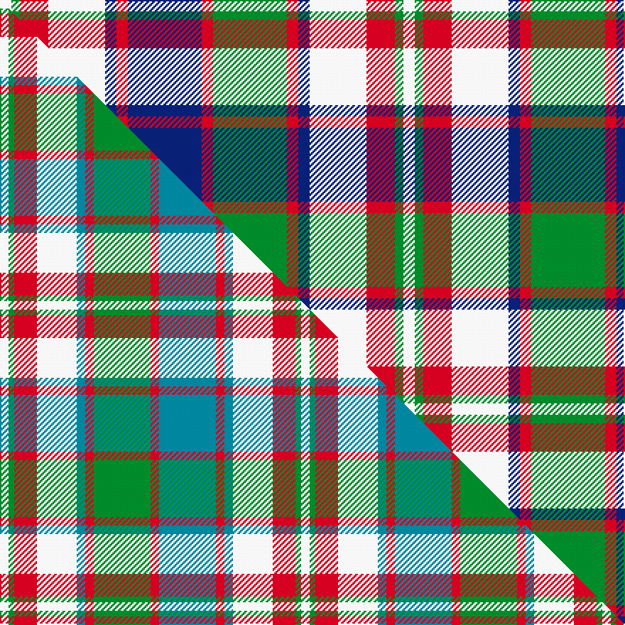

This is one **variant** — a specific cloth: this exact thread count and colourway, with its own
provenance below. It is one weaving of the [sett](/tartans/r/ro/robertson-dress-hunting/) (the scale-free proportion — the
same cloth at any scale or shade), whose colour order is pattern [WGRWBRBRGRBWRGW](/stripes/wgrwbrbrgrbwrgw/).

Part of the [Robertson dress Hunting](/tartans/r/ro/robertson-dress-hunting/) tartan — the named design grouping this sett with its other cloths.

Sourced from house-of-tartan.  It is a [15 stripe tartan](/stripes/stripes15/).

Original link [http://www.house-of-tartan.scotland.net/house/TartanViewjs.asp?colr=Def&tnam=1804](http://www.house-of-tartan.scotland.net/house/TartanViewjs.asp?colr=Def&tnam=1804)

## Provenance

Earliest known date: pre 2003 Nothing

2 attestations — the source records this cloth was collapsed from (oldest owns this page)

<ul>
<li>pre 2003 — Robertson Dress Hunting Clan Tartan (house-of-tartan, <a href="http://www.house-of-tartan.scotland.net/house/TartanViewjs.asp?colr=Def&tnam=1804">record</a>) </li>
<li>undated — Robertson, dress hunting (weddslist, <a href="http://www.weddslist.com/cgi-bin/tartans/pg.pl?source=sts">record</a>) </li>
</ul>

Dataset <small>— provenance for this record, inherited from the source manifest</small>

<dl class="dataset-prov">
<dt>source</dt><dd><a href="/sources/house-of-tartan/">House of Tartan</a></dd>
<dt>data captured from</dt><dd><a href="https://github.com/thetartan/tartan-database/blob/master/data/house-of-tartan/data.csv">https://github.com/thetartan/tartan-database/blob/master/data/house-of-tartan/data.csv</a></dd>
<dt>data date</dt><dd>pre 2003 <small>(this record)</small></dd>
<dt>licence</dt><dd><a href="https://creativecommons.org/licenses/by-nc-nd/4.0/">CC BY-NC-ND 4.0</a></dd>
</dl>

Capture chain <small>— the hands this data passed through, oldest first; each capture carries its own licence</small>

<ol class="capture-chain">
<li><a href="http://www.house-of-tartan.scotland.net/">House of Tartan</a> <small>the weaver/retailer's database — the site is now offline; the URL is kept as the ultimate source's identity</small></li>
<li><a href="https://github.com/thetartan/tartan-database">thetartan/tartan-database</a> <small>2016-2017</small> · <a href="https://creativecommons.org/licenses/by-nc-nd/4.0/">CC BY-NC-ND 4.0</a> <small>Levko Kravets's frozen compilation — the capture we vendored, and where its CC licence text came from</small></li>
<li>this dictionary <small>captured 2026-06-10 · commit 5bf86c7566</small> <small>each re-capture is a git commit to data/sources</small></li>
</ol>

## Thread count
W/8 G6 R20 W40 DB8 R8 DB52 R8 G52 R8 DB8 W40 R20 G6 W/8

One full sett is **568 threads**.

## Palette
<table><thead><tr><th>Colour</th><th>Shade</th><th>OKLCh</th></tr></thead><tbody><tr><td>DB</td><td><code style="background-color:#082077;">#082077</code> <small style="color:#888">#082077</small></td><td><small style="color:#888">oklch(30.0% 0.149 265.1)</small></td></tr><tr><td>G</td><td><code style="background-color:#008B2A;">#008B2A</code> <small style="color:#888">#008B2A</small></td><td><small style="color:#888">oklch(55.4% 0.170 145.9)</small></td></tr><tr><td>W</td><td><code style="background-color:#F7F7F7;">#F7F7F7</code> <small style="color:#888">#F7F7F7</small></td><td><small style="color:#888">oklch(97.6% 0.000 89.9)</small></td></tr><tr><td>R</td><td><code style="background-color:#D60020;">#D60020</code> <small style="color:#888">#D60020</small></td><td><small style="color:#888">oklch(55.2% 0.224 25.5)</small></td></tr></tbody></table>

# Sample pattern

[Sample sheet (PDF)](swatch.pdf) — the woven sample, thread count and palette on one printable A4, rendered on demand (the same sheet the TTD print page downloads).

## Compared to the master

This cloth is one sett of its design; the master sett (the exemplar the design is anchored on) is below for comparison.

Its **ΔTartan distance** from the master is **0.29** — the same measure the nearest-tartans table ranks by (0 is identical; a re-scale of the same cloth is near 0, a recolour or a different proportion further).

<figure class="master-compare" style="margin:0">

this sett
master sett ★

<figcaption style="color:#888;font-size:smaller">One weave of this sett against the <a href="/setts/w3g2r8w14t3r3g20r3t20r3t3w14r8g2w3/">master sett ★</a>, split on the diagonal: a shared proportion runs seamlessly across it with only the shades shifting; a different proportion breaks on it.</figcaption>
</figure>

## Nearest tartan variants

The nearest existing variants by ΔTartan distance, with this cloth at the top so the swatches line up against it.

ΔTartan

Threads

Variant

Sett

—

568

<a href="/variants/s15/w4g3r10w20db4r4db26r4g26r4db4w20r10g3w4~x2/">Robertson Dress Hunting Clan Tartan</a>

<a href="/ttd/edit/#slug=w3g2r8w14t3r3g20r3t20r3t3w14r8g2w3~x2&amp;base=w4g3r10w20db4r4db26r4g26r4db4w20r10g3w4~x2" title="compare in the TTD">0.29</a>

424

<a href="/variants/s15/w3g2r8w14t3r3g20r3t20r3t3w14r8g2w3~x2/">Robertson dress Hunting</a>

<a href="/ttd/edit/#slug=r5db3r5g12db8w5db5w22db3r4db3w22db5w5db8g12r5db3r5~x2&amp;base=w4g3r10w20db4r4db26r4g26r4db4w20r10g3w4~x2" title="compare in the TTD">1.89</a>

540

<a href="/variants/s19/r5db3r5g12db8w5db5w22db3r4db3w22db5w5db8g12r5db3r5~x2/">Unidentified #56</a>

<a href="/ttd/edit/#slug=w20o3w20o3w9o12w3o15db3o6db19w3db5r4db19~x2&amp;base=w4g3r10w20db4r4db26r4g26r4db4w20r10g3w4~x2" title="compare in the TTD">2.39</a>

498

<a href="/variants/s15/w20o3w20o3w9o12w3o15db3o6db19w3db5r4db19~x2/">Black and White, Colourway</a>

<a href="/ttd/edit/#slug=w5db2w1g8w1db2r2w1r2db2w1lo8w1db2w5~x2&amp;base=w4g3r10w20db4r4db26r4g26r4db4w20r10g3w4~x2" title="compare in the TTD">2.43</a>

152

<a href="/variants/s15/w5db2w1g8w1db2r2w1r2db2w1lo8w1db2w5~x2/">Wombles Corporate Tartan</a>

<a href="/ttd/edit/#slug=db3o14g2o2g2o3g6w18db3o2db2o2~x2&amp;base=w4g3r10w20db4r4db26r4g26r4db4w20r10g3w4~x2" title="compare in the TTD">2.53</a>

226

<a href="/variants/s12/db3o14g2o2g2o3g6w18db3o2db2o2~x2/">Raibert, Check</a>

<a href="/ttd/edit/#slug=db24r4g24r4db4w20r10g3w4~x2&amp;base=w4g3r10w20db4r4db26r4g26r4db4w20r10g3w4~x2" title="compare in the TTD">2.59</a>

332

<a href="/variants/s9/db24r4g24r4db4w20r10g3w4~x2/">Robertson Dress Clan Tartan</a>

<a href="/ttd/edit/#slug=r3dg8db5w3dg20w3db5w3db5w22db3w8r3~x2&amp;base=w4g3r10w20db4r4db26r4g26r4db4w20r10g3w4~x2" title="compare in the TTD">2.66</a>

352

<a href="/variants/s13/r3dg8db5w3dg20w3db5w3db5w22db3w8r3~x2/">MacDonald, Flora (Dance)</a>

<a href="/ttd/edit/#slug=w11db4w4db2w4n4w11o26n4w3n4w2db14dg10w16dg6~x2&amp;base=w4g3r10w20db4r4db26r4g26r4db4w20r10g3w4~x2" title="compare in the TTD">2.74</a>

466

<a href="/variants/s16/w11db4w4db2w4n4w11o26n4w3n4w2db14dg10w16dg6~x2/">Stuart-Houghton Dress (Personal)</a>

<a href="/ttd/edit/#slug=w5db2w1g8w1db2r2w1r2db2w1b8w1db2w5~x2&amp;base=w4g3r10w20db4r4db26r4g26r4db4w20r10g3w4~x2" title="compare in the TTD">2.79</a>

152

<a href="/variants/s15/w5db2w1g8w1db2r2w1r2db2w1b8w1db2w5~x2/">Wombles</a>

<a href="/ttd/edit/#slug=w4db1g9db9r9db1y4db1r9db9g1db1g1db1g4db1w4~x2&amp;base=w4g3r10w20db4r4db26r4g26r4db4w20r10g3w4~x2" title="compare in the TTD">2.86</a>

260

<a href="/variants/s17/w4db1g9db9r9db1y4db1r9db9g1db1g1db1g4db1w4~x2/">Alaskan Scottish</a>

## Neighbour map

Every grey dot is one of 13662 variants placed by the first two principal components of the ΔTartan feature space (42% of its variance). Red is this tartan; blue dots are its nearest — click one to open its page. The map is a flat projection of a many-dimensional space — [how to read it](/posts/neighbourhood-maps/).

<svg viewBox="0 0 640 380" role="img" style="max-width:100%;height:auto;border:1px solid #e0e0e0;border-radius:4px;display:block" xmlns="http://www.w3.org/2000/svg"><image href="/nn/cloud.v1.png" width="640" height="380"/><a href="/variants/s15/w3g2r8w14t3r3g20r3t20r3t3w14r8g2w3~x2/"><circle cx="145.1" cy="178.4" r="4" fill="#3465a4"><title>Robertson dress Hunting</title></circle></a><a href="/variants/s19/r5db3r5g12db8w5db5w22db3r4db3w22db5w5db8g12r5db3r5~x2/"><circle cx="124.5" cy="175.8" r="4" fill="#3465a4"><title>Unidentified #56</title></circle></a><a href="/variants/s15/w20o3w20o3w9o12w3o15db3o6db19w3db5r4db19~x2/"><circle cx="144.7" cy="196.2" r="4" fill="#3465a4"><title>Black and White, Colourway</title></circle></a><a href="/variants/s15/w5db2w1g8w1db2r2w1r2db2w1lo8w1db2w5~x2/"><circle cx="108.7" cy="172.3" r="4" fill="#3465a4"><title>Wombles Corporate Tartan</title></circle></a><a href="/variants/s12/db3o14g2o2g2o3g6w18db3o2db2o2~x2/"><circle cx="183.2" cy="171.0" r="4" fill="#3465a4"><title>Raibert, Check</title></circle></a><a href="/variants/s9/db24r4g24r4db4w20r10g3w4~x2/"><circle cx="117.4" cy="204.0" r="4" fill="#3465a4"><title>Robertson Dress Clan Tartan</title></circle></a><a href="/variants/s13/r3dg8db5w3dg20w3db5w3db5w22db3w8r3~x2/"><circle cx="161.6" cy="177.9" r="4" fill="#3465a4"><title>MacDonald, Flora (Dance)</title></circle></a><a href="/variants/s16/w11db4w4db2w4n4w11o26n4w3n4w2db14dg10w16dg6~x2/"><circle cx="143.8" cy="150.3" r="4" fill="#3465a4"><title>Stuart-Houghton Dress (Personal)</title></circle></a><a href="/variants/s15/w5db2w1g8w1db2r2w1r2db2w1b8w1db2w5~x2/"><circle cx="107.4" cy="173.9" r="4" fill="#3465a4"><title>Wombles</title></circle></a><a href="/variants/s17/w4db1g9db9r9db1y4db1r9db9g1db1g1db1g4db1w4~x2/"><circle cx="125.0" cy="160.9" r="4" fill="#3465a4"><title>Alaskan Scottish</title></circle></a><circle cx="123.3" cy="173.6" r="5" fill="#c00000"/><text x="320" y="376" text-anchor="middle" font-size="11" fill="#999">ground</text><text x="11" y="190" text-anchor="middle" font-size="11" fill="#999" transform="rotate(-90 11 190)">complexity</text></svg>

ID: /variants/s15/w4g3r10w20db4r4db26r4g26r4db4w20r10g3w4~x2/
