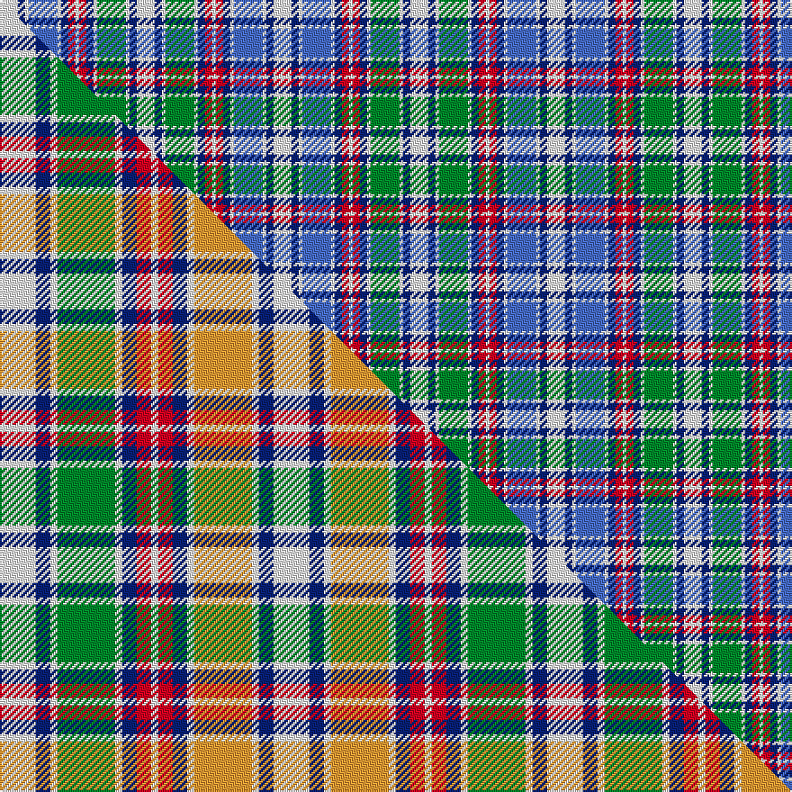

This page is one **sett** — a single exact thread-count. It belongs to the [tartan](/setts/w5db2w1g8w1db2r2w1r2db2w1b8w1db2w5/)
(the same proportion at any scale), whose colour order is pattern [WBWBWBRWRBWGWBW](/stripes/wbwbwbrwrbwgwbw/).

Part of the [Wombles](/tartans/wombles/) tartan — the named design grouping this sett with its other cloths.

Sourced from weddslist.  It is a [15 stripe tartan](/stripes/stripes15/).

Original link [http://www.weddslist.com/cgi-bin/tartans/pg.pl?source=sts](http://www.weddslist.com/cgi-bin/tartans/pg.pl?source=sts)

Dataset <small>— provenance for this record, inherited from the source manifest</small>

<dl class="dataset-prov">
<dt>source</dt><dd><a href="/sources/weddslist/">Weddslist</a></dd>
<dt>data captured from</dt><dd><a href="https://github.com/thetartan/tartan-database/blob/master/data/weddslist/data.csv">https://github.com/thetartan/tartan-database/blob/master/data/weddslist/data.csv</a></dd>
<dt>data date</dt><dd>2016-11-17 <small>(dataset default)</small></dd>
<dt>licence</dt><dd><a href="https://creativecommons.org/licenses/by-nc-nd/4.0/">CC BY-NC-ND 4.0</a></dd>
</dl>

Capture chain <small>— the hands this data passed through, oldest first; each capture carries its own licence</small>

<ol class="capture-chain">
<li><a href="https://www.weddslist.com/tartans/">Weddslist</a> <small>the living privately compiled reference</small></li>
<li><a href="https://github.com/thetartan/tartan-database">thetartan/tartan-database</a> <small>2016-2017</small> · <a href="https://creativecommons.org/licenses/by-nc-nd/4.0/">CC BY-NC-ND 4.0</a> <small>Levko Kravets's frozen compilation — the capture we vendored, and where its CC licence text came from</small></li>
<li>this dictionary <small>captured 2026-06-10 · commit 5bf86c7566</small> <small>each re-capture is a git commit to data/sources</small></li>
</ol>

## Thread count
W/10 DB4 W2 B16 W2 DB4 R4 W2 R4 DB4 W2 G16 W2 DB4 W/10

One full sett is **152 threads**.

## Palette
<table><thead><tr><th>Colour</th><th>Shade</th><th>OKLCh</th></tr></thead><tbody><tr><td>DB</td><td><code style="background-color:#082077;">#082077</code> <small style="color:#888">#082077</small></td><td><small style="color:#888">oklch(30.0% 0.149 265.1)</small></td></tr><tr><td>R</td><td><code style="background-color:#D60020;">#D60020</code> <small style="color:#888">#D60020</small></td><td><small style="color:#888">oklch(55.2% 0.224 25.5)</small></td></tr><tr><td>G</td><td><code style="background-color:#008B2A;">#008B2A</code> <small style="color:#888">#008B2A</small></td><td><small style="color:#888">oklch(55.4% 0.170 145.9)</small></td></tr><tr><td>W</td><td><code style="background-color:#F7F7F7;">#F7F7F7</code> <small style="color:#888">#F7F7F7</small></td><td><small style="color:#888">oklch(97.6% 0.000 89.9)</small></td></tr><tr><td>B</td><td><code style="background-color:#466CC8;">#466CC8</code> <small style="color:#888">#466CC8</small></td><td><small style="color:#888">oklch(55.1% 0.149 265.0)</small></td></tr></tbody></table>

# Sample pattern

## Compared to the master

This cloth is one sett of its design; the master sett (the exemplar the design is anchored on) is below for comparison.

Its **ΔTartan distance** from the master is **1.00** — the same measure the nearest-tartans table ranks by (0 is identical; a re-scale of the same cloth is near 0, a recolour or a different proportion further).

<figure class="master-compare" style="margin:0">

this sett
master sett ★

<figcaption style="color:#888;font-size:smaller">One weave of this sett against the <a href="/setts/w5db2w1g8w1db2r2w1r2db2w1lo8w1db2w5/">master sett ★</a>, split on the diagonal: a shared proportion runs seamlessly across it with only the shades shifting; a different proportion breaks on it.</figcaption>
</figure>

## Nearest tartan variants

The nearest existing variants by ΔTartan distance, with this cloth at the top so the swatches line up against it.

ΔTartan

Threads

Variant

Sett

—

152

<a href="/variants/s15/w5db2w1g8w1db2r2w1r2db2w1b8w1db2w5~x2/">Wombles</a>

<a href="/ttd/edit/#slug=w5db2w1g8w1db2r2w1r2db2w1lo8w1db2w5~x2&amp;base=w5db2w1g8w1db2r2w1r2db2w1b8w1db2w5~x2" title="compare in the TTD">1.00</a>

152

<a href="/variants/s15/w5db2w1g8w1db2r2w1r2db2w1lo8w1db2w5~x2/">Wombles Corporate Tartan</a>

<a href="/ttd/edit/#slug=w5db2w1g8w1db2r2w1r2db2w1lo8w1db2w5~x4&amp;base=w5db2w1g8w1db2r2w1r2db2w1b8w1db2w5~x2" title="compare in the TTD">1.00</a>

304

<a href="/variants/s15/w5db2w1g8w1db2r2w1r2db2w1lo8w1db2w5~x4/">Wombles #4</a>

<a href="/ttd/edit/#slug=w11db4w4db2w4n4w11o26n4w3n4w2db14dg10w16dg6~x2&amp;base=w5db2w1g8w1db2r2w1r2db2w1b8w1db2w5~x2" title="compare in the TTD">2.47</a>

466

<a href="/variants/s16/w11db4w4db2w4n4w11o26n4w3n4w2db14dg10w16dg6~x2/">Stuart-Houghton Dress (Personal)</a>

<a href="/ttd/edit/#slug=lb18db3lb10db3lb10db14ly2r7ly2g14ly2db14~x2&amp;base=w5db2w1g8w1db2r2w1r2db2w1b8w1db2w5~x2" title="compare in the TTD">2.54</a>

332

<a href="/variants/s12/lb18db3lb10db3lb10db14ly2r7ly2g14ly2db14~x2/">Ralston (UK)</a>

<a href="/ttd/edit/#slug=w1r2db2w1g9w1db2r2w1r2db2w1b9w1db2r2w1~x4&amp;base=w5db2w1g8w1db2r2w1r2db2w1b8w1db2w5~x2" title="compare in the TTD">2.56</a>

320

<a href="/variants/s17/w1r2db2w1g9w1db2r2w1r2db2w1b9w1db2r2w1~x4/">Jacobite</a>

<a href="/ttd/edit/#slug=w1r2db2w1g8w1db2r2w1r2db2w1b8w1db2r2w1~x2&amp;base=w5db2w1g8w1db2r2w1r2db2w1b8w1db2w5~x2" title="compare in the TTD">2.71</a>

152

<a href="/variants/s17/w1r2db2w1g8w1db2r2w1r2db2w1b8w1db2r2w1~x2/">Jacobite</a>

<a href="/ttd/edit/#slug=w4g3r10w20db4r4db26r4g26r4db4w20r10g3w4~x2&amp;base=w5db2w1g8w1db2r2w1r2db2w1b8w1db2w5~x2" title="compare in the TTD">2.79</a>

568

<a href="/variants/s15/w4g3r10w20db4r4db26r4g26r4db4w20r10g3w4~x2/">Robertson, dress hunting</a>

<a href="/ttd/edit/#slug=w8g14r6g24db30y10w40y10db7y4&amp;base=w5db2w1g8w1db2r2w1r2db2w1b8w1db2w5~x2" title="compare in the TTD">2.86</a>

294

<a href="/variants/s10/w8g14r6g24db30y10w40y10db7y4/">John, Hamilton Gray</a>

<a href="/ttd/edit/#slug=db12r2db2r2db2g10w12dy3w12g10db11r2db2~x2&amp;base=w5db2w1g8w1db2r2w1r2db2w1b8w1db2w5~x2" title="compare in the TTD">2.86</a>

300

<a href="/variants/s13/db12r2db2r2db2g10w12dy3w12g10db11r2db2~x2/">Idaho</a>

<a href="/ttd/edit/#slug=r5db3r5g12db8w5db5w22db3r4db3w22db5w5db8g12r5db3r5~x2&amp;base=w5db2w1g8w1db2r2w1r2db2w1b8w1db2w5~x2" title="compare in the TTD">2.92</a>

540

<a href="/variants/s19/r5db3r5g12db8w5db5w22db3r4db3w22db5w5db8g12r5db3r5~x2/">Unidentified #56</a>

## Neighbour map

Every grey dot is one of 13621 variants placed by the first two principal components of the ΔTartan feature space (42% of its variance). Red is this tartan; blue dots are its nearest — click one to open its page.

<svg viewBox="0 0 640 380" role="img" style="max-width:100%;height:auto;border:1px solid #e0e0e0;border-radius:4px;display:block" xmlns="http://www.w3.org/2000/svg"><image href="/nn/cloud.v1.png" width="640" height="380"/><a href="/variants/s15/w5db2w1g8w1db2r2w1r2db2w1lo8w1db2w5~x2/"><circle cx="108.6" cy="173.0" r="4" fill="#3465a4"><title>Wombles Corporate Tartan</title></circle></a><a href="/variants/s15/w5db2w1g8w1db2r2w1r2db2w1lo8w1db2w5~x4/"><circle cx="65.8" cy="146.6" r="4" fill="#3465a4"><title>Wombles #4</title></circle></a><a href="/variants/s16/w11db4w4db2w4n4w11o26n4w3n4w2db14dg10w16dg6~x2/"><circle cx="143.7" cy="150.9" r="4" fill="#3465a4"><title>Stuart-Houghton Dress (Personal)</title></circle></a><a href="/variants/s12/lb18db3lb10db3lb10db14ly2r7ly2g14ly2db14~x2/"><circle cx="150.3" cy="195.8" r="4" fill="#3465a4"><title>Ralston (UK)</title></circle></a><a href="/variants/s17/w1r2db2w1g9w1db2r2w1r2db2w1b9w1db2r2w1~x4/"><circle cx="83.0" cy="154.6" r="4" fill="#3465a4"><title>Jacobite</title></circle></a><a href="/variants/s17/w1r2db2w1g8w1db2r2w1r2db2w1b8w1db2r2w1~x2/"><circle cx="68.4" cy="164.8" r="4" fill="#3465a4"><title>Jacobite</title></circle></a><a href="/variants/s15/w4g3r10w20db4r4db26r4g26r4db4w20r10g3w4~x2/"><circle cx="123.2" cy="174.3" r="4" fill="#3465a4"><title>Robertson, dress hunting</title></circle></a><a href="/variants/s10/w8g14r6g24db30y10w40y10db7y4/"><circle cx="105.3" cy="188.4" r="4" fill="#3465a4"><title>John, Hamilton Gray</title></circle></a><a href="/variants/s13/db12r2db2r2db2g10w12dy3w12g10db11r2db2~x2/"><circle cx="73.6" cy="174.3" r="4" fill="#3465a4"><title>Idaho</title></circle></a><a href="/variants/s19/r5db3r5g12db8w5db5w22db3r4db3w22db5w5db8g12r5db3r5~x2/"><circle cx="124.4" cy="176.5" r="4" fill="#3465a4"><title>Unidentified #56</title></circle></a><circle cx="107.4" cy="174.4" r="5" fill="#c00000"/><text x="320" y="376" text-anchor="middle" font-size="11" fill="#999">ground</text><text x="11" y="190" text-anchor="middle" font-size="11" fill="#999" transform="rotate(-90 11 190)">complexity</text></svg>

ID: /variants/s15/w5db2w1g8w1db2r2w1r2db2w1b8w1db2w5~x2/
