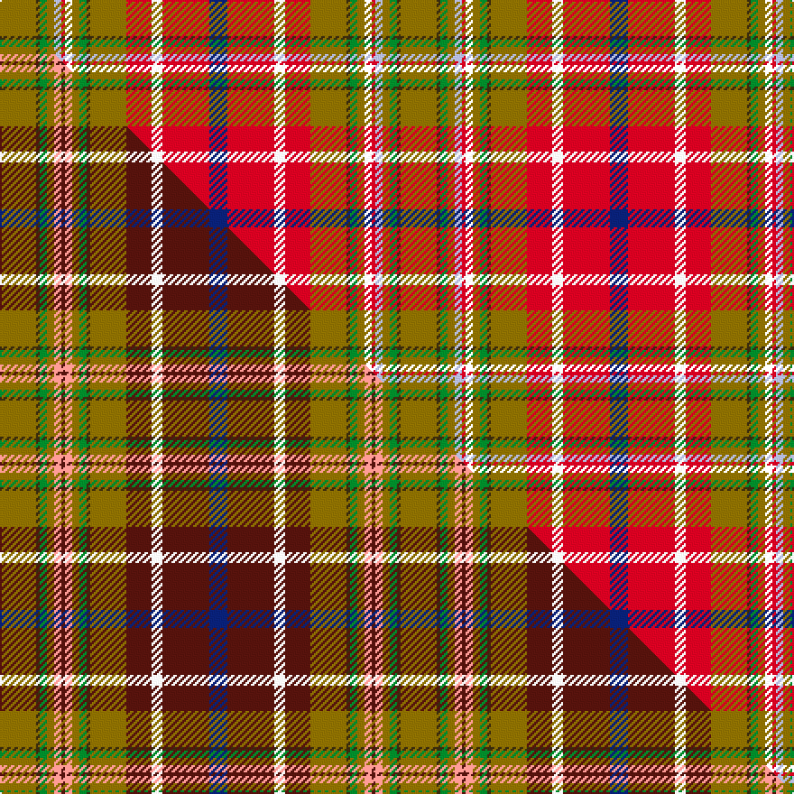

This is one **variant** — a specific cloth: this exact thread count and colourway, with its own
provenance below. It is one weaving of the [sett](/tartans/c/co/contrecoeur-2/) (the scale-free proportion — the
same cloth at any scale or shade), whose colour order is pattern [BRWRGGGGKRWGGGG](/stripes/brwrggggkrwgggg/).

Part of the [Contrecoeur](/tartans/c/co/contrecoeur-2/) tartan — the named design grouping this sett with its other cloths.

Sourced from house-of-tartan.  It is a [15 stripe tartan](/stripes/stripes15/).

Original link [http://www.house-of-tartan.scotland.net/house/TartanViewjs.asp?colr=Def&tnam=2294](http://www.house-of-tartan.scotland.net/house/TartanViewjs.asp?colr=Def&tnam=2294)

## Provenance

Earliest known date: 1992 Small township in southern Quebec. Tartan designed by French Canadian Madeleine Asselin.

Dataset <small>— provenance for this record, inherited from the source manifest</small>

<dl class="dataset-prov">
<dt>source</dt><dd><a href="/sources/house-of-tartan/">House of Tartan</a></dd>
<dt>data captured from</dt><dd><a href="https://github.com/thetartan/tartan-database/blob/master/data/house-of-tartan/data.csv">https://github.com/thetartan/tartan-database/blob/master/data/house-of-tartan/data.csv</a></dd>
<dt>data date</dt><dd>1992 <small>(this record)</small></dd>
<dt>licence</dt><dd><a href="https://creativecommons.org/licenses/by-nc-nd/4.0/">CC BY-NC-ND 4.0</a></dd>
</dl>

Capture chain <small>— the hands this data passed through, oldest first; each capture carries its own licence</small>

<ol class="capture-chain">
<li><a href="http://www.house-of-tartan.scotland.net/">House of Tartan</a> <small>the weaver/retailer's database — the site is now offline; the URL is kept as the ultimate source's identity</small></li>
<li><a href="https://github.com/thetartan/tartan-database">thetartan/tartan-database</a> <small>2016-2017</small> · <a href="https://creativecommons.org/licenses/by-nc-nd/4.0/">CC BY-NC-ND 4.0</a> <small>Levko Kravets's frozen compilation — the capture we vendored, and where its CC licence text came from</small></li>
<li>this dictionary <small>captured 2026-06-10 · commit 5bf86c7566</small> <small>each re-capture is a git commit to data/sources</small></li>
</ol>

## Thread count
Y/20 DY2 G4 Y4 LB4 R2 K4 Y4 G4 DY2 Y20 R14 W6 R26 DB/10

One full sett is **222 threads**.

## Palette
<table><thead><tr><th>Colour</th><th>Shade</th><th>OKLCh</th></tr></thead><tbody><tr><td>DB</td><td><code style="background-color:#082077;">#082077</code> <small style="color:#888">#082077</small></td><td><small style="color:#888">oklch(30.0% 0.149 265.1)</small></td></tr><tr><td>R</td><td><code style="background-color:#D60020;">#D60020</code> <small style="color:#888">#D60020</small></td><td><small style="color:#888">oklch(55.2% 0.224 25.5)</small></td></tr><tr><td>G</td><td><code style="background-color:#008B2A;">#008B2A</code> <small style="color:#888">#008B2A</small></td><td><small style="color:#888">oklch(55.4% 0.170 145.9)</small></td></tr><tr><td>DY</td><td><code style="background-color:#3A2B0D;">#3A2B0D</code> <small style="color:#888">#3A2B0D</small></td><td><small style="color:#888">oklch(30.0% 0.049 82.0)</small></td></tr><tr><td>LB</td><td><code style="background-color:#B5BBDE;">#B5BBDE</code> <small style="color:#888">#B5BBDE</small></td><td><small style="color:#888">oklch(79.9% 0.050 277.6)</small></td></tr><tr><td>W</td><td><code style="background-color:#F7F7F7;">#F7F7F7</code> <small style="color:#888">#F7F7F7</small></td><td><small style="color:#888">oklch(97.6% 0.000 89.9)</small></td></tr><tr><td>Y</td><td><code style="background-color:#8B6E00;">#8B6E00</code> <small style="color:#888">#8B6E00</small></td><td><small style="color:#888">oklch(55.1% 0.113 90.4)</small></td></tr></tbody></table>

# Sample pattern

[Sample sheet (PDF)](swatch.pdf) — the woven sample, thread count and palette on one printable A4, rendered on demand (the same sheet the TTD print page downloads).

## Compared to the master

This cloth is one sett of its design; the master sett (the exemplar the design is anchored on) is below for comparison.

Its **ΔTartan distance** from the master is **0.92** — the same measure the nearest-tartans table ranks by (0 is identical; a re-scale of the same cloth is near 0, a recolour or a different proportion further).

<figure class="master-compare" style="margin:0">

this sett
master sett ★

<figcaption style="color:#888;font-size:smaller">One weave of this sett against the <a href="/setts/y10dy1g2y2lr2dr1lr2y2g2dy1y10dr7w3dr13db5/">master sett ★</a>, split on the diagonal: a shared proportion runs seamlessly across it with only the shades shifting; a different proportion breaks on it.</figcaption>
</figure>

## Nearest tartan variants

The nearest existing variants by ΔTartan distance, with this cloth at the top so the swatches line up against it.

ΔTartan

Threads

Variant

Sett

—

222

<a href="/variants/s15/y10dy1g2y2lb2r1k2y2g2dy1y10r7w3r13db5~x2/">Contrecoeur Corporate Tartan</a>

<a href="/ttd/edit/#slug=r25w2o5dg2db2o5w2g12w2b2o2r5k2r5o2b2w2o9~x2&amp;base=y10dy1g2y2lb2r1k2y2g2dy1y10r7w3r13db5~x2" title="compare in the TTD">1.98</a>

284

<a href="/variants/s18/r25w2o5dg2db2o5w2g12w2b2o2r5k2r5o2b2w2o9~x2/">Campbell, New Louden</a>

<a href="/ttd/edit/#slug=r18w2dg21g2dp7y5w2y5dp7g2dg21w2r18k3~x2~r5221030-w90-dg4514144-g4808117&amp;base=y10dy1g2y2lb2r1k2y2g2dy1y10r7w3r13db5~x2" title="compare in the TTD">2.57</a>

418

<a href="/variants/s14/r18w2dg21g2dp7y5w2y5dp7g2dg21w2r18k3~x2~r5221030-w90-dg4514144-g4808117/">Wilson's No.132</a>

<a href="/ttd/edit/#slug=r25w2ly5lb2db2ly5w2g12w2o2ly2r5k2r5ly2o2w2ly9~x2&amp;base=y10dy1g2y2lb2r1k2y2g2dy1y10r7w3r13db5~x2" title="compare in the TTD">2.77</a>

284

<a href="/variants/s18/r25w2ly5lb2db2ly5w2g12w2o2ly2r5k2r5ly2o2w2ly9~x2/">Campbell, New Louden</a>

<a href="/ttd/edit/#slug=r12w1k1g12y2db5lb6r2lb2r4g2r2k2g2~x2&amp;base=y10dy1g2y2lb2r1k2y2g2dy1y10r7w3r13db5~x2" title="compare in the TTD">2.91</a>

192

<a href="/variants/s14/r12w1k1g12y2db5lb6r2lb2r4g2r2k2g2~x2/">Unidentified #31</a>

<a href="/ttd/edit/#slug=t4dp3g1dg9lb1r8k1~x4~t6107234-g4808117-dg4514144-lb80-r5221030&amp;base=y10dy1g2y2lb2r1k2y2g2dy1y10r7w3r13db5~x2" title="compare in the TTD">3.13</a>

196

<a href="/variants/s7/t4dp3g1dg9lb1r8k1~x4~t6107234-g4808117-dg4514144-lb80-r5221030/">Wilson's No.121</a>

<a href="/ttd/edit/#slug=w2k1ri3lb3ri3r3ri12r3ri3db3ri3db19y3g19ri3db3ri3r3ri12r3ri3lb3ri3k1w2~x2~ri5021030-r4116015&amp;base=y10dy1g2y2lb2r1k2y2g2dy1y10r7w3r13db5~x2" title="compare in the TTD">3.43</a>

468

<a href="/variants/s25/w2k1ri3lb3ri3r3ri12r3ri3db3ri3db19y3g19ri3db3ri3r3ri12r3ri3lb3ri3k1w2~x2~ri5021030-r4116015/">Fitzgerald dress</a>

<a href="/ttd/edit/#slug=w2k1ri3lb3ri3r3ri12r3ri3db3ri3db19y3g19ri3db3ri3r3ri12r3ri3lb3ri3k1w2~x2~ri5221030-r4518006&amp;base=y10dy1g2y2lb2r1k2y2g2dy1y10r7w3r13db5~x2" title="compare in the TTD">3.46</a>

468

<a href="/variants/s25/w2k1ri3lb3ri3r3ri12r3ri3db3ri3db19y3g19ri3db3ri3r3ri12r3ri3lb3ri3k1w2~x2~ri5221030-r4518006/">Fitzgerald Family Tartan</a>

<a href="/ttd/edit/#slug=dy24o2dy2o12k4lr4wi4w4y4lo4dy4o12dy2o2dy24k1lr2k1~x2~dy3808066-wi98-w9203093&amp;base=y10dy1g2y2lb2r1k2y2g2dy1y10r7w3r13db5~x2" title="compare in the TTD">3.52</a>

398

<a href="/variants/s18/dy24o2dy2o12k4lr4wi4w4y4lo4dy4o12dy2o2dy24k1lr2k1~x2~dy3808066-wi98-w9203093/">Bear Corporate Tartan</a>

<a href="/ttd/edit/#slug=dy24k1lr2k1dy24o2dy2o12k4lr4w4wi4y4lo4dy4o12dy2o2~x2~dy3808066-lr75-wi9203093&amp;base=y10dy1g2y2lb2r1k2y2g2dy1y10r7w3r13db5~x2" title="compare in the TTD">3.58</a>

396

<a href="/variants/s18/dy24k1lr2k1dy24o2dy2o12k4lr4w4wi4y4lo4dy4o12dy2o2~x2~dy3808066-lr75-wi9203093/">Bear</a>

<a href="/ttd/edit/#slug=k4n13m3lr7w3ly25r2ly3o4~x2&amp;base=y10dy1g2y2lb2r1k2y2g2dy1y10r7w3r13db5~x2" title="compare in the TTD">3.68</a>

240

<a href="/variants/s9/k4n13m3lr7w3ly25r2ly3o4~x2/">Australian Donkey</a>

## Neighbour map

Every grey dot is one of 13662 variants placed by the first two principal components of the ΔTartan feature space (42% of its variance). Red is this tartan; blue dots are its nearest — click one to open its page. The map is a flat projection of a many-dimensional space — [how to read it](/posts/neighbourhood-maps/).

<svg viewBox="0 0 640 380" role="img" style="max-width:100%;height:auto;border:1px solid #e0e0e0;border-radius:4px;display:block" xmlns="http://www.w3.org/2000/svg"><image href="/nn/cloud.v1.png" width="640" height="380"/><a href="/variants/s18/r25w2o5dg2db2o5w2g12w2b2o2r5k2r5o2b2w2o9~x2/"><circle cx="129.1" cy="70.9" r="4" fill="#3465a4"><title>Campbell, New Louden</title></circle></a><a href="/variants/s14/r18w2dg21g2dp7y5w2y5dp7g2dg21w2r18k3~x2~r5221030-w90-dg4514144-g4808117/"><circle cx="127.1" cy="125.6" r="4" fill="#3465a4"><title>Wilson's No.132</title></circle></a><a href="/variants/s18/r25w2ly5lb2db2ly5w2g12w2o2ly2r5k2r5ly2o2w2ly9~x2/"><circle cx="112.9" cy="67.9" r="4" fill="#3465a4"><title>Campbell, New Louden</title></circle></a><a href="/variants/s14/r12w1k1g12y2db5lb6r2lb2r4g2r2k2g2~x2/"><circle cx="95.8" cy="107.9" r="4" fill="#3465a4"><title>Unidentified #31</title></circle></a><a href="/variants/s7/t4dp3g1dg9lb1r8k1~x4~t6107234-g4808117-dg4514144-lb80-r5221030/"><circle cx="129.7" cy="147.5" r="4" fill="#3465a4"><title>Wilson's No.121</title></circle></a><a href="/variants/s25/w2k1ri3lb3ri3r3ri12r3ri3db3ri3db19y3g19ri3db3ri3r3ri12r3ri3lb3ri3k1w2~x2~ri5021030-r4116015/"><circle cx="115.6" cy="47.4" r="4" fill="#3465a4"><title>Fitzgerald dress</title></circle></a><a href="/variants/s25/w2k1ri3lb3ri3r3ri12r3ri3db3ri3db19y3g19ri3db3ri3r3ri12r3ri3lb3ri3k1w2~x2~ri5221030-r4518006/"><circle cx="114.3" cy="46.6" r="4" fill="#3465a4"><title>Fitzgerald Family Tartan</title></circle></a><a href="/variants/s18/dy24o2dy2o12k4lr4wi4w4y4lo4dy4o12dy2o2dy24k1lr2k1~x2~dy3808066-wi98-w9203093/"><circle cx="196.9" cy="48.0" r="4" fill="#3465a4"><title>Bear Corporate Tartan</title></circle></a><a href="/variants/s18/dy24k1lr2k1dy24o2dy2o12k4lr4w4wi4y4lo4dy4o12dy2o2~x2~dy3808066-lr75-wi9203093/"><circle cx="199.2" cy="49.5" r="4" fill="#3465a4"><title>Bear</title></circle></a><a href="/variants/s9/k4n13m3lr7w3ly25r2ly3o4~x2/"><circle cx="126.2" cy="106.1" r="4" fill="#3465a4"><title>Australian Donkey</title></circle></a><circle cx="121.4" cy="96.9" r="5" fill="#c00000"/><text x="320" y="376" text-anchor="middle" font-size="11" fill="#999">ground</text><text x="11" y="190" text-anchor="middle" font-size="11" fill="#999" transform="rotate(-90 11 190)">complexity</text></svg>

ID: /variants/s15/y10dy1g2y2lb2r1k2y2g2dy1y10r7w3r13db5~x2/
