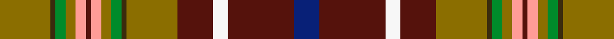

This is one **variant** — a specific cloth: this exact thread count and colourway, with its own
provenance below. It is one weaving of the [sett](/setts/y10dy1g2y2lr2dr1lr2y2g2dy1y10dr7w3dr13db5/) (the scale-free proportion — the
same cloth at any scale or shade), whose colour order is pattern [BBWBGGGGYBYGGGG](/stripes/bbwbggggybygggg/).

Part of the [Contrecoeur](/tartans/contrecoeur/) tartan — the named design grouping this sett with its other cloths.

Sourced from register-of-tartans.  It is a [15 stripe tartan](/stripes/stripes15/).

Original link [https://www.tartanregister.gov.uk/tartanDetails.aspx?ref=748](https://www.tartanregister.gov.uk/tartanDetails.aspx?ref=748)

2 attestations — the source records this cloth was collapsed from (oldest owns this page)

<ul>
<li>01/01/1992 — Contrecoeur (register-of-tartans, <a href="https://www.tartanregister.gov.uk/tartanDetails.aspx?ref=748">record</a>)  <em>Small township in southern Quebec. Tartan designed by French Canadian Madeleine Asselin. Red is for the courage of the town's founders, yellow is for the town's prestigious past and 'our holiday centres', blue is for the Saint-Laurent river which also links the twon with the native country of the funder, Antoine-Pecaudt, white is for the pride and determination of the people, pine green is for giant pines, the fecund soil, the islands of Contrecoeur and the duck shooting. Steel grey is for the industrial development and brown is for the traditional footwear indsutry established in 1883. The above is a precis of an article written by the designer and translated July 2008 by John Forsyth of Vancouver Island.</em></li>
<li>1992 — Contrecoeur (District) (tartans-authority, <a href="https://www.tartanregister.gov.uk/tartanDetails.aspx?ref=2294">record</a>)  <em>Small township in southern Quebec. Tartan designed by French Canadian Madeleine Asselin. Red is for the courage of the town's founders, yellow is for the town's prestigious past and 'our holiday centres', blue is for the Saint-Laurent river which also links the twon with the native country of the funder, Antoine-Pecaudt, white is for the pride and determination of the people, pine green is for giant pines, the fecund soil, the islands of Contrecoeur and the duck shooting. Steel grey is for the industrial development and brown is for the traditional footwear indsutry established in 1883. The above is a precis of an article written by the designer and translated Julky 2008 by John Forsyth of Vancouver Island.</em></li>
</ul>

Dataset <small>— provenance for this record, inherited from the source manifest</small>

<dl class="dataset-prov">
<dt>source</dt><dd><a href="/sources/register-of-tartans/">Scottish Register of Tartans</a></dd>
<dt>data captured from</dt><dd><a href="https://github.com/thetartan/tartan-database/blob/master/data/register-of-tartans/data.csv">https://github.com/thetartan/tartan-database/blob/master/data/register-of-tartans/data.csv</a></dd>
<dt>data date</dt><dd>1992 <small>(this record)</small></dd>
<dt>licence</dt><dd><a href="https://www.tartanregister.gov.uk/copyright">Crown copyright</a></dd>
</dl>

Capture chain <small>— the hands this data passed through, oldest first; each capture carries its own licence</small>

<ol class="capture-chain">
<li><a href="https://www.tartanregister.gov.uk/">Scottish Register of Tartans</a> · <a href="https://www.tartanregister.gov.uk/copyright">Crown copyright</a> <small>the living register — still published by National Records of Scotland</small></li>
<li><a href="https://github.com/thetartan/tartan-database">thetartan/tartan-database</a> <small>2016-2017</small> · <a href="https://creativecommons.org/licenses/by-nc-nd/4.0/">CC BY-NC-ND 4.0</a> <small>Levko Kravets's frozen compilation — the capture we vendored, and where its CC licence text came from</small></li>
<li>this dictionary <small>captured 2026-06-10 · commit 5bf86c7566</small> <small>each re-capture is a git commit to data/sources</small></li>
</ol>

## Register references

External register numbers recorded for this tartan.

- Scottish Register of Tartans: [748](https://www.tartanregister.gov.uk/tartanDetails.aspx?ref=748)
- Scottish Tartans Authority (ITI): 2294
- Scottish Tartans World Register: 2294

## Thread count
Y/20 DY2 G4 Y4 LR4 DR2 LR4 Y4 G4 DY2 Y20 DR14 W6 DR26 DB/10

One full sett is **222 threads**.

## Palette
<table><thead><tr><th>Colour</th><th>Shade</th><th>OKLCh</th></tr></thead><tbody><tr><td>DB</td><td><code style="background-color:#082077;">#082077</code> <small style="color:#888">#082077</small></td><td><small style="color:#888">oklch(30.0% 0.149 265.1)</small></td></tr><tr><td>DR</td><td><code style="background-color:#55120C;">#55120C</code> <small style="color:#888">#55120C</small></td><td><small style="color:#888">oklch(30.0% 0.099 29.3)</small></td></tr><tr><td>G</td><td><code style="background-color:#008B2A;">#008B2A</code> <small style="color:#888">#008B2A</small></td><td><small style="color:#888">oklch(55.4% 0.170 145.9)</small></td></tr><tr><td>DY</td><td><code style="background-color:#3A2B0D;">#3A2B0D</code> <small style="color:#888">#3A2B0D</small></td><td><small style="color:#888">oklch(30.0% 0.049 82.0)</small></td></tr><tr><td>LR</td><td><code style="background-color:#FF9C97;">#FF9C97</code> <small style="color:#888">#FF9C97</small></td><td><small style="color:#888">oklch(79.3% 0.119 23.2)</small></td></tr><tr><td>W</td><td><code style="background-color:#F7F7F7;">#F7F7F7</code> <small style="color:#888">#F7F7F7</small></td><td><small style="color:#888">oklch(97.6% 0.000 89.9)</small></td></tr><tr><td>Y</td><td><code style="background-color:#8B6E00;">#8B6E00</code> <small style="color:#888">#8B6E00</small></td><td><small style="color:#888">oklch(55.1% 0.113 90.4)</small></td></tr></tbody></table>

# Sample pattern

## Nearest tartan variants

The nearest existing variants by ΔTartan distance, with this cloth at the top so the swatches line up against it.

ΔTartan

Threads

Variant

Sett

—

222

<a href="/variants/s15/y10dy1g2y2lr2dr1lr2y2g2dy1y10dr7w3dr13db5~x2/">Contrecoeur</a>

<a href="/ttd/edit/#slug=lo40y10w6dy10do6dy4do6dy4do60n34db11&amp;base=y10dy1g2y2lr2dr1lr2y2g2dy1y10dr7w3dr13db5~x2" title="compare in the TTD">1.99</a>

331

<a href="/variants/s11/lo40y10w6dy10do6dy4do6dy4do60n34db11/">Angels' Share, The</a>

<a href="/ttd/edit/#slug=y10o1g2y2b2dr1b2y2g2o1y10dr7w3dr13db5~x2&amp;base=y10dy1g2y2lr2dr1lr2y2g2dy1y10dr7w3dr13db5~x2" title="compare in the TTD">2.61</a>

222

<a href="/variants/s15/y10o1g2y2b2dr1b2y2g2o1y10dr7w3dr13db5~x2/">Contrecoeur</a>

<a href="/ttd/edit/#slug=y3dy24db4dy8w2dy2g10r12dyi2r5w2~x2~dy1203057-dyi1502083&amp;base=y10dy1g2y2lr2dr1lr2y2g2dy1y10dr7w3dr13db5~x2" title="compare in the TTD">3.32</a>

286

<a href="/variants/s11/y3dy24db4dy8w2dy2g10r12dyi2r5w2~x2~dy1203057-dyi1502083/">Unidentified (Possibly Muirhead)</a>

<a href="/ttd/edit/#slug=dy2n2dg19n6dg2n6lo14dr4w2~x2&amp;base=y10dy1g2y2lr2dr1lr2y2g2dy1y10dr7w3dr13db5~x2" title="compare in the TTD">3.38</a>

220

<a href="/variants/s9/dy2n2dg19n6dg2n6lo14dr4w2~x2/">Royal Pharmaceutical Society (Corp)</a>

<a href="/ttd/edit/#slug=r24w3y4dg18dp18g3lb4~x2&amp;base=y10dy1g2y2lr2dr1lr2y2g2dy1y10dr7w3dr13db5~x2" title="compare in the TTD">3.52</a>

240

<a href="/variants/s7/r24w3y4dg18dp18g3lb4~x2/">Walter (Personal)</a>

<a href="/ttd/edit/#slug=r14lb4dt6y1dt2w2dt2g12r6dt2r2w1~x4&amp;base=y10dy1g2y2lr2dr1lr2y2g2dy1y10dr7w3dr13db5~x2" title="compare in the TTD">3.57</a>

372

<a href="/variants/s12/r14lb4dt6y1dt2w2dt2g12r6dt2r2w1~x4/">Stewart - Pr Ch Ed (Royal)</a>

<a href="/ttd/edit/#slug=dy22y22dr2lb6dr2lo2dr16dg5dy8lb2~x2&amp;base=y10dy1g2y2lr2dr1lr2y2g2dy1y10dr7w3dr13db5~x2" title="compare in the TTD">3.60</a>

300

<a href="/variants/s10/dy22y22dr2lb6dr2lo2dr16dg5dy8lb2~x2/">Bruce of Kinnaird (Vivienne Westwood Design)</a>

<a href="/ttd/edit/#slug=t12dg4r2dy3g4dg4r20w4r14dg4g4dy3r2dg4t12dy2t8dy2~x2~dg1806142-g2408144&amp;base=y10dy1g2y2lr2dr1lr2y2g2dy1y10dr7w3dr13db5~x2" title="compare in the TTD">3.65</a>

404

<a href="/variants/s18/t12dg4r2dy3g4dg4r20w4r14dg4g4dy3r2dg4t12dy2t8dy2~x2~dg1806142-g2408144/">Beguinot, (Personal)</a>

<a href="/ttd/edit/#slug=y9g7db3r28db4g7db5lb4db5dg7db3w6~x2~g1903114-dg1806142&amp;base=y10dy1g2y2lr2dr1lr2y2g2dy1y10dr7w3dr13db5~x2" title="compare in the TTD">3.66</a>

322

<a href="/variants/s12/y9g7db3r28db4g7db5lb4db5dg7db3w6~x2~g1903114-dg1806142/">Mayo County Crest (Fashion)</a>

<a href="/ttd/edit/#slug=ly5db2r14do9dg8db3r3db3r3db3dg18lyi3~x2~ly2705081-lyi3103095&amp;base=y10dy1g2y2lr2dr1lr2y2g2dy1y10dr7w3dr13db5~x2" title="compare in the TTD">3.69</a>

280

<a href="/variants/s12/ly5db2r14do9dg8db3r3db3r3db3dg18lyi3~x2~ly2705081-lyi3103095/">Meath, County</a>

## Neighbour map

Every grey dot is one of 13621 variants placed by the first two principal components of the ΔTartan feature space (42% of its variance). Red is this tartan; blue dots are its nearest — click one to open its page.

<svg viewBox="0 0 640 380" role="img" style="max-width:100%;height:auto;border:1px solid #e0e0e0;border-radius:4px;display:block" xmlns="http://www.w3.org/2000/svg"><image href="/nn/cloud.v1.png" width="640" height="380"/><a href="/variants/s11/lo40y10w6dy10do6dy4do6dy4do60n34db11/"><circle cx="180.5" cy="138.9" r="4" fill="#3465a4"><title>Angels' Share, The</title></circle></a><a href="/variants/s15/y10o1g2y2b2dr1b2y2g2o1y10dr7w3dr13db5~x2/"><circle cx="168.0" cy="131.7" r="4" fill="#3465a4"><title>Contrecoeur</title></circle></a><a href="/variants/s11/y3dy24db4dy8w2dy2g10r12dyi2r5w2~x2~dy1203057-dyi1502083/"><circle cx="195.1" cy="133.9" r="4" fill="#3465a4"><title>Unidentified (Possibly Muirhead)</title></circle></a><a href="/variants/s9/dy2n2dg19n6dg2n6lo14dr4w2~x2/"><circle cx="178.7" cy="185.4" r="4" fill="#3465a4"><title>Royal Pharmaceutical Society (Corp)</title></circle></a><a href="/variants/s7/r24w3y4dg18dp18g3lb4~x2/"><circle cx="103.7" cy="166.2" r="4" fill="#3465a4"><title>Walter (Personal)</title></circle></a><a href="/variants/s12/r14lb4dt6y1dt2w2dt2g12r6dt2r2w1~x4/"><circle cx="177.1" cy="138.4" r="4" fill="#3465a4"><title>Stewart - Pr Ch Ed (Royal)</title></circle></a><a href="/variants/s10/dy22y22dr2lb6dr2lo2dr16dg5dy8lb2~x2/"><circle cx="211.8" cy="189.8" r="4" fill="#3465a4"><title>Bruce of Kinnaird (Vivienne Westwood Design)</title></circle></a><a href="/variants/s18/t12dg4r2dy3g4dg4r20w4r14dg4g4dy3r2dg4t12dy2t8dy2~x2~dg1806142-g2408144/"><circle cx="147.7" cy="154.1" r="4" fill="#3465a4"><title>Beguinot, (Personal)</title></circle></a><a href="/variants/s12/y9g7db3r28db4g7db5lb4db5dg7db3w6~x2~g1903114-dg1806142/"><circle cx="101.5" cy="148.1" r="4" fill="#3465a4"><title>Mayo County Crest (Fashion)</title></circle></a><a href="/variants/s12/ly5db2r14do9dg8db3r3db3r3db3dg18lyi3~x2~ly2705081-lyi3103095/"><circle cx="150.3" cy="175.0" r="4" fill="#3465a4"><title>Meath, County</title></circle></a><circle cx="179.0" cy="141.1" r="5" fill="#c00000"/><text x="320" y="376" text-anchor="middle" font-size="11" fill="#999">ground</text><text x="11" y="190" text-anchor="middle" font-size="11" fill="#999" transform="rotate(-90 11 190)">complexity</text></svg>

ID: /variants/s15/y10dy1g2y2lr2dr1lr2y2g2dy1y10dr7w3dr13db5~x2/
