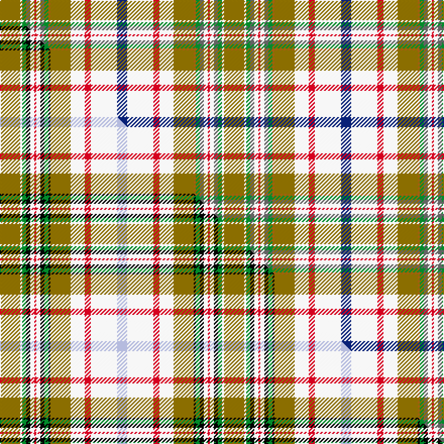

This is one **variant** — a specific cloth: this exact thread count and colourway, with its own
provenance below. It is one weaving of the [sett](/tartans/c/co/contreceour-dress/) (the scale-free proportion — the
same cloth at any scale or shade), whose colour order is pattern [BWRWGRGBWRWBGWG](/stripes/bwrwgrgbwrwbgwg/).

Part of the [Contreceour Dress](/tartans/c/co/contreceour-dress/) tartan — the named design grouping this sett with its other cloths.

Sourced from weddslist.  It is a [15 stripe tartan](/stripes/stripes15/).

Original link [http://www.weddslist.com/cgi-bin/tartans/pg.pl?source=sts](http://www.weddslist.com/cgi-bin/tartans/pg.pl?source=sts)

Dataset <small>— provenance for this record, inherited from the source manifest</small>

<dl class="dataset-prov">
<dt>source</dt><dd><a href="/sources/weddslist/">Weddslist</a></dd>
<dt>data captured from</dt><dd><a href="https://github.com/thetartan/tartan-database/blob/master/data/weddslist/data.csv">https://github.com/thetartan/tartan-database/blob/master/data/weddslist/data.csv</a></dd>
<dt>data date</dt><dd>2016-11-17 <small>(dataset default)</small></dd>
<dt>licence</dt><dd><a href="https://creativecommons.org/licenses/by-nc-nd/4.0/">CC BY-NC-ND 4.0</a></dd>
</dl>

Capture chain <small>— the hands this data passed through, oldest first; each capture carries its own licence</small>

<ol class="capture-chain">
<li><a href="https://www.weddslist.com/tartans/">Weddslist</a> <small>the living privately compiled reference</small></li>
<li><a href="https://github.com/thetartan/tartan-database">thetartan/tartan-database</a> <small>2016-2017</small> · <a href="https://creativecommons.org/licenses/by-nc-nd/4.0/">CC BY-NC-ND 4.0</a> <small>Levko Kravets's frozen compilation — the capture we vendored, and where its CC licence text came from</small></li>
<li>this dictionary <small>captured 2026-06-10 · commit 5bf86c7566</small> <small>each re-capture is a git commit to data/sources</small></li>
</ol>

## Thread count
Y/20 W2 G4 N4 W4 R2 W4 N4 G4 O2 Y20 W14 R6 W26 DB/10

One full sett is **222 threads**.

## Palette
<table><thead><tr><th>Colour</th><th>Shade</th><th>OKLCh</th></tr></thead><tbody><tr><td>DB</td><td><code style="background-color:#082077;">#082077</code> <small style="color:#888">#082077</small></td><td><small style="color:#888">oklch(30.0% 0.149 265.1)</small></td></tr><tr><td>G</td><td><code style="background-color:#008B2A;">#008B2A</code> <small style="color:#888">#008B2A</small></td><td><small style="color:#888">oklch(55.4% 0.170 145.9)</small></td></tr><tr><td>W</td><td><code style="background-color:#F7F7F7;">#F7F7F7</code> <small style="color:#888">#F7F7F7</small></td><td><small style="color:#888">oklch(97.6% 0.000 89.9)</small></td></tr><tr><td>O</td><td><code style="background-color:#A65C11;">#A65C11</code> <small style="color:#888">#A65C11</small></td><td><small style="color:#888">oklch(55.0% 0.125 58.3)</small></td></tr><tr><td>N</td><td><code style="background-color:#636363;">#636363</code> <small style="color:#888">#636363</small></td><td><small style="color:#888">oklch(50.0% 0.000 89.9)</small></td></tr><tr><td>R</td><td><code style="background-color:#D60020;">#D60020</code> <small style="color:#888">#D60020</small></td><td><small style="color:#888">oklch(55.2% 0.224 25.5)</small></td></tr><tr><td>Y</td><td><code style="background-color:#8B6E00;">#8B6E00</code> <small style="color:#888">#8B6E00</small></td><td><small style="color:#888">oklch(55.1% 0.113 90.4)</small></td></tr></tbody></table>

# Sample pattern

## Compared to the master

This cloth is one sett of its design; the master sett (the exemplar the design is anchored on) is below for comparison.

Its **ΔTartan distance** from the master is **0.39** — the same measure the nearest-tartans table ranks by (0 is identical; a re-scale of the same cloth is near 0, a recolour or a different proportion further).

<figure class="master-compare" style="margin:0">

this sett
master sett ★

<figcaption style="color:#888;font-size:smaller">One weave of this sett against the <a href="/setts/y10w1g2k2w2r1w2k2g2k1y10w7r3w13lb5/">master sett ★</a>, split on the diagonal: a shared proportion runs seamlessly across it with only the shades shifting; a different proportion breaks on it.</figcaption>
</figure>

## Nearest tartan variants

The nearest existing variants by ΔTartan distance, with this cloth at the top so the swatches line up against it.

ΔTartan

Threads

Variant

Sett

—

222

<a href="/variants/s15/y10w1g2n2w2r1w2n2g2o1y10w7r3w13db5~x2/">Contreceour dress</a>

<a href="/ttd/edit/#slug=y10w1g2k2w2r1w2k2g2k1y10w7r3w13lb5~x2&amp;base=y10w1g2n2w2r1w2n2g2o1y10w7r3w13db5~x2" title="compare in the TTD">0.39</a>

222

<a href="/variants/s15/y10w1g2k2w2r1w2k2g2k1y10w7r3w13lb5~x2/">Contreceour Dress Corporate Tartan</a>

<a href="/ttd/edit/#slug=w2n2g2dy1y10w7r3w13db5y10w1g2n2w2r1~x4&amp;base=y10w1g2n2w2r1w2n2g2o1y10w7r3w13db5~x2" title="compare in the TTD">2.26</a>

492

<a href="/variants/s15/w2n2g2dy1y10w7r3w13db5y10w1g2n2w2r1~x4/">Contrecoeur Dress</a>

<a href="/ttd/edit/#slug=n10b2do4y2do3w3do3o18w30r2w4do2~x2~do2508039-o5309063&amp;base=y10w1g2n2w2r1w2n2g2o1y10w7r3w13db5~x2" title="compare in the TTD">2.52</a>

308

<a href="/variants/s12/n10b2do4y2do3w3do3o18w30r2w4do2~x2~do2508039-o5309063/">MacLean of Duart, dress</a>

<a href="/ttd/edit/#slug=dp3lb1w9r6g5lb2w2lb2w2lb2g12y2~x2&amp;base=y10w1g2n2w2r1w2n2g2o1y10w7r3w13db5~x2" title="compare in the TTD">2.56</a>

182

<a href="/variants/s12/dp3lb1w9r6g5lb2w2lb2w2lb2g12y2~x2/">Fredericton District Tartan</a>

<a href="/ttd/edit/#slug=dp6lb2w24r15g12lb4w4lb4w4lb4g34y4&amp;base=y10w1g2n2w2r1w2n2g2o1y10w7r3w13db5~x2" title="compare in the TTD">2.62</a>

224

<a href="/variants/s12/dp6lb2w24r15g12lb4w4lb4w4lb4g34y4/">Fredericton (District)</a>

<a href="/ttd/edit/#slug=n12lb2do4y2do3w3do3o20w29lb2w4do2~x2&amp;base=y10w1g2n2w2r1w2n2g2o1y10w7r3w13db5~x2" title="compare in the TTD">2.80</a>

316

<a href="/variants/s12/n12lb2do4y2do3w3do3o20w29lb2w4do2~x2/">MacLean of Duart 7</a>

<a href="/ttd/edit/#slug=t4w2t1w19r2do4t8g4w2t3dy2g2do2r2dy2~x2&amp;base=y10w1g2n2w2r1w2n2g2o1y10w7r3w13db5~x2" title="compare in the TTD">3.06</a>

224

<a href="/variants/s15/t4w2t1w19r2do4t8g4w2t3dy2g2do2r2dy2~x2/">Highlands of Haliburton Dress</a>

<a href="/ttd/edit/#slug=dp3lb1w9r6dg5lb2w2lb2w2lb2dg12y2~x4&amp;base=y10w1g2n2w2r1w2n2g2o1y10w7r3w13db5~x2" title="compare in the TTD">3.12</a>

364

<a href="/variants/s12/dp3lb1w9r6dg5lb2w2lb2w2lb2dg12y2~x4/">Fredericton #1</a>

<a href="/ttd/edit/#slug=g8o3lr3o3w28lr4w8o12g3o3g3o3g8do3g3do3g3do12r4&amp;base=y10w1g2n2w2r1w2n2g2o1y10w7r3w13db5~x2" title="compare in the TTD">3.18</a>

222

<a href="/variants/s19/g8o3lr3o3w28lr4w8o12g3o3g3o3g8do3g3do3g3do12r4/">Drymen</a>

<a href="/ttd/edit/#slug=lg4w2lg1w14r2do4lg8g4w2lg3ly2g2do2w2ly2~x2&amp;base=y10w1g2n2w2r1w2n2g2o1y10w7r3w13db5~x2" title="compare in the TTD">3.22</a>

204

<a href="/variants/s15/lg4w2lg1w14r2do4lg8g4w2lg3ly2g2do2w2ly2~x2/">Highlands of Haliburton Dress (Dist.</a>

## Neighbour map

Every grey dot is one of 13662 variants placed by the first two principal components of the ΔTartan feature space (42% of its variance). Red is this tartan; blue dots are its nearest — click one to open its page. The map is a flat projection of a many-dimensional space — [how to read it](/posts/neighbourhood-maps/).

<svg viewBox="0 0 640 380" role="img" style="max-width:100%;height:auto;border:1px solid #e0e0e0;border-radius:4px;display:block" xmlns="http://www.w3.org/2000/svg"><image href="/nn/cloud.v1.png" width="640" height="380"/><a href="/variants/s15/y10w1g2k2w2r1w2k2g2k1y10w7r3w13lb5~x2/"><circle cx="96.3" cy="102.2" r="4" fill="#3465a4"><title>Contreceour Dress Corporate Tartan</title></circle></a><a href="/variants/s15/w2n2g2dy1y10w7r3w13db5y10w1g2n2w2r1~x4/"><circle cx="139.7" cy="127.1" r="4" fill="#3465a4"><title>Contrecoeur Dress</title></circle></a><a href="/variants/s12/n10b2do4y2do3w3do3o18w30r2w4do2~x2~do2508039-o5309063/"><circle cx="171.1" cy="100.8" r="4" fill="#3465a4"><title>MacLean of Duart, dress</title></circle></a><a href="/variants/s12/dp3lb1w9r6g5lb2w2lb2w2lb2g12y2~x2/"><circle cx="125.8" cy="159.0" r="4" fill="#3465a4"><title>Fredericton District Tartan</title></circle></a><a href="/variants/s12/dp6lb2w24r15g12lb4w4lb4w4lb4g34y4/"><circle cx="166.0" cy="132.6" r="4" fill="#3465a4"><title>Fredericton (District)</title></circle></a><a href="/variants/s12/n12lb2do4y2do3w3do3o20w29lb2w4do2~x2/"><circle cx="180.0" cy="120.6" r="4" fill="#3465a4"><title>MacLean of Duart 7</title></circle></a><a href="/variants/s15/t4w2t1w19r2do4t8g4w2t3dy2g2do2r2dy2~x2/"><circle cx="154.0" cy="106.5" r="4" fill="#3465a4"><title>Highlands of Haliburton Dress</title></circle></a><a href="/variants/s12/dp3lb1w9r6dg5lb2w2lb2w2lb2dg12y2~x4/"><circle cx="106.5" cy="148.4" r="4" fill="#3465a4"><title>Fredericton #1</title></circle></a><a href="/variants/s19/g8o3lr3o3w28lr4w8o12g3o3g3o3g8do3g3do3g3do12r4/"><circle cx="89.4" cy="133.8" r="4" fill="#3465a4"><title>Drymen</title></circle></a><a href="/variants/s15/lg4w2lg1w14r2do4lg8g4w2lg3ly2g2do2w2ly2~x2/"><circle cx="146.6" cy="144.7" r="4" fill="#3465a4"><title>Highlands of Haliburton Dress (Dist.</title></circle></a><circle cx="132.3" cy="121.5" r="5" fill="#c00000"/><text x="320" y="376" text-anchor="middle" font-size="11" fill="#999">ground</text><text x="11" y="190" text-anchor="middle" font-size="11" fill="#999" transform="rotate(-90 11 190)">complexity</text></svg>

ID: /variants/s15/y10w1g2n2w2r1w2n2g2o1y10w7r3w13db5~x2/
