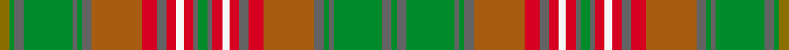

This page is one **sett** — a single exact thread-count. It belongs to the [tartan](/setts/y4g2n4g20n2g2n4o21r6n4r4w3r4n2g4/)
(the same proportion at any scale), whose colour order is pattern [GBGBGBRRBRWRBGBRWRBRRBGBGBGG](/stripes/gbgbgbrrbrwrbgbrwrbrrbgbgbgg/).

Sourced from register-of-tartans.  It is a [28 stripe tartan](/stripes/stripes28/).

Original link https://www.tartanregister.gov.uk/tartanDetails.aspx?ref=1892

2 attestations — the source records this cloth was collapsed from (oldest owns this page)

<ul>
<li>01/10/2002 — Jewel Look JTB (register-of-tartans, <a href="https://www.tartanregister.gov.uk/tartanDetails.aspx?ref=1892">record</a>)  <em>For the Japan Tourist Board. Name changed February 2003. Lochcarron swatch.</em></li>
<li>Oct 2002 — Jewel Look JTB (Corporate) (tartans-authority, <a href="http://www.tartansauthority.com/tartan-ferret/display/5730/">record</a>)  <em>For the Japan Tourist Board. Name changed February 2003. Lochcarron swatch.</em></li>
</ul>

## Register references

External register numbers recorded for this tartan.

- Scottish Register of Tartans: [1892](https://www.tartanregister.gov.uk/tartanDetails.aspx?ref=1892)
- Scottish Tartans Authority (ITI): 5730

## Thread count
Y/4 G2 N4 G20 N2 G2 N4 O21 R6 N4 R4 W3 R4 N2 G4 N2 R4 W3 R4 N4 R6 O21 N4 G2 N2 G20 N4 G/2

One full sett is **322 threads**.

## Palette
<table><thead><tr><th>Colour</th><th>Shade</th><th>OKLCh</th></tr></thead><tbody><tr><td>G</td><td><code style="background-color:#053819;">#053819</code> <small style="color:#888">#053819</small></td><td><small style="color:#888">oklch(30.0% 0.075 151.3)</small></td></tr><tr><td>Ga</td><td><code style="background-color:#008B2A;">#008B2A</code> <small style="color:#888">#008B2A</small></td><td><small style="color:#888">oklch(55.4% 0.170 145.9)</small></td></tr><tr><td>LN</td><td><code style="background-color:#F7F7F7;">#F7F7F7</code> <small style="color:#888">#F7F7F7</small></td><td><small style="color:#888">oklch(97.6% 0.000 89.9)</small></td></tr><tr><td>LP</td><td><code style="background-color:#A65C11;">#A65C11</code> <small style="color:#888">#A65C11</small></td><td><small style="color:#888">oklch(55.0% 0.125 58.3)</small></td></tr><tr><td>N</td><td><code style="background-color:#636363;">#636363</code> <small style="color:#888">#636363</small></td><td><small style="color:#888">oklch(50.0% 0.000 89.9)</small></td></tr><tr><td>R</td><td><code style="background-color:#D60020;">#D60020</code> <small style="color:#888">#D60020</small></td><td><small style="color:#888">oklch(55.2% 0.224 25.5)</small></td></tr><tr><td>Y</td><td><code style="background-color:#8B6E00;">#8B6E00</code> <small style="color:#888">#8B6E00</small></td><td><small style="color:#888">oklch(55.1% 0.113 90.4)</small></td></tr></tbody></table>

# Sample pattern

ID: /variants/s15/y4g2n4g20n2g2n4o21r6n4r4w3r4n2g4/
