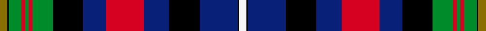

This is one **variant** — a specific cloth: this exact thread count and colourway, with its own
provenance below. It is one weaving of the [sett](/setts/y6k1g10r3g3r3g16k24db18r30db20k24db30k1w6/) (the scale-free proportion — the
same cloth at any scale or shade), whose colour order is pattern [GKGRGRGKBRBKBKW](/stripes/gkgrgrgkbrbkbkw/).

Sourced from register-of-tartans.  It is a [15 stripe tartan](/stripes/stripes15/).

Original link [https://www.tartanregister.gov.uk/tartanDetails.aspx?ref=4294](https://www.tartanregister.gov.uk/tartanDetails.aspx?ref=4294)

2 attestations — the source records this cloth was collapsed from (oldest owns this page)

<ul>
<li>undated — Unidentified Flora MacDonald (register-of-tartans, <a href="https://www.tartanregister.gov.uk/tartanDetails.aspx?ref=4294">record</a>)  <em>Similar to 'Plaid of Flora MacDonald' BKB:BKB</em></li>
<li>undated — Unidentified, Flora MacDonald (weddslist, <a href="http://www.weddslist.com/cgi-bin/tartans/pg.pl?source=sts">record</a>) </li>
</ul>

Dataset <small>— provenance for this record, inherited from the source manifest</small>

<dl class="dataset-prov">
<dt>source</dt><dd><a href="/sources/register-of-tartans/">Scottish Register of Tartans</a></dd>
<dt>data captured from</dt><dd><a href="https://github.com/thetartan/tartan-database/blob/master/data/register-of-tartans/data.csv">https://github.com/thetartan/tartan-database/blob/master/data/register-of-tartans/data.csv</a></dd>
<dt>data date</dt><dd>2017-01-06 <small>(dataset default)</small></dd>
<dt>licence</dt><dd><a href="https://www.tartanregister.gov.uk/copyright">Crown copyright</a></dd>
</dl>

Capture chain <small>— the hands this data passed through, oldest first; each capture carries its own licence</small>

<ol class="capture-chain">
<li><a href="https://www.tartanregister.gov.uk/">Scottish Register of Tartans</a> · <a href="https://www.tartanregister.gov.uk/copyright">Crown copyright</a> <small>the living register — still published by National Records of Scotland</small></li>
<li><a href="https://github.com/thetartan/tartan-database">thetartan/tartan-database</a> <small>2016-2017</small> · <a href="https://creativecommons.org/licenses/by-nc-nd/4.0/">CC BY-NC-ND 4.0</a> <small>Levko Kravets's frozen compilation — the capture we vendored, and where its CC licence text came from</small></li>
<li>this dictionary <small>captured 2026-06-10 · commit 5bf86c7566</small> <small>each re-capture is a git commit to data/sources</small></li>
</ol>

## Register references

External register numbers recorded for this tartan.

- Scottish Register of Tartans: [4294](https://www.tartanregister.gov.uk/tartanDetails.aspx?ref=4294)
- Scottish Tartans World Register: 1814

## Thread count
Y/12 K2 G20 R6 G6 R6 G32 K48 DB36 R60 DB40 K48 DB60 K2 W/12

One full sett is **756 threads**.

## Palette
<table><thead><tr><th>Colour</th><th>Shade</th><th>OKLCh</th></tr></thead><tbody><tr><td>DB</td><td><code style="background-color:#082077;">#082077</code> <small style="color:#888">#082077</small></td><td><small style="color:#888">oklch(30.0% 0.149 265.1)</small></td></tr><tr><td>G</td><td><code style="background-color:#008B2A;">#008B2A</code> <small style="color:#888">#008B2A</small></td><td><small style="color:#888">oklch(55.4% 0.170 145.9)</small></td></tr><tr><td>K</td><td><code style="background-color:#000000;">#000000</code> <small style="color:#888">#000000</small></td><td><small style="color:#888">oklch(0.0% 0.000 0.0)</small></td></tr><tr><td>W</td><td><code style="background-color:#F7F7F7;">#F7F7F7</code> <small style="color:#888">#F7F7F7</small></td><td><small style="color:#888">oklch(97.6% 0.000 89.9)</small></td></tr><tr><td>R</td><td><code style="background-color:#D60020;">#D60020</code> <small style="color:#888">#D60020</small></td><td><small style="color:#888">oklch(55.2% 0.224 25.5)</small></td></tr><tr><td>Y</td><td><code style="background-color:#8B6E00;">#8B6E00</code> <small style="color:#888">#8B6E00</small></td><td><small style="color:#888">oklch(55.1% 0.113 90.4)</small></td></tr></tbody></table>

# Sample pattern

## Nearest tartan variants

The nearest existing variants by ΔTartan distance, with this cloth at the top so the swatches line up against it.

ΔTartan

Threads

Variant

Sett

—

756

<a href="/variants/s15/y6k1g10r3g3r3g16k24db18r30db20k24db30k1w6~x2/">Unidentified Flora MacDonald</a>

<a href="/ttd/edit/#slug=dg10y6dg20k20db20k6db8r6db20r6w4r16w4db6w1~x2&amp;base=y6k1g10r3g3r3g16k24db18r30db20k24db30k1w6~x2" title="compare in the TTD">1.87</a>

590

<a href="/variants/s15/dg10y6dg20k20db20k6db8r6db20r6w4r16w4db6w1~x2/">Watson - Kirby (Personal)</a>

<a href="/ttd/edit/#slug=k16w4k2w4k2r8y8g8k1db24w6~x2&amp;base=y6k1g10r3g3r3g16k24db18r30db20k24db30k1w6~x2" title="compare in the TTD">2.60</a>

288

<a href="/variants/s11/k16w4k2w4k2r8y8g8k1db24w6~x2/">Zimbabwe</a>

<a href="/ttd/edit/#slug=r4t11k4t4k4t4k21dt21w4dt21k21t20k1r4~x2~t2503227-dt1204274&amp;base=y6k1g10r3g3r3g16k24db18r30db20k24db30k1w6~x2" title="compare in the TTD">2.63</a>

560

<a href="/variants/s14/r4t11k4t4k4t4k21db21w4db21k21t20k1r4~x2~t2503227-db1204274/">McCaig (2016)</a>

<a href="/ttd/edit/#slug=dy5k2db6w1db6k2dy7k16g7k2r4g2r4k2g4~x2&amp;base=y6k1g10r3g3r3g16k24db18r30db20k24db30k1w6~x2" title="compare in the TTD">2.69</a>

262

<a href="/variants/s15/dy5k2db6w1db6k2dy7k16g7k2r4g2r4k2g4~x2/">Redgate (Connecticut) Hunting #2</a>

<a href="/ttd/edit/#slug=db14k4db4k15g20k2lb4r2k1w4r14db4r2db2r4db2r2~x2&amp;base=y6k1g10r3g3r3g16k24db18r30db20k24db30k1w6~x2" title="compare in the TTD">2.72</a>

368

<a href="/variants/s17/db14k4db4k15g20k2lb4r2k1w4r14db4r2db2r4db2r2~x2/">Caledonian Society of Prince Edward Island</a>

<a href="/ttd/edit/#slug=r3k5w3y2db10k1yi19dt19k28dt3k3dt3k3r3~yi2400000-dt1700000&amp;base=y6k1g10r3g3r3g16k24db18r30db20k24db30k1w6~x2" title="compare in the TTD">2.76</a>

204

<a href="/variants/s14/r3k5w3y2db10k1yi19n19k28n3k3n3k3r3~yi2400000-n1700000/">Association Cornemuses du Monde</a>

<a href="/ttd/edit/#slug=r3dg4g2dg10k18dg2dp18dg3dp18dg2k18dg18w1r3~x2~dg1806142-g1903114&amp;base=y6k1g10r3g3r3g16k24db18r30db20k24db30k1w6~x2" title="compare in the TTD">2.78</a>

468

<a href="/variants/s14/r3dg4g2dg10k18dg2dp18dg3dp18dg2k18dg18w1r3~x2~dg1806142-g1903114/">Paget (Personal)</a>

<a href="/ttd/edit/#slug=r14db4r2db2r4db2r2db14k4db4k15g20k2y4r2k1w4~x2&amp;base=y6k1g10r3g3r3g16k24db18r30db20k24db30k1w6~x2" title="compare in the TTD">2.78</a>

364

<a href="/variants/s17/r14db4r2db2r4db2r2db14k4db4k15g20k2y4r2k1w4~x2/">Caledonian Society of P.E.I. (Corp)</a>

<a href="/ttd/edit/#slug=dr4g20k16ly2k3lr3k2db18dr6k2dr4k1lr2~x4&amp;base=y6k1g10r3g3r3g16k24db18r30db20k24db30k1w6~x2" title="compare in the TTD">2.85</a>

640

<a href="/variants/s13/dr4g20k16ly2k3lr3k2db18dr6k2dr4k1lr2~x4/">Galt, Alexander, Sir</a>

<a href="/ttd/edit/#slug=lb12r2lb3r4lb15k24dg18y1k3dg3w3~x2~dg1504144&amp;base=y6k1g10r3g3r3g16k24db18r30db20k24db30k1w6~x2" title="compare in the TTD">2.86</a>

322

<a href="/variants/s11/lb12r2lb3r4lb15k24dg18y1k3dg3w3~x2~dg1504144/">Groen (Personal)</a>

## Neighbour map

Every grey dot is one of 13621 variants placed by the first two principal components of the ΔTartan feature space (42% of its variance). Red is this tartan; blue dots are its nearest — click one to open its page.

<svg viewBox="0 0 640 380" role="img" style="max-width:100%;height:auto;border:1px solid #e0e0e0;border-radius:4px;display:block" xmlns="http://www.w3.org/2000/svg"><image href="/nn/cloud.v1.png" width="640" height="380"/><a href="/variants/s15/dg10y6dg20k20db20k6db8r6db20r6w4r16w4db6w1~x2/"><circle cx="92.5" cy="123.3" r="4" fill="#3465a4"><title>Watson - Kirby (Personal)</title></circle></a><a href="/variants/s11/k16w4k2w4k2r8y8g8k1db24w6~x2/"><circle cx="66.2" cy="102.6" r="4" fill="#3465a4"><title>Zimbabwe</title></circle></a><a href="/variants/s14/r4t11k4t4k4t4k21db21w4db21k21t20k1r4~x2~t2503227-db1204274/"><circle cx="130.0" cy="120.8" r="4" fill="#3465a4"><title>McCaig (2016)</title></circle></a><a href="/variants/s15/dy5k2db6w1db6k2dy7k16g7k2r4g2r4k2g4~x2/"><circle cx="83.1" cy="119.1" r="4" fill="#3465a4"><title>Redgate (Connecticut) Hunting #2</title></circle></a><a href="/variants/s17/db14k4db4k15g20k2lb4r2k1w4r14db4r2db2r4db2r2~x2/"><circle cx="64.5" cy="87.9" r="4" fill="#3465a4"><title>Caledonian Society of Prince Edward Island</title></circle></a><a href="/variants/s14/r3k5w3y2db10k1yi19n19k28n3k3n3k3r3~yi2400000-n1700000/"><circle cx="121.1" cy="60.0" r="4" fill="#3465a4"><title>Association Cornemuses du Monde</title></circle></a><a href="/variants/s14/r3dg4g2dg10k18dg2dp18dg3dp18dg2k18dg18w1r3~x2~dg1806142-g1903114/"><circle cx="129.6" cy="116.9" r="4" fill="#3465a4"><title>Paget (Personal)</title></circle></a><a href="/variants/s17/r14db4r2db2r4db2r2db14k4db4k15g20k2y4r2k1w4~x2/"><circle cx="65.5" cy="87.6" r="4" fill="#3465a4"><title>Caledonian Society of P.E.I. (Corp)</title></circle></a><a href="/variants/s13/dr4g20k16ly2k3lr3k2db18dr6k2dr4k1lr2~x4/"><circle cx="92.4" cy="100.4" r="4" fill="#3465a4"><title>Galt, Alexander, Sir</title></circle></a><a href="/variants/s11/lb12r2lb3r4lb15k24dg18y1k3dg3w3~x2~dg1504144/"><circle cx="112.1" cy="98.4" r="4" fill="#3465a4"><title>Groen (Personal)</title></circle></a><circle cx="111.0" cy="92.6" r="5" fill="#c00000"/><text x="320" y="376" text-anchor="middle" font-size="11" fill="#999">ground</text><text x="11" y="190" text-anchor="middle" font-size="11" fill="#999" transform="rotate(-90 11 190)">complexity</text></svg>

ID: /variants/s15/y6k1g10r3g3r3g16k24db18r30db20k24db30k1w6~x2/
