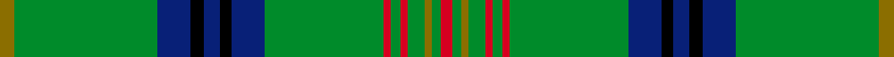

This page is one **sett** — a single exact thread-count. It belongs to the [tartan](/setts/y8g77db18k7db9k6db18g64r4g5r4g9y4g5r6/)
(the same proportion at any scale), whose colour order is pattern [GGBKBKBGRGRGGGR](/stripes/ggbkbkbgrgrgggr/).

Sourced from register-of-tartans.  It is a [15 stripe tartan](/stripes/stripes15/).

Original link https://www.tartanregister.gov.uk/tartanDetails.aspx?ref=1943

## Register references

External register numbers recorded for this tartan.

- Scottish Register of Tartans: [1943](https://www.tartanregister.gov.uk/tartanDetails.aspx?ref=1943)
- Scottish Tartans World Register: 1560

## Thread count
Y/8 G77 DB18 K7 DB9 K6 DB18 G64 R4 G5 R4 G9 Y4 G5 R/6

One full sett is **474 threads**.

## Palette
<table><thead><tr><th>Colour</th><th>Shade</th><th>OKLCh</th></tr></thead><tbody><tr><td>DB</td><td><code style="background-color:#082077;">#082077</code> <small style="color:#888">#082077</small></td><td><small style="color:#888">oklch(30.0% 0.149 265.1)</small></td></tr><tr><td>G</td><td><code style="background-color:#008B2A;">#008B2A</code> <small style="color:#888">#008B2A</small></td><td><small style="color:#888">oklch(55.4% 0.170 145.9)</small></td></tr><tr><td>K</td><td><code style="background-color:#000000;">#000000</code> <small style="color:#888">#000000</small></td><td><small style="color:#888">oklch(0.0% 0.000 0.0)</small></td></tr><tr><td>R</td><td><code style="background-color:#D60020;">#D60020</code> <small style="color:#888">#D60020</small></td><td><small style="color:#888">oklch(55.2% 0.224 25.5)</small></td></tr><tr><td>Y</td><td><code style="background-color:#8B6E00;">#8B6E00</code> <small style="color:#888">#8B6E00</small></td><td><small style="color:#888">oklch(55.1% 0.113 90.4)</small></td></tr></tbody></table>

# Sample pattern

## Nearest variants

The nearest existing variants by ΔTartan distance, with this cloth at the top so the swatches line up against it.

ΔTartan

Threads

Variant

Sett

—

474

<a href="/variants/s15/y8g77db18k7db9k6db18g64r4g5r4g9y4g5r6/">Kennedy #2</a>

<a href="/ttd/edit/#slug=y8g84t21k10t10k10t10k10t21g62r3g6r3g10y3g5r6&amp;base=y8g77db18k7db9k6db18g64r4g5r4g9y4g5r6" title="compare in the TTD">1.78</a>

550

<a href="/variants/s17/y8g84t21k10t10k10t10k10t21g62r3g6r3g10y3g5r6/">King Edward VII (Royal)</a>

<a href="/ttd/edit/#slug=y8g84db21k10db10k10db10k10db21g62r3g6r3g10y3g5r6~x2&amp;base=y8g77db18k7db9k6db18g64r4g5r4g9y4g5r6" title="compare in the TTD">1.78</a>

1100

<a href="/variants/s17/y8g84db21k10db10k10db10k10db21g62r3g6r3g10y3g5r6~x2/">King Edward VII</a>

## Neighbour map

Every grey dot is one of 13620 variants placed by the first two principal components of the ΔTartan feature space (42% of its variance). Red is this tartan; blue dots are its nearest — click one to open its page.

<svg viewBox="0 0 640 380" role="img" style="max-width:100%;height:auto;border:1px solid #e0e0e0;border-radius:4px;display:block" xmlns="http://www.w3.org/2000/svg"><image href="/nn/cloud.v1.png" width="640" height="380"/><a href="/variants/s17/y8g84t21k10t10k10t10k10t21g62r3g6r3g10y3g5r6/"><circle cx="319.2" cy="90.6" r="4" fill="#3465a4"><title>King Edward VII (Royal)</title></circle></a><a href="/variants/s17/y8g84db21k10db10k10db10k10db21g62r3g6r3g10y3g5r6~x2/"><circle cx="297.4" cy="80.2" r="4" fill="#3465a4"><title>King Edward VII</title></circle></a><circle cx="345.7" cy="100.9" r="5" fill="#c00000"/><text x="320" y="376" text-anchor="middle" font-size="11" fill="#999">ground</text><text x="11" y="190" text-anchor="middle" font-size="11" fill="#999" transform="rotate(-90 11 190)">complexity</text></svg>

ID: /variants/s15/y8g77db18k7db9k6db18g64r4g5r4g9y4g5r6/
